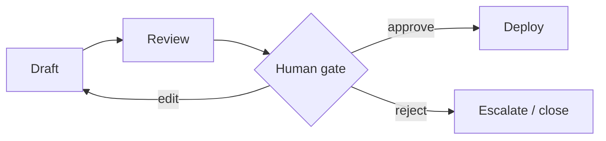

> **Learning goals:** Add approval breakpoints; edit state mid-run; define who owns the merge button.
> **Prerequisites:** [Loops, memory, checkpointing](/docs/ai-agents/langgraph/04-loops-memory-and-checkpointing).

## Interrupts are first-class

```python
graph.compile(
  checkpointer=checkpointer,
  interrupt_before=["deploy"],  # pause, wait for human
)
# human reviews draft in state, approves or edits, then:
# graph.invoke(None, config={"thread_id": tid})  # resume
```



## Where to put gates

- Before **irreversible** actions (deploy, refund, delete).
- When **confidence < bar** or tries exhausted.
- On **policy edges**: money, PII, external sends.

Keep humans at gates until evals earn their removal — the 5-stage adoption from [Graph engineering](/docs/ai-agents/agent-engineer/22-graph-engineering).

## Approval UX minimum

Show the diff, the citations, and the cost of being wrong. One click approve / edit / reject. Log who said yes, when, on what state version.

## Key takeaways

1. `interrupt_before/after` turns any node into a gate.
2. Humans edit state, not code, to steer a paused run.
3. Gates + audit = autonomy you can ship.

---

[Previous: Checkpointing](/docs/ai-agents/langgraph/04-loops-memory-and-checkpointing) | [Next: Multi-agent graphs →](/docs/ai-agents/langgraph/06-multi-agent-graphs)
