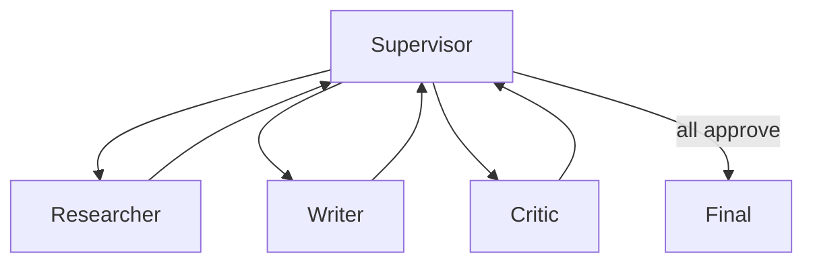

> **Learning goals:** Choose supervisor vs handoff vs shared-state; bound communication cost; capstone an essay-writer graph.
> **Prerequisites:** [Human-in-the-loop](/docs/ai-agents/langgraph/05-human-in-the-loop-and-interrupts), [Multi-agent systems](/docs/ai-agents/agent-engineer/07-multi-agent-systems).

## Three topologies

| Topology | Shape | Best when |
|---|---|---|
| Supervisor | One router delegates to workers | Tasks split cleanly, central QA |
| Handoff | Peer-to-peer transfers | Pipeline with natural ownership |
| Shared state | All nodes read/write one board | Emergent coordination, swarms |

## Capstone: essay writer

Topic → plan → parallel research → draft → reflect → (revise | finalise). Exercises every lesson: typed state, reducers for parallel research, conditional reflect loop capped at 2, checkpoint + time travel, human gate before publish, supervisor over three roles.

Two production upgrades: parallelise research branches, cap reflect/revise at 2–3 rounds.

## Cost control

Multi-agent token spend multiplies fast. Parallelise reads only, share context via state (not full transcripts), and eval team vs single-agent on the same golden set — see [Multi-agent case studies](/docs/ai-agents/agent-engineer/multi-agent-case-studies).

## Key takeaways

1. Start single-graph; add agents only when roles genuinely differ.
2. Supervisor is the default; shared state is the expert move.
3. Same rules apply: typed state, guarded cycles, human gates, checkpoint everything.

## Further reading

- [LangGraph docs](https://langchain-ai.github.io/langgraph/)
- [Tooling and frameworks](/docs/ai-agents/agent-engineer/agent-tooling-and-frameworks)

---

[Previous: Human-in-the-loop](/docs/ai-agents/langgraph/05-human-in-the-loop-and-interrupts)
