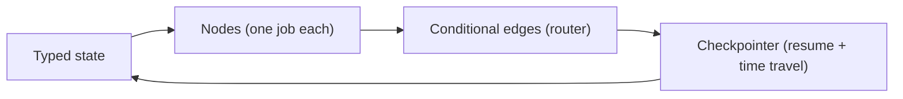

When an agent loop needs auditability, pause-and-resume, and deterministic routing, you stop prompting for control flow and start **declaring a graph**. LangGraph gives you typed state, single-purpose nodes, conditional edges, and a checkpointer that remembers every step.

> **Prerequisites:** [LangChain](/docs/ai-agents/langchain) lessons 1–4, plus [Graph engineering](/docs/ai-agents/agent-engineer/22-graph-engineering). Complements [Tooling and frameworks](/docs/ai-agents/agent-engineer/agent-tooling-and-frameworks).

## Lessons

1. [Why graphs for agents?](/docs/ai-agents/langgraph/01-why-graphs-for-agents)
2. [State schemas and reducers](/docs/ai-agents/langgraph/02-state-schemas-and-reducers)
3. [Nodes, edges, and conditional routing](/docs/ai-agents/langgraph/03-nodes-edges-and-conditional-routing)
4. [Loops, memory, and checkpointing](/docs/ai-agents/langgraph/04-loops-memory-and-checkpointing)
5. [Human-in-the-loop and interrupts](/docs/ai-agents/langgraph/05-human-in-the-loop-and-interrupts)
6. [Multi-agent graphs](/docs/ai-agents/langgraph/06-multi-agent-graphs)

## The core quartet

Build one essay-writer or code-review graph end to end and you will have touched all six lessons. Start at lesson 1.
