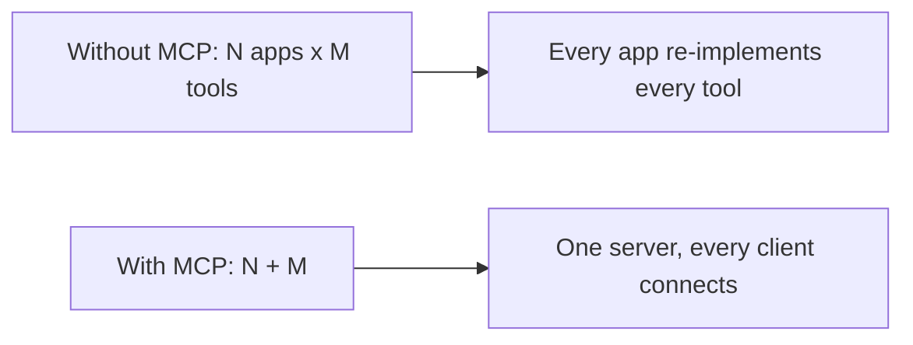

> **Learning goals:** Separate MCP the *standard* from MCP the *hype*; tell personal MCP use apart from backend integration; know what this module builds.
> **Prerequisites:** None beyond [MCP deep dive](/docs/ai-agents/agent-engineer/16-mcp-deep-dive).

## MCP is a standard, not new magic

If you have ever given an LLM access to a tool through function calling, you have already implemented the core idea behind MCP. What MCP adds is **standardisation**: a single protocol for how tools are exposed, discovered, and invoked.

- **Not new capability** — the model could already call tools.
- **A new contract** — the same server works with any MCP-compatible client.
- **A growing ecosystem** — reuse servers instead of rewriting integrations.

## Hype vs reality

| Claim | Reality |
|---|---|
| "MCP replaces function calling" | No — MCP tools are translated into function-call definitions before the model sees them |
| "MCP is only for Claude Desktop" | It is useful for any host, but the developer story is *your* Python app |
| "MCP is production-ready out of the box" | You still own auth, rate limits, secrets, and output validation |

## Bridging the gap

There is a clear split in most tutorials:

1. **Personal MCP use** — plugging servers into Claude Desktop, Cursor, or another assistant.
2. **Backend integration** — building MCP into your own Python applications and agent systems.

This module focuses on the second case. That means you will:

- Understand the technical architecture (host, client, server, transports).
- Build custom servers with the Python SDK.
- Integrate those servers into a Python application.
- Make an informed call on when MCP is worth it.

## Key takeaways

1. MCP standardises tool supply; it does not add reasoning the model lacked.
2. Most public tutorials stop at personal use — this module goes to backend integration.
3. You will need Python's `async`/`await` and a virtual environment for the code.

---

[Next: Understanding MCP at a technical level →](/docs/ai-agents/mcp/02-understanding-mcp)
