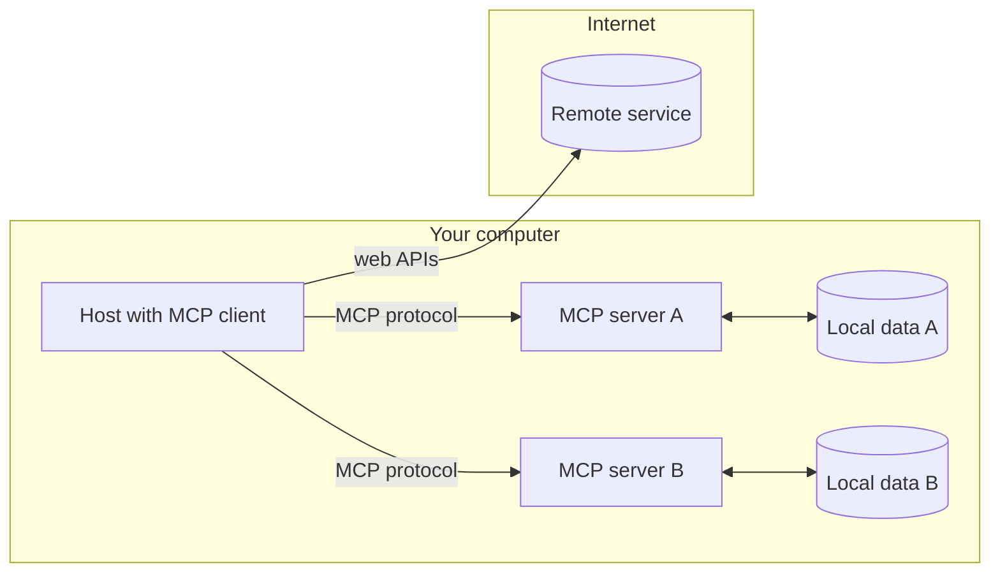
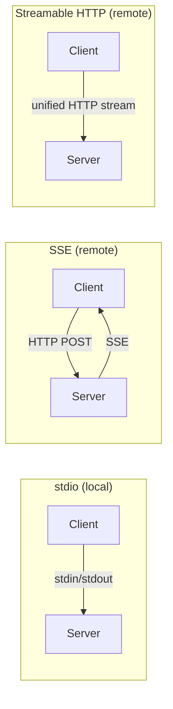

> **Learning goals:** Describe the client–host–server architecture; name the three primitives; choose the right transport for a deployment.
> **Prerequisites:** [Introduction and context](/docs/ai-agents/mcp/01-introduction-and-context).

## Architecture overview

MCP follows a **client–host–server** model. The separation of concerns keeps each server focused on one domain — files, search, a database — while the host composes them.

- **Host** — the program requesting access (Claude Desktop, an IDE, your Python app).
- **Client** — the protocol handler; keeps a **1:1 connection** with one server.
- **Server** — a lightweight program exposing capabilities over the standardized protocol.
- **Local data sources** — files, databases, services a server can safely reach.
- **Remote services** — external systems the server calls over the internet.

## The three primitives

| Primitive | What it is | Who controls it |
|---|---|---|
| [**Tools**](https://modelcontextprotocol.io/docs/concepts/tools) | Model-invoked functions (API calls, computations) | The model decides when to use them |
| [**Resources**](https://modelcontextprotocol.io/docs/concepts/resources) | Context data (file contents, database records) | The application or user selects them |
| [**Prompts**](https://modelcontextprotocol.io/docs/concepts/prompts) | Reusable templates for LLM interactions | The user invokes them |

For Python developers, **tools** are the immediately useful primitive — they let the model act.

## Transport mechanisms

MCP supports three transports:

1. **stdio** — communication over standard input/output. Best for local integrations where server and client share a machine. No network configuration.
2. **SSE (Server-Sent Events)** — HTTP for client→server and SSE for server→client. Suited to remote connections, and needed for older servers.
3. **Streamable HTTP** *(March 24, 2025)* — modern HTTP streaming that **supersedes SSE**. A unified endpoint, both stateful and stateless modes, and the **recommended choice for production**.

| Transport | Choose when |
|---|---|
| **stdio** | Single-application integrations and local development |
| **SSE** | Development, or connecting to an older MCP implementation |
| **Streamable HTTP** | Production deployments needing performance and scalability |

If you know **FastAPI**, HTTP-transport MCP servers will feel familiar: HTTP endpoints, streaming responses, async handlers, and route-specific functions.

## Why standardisation matters

MCP's value is not new capability but a shared contract:

- **Reusability** — build a server once, use it with any MCP-compatible client.
- **Composability** — combine multiple servers into complex capability sets.
- **Ecosystem growth** — benefit from servers others publish. See the community [reference servers](https://github.com/modelcontextprotocol/servers).

## Key takeaways

1. Host → client → server, with one client connection per server.
2. Tools are model-called, resources are app-read, prompts are user-invoked.
3. Prefer **Streamable HTTP** for new remote work; keep **stdio** for local.
4. Standardisation is the whole point — reuse over reinvention.

---

[Previous: Introduction and context](/docs/ai-agents/mcp/01-introduction-and-context) | [Next: A simple server with the Python SDK →](/docs/ai-agents/mcp/03-simple-server-setup)
