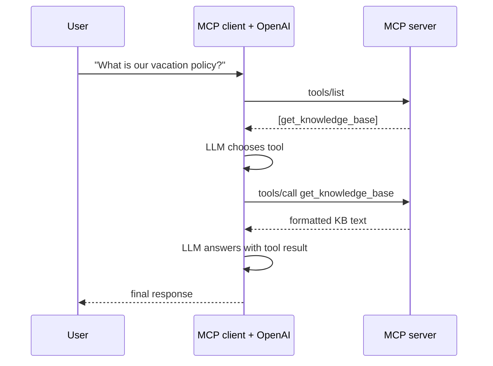

> **Learning goals:** Convert MCP tools into OpenAI's function format; run a complete tool-calling loop; keep the client resilient with an exit stack.
> **Prerequisites:** [A simple server with the Python SDK](/docs/ai-agents/mcp/03-simple-server-setup), plus `OPENAI_API_KEY` in the environment.

## What we are building

A server exposes a `get_knowledge_base` tool. A client connects over **stdio**, converts the MCP tools to OpenAI's function format, lets the model choose a tool, forwards the call to the server, and asks the model to answer with the result.



## The server

The tool reads Q&A pairs from `data/kb.json` and returns a formatted string. It never raises raw exceptions — it returns an error message the model can read and recover from.

```python
import os
import json
from mcp.server.fastmcp import FastMCP

mcp = FastMCP(name="Knowledge Base", host="127.0.0.1", port=8050)


@mcp.tool()
def get_knowledge_base() -> str:
    """Retrieve the entire knowledge base as a formatted string."""
    try:
        kb_path = os.path.join(os.path.dirname(__file__), "data", "kb.json")
        with open(kb_path, "r") as f:
            kb_data = json.load(f)

        kb_text = "Here is the retrieved knowledge base:\n\n"
        if isinstance(kb_data, list):
            for i, item in enumerate(kb_data, 1):
                question = item.get("question", "Unknown question")
                answer = item.get("answer", "Unknown answer")
                kb_text += f"Q{i}: {question}\nA{i}: {answer}\n\n"
        return kb_text
    except FileNotFoundError:
        return "Error: Knowledge base file not found"
    except json.JSONDecodeError:
        return "Error: Invalid JSON in knowledge base file"


if __name__ == "__main__":
    mcp.run(transport="stdio")
```

## Converting MCP tools to OpenAI format

The bridge is a small adapter: **MCP's `inputSchema` maps directly to OpenAI's `parameters`**.

```python
async def get_mcp_tools():
    tools_result = await session.list_tools()
    return [
        {
            "type": "function",
            "function": {
                "name": tool.name,
                "description": tool.description,
                "parameters": tool.inputSchema,
            },
        }
        for tool in tools_result.tools
    ]
```

## The tool loop

```python
async def process_query(query: str) -> str:
    tools = await get_mcp_tools()

    response = await openai_client.chat.completions.create(
        model="gpt-4o",
        messages=[{"role": "user", "content": query}],
        tools=tools,
        tool_choice="auto",
    )
    assistant_message = response.choices[0].message
    messages = [{"role": "user", "content": query}, assistant_message]

    if assistant_message.tool_calls:
        for tool_call in assistant_message.tool_calls:
            result = await session.call_tool(
                tool_call.function.name,
                arguments=json.loads(tool_call.function.arguments),
            )
            messages.append(
                {
                    "role": "tool",
                    "tool_call_id": tool_call.id,
                    "content": result.content[0].text,
                }
            )

        final_response = await openai_client.chat.completions.create(
            model="gpt-4o",
            messages=messages,
            tools=tools,
            tool_choice="none",  # no more tool calls — force an answer
        )
        return final_response.choices[0].message.content

    return assistant_message.content
```

Wrap the session in an `AsyncExitStack` so a partially established connection is always cleaned up, and close the OpenAI client in a `finally`.

## Running it

```bash
python 4-openai-integration/client.py
```

With stdio you do **not** start the server separately — the client launches it. Both scripts resolve their paths from `__file__`, so they work regardless of your working directory.

## The role of MCP here

- **Standardisation** — a consistent interface for models to reach tools.
- **Abstraction** — backend complexity stays behind the server.
- **Security** — you control exactly what is exposed.
- **Flexibility** — change the backend without touching the model integration.

## Key takeaways

1. MCP tools become OpenAI functions through a field-mapping adapter.
2. `tool_choice="none"` on the second call forces the model to answer.
3. Return errors as strings so the model can recover.
4. Use `AsyncExitStack` for reliable teardown.

---

[Previous: A simple server with the Python SDK](/docs/ai-agents/mcp/03-simple-server-setup) | [Next: MCP vs function calling →](/docs/ai-agents/mcp/05-mcp-vs-function-calling)
