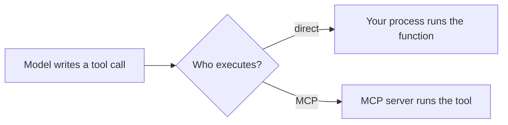

> **Learning goals:** Show that MCP is a new way to *call* functions, not a new capability; decide per integration when MCP pays off.
> **Prerequisites:** [OpenAI integration](/docs/ai-agents/mcp/04-openai-integration). For the full decision framework, see [MCP vs Tools](/docs/ai-agents/agent-engineer/mcp-vs-tools).

## The point in one line

MCP does not change what the model does — it still emits a function call. MCP changes **where the function lives and who runs it**.



## The direct version

A plain function plus a schema, executed in-process:

```python
import json
import openai
from tools import add

tools = [
    {
        "type": "function",
        "function": {
            "name": "add",
            "description": "Add two numbers together",
            "parameters": {
                "type": "object",
                "properties": {
                    "a": {"type": "integer", "description": "First number"},
                    "b": {"type": "integer", "description": "Second number"},
                },
                "required": ["a", "b"],
            },
        },
    }
]

response = openai.chat.completions.create(
    model="gpt-4o",
    messages=[{"role": "user", "content": "Calculate 25 + 17"}],
    tools=tools,
)

if response.choices[0].message.tool_calls:
    tool_call = response.choices[0].message.tool_calls[0]
    tool_args = json.loads(tool_call.function.arguments)
    result = add(**tool_args)  # executed directly, right here

    final_response = openai.chat.completions.create(
        model="gpt-4o",
        messages=[
            {"role": "user", "content": "Calculate 25 + 17"},
            response.choices[0].message,
            {"role": "tool", "tool_call_id": tool_call.id, "content": str(result)},
        ],
    )
    print(final_response.choices[0].message.content)
```

At this scale the direct approach is **simpler**. The difference only shows up as systems grow.

## Where MCP starts to win

1. **Scale** — dozens of tools need organisation and discovery.
2. **Reuse** — one server can serve multiple clients and applications.
3. **Distribution** — MCP provides standard mechanisms for remote operation.

## When to choose which

**Consider MCP when:**

- You share tool implementations across multiple applications.
- You build a distributed system with components on different machines.
- You want to reuse existing servers from the ecosystem.
- Standardisation itself is a user-facing benefit.

**Traditional function calling may be better when:**

- The application is simple and self-contained.
- Performance is critical (direct calls have less overhead).
- You are early in development and rapid iteration beats standardisation.

> **Rule of thumb:** build inline first, extract survivors. Promote to MCP when a **second** client needs the same tool, or when you need auth, multi-tenancy, or discovery.

## Key takeaways

1. MCP is a new way to call functions — not a new capability.
2. Direct calls win at small scale; MCP wins on reuse and distribution.
3. Decide **per integration**, not per system — most production agents mix both.

---

[Previous: OpenAI integration](/docs/ai-agents/mcp/04-openai-integration) | [Next: Running a server with Docker →](/docs/ai-agents/mcp/06-run-with-docker)
