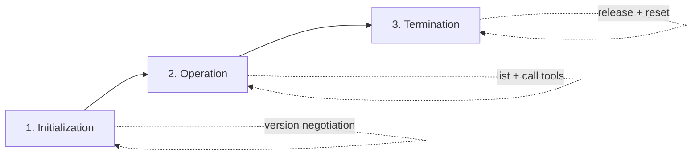

> **Learning goals:** Walk the three lifecycle phases; close connections reliably; inject typed resources with a lifespan context.
> **Prerequisites:** [Running a server with Docker](/docs/ai-agents/mcp/06-run-with-docker).

## The three phases



### 1. Initialization

- The **client** connects and negotiates a protocol version.
- The **server** validates the request and prepares to handle calls.
- Both agree on a compatible version for the session.

```python
async with stdio_client(server_params) as (read, write):
    async with ClientSession(read, write) as session:
        await session.initialize()
```

### 2. Operation

- The server registers and exposes its tools.
- The client discovers tools and calls them.
- The server manages any resources a tool needs.

```python
tools_result = await session.list_tools()
for tool in tools_result.tools:
    print(f"  - {tool.name}: {tool.description}")

result = await session.call_tool(
    tool_call.function.name,
    arguments=json.loads(tool_call.function.arguments),
)
```

### 3. Termination

Leaving the `ClientSession` context manager releases resources, closes the channel, and resets server state for the next session:

```python
async with ClientSession(read, write) as session:
    ...  # session operations
# automatically terminated here
```

## Managing server-wide resources: the lifespan object

Tools sometimes need resources that outlive a single call — a database pool, a cache client. The **lifespan** context manager initializes them once, makes them available to every tool, and cleans them up on shutdown.

```python
from contextlib import asynccontextmanager
from collections.abc import AsyncIterator
from dataclasses import dataclass

from mcp.server.fastmcp import Context, FastMCP


@dataclass
class AppContext:
    db: Database  # replace with your resource type


@asynccontextmanager
async def app_lifespan(server: FastMCP) -> AsyncIterator[AppContext]:
    db = await Database.connect()  # startup
    try:
        yield AppContext(db=db)  # available during operation
    finally:
        await db.disconnect()  # shutdown


mcp = FastMCP("My App", lifespan=app_lifespan)


@mcp.tool()
def query_db(ctx: Context) -> str:
    """Tool that uses initialized resources"""
    db = ctx.request_context.lifespan_context.db
    return db.query()
```

## Why the lifespan pattern pays off

1. **Type safety** — the context is strongly typed, so IDEs and checkers help.
2. **Resource management** — guaranteed init and teardown, no leaked connections.
3. **Dependency injection** — clean access to shared resources inside tools.
4. **Separation of concerns** — resource setup stays out of tool logic.

> **Reference:** [MCP lifecycle specification](https://modelcontextprotocol.io/specification/2025-03-26/basic/lifecycle#lifecycle).

## Key takeaways

1. Every session moves through initialization → operation → termination.
2. Context managers give you correct teardown for free — use them.
3. Use `lifespan` for resources shared across tools, not per-call.

---

[Previous: Running a server with Docker](/docs/ai-agents/mcp/06-run-with-docker) | [Next: Case study — a YouTube transcript server →](/docs/ai-agents/mcp/08-youtube-transcript-server)
