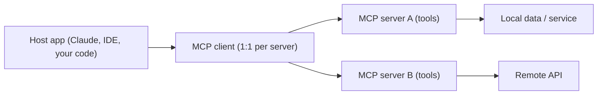

MCP is a **standard protocol for connecting models to tools and data**. Instead of hard-coding a tool into every app, you expose it once on a server and any MCP-compatible client can discover and call it. This module is the hands-on companion to the concepts in [MCP deep dive](/docs/ai-agents/agent-engineer/16-mcp-deep-dive): you build a real server, connect Python clients, and wire it into OpenAI.

> **Prerequisites:** [Agent Engineer 14](/docs/ai-agents/agent-engineer/14-agent-protocols-mcp-and-a2a) and [16](/docs/ai-agents/agent-engineer/16-mcp-deep-dive) for the concepts. Comfort with Python `async`/`await`. Everything here runs on the maintained v1 Python SDK (`mcp[cli]==1.30.0`).

## Lessons

1. [Introduction and context](/docs/ai-agents/mcp/01-introduction-and-context)
2. [Understanding MCP at a technical level](/docs/ai-agents/mcp/02-understanding-mcp)
3. [A simple server with the Python SDK](/docs/ai-agents/mcp/03-simple-server-setup)
4. [OpenAI integration](/docs/ai-agents/mcp/04-openai-integration)
5. [MCP vs function calling](/docs/ai-agents/mcp/05-mcp-vs-function-calling)
6. [Running a server with Docker](/docs/ai-agents/mcp/06-run-with-docker)
7. [Lifecycle management](/docs/ai-agents/mcp/07-lifecycle-management)
8. [Case study: a YouTube transcript server](/docs/ai-agents/mcp/08-youtube-transcript-server)

## The one diagram to remember

- **Host** — the app the user is in. It creates and manages clients.
- **Client** — speaks the protocol, one connection per server.
- **Server** — exposes **tools** (model-called), **resources** (app-read data), and **prompts** (user-invoked templates).

Everything below is message-based: JSON-RPC 2.0 over `stdio` (local) or Streamable HTTP (remote). Start at lesson 1, or jump to [lesson 3](/docs/ai-agents/mcp/03-simple-server-setup) if you just want a working server.

> **Runnable companion code.** Every example in this module is a trimmed version of the full project in the repository's `mcp/crash-course` folder. Install its requirements (`uv pip install -r requirements.txt`) and run the scripts as shown in each lesson.
