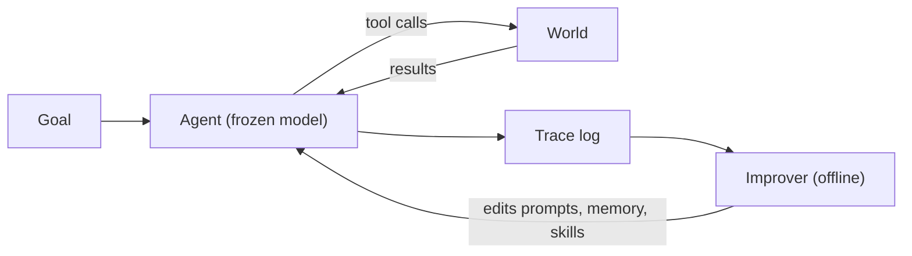

> **Learning goals:** Define self-evolution without hype; name the four levels from cached answers to harness edits; decide what the loop may and may not touch.
> **Prerequisites:** [Agent Engineer 01](/docs/ai-agents/agent-engineer/01-what-are-ai-agents).

## The idea in one paragraph

A self-evolving agent keeps a record of what it did, scores what worked, and changes its own future behaviour — prompts, memories, skills, tool descriptions — so the next run is better. No weight updates. The model stays frozen; the **harness around it** learns.

## Four levels, cheapest first

| Level | What changes | Example | Cost |
|---|---|---|---|
| 0. Fixed | Nothing persists | Same prompt every run | Zero |
| 1. Remember | Episodic notes (`MEMORY.md`) | "YouTube URLs need transcript API" | Cheap |
| 2. Skillify | Reusable SOPs (`skills/*.md`) | `skills/deploy-nextjs.md` after 3 deploys | Medium |
| 3. Hill-climb | Prompt / policy / tool schema edits tested vs evals | Recency boost in retrieval after failure cluster | Highest rigour |

Most teams should live at levels 1–2 for months before attempting level 3. Level 3 without evals is just drift with confidence.

## What the loop may touch

| Editable by the loop | Human-only | Never |
|---|---|---|
| Prompt wording, skill files, tool descriptions | Eval rubrics, golden sets, model choice | Safety guardrails, audit logging, kill switch |
| Context policy (what to retrieve) | Budget tiers, deploy permissions | Approval requirements |

Rule: **the loop proposes, evals dispose, humans merge.** Anything that edits its own scorekeeper is disqualified.

## When evolution pays off

- The task **repeats** (weekly reports, deploys, triage) so learning compounds.
- Failures **cluster** (same retrieval miss, same schema error) instead of scattering randomly.
- You have **20+ eval cases** so "better" means something.

If runs are one-offs, invest in the single run, not the loop.

## Key takeaways

1. Self-evolution = frozen model + learning harness (memory, skills, prompts).
2. Climb levels in order: remember, then skillify, then hill-climb against evals.
3. Fence the blast radius before you automate improvement.

## Further reading

- [Self-improving agents and human oversight](/docs/ai-agents/agent-engineer/self-improvement-and-oversight)
- [Sutton — The Bitter Lesson](http://www.incompleteideas.net/IncIdeas/BitterLesson.html)

---

[Next: Reflection and critique loops →](/docs/ai-agents/self-evolving-agents/02-reflection-and-critique-loops)
