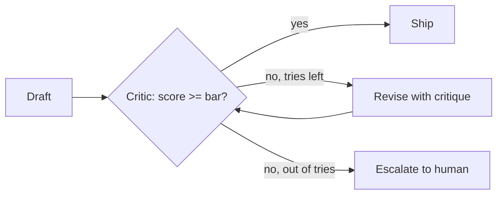

> **Learning goals:** Build a generator → critic → revise loop; cap retries so it always terminates; store critiques worth keeping.
> **Prerequisites:** [What are self-evolving agents?](/docs/ai-agents/self-evolving-agents/01-what-are-self-evolving-agents).

## The smallest self-improving loop

One agent drafts. A second pass (same model, critic prompt + rubric) scores it. If the score fails, the draft goes back with the critique attached. Two rounds max, then escalate.



## A minimal rubric beats a clever prompt

```python
CRITIC_RUBRIC = """
Score 0-100 on: correctness, citations, scope.
Reject if: no sources, invented APIs, out-of-scope actions.
Return: score, failing checks, one concrete fix.
"""
MAX_ROUNDS = 2
```

Without a rubric the critic just flatters the draft. With one, reflection actually moves the score.

## Reflexion in one idea

Keep the failed attempt **plus the critique** in context for the next try ("verbal reinforcement"). The agent sees *why* it failed, not just that it failed. Cap history to the last 1–2 critiques or context bloats.

## Common pitfalls

| Pitfall | Symptom | Fix |
|---|---|---|
| Unbounded retries | 12 rounds, same error, big bill | Hard cap at 2–3, then human |
| Critic = author | Self-congratulation | Separate prompt, rubric, ideally smaller dedicated pass |
| Throwaway critiques | Same mistake next session | Promote repeated critiques to memory (next lesson) |

## Key takeaways

1. Reflection = draft, score against a rubric, revise with the critique attached.
2. Always bound it: max rounds + escalation target.
3. Persist only critiques that recur — the rest is noise.

---

[Previous: What are self-evolving agents?](/docs/ai-agents/self-evolving-agents/01-what-are-self-evolving-agents) | [Next: Memory and skill accumulation →](/docs/ai-agents/self-evolving-agents/03-memory-and-skill-accumulation)
