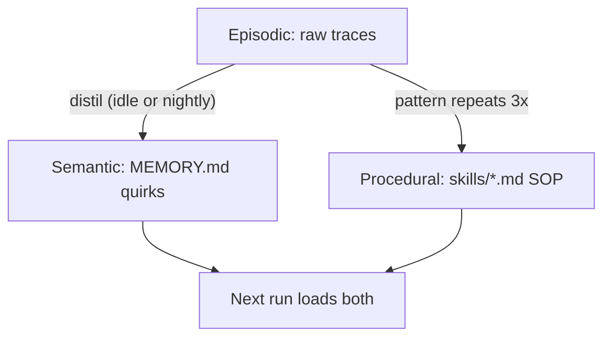

> **Learning goals:** Separate episodic, semantic, and procedural memory; write quirk entries that actually get reused; synthesize SOP skills from repeated tool chains.
> **Prerequisites:** [Reflection loops](/docs/ai-agents/self-evolving-agents/02-reflection-and-critique-loops).

## Three memories, three jobs

| Type | Stores | Lives in | Example |
|---|---|---|---|
| Episodic | What happened this run | Trace log / `state.db` | "Deploy #789 failed on TTL change" |
| Semantic | Durable facts and quirks | `MEMORY.md` | "YouTube URLs need transcript API, not scraper" |
| Procedural | How to do recurring work | `skills/<task>.md` | `skills/weekly-report.md` with steps + checks |



## The quirk rule

Write the quirk **the moment it bites**, in one line with trigger + fix:

```md
- [2026-09-01] YouTube URLs: scraper returns empty → use transcript API first.
- [2026-09-04] Staging DB resets nightly — re-seed before 9am runs.
```

Prune monthly. Stale quirks are worse than none.

## When to synthesize a skill

Trigger when you see: 5+ tool calls in one pattern, the same workflow 3+ times, or a user correction twice. The SOP captures steps, tools + params, success checks, and edge cases observed. This is the Hermes-style Proactive Skill Creator from [Agent Engineer](/docs/ai-agents/agent-engineer/self-improvement-and-oversight).

## Key takeaways

1. Episodic is raw material; semantic and procedural are the refined products.
2. Quirks: trigger + fix, written immediately, pruned regularly.
3. Skills: only for patterns proven by repetition.

---

[Previous: Reflection loops](/docs/ai-agents/self-evolving-agents/02-reflection-and-critique-loops) | [Next: Eval-driven hill-climbing →](/docs/ai-agents/self-evolving-agents/04-eval-driven-hill-climbing)
