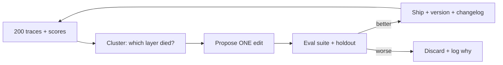

> **Learning goals:** Run the trace → cluster → propose → test → ship loop; enforce one-variable edits; keep a human-owned holdout.
> **Prerequisites:** [Memory and skill accumulation](/docs/ai-agents/self-evolving-agents/03-memory-and-skill-accumulation), [Evaluating agents](/docs/ai-agents/agent-engineer/09-evaluating-and-testing-agents).

## The loop

## Rules that keep it honest

1. **One layer per change** — prompt *or* retrieval policy *or* tool schema. Otherwise you cannot attribute the win.
2. **Never let the loop edit its own evals** — golden sets and rubrics are human-owned.
3. **Outcome metrics, not shape metrics** — "refund processed correctly", not "answer looks nice".
4. **Holdout stays hidden** — rotate cases; the loop never sees the final exam.

| Failure cluster | Candidate edit | How you will know |
|---|---|---|
| Stale retrieval | Recency boost in context policy | Recall@k on golden set rises, holdout holds |
| Schema errors | Tighter tool description + example | Tool-call success rate rises |
| Vague answers | Rubric line in critic prompt | Human preference wins, no latency regression |

## A week in the life

Mon collect → Tue diagnose → Wed propose diff → Thu eval + holdout → Fri ship with decision record. One change, one owner, one artifact trail.

## Key takeaways

1. Hill-climbing edits the harness, never the eval.
2. Single-variable edits + versioned diffs make improvement attributable.
3. Reward hacking dies under holdouts and outcome metrics.

---

[Previous: Memory and skills](/docs/ai-agents/self-evolving-agents/03-memory-and-skill-accumulation) | [Next: Oversight and safe autonomy →](/docs/ai-agents/self-evolving-agents/05-oversight-and-safe-autonomy)
