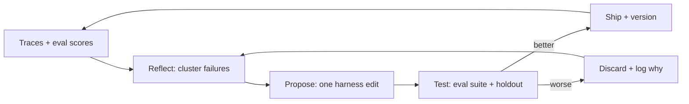

Agents that run the same task twice should not make the same mistake twice. This track covers **self-evolution without fine-tuning**: reflect on outputs, remember what worked, distil reusable skills, and hill-climb the harness against evals — all under human-owned guardrails.

> **Prerequisites:** [Agent Engineer](/docs/ai-agents/agent-engineer) lessons 1–7 (what agents are, tools, memory, planning). For the eval machinery, see [Self-improving agents and human oversight](/docs/ai-agents/agent-engineer/self-improvement-and-oversight).

## Lessons

1. [What are self-evolving agents?](/docs/ai-agents/self-evolving-agents/01-what-are-self-evolving-agents)
2. [Reflection and critique loops](/docs/ai-agents/self-evolving-agents/02-reflection-and-critique-loops)
3. [Memory and skill accumulation](/docs/ai-agents/self-evolving-agents/03-memory-and-skill-accumulation)
4. [Eval-driven hill-climbing](/docs/ai-agents/self-evolving-agents/04-eval-driven-hill-climbing)
5. [Oversight and safe autonomy](/docs/ai-agents/self-evolving-agents/05-oversight-and-safe-autonomy)

## How the loop fits together

Start with lesson 1 if self-evolution is new. If you already run reflection prompts, jump to lesson 4 for the hill-climbing discipline that makes them safe.
