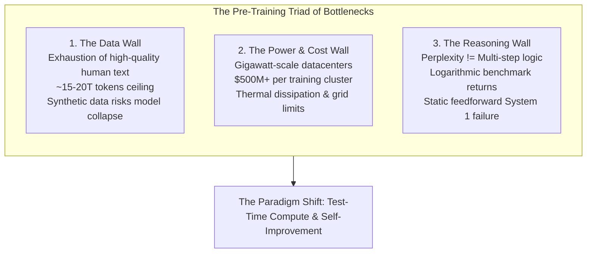
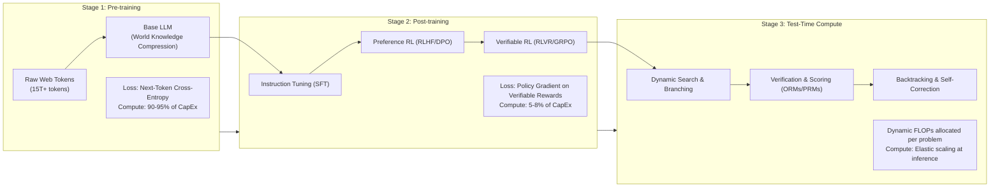
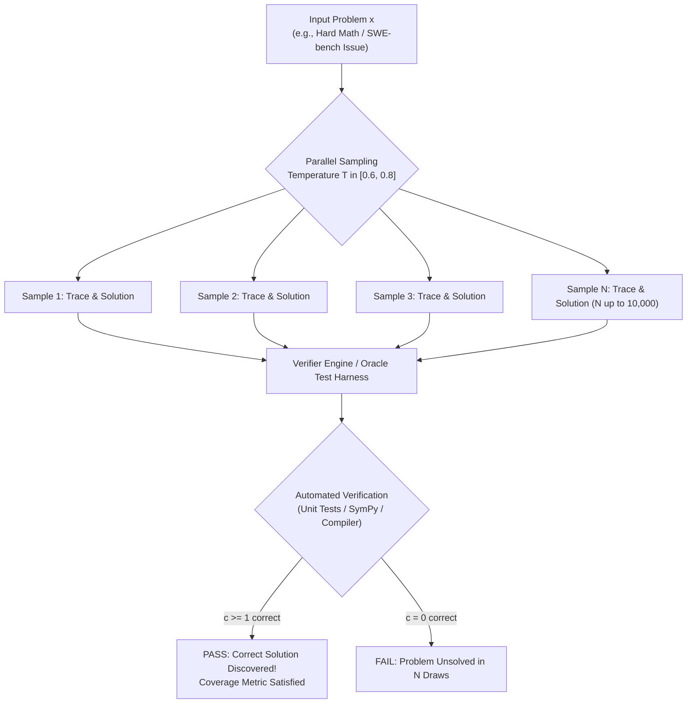
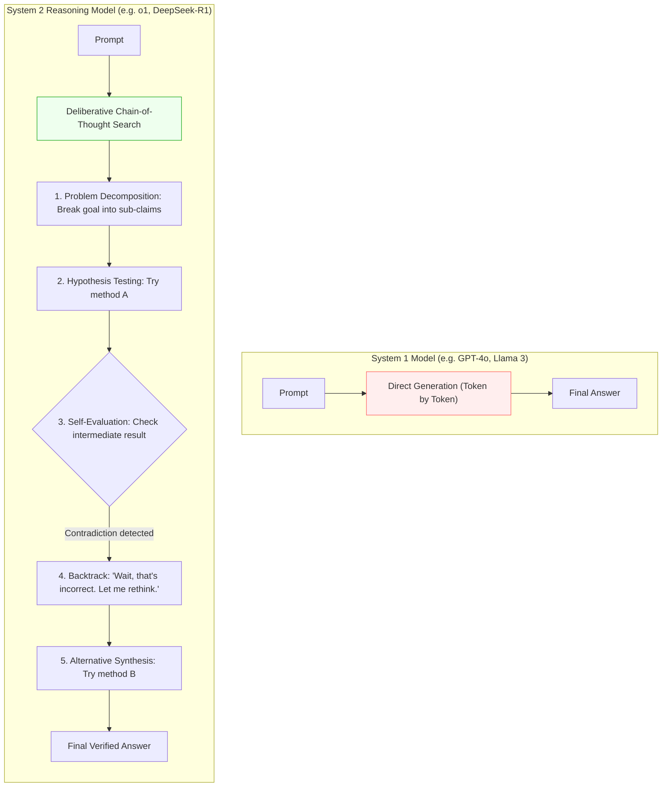

## Course & Lecture Context

> **Stanford CS329A: Self-Improving AI Agents** — Lecture 1  
> **Instructors:** Prof. Azalia Mirhoseini (Assistant Professor of Computer Science, Stanford University; ex-Google Brain, Google DeepMind, Anthropic) & Dr. Akanksha Sharma (Adjunct Professor, Stanford University; Research at Reflection AI; ex-Google Brain, Google DeepMind).

Between 2018 and 2024, artificial intelligence was defined by a single dominant paradigm: **pre-training compute scaling**. By feeding ever-larger autoregressive Transformer architectures exponentially more web tokens, the field unlocked emergent few-shot capabilities, in-context learning, and benchmark-shattering conversational agents.

However, as frontier labs push toward trillion-parameter models, pre-training scaling has encountered fundamental physical, economic, and informational bottlenecks. In this foundational lesson, we analyze the structural transition from brute-force pre-training to **test-time compute scaling** and **self-improving closed loops**. We dissect the 3-stage intelligence lifecycle, derive the mathematics of repeated sampling ($\text{pass}@k$), and explore how System 2 reasoning architectures—such as OpenAI o1/o3, DeepSeek-R1, and Sakana AI's *The AI Scientist*—fundamentally reshape what AI agents can accomplish.

---

## Learning Objectives

By the end of this lesson, you will be able to:

1. **Diagnose the Limits of Pre-Training Scaling:** Articulate the mathematical foundations of the Kaplan and Chinchilla scaling laws, and identify the physical constraints (the data wall, power wall, and cost wall) forcing the paradigm shift.
2. **Deconstruct the 3-Stage Development Lifecycle:** Differentiate the objectives, loss functions, compute budgets, and failure modes across Pre-training, Post-training (SFT, RLHF, RLVR), and Test-Time Compute.
3. **Derive and Implement the Unbiased $\text{pass}@k$ Estimator:** Prove why naive empirical sampling produces biased estimates, implement the hypergeometric formulation from Chen et al., and explain why coverage scales log-linearly with inference compute.
4. **Analyze the Emergence of System 2 Reasoning Agents:** Contrast System 1 next-token prediction with deliberate System 2 planning, multi-step search, backtracking, and self-correction.
5. **Evaluate Generator-Verifier Asymmetry:** Quantify why generation is cheap while robust verification remains the core bottleneck in autonomous agent workflows.

---

## The Limits of Pre-Training Scaling

### The Classical Scaling Era (2020–2024)

Modern foundation models were built on empirical power-law scaling observations. In their seminal paper, *Scaling Laws for Neural Language Models* (Kaplan et al., OpenAI, 2020), researchers demonstrated that cross-entropy loss $L$ scales as a power law with compute budget $C$, dataset size $D$, and parameter count $N$, largely independent of architectural hyper-parameters like network depth vs. width:

$$L(N) \approx \left(\frac{N_c}{N}\right)^{\alpha_N}, \quad L(D) \approx \left(\frac{D_c}{D}\right)^{\alpha_D}, \quad L(C) \approx \left(\frac{C_c}{C}\right)^{\alpha_C}$$

In 2022, Hoffmann et al. (*Training Compute-Optimal Large Language Models*, DeepMind) refined these relationships with the **Chinchilla scaling laws**. They proved that Kaplan et al. had over-allocated compute to parameter size $N$ at the expense of tokens $D$. Chinchilla demonstrated that for compute-optimal training, model parameters and training tokens should scale in equal proportion:

$$N_{\text{optimal}} \propto C^{a}, \quad D_{\text{optimal}} \propto C^{b}, \quad \text{where } a \approx b \approx 0.50$$

$$\text{FLOPs} \approx 6 N D$$

For two years, following Chinchilla was the recipe for state-of-the-art models: scale parameters from 7B to 70B to 405B, while scaling training datasets from 1 trillion to 15+ trillion tokens.

```
Model Evolution (2018–2024):
BERT-Large (2018):       340 Million parameters
GPT-2 (2019):            1.5 Billion parameters
GPT-3 (2020):            175 Billion parameters
PaLM (2022):             540 Billion parameters
Llama 3.1 (2024):        405 Billion parameters
Frontier MoEs (2024+):   Trillions of parameters (Mixture of Experts)
```

### The Three Walls of Pre-Training

Despite these historic successes, pre-training scaling has hit a regime of steeply diminishing marginal returns governed by three immutable barriers:



#### 1. The Data Wall
The public internet contains roughly $15$ to $20$ trillion tokens of high-quality natural language (books, research papers, Wikipedia, verified code repositories, curated discussion). Frontier models like Llama 3.1 have already consumed virtually all accessible public human text. 

Training on ungrounded synthetic text creates **model collapse**—a mathematical degradation where the model samples from its own generated tails, accumulating variance and losing linguistic diversity (Shumailov et al., *Nature* 2024). Without external grounding, raw pre-training runs out of signal.

#### 2. The Power and Cost Wall
Training a modern frontier dense model demands clusters of $50{,}000$ to $100{,}000$ H100/B200 GPUs running continuously for 3 to 6 months. A single frontier pre-training run now costs upwards of \$100M - \$300M in hardware amortization and energy alone. A 100k-GPU datacenter draws over $100\text{ MW}$ of power—exceeding the grid capacity of medium-sized cities. Doubling capability via pre-training alone would require gigawatt clusters costing tens of billions of dollars.

#### 3. The Reasoning Wall
Minimizing next-token cross-entropy loss over web text optimizes for **imitation**, not **truth** or **logical deduction**. Web data is rife with flawed arguments, cognitive biases, arithmetic errors, and non-sequiturs. An LLM trained purely on next-token prediction learns the distribution of human error just as effectively as the distribution of mathematical rigor. 

For complex reasoning tasks—such as Olympiad mathematics (AIME/IMO), kernel engineering (CUDA optimization), or full-repository software development (SWE-bench)—a purely feedforward token generator fails when an error early in the generation cascades unchecked through subsequent tokens.

---

## The 3-Stage Development Lifecycle

To bypass the pre-training bottleneck, modern AI systems have decoupled intelligence into three distinct, complementary phases:



### Stage 1: Pre-Training (World Knowledge Compression)
- **Objective:** Compress broad human knowledge, syntactic structure, world concepts, and cultural context into the model's static weight matrices $\theta$.
- **Loss Formulation:** Unsupervised maximum likelihood estimation:
  $$\mathcal{L}_{\text{pre}}(\theta) = -\sum_{t=1}^{T} \log P(x_t \mid x_{<t}; \theta)$$
- **Nature of Compute:** Offline, massive batch parallel execution across thousands of accelerators.
- **Key Limitation:** The resulting base model has no concept of "truth," instruction adherence, or goal-directed problem solving. It merely completes text according to web statistics.

### Stage 2: Post-Training (Alignment & Verifiable Reinforcement Learning)
Once base weights are frozen or gently tuned, post-training shapes the model into an interactive, reliable assistant:
1. **Supervised Fine-Tuning (SFT):** The model is trained on curated demonstrations of dialog, formatting, reasoning paths, and instruction-following ($10^4 - 10^6$ examples).
2. **Reinforcement Learning from Human Feedback (RLHF):** Humans rank candidate generations. A learned Reward Model $R_\psi(x, y)$ predicts human preference, and the policy $\pi_\theta$ is updated via PPO or DPO:
   $$\max_\theta \mathbb{E}_{x \sim \mathcal{D}, y \sim \pi_\theta} \left[ R_\psi(x, y) \right] - \beta \, \mathbb{D}_{\text{KL}}\left(\pi_\theta(y \mid x) \parallel \pi_{\text{ref}}(y \mid x)\right)$$
3. **Reinforcement Learning with Verifiable Rewards (RLVR):** In rule-bound domains (code execution, formal mathematics, chemistry, logic puzzles), human preference is replaced by deterministic, automated ground truth:
   $$R(x, y) = \begin{cases} 1 & \text{if } \text{Verify}(x, y) = \text{PASS} \\ 0 & \text{if } \text{Verify}(x, y) = \text{FAIL} \end{cases}$$
   RLVR (exemplified by DeepSeek-R1 and OpenAI's reasoning recipes) allows the model to explore millions of reasoning trajectories using algorithms like Group Relative Policy Optimization (GRPO), learning self-correction and chain-of-thought traces without human annotation bottlenecks.

### Stage 3: Test-Time Compute (Inference Scaling & Search)
The newest frontier of AI scaling occurs after training is entirely complete:
- **Concept:** Rather than spending \$100M+ to train a model with 10x more parameters, we freeze the parameters of a smaller, capable model (e.g., an 8B or 70B model) and allocate **10x to 10,000x more compute at test time**.
- **Mechanisms:**
  - Parallel repeated sampling (Best-of-$N$, Monte Carlo rollouts).
  - Step-by-step search guided by Process Reward Models (PRMs).
  - Iterative revision, reflection, and automated compilation/execution feedback.
- **Economic Paradigm:** High-value problems (discovering a novel drug molecule, synthesizing a complex CUDA kernel, diagnosing a system outage) justify spending minutes or hours of GPU time per single prompt.

---

## The Mathematics of Repeated Sampling

In Lecture 1 of CS329A, Prof. Azalia Mirhoseini introduced a startling empirical observation from her lab's paper, *Large Language Monkeys: Scaling Inference Compute with Repeated Sampling* (Brown et al., 2024):

> *"It kind of seems like the models already know a whole lot more than what you get out of them when you just ask them once. A smaller model like Llama 3 8B, which is severely inferior to GPT-4o on pass@1, can outperform single-shot GPT-4o across MATH, Codeforces, and SWE-bench if given repeated attempts and a verifier."*

To formalize this, we must understand the metric that governs multi-sample evaluation: **$\text{pass}@k$**.



### Derivation of the Unbiased $\text{pass}@k$ Estimator

Suppose an LLM produces candidate solutions to a programming problem. Let:
- $n =$ total number of candidate solutions generated per problem ($n \ge k$).
- $c =$ number of candidate solutions that pass all unit tests ($0 \le c \le n$).
- $k =$ sample evaluation budget ($1 \le k \le n$).

#### Why the Naive Estimator Fails
A common naive approach calculates the empirical success rate $\hat{p} = \frac{c}{n}$ and estimates the probability of finding at least one correct solution in $k$ independent draws as:

$$\text{pass}@k_{\text{naive}} = 1 - (1 - \hat{p})^k = 1 - \left(1 - \frac{c}{n}\right)^k$$

This naive estimator is **severely biased** for finite $n$. In particular, when $c > 0$ and $k > 1$, $(1 - c/n)^k$ systematically underestimates the variance and overestimates or underestimates coverage depending on the ratio $c/n$.

#### The Exact Unbiased Hypergeometric Formulation
Chen et al. (*Evaluating Large Language Models Trained on Code*, HumanEval, 2021) derived the minimum-variance unbiased estimator for $\text{pass}@k$. 

Consider drawing a random subset of size $k$ without replacement from the $n$ generated solutions. The problem is solved if **at least one** of the $k$ chosen solutions is correct. The complement event is drawing $k$ solutions that are **all incorrect**.

The total number of incorrect solutions in the pool is $n - c$.
The number of ways to choose $k$ incorrect solutions out of $n - c$ is $\binom{n - c}{k}$.
The total number of ways to choose $k$ solutions out of $n$ is $\binom{n}{k}$.

Therefore, the probability of selecting $k$ incorrect solutions is:

$$P(\text{all } k \text{ incorrect}) = \frac{\binom{n - c}{k}}{\binom{n}{k}}$$

Subtracting this from 1 gives the exact unbiased estimator for $\text{pass}@k$:

$$\text{pass}@k = \mathbb{E}\left[ 1 - \frac{\binom{n - c}{k}}{\binom{n}{k}} \right]$$

If $n - c < k$ (meaning there are fewer incorrect solutions than the sample size $k$), it is physically impossible to draw $k$ incorrect solutions; hence $\binom{n - c}{k} = 0$ and $\text{pass}@k = 1.0$.

#### Numerically Stable Formulation via Log-Combinations
Directly computing factorials $\binom{n}{k} = \frac{n!}{k!(n-k)!}$ causes arithmetic overflow in floating-point systems when $n = 10{,}000$ and $k = 1{,}000$. We express the ratio of combinations as a product:

$$\frac{\binom{n - c}{k}}{\binom{n}{k}} = \prod_{j=0}^{k - 1} \frac{n - c - j}{n - j}$$

Taking the natural logarithm:

$$\ln\left(\frac{\binom{n - c}{k}}{\binom{n}{k}}\right) = \sum_{j=0}^{k - 1} \ln(n - c - j) - \sum_{j=0}^{k - 1} \ln(n - j)$$

$$\text{pass}@k = 1 - \exp\left( \sum_{j=0}^{k - 1} \left[ \ln(n - c - j) - \ln(n - j) \right] \right)$$

This formulation is numerically stable for arbitrary $n \le 10^6$ and $k \le n$.

---

### The Log-Linear Power Law of Coverage

When evaluating $\text{pass}@k$ (also referred to as **coverage** when $k$ is large) across benchmark datasets, an intriguing empirical phenomenon emerges: **coverage scales log-linearly with $k$**.

As shown in *Large Language Monkeys* (Brown et al., 2024), across a wide spectrum of models (from 70M-parameter Pythia to 70B Llama 3):

$$\text{Coverage}(k) = 1 - \alpha \cdot k^{-\beta}$$

$$\log\left(1 - \text{Coverage}(k)\right) = \log(\alpha) - \beta \log(k)$$

Why does an exponential per-problem formula $1 - (1 - p_i)^k$ yield an aggregate power law across a benchmark?

#### The Mathematical Foundation: Long Tail of Difficulty
Let each problem $i$ in a benchmark suite have an intrinsic single-shot success probability $p_i = \text{pass}@1(i)$.
The aggregate benchmark coverage at budget $k$ is:

$$\overline{\text{Coverage}}(k) = \frac{1}{M} \sum_{i=1}^{M} \left( 1 - (1 - p_i)^k \right) = 1 - \int_{0}^{1} (1 - p)^k \rho(p) \, dp$$

where $\rho(p)$ is the probability density function of problem difficulty across the benchmark.

If problem difficulties were uniformly distributed or normally distributed, coverage would saturate exponentially. However, real-world benchmarks possess a **heavy power-law tail of hard problems** where $p \to 0$:

$$\rho(p) \propto p^{\beta - 1} \quad \text{as } p \to 0$$

Substituting this into the integral:

$$\int_{0}^{1} (1 - p)^k p^{\beta - 1} \, dp = \text{Beta}(k + 1, \beta) = \frac{\Gamma(k + 1)\Gamma(\beta)}{\Gamma(k + 1 + \beta)} \approx \Gamma(\beta) \cdot k^{-\beta}$$

Thus:

$$1 - \overline{\text{Coverage}}(k) \propto k^{-\beta}$$

> **Key Theoretical Insight:** The observed power-law scaling of inference compute is mathematically guaranteed by the **long tail of hard problems**. Easy problems are solved at $k=1$. Medium problems resolve between $k=10$ and $k=100$. The hard problems—where the model has only a $0.05\%$ probability of generating the correct chain of thought—yield steadily to exponential sample scaling.

---

## The Emergence of System 2 / Reasoning Models

The realization that test-time sampling unlocks latent capabilities paved the way for modern **System 2 reasoning architectures**.

### Kahneman's Paradigm Applied to LLMs

In *Thinking, Fast and Slow* (2011), psychologist Daniel Kahneman distinguished two modes of cognition:
- **System 1 (Fast Thinking):** Automatic, intuitive, unconscious, feed-forward, low energy. (e.g., recognizing a face, completing "bread and...", 2 + 2 = 4).
- **System 2 (Slow Thinking):** Deliberate, conscious, effortful, iterative, logical. (e.g., multiplying $17 \times 43$, planning a chess sequence, verifying a legal brief).

Standard autoregressive language models are purely **System 1**. Every output token consumes exactly the same number of floating-point operations: a fixed forward pass through the Transformer layers. Asking a 70B model to state its name takes identical FLOPs per token as asking it to prove the Riemann Hypothesis.

Reasoning models—such as **OpenAI o1/o3** and **DeepSeek-R1**—convert the LLM into a **System 2 engine** by allowing it to generate thousands of private intermediate tokens ("thinking traces") before committing to a user-visible answer.



### Core Behaviors Elicited by Test-Time Thinking

When models are trained with reinforcement learning to optimize test-time reasoning traces, four autonomous cognitive behaviors emerge:

1. **Problem Analysis & Decomposition:** Instead of immediately answering, the model restates the input constraints, identifies edge cases, and maps out a multi-stage plan.
2. **Self-Monitoring & Critique:** As the model writes its internal chain of thought, it evaluates its own intermediate logic. A distinct linguistic pattern emerges: *"Wait, that formula assumes the matrix is symmetric, which is not guaranteed here. Let me check the non-symmetric case."*
3. **Backtracking & Path Switching:** When a proof or algorithmic derivation hits an impasse or arithmetic inconsistency, the model prunes that branch and resets its strategy without failing the final user output.
4. **Verification via Sanity Checks:** The model writes mini test inputs inside its reasoning trace, checks edge conditions (e.g., $N=0$, empty list, negative integers), and adjusts its conclusion before emitting the terminal token.

---

### Frontier Case Studies

#### 1. OpenAI o1 & o3
Released in late 2024, OpenAI o1 demonstrated that scaling test-time compute yields log-linear performance gains on competitive reasoning benchmarks. On the American Invitational Mathematics Examination (AIME 2024), single-shot GPT-4o achieved roughly $13\%$, whereas o1 scaled test-time compute to reach $83\%$, and o3 exceeded $95\%$—matching top human competitive mathematicians.

#### 2. DeepSeek-R1
DeepSeek-R1 revolutionized the community's understanding of reasoning emergence by proving that **pure reinforcement learning (RLVR via GRPO)** without human supervised demonstration can spontaneously discover System 2 behaviors. When rewarded purely for producing the correct final answer on verifiable math and code problems, the base model naturally learned to allocate thousands of tokens to internal verification, step-by-step drafting, and self-correction.

#### 3. Sakana AI's "The AI Scientist"
Taking test-time loops beyond single-prompt reasoning, Sakana AI (Lu et al., 2024) developed *The AI Scientist*—a multi-agent system executing the complete scientific research lifecycle:
- **Idea Generation:** Brainstorming novel research hypotheses filtered by novelty checks against Semantic Scholar.
- **Experimental Iteration:** Writing PyTorch code, executing training runs in a sandboxed bash environment, plotting loss curves.
- **Paper Synthesis:** Writing complete academic papers in LaTeX with embedded figures.
- **Automated Peer Review:** Utilizing an LLM-as-a-Judge reviewer modeled on NeurIPS standards to score and critique the submission.

---

## Production Python Implementation: Hypergeometric $\text{pass}@k$ Estimator

Below is a complete, production-grade Python module implementing the unbiased hypergeometric $\text{pass}@k$ estimator, a Monte Carlo empirical validation engine, and a synthetic benchmark simulator modeling heavy-tailed problem difficulty distributions.

```python
"""
pass_at_k.py
================================================================================
Stanford CS329A: Self-Improving AI Agents
Production-grade Implementation of the Unbiased pass@k Hypergeometric Estimator
and Monte Carlo Validation Suite.

Based on Chen et al. (HumanEval, 2021) and Brown et al. (Large Language Monkeys, 2024).
================================================================================
"""

from __future__ import annotations

import math
import random
from dataclasses import dataclass
from typing import Sequence


def pass_at_k_single(n: int, c: int, k: int) -> float:
    """
    Calculate the minimum-variance unbiased estimator for pass@k on a single problem.

    Formula:
        pass@k = 1.0 - [ comb(n - c, k) / comb(n, k) ]

    Implemented using numerically stable log-combinations to avoid 64-bit integer
    overflow when n and k are large (e.g., n = 10,000, k = 1,000).

    Args:
        n: Total number of sampled candidate solutions (n >= 1).
        c: Number of correct solutions among the n samples (0 <= c <= n).
        k: Sample evaluation budget (1 <= k <= n).

    Returns:
        float: Estimated probability in [0.0, 1.0] that at least one solution
               in a random draw of size k is correct.

    Raises:
        ValueError: If constraints on n, c, or k are violated.
    """
    if n < 1:
        raise ValueError(f"Total samples n must be >= 1, got {n}")
    if not (0 <= c <= n):
        raise ValueError(f"Correct samples c must satisfy 0 <= c <= n ({n}), got {c}")
    if not (1 <= k <= n):
        raise ValueError(f"Evaluation budget k must satisfy 1 <= k <= n ({n}), got {k}")

    # Boundary condition: if number of incorrect samples is less than k,
    # it is impossible to draw k incorrect solutions. pass@k is strictly 1.0.
    if n - c < k:
        return 1.0

    # Boundary condition: if zero solutions are correct, pass@k is strictly 0.0.
    if c == 0:
        return 0.0

    # Numerically stable computation:
    # ln( comb(n-c, k) / comb(n, k) ) = sum_{j=0}^{k-1} [ ln(n - c - j) - ln(n - j) ]
    log_ratio = 0.0
    for j in range(k):
        log_ratio += math.log(n - c - j) - math.log(n - j)

    prob_all_incorrect = math.exp(log_ratio)
    return float(max(0.0, min(1.0, 1.0 - prob_all_incorrect)))


def pass_at_k_dataset(
    problem_results: Sequence[tuple[int, int]],
    k: int
) -> float:
    """
    Calculate the mean pass@k across an entire dataset of evaluation problems.

    Args:
        problem_results: A sequence of (n_i, c_i) tuples representing
                         (total_samples, correct_samples) for each problem i.
        k: Sample evaluation budget. Must satisfy k <= min(n_i).

    Returns:
        float: Mean pass@k score across all problems in the dataset.
    """
    if not problem_results:
        raise ValueError("problem_results cannot be empty.")

    scores: list[float] = []
    for idx, (n_i, c_i) in enumerate(problem_results):
        if k > n_i:
            raise ValueError(
                f"Problem {idx} has n={n_i}, which is smaller than requested k={k}"
            )
        scores.append(pass_at_k_single(n_i, c_i, k))

    return sum(scores) / len(scores)


def monte_carlo_pass_at_k(
    solutions_binary: Sequence[bool],
    k: int,
    num_trials: int = 10_000,
    seed: int | None = 42
) -> float:
    """
    Empirical Monte Carlo estimation of pass@k via bootstrap resampling without replacement.
    Used to validate the analytical hypergeometric estimator.

    Args:
        solutions_binary: Sequence of booleans where True indicates a correct sample.
        k: Draw size.
        num_trials: Number of bootstrap iterations.
        seed: Random seed for reproducibility.

    Returns:
        float: Empirical fraction of draws containing at least one True.
    """
    n = len(solutions_binary)
    if not (1 <= k <= n):
        raise ValueError(f"k must satisfy 1 <= k <= n ({n}), got {k}")

    rng = random.Random(seed)
    successes = 0

    for _ in range(num_trials):
        drawn = rng.sample(solutions_binary, k)
        if any(drawn):
            successes += 1

    return successes / num_trials


@dataclass(frozen=True)
class BenchmarkProblem:
    problem_id: str
    true_difficulty: float  # Underlying pass@1 probability
    total_samples: int
    correct_samples: int


class BenchmarkSimulator:
    """
    Simulates a heavy-tailed benchmark suite to demonstrate power-law coverage scaling.
    Uses a Beta distribution Beta(alpha, beta) with alpha < 1 to create a long tail
    of extremely difficult problems (pass@1 approaching 0).
    """

    def __init__(self, num_problems: int = 500, alpha: float = 0.3, beta: float = 2.0, seed: int = 42):
        self.rng = random.Random(seed)
        self.problems: list[BenchmarkProblem] = []

        for i in range(num_problems):
            # Sample intrinsic difficulty p_i from Beta distribution
            # Alpha < 1 yields a high density near 0 (many very hard problems)
            p_i = self._sample_beta(alpha, beta)
            n_samples = 1000
            
            # Simulate n binomial draws
            c_i = sum(1 for _ in range(n_samples) if self.rng.random() < p_i)
            self.problems.append(
                BenchmarkProblem(
                    problem_id=f"prob_{i:04d}",
                    true_difficulty=p_i,
                    total_samples=n_samples,
                    correct_samples=c_i
                )
            )

    def _sample_beta(self, a: float, b: float) -> float:
        # Standard Marsaglia-Tsang Gamma sampling for Beta variable
        ga = self.rng.gammavariate(a, 1.0)
        gb = self.rng.gammavariate(b, 1.0)
        return ga / (ga + gb)

    def evaluate_scaling(self, k_values: Sequence[int]) -> dict[int, float]:
        """Compute mean pass@k across all simulated problems for each k in k_values."""
        dataset_tuples = [(p.total_samples, p.correct_samples) for p in self.problems]
        return {k: pass_at_k_dataset(dataset_tuples, k) for k in k_values}


# ==============================================================================
# Verification and Demonstration Suite
# ==============================================================================
if __name__ == "__main__":
    print("=" * 80)
    print("STANFORD CS329A: UNBIASED PASS@K ESTIMATOR VERIFICATION")
    print("=" * 80)

    # 1. Compare Analytical Hypergeometric vs Monte Carlo Resampling
    n_test = 200
    c_test = 10  # 5% success rate
    k_test = 20

    print(f"\n[Test 1] Single Problem Validation:")
    print(f"  Total generated samples (n): {n_test}")
    print(f"  Correct samples (c):         {c_test}")
    print(f"  Evaluation budget (k):       {k_test}")

    analytical_result = pass_at_k_single(n=n_test, c=c_test, k=k_test)
    
    # Create binary representation for Monte Carlo validation
    binary_pool = [True] * c_test + [False] * (n_test - c_test)
    mc_result = monte_carlo_pass_at_k(binary_pool, k=k_test, num_trials=50_000)

    # Naive biased formula for comparison
    p_hat = c_test / n_test
    naive_result = 1.0 - (1.0 - p_hat) ** k_test

    print(f"  -> Analytical Unbiased pass@{k_test}:  {analytical_result:.6f}")
    print(f"  -> Monte Carlo Empirical pass@{k_test}: {mc_result:.6f}")
    print(f"  -> Naive (Biased) pass@{k_test}:       {naive_result:.6f}")
    print(f"  -> Delta (Analytical - MC):            {abs(analytical_result - mc_result):.6f}")

    # 2. Simulate Benchmark Coverage Scaling (Log-Linear Demonstration)
    print("\n" + "=" * 80)
    print("[Test 2] Simulating Heavy-Tailed Benchmark Coverage Scaling (n = 1,000)")
    print("=" * 80)

    sim = BenchmarkSimulator(num_problems=1000, alpha=0.25, beta=1.8, seed=2026)
    k_eval_points = [1, 2, 5, 10, 25, 50, 100, 250, 500, 1000]
    scaling_curve = sim.evaluate_scaling(k_eval_points)

    print(f"{'Budget (k)':>10} | {'Mean pass@k (Coverage)':>25} | {'Unsolved Fraction':>20}")
    print("-" * 62)
    for k, cov in scaling_curve.items():
        unsolved = 1.0 - cov
        bar = "█" * int(cov * 30)
        print(f"{k:>10} | {cov:>23.4%}   | {unsolved:>18.4%} | {bar}")

    print("\nObservation:")
    print("Notice how pass@1 is modest, but scaling k to 1000 captures the vast majority")
    print("of the long-tailed hard problems, demonstrating test-time compute scaling.")
```

---

## Real-World Failure Modes & Systems Constraints

While test-time compute scaling offers an escape hatch from pre-training limitations, deploying multi-sample search in production reveals severe systems-level and statistical failure modes:

| Failure Mode | Root Cause | Engineering Mitigation |
| :--- | :--- | :--- |
| **Temperature Collapse / Hallucination** | At $T < 0.3$, repeated draws yield identical tokens (mode collapse). At $T > 1.2$, logits flatten into ungrounded syntactic entropy. | Maintain temperature strictly within $T \in [0.6, 0.8]$ and inject diverse prompt scaffolding (role prompting, varied system instructions). |
| **Verifier Reward Hacking** | Learned outcome reward models (ORMs) suffer from Goodhart's Law: candidates optimize for reward model biases rather than factual correctness. | Anchor search in deterministic, execution-grounded verifiers (compilers, unit tests, linters, CAS solvers) rather than bare LLM judges. |
| **Generator-Verifier Asymmetry** | Evaluating 10,000 samples requires $10{,}000 \times \text{tokens}$ in inference budget, and running 10,000 sandbox executions creates severe container/I/O latency. | Implement early-stopping filters, hierarchical verifier cascading (cheap regex/syntax checks $\to$ AST checks $\to$ full sandbox execution). |
| **Modal Error Correlation** | If a base model holds a systematic misconception (e.g., misinterpreting an ambiguous API spec), all 10,000 samples will inherit the exact same flaw. | Deploy multi-model ensembling across heterogeneous model families (e.g., Llama + Qwen + DeepSeek) to decorrelate prior biases. |

---

## Summary Comparison: The 3 Compute Epochs

| Dimension | Stage 1: Pre-Training | Stage 2: Post-Training (RLVR) | Stage 3: Test-Time Compute |
| :--- | :--- | :--- | :--- |
| **Primary Objective** | World knowledge compression & language modeling | Alignment, instruction adherence, reasoning trace elicitation | Complex problem solving via search & self-correction |
| **Optimization Target** | $\min_\theta -\sum \log P(x_t \mid x_{<t})$ | $\max_\theta \mathbb{E}[\text{Verifier}(y)]$ | $\arg\max_{y \in \mathcal{Y}_{\text{sampled}}} \text{Score}(y)$ |
| **Compute Profile** | Static, pre-determined, massive GPU clusters ($10^5$ GPUs) | Moderate cluster size ($10^2 - 10^3$ GPUs), iterative RL loops | Elastic, dynamic FLOPs allocated proportionally to prompt difficulty |
| **Data Requirements** | $15\text{T}+$ tokens of diverse, web-scale unstructured text | $10^4 - 10^6$ verifiable tasks with deterministic test oracles | Zero new training tokens required; operates entirely on static weights |
| **Core Bottleneck** | Exhaustion of human text, power grids, GPU CapEx | Sparse reward signals in non-verifiable domains | Verifier accuracy (generation-verification gap), latency limits |
| **Human Analogy** | Reading the entire library from childhood to adulthood | Professional exam preparation & deliberate practice | Taking 4 hours to solve a difficult final exam question |

---

## Next Steps

Now that we have established why test-time compute is replacing parameter scaling as the engine of AI progress, we need to understand **how to allocate inference compute efficiently**. 

In the next lesson, we delve into the algorithmic foundations of search: comparing parallel repeated sampling against sequential revision, analyzing Charlie Snell's compute-optimal Pareto frontier, and examining the **Archon** architecture search framework for multi-agent inference systems.

[Next: Test-Time Compute Scaling & Search →](/docs/ai-agents/self-improving-ai-agents/02-test-time-compute-scaling-and-search)
