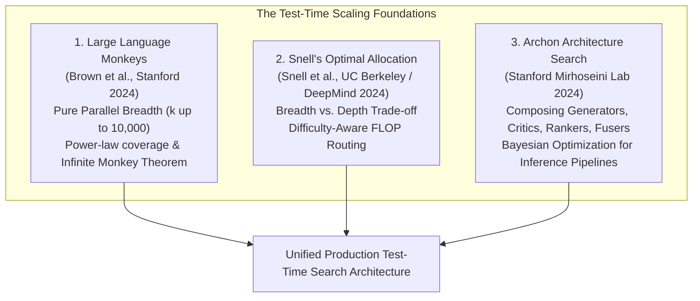
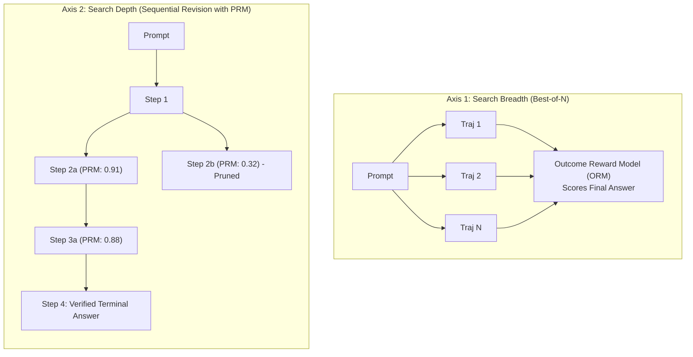
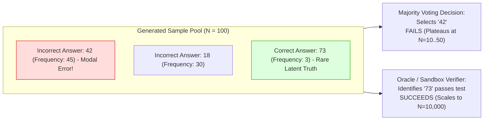
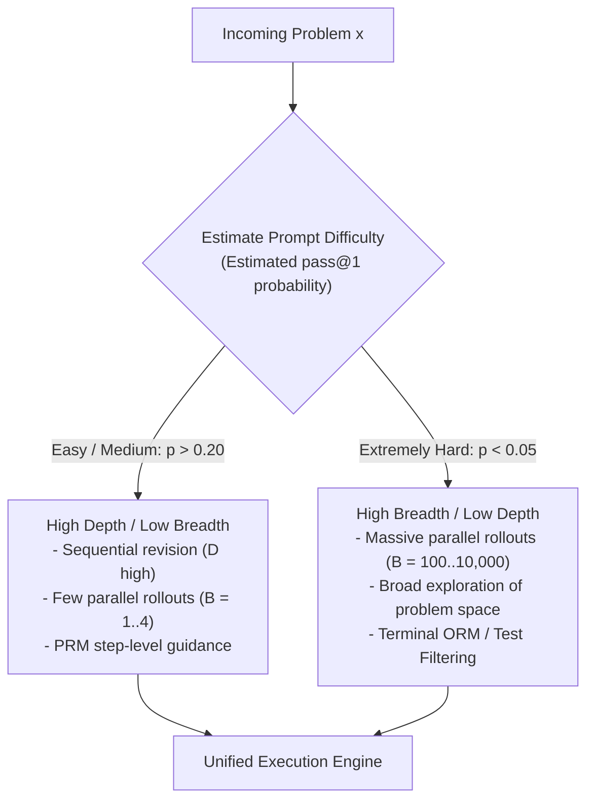
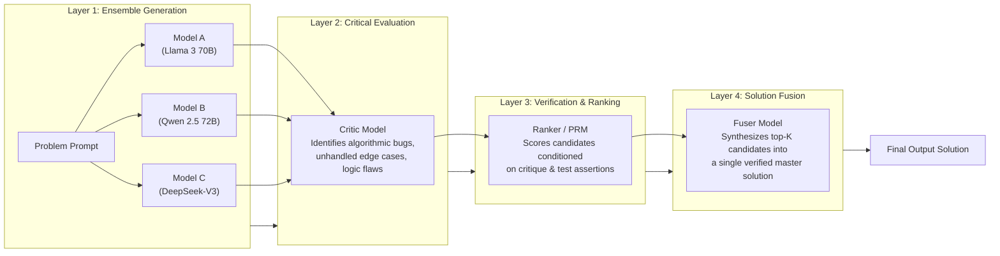

## Course & Lecture Context

> **Stanford CS329A: Self-Improving AI Agents** — Lecture 2  
> **Instructor:** Prof. Azalia Mirhoseini (Assistant Professor of Computer Science, Stanford University; ex-Google Brain, Google DeepMind, Anthropic).

In Lecture 1, we established that pre-training scaling laws have encountered severe data, thermal, and economic constraints. In this lesson, we transition to the operational core of inference-time intelligence: **Test-Time Compute Scaling**.

Rather than modifying model parameters, test-time scaling treats the foundation model as a stochastic exploration engine. By combining parallel candidate generation, sequential revision, process-guided search, and multi-agent synthesis, we can trade inference FLOPs directly for accuracy. We explore three foundational research pillars from Stanford, UC Berkeley, and Google DeepMind:
1. **Large Language Monkeys** (Brown et al., Stanford 2024): The power-law scaling of repeated sampling and coverage.
2. **Snell's Compute-Optimal Allocation** (Snell et al., UC Berkeley / DeepMind 2024): The Pareto frontier balancing breadth (Best-of-$N$) against depth (sequential revision).
3. **Archon** (Stanford Mirhoseini Lab 2024): Automated architecture search over multi-agent inference pipelines (generators, critics, rankers, fusers).

---

## Learning Objectives

By the end of this lesson, you will be able to:

1. **Contrast Coverage vs. Majority Voting:** Quantify why self-consistency plateaus at 10–50 samples due to modal errors, while oracle-verified coverage scales log-linearly up to 10,000+ samples.
2. **Analyze the Generation-Verification Gap:** Explain mathematically and empirically why generative capacity outstrips automated verification in open domains.
3. **Apply Snell's Pareto Frontier:** Formulate the FLOP allocation trade-off between search breadth (Best-of-$N$) and search depth (step-level revision with Process Reward Models), and route compute dynamically based on prompt difficulty.
4. **Architect Modular Inference Pipelines via Archon:** Compose generators, verifiers, critics, rankers, and fusers, and explain why LLM fusion can surpass even oracle candidate selection.
5. **Implement an End-to-End Test-Time Search Harness:** Build a typed, production-ready Python framework executing Best-of-$N$, temperature scheduling, majority voting clustering, and verifier scoring.

---

## Three Seminal Papers: The Triad of Inference Scaling



### 1. *Large Language Monkeys: Scaling Inference Compute with Repeated Sampling* (Brown et al., 2024)

Named after the classical **Infinite Monkey Theorem**—which posits that a monkey hitting keys at random on a typewriter for an infinite amount of time will almost surely type the complete works of William Shakespeare—this paper asks: *What happens if we treat an LLM as the monkey, and repeatedly sample solutions to difficult algorithmic and mathematical problems?*

#### Empirical Methodology
The authors evaluated open-source models (including Llama 3 8B/70B, Gemma, DeepSeek-V3, and Pythia) across difficult benchmarks:
- **MATH** (Challenging high-school and Olympiad mathematics)
- **Codeforces** (Competitive programming under strict runtime constraints)
- **SWE-bench Lite** (End-to-end GitHub issue resolution on real software repositories)
- **KernelBench** (Translating high-level PyTorch tensor operations into optimized CUDA kernels)

Samples per problem were scaled from $k = 1$ to $k = 10{,}000$ using stochastic sampling ($T \in [0.6, 0.8]$).

#### Core Findings
1. **Underestimated Latent Competence:** Small models contain correct solutions in their probability distribution that single-shot sampling rarely surfaces. A compact 8B model with $k=1{,}000$ samples and an automated unit test verifier outperformed single-shot **GPT-4o** and **Claude 3.5 Sonnet** on SWE-bench Lite.
2. **Empirical Power-Law Coverage:** Coverage (the fraction of problems solved by at least one sample) follows an exponential power law across all model sizes (from 70M to 70B parameters):
   $$\text{Coverage}(k) = 1 - a \cdot k^{-b}$$
3. **The Necessity of Hard Tails:** The power law holds because real-world benchmark suites possess a long tail of problems where the pass probability $p_i$ is tiny ($0.01\% - 0.5\%$), but non-zero.

---

### 2. *Scaling LLM Test-Time Compute Optimally can be More Effective than Scaling Model Parameters* (Snell et al., 2024)

While *Language Monkeys* focused on parallel repeated sampling (breadth), Charlie Snell and his collaborators at UC Berkeley and Google DeepMind demonstrated that parallel sampling is only one dimension of test-time compute.

#### The Two Axes of Test-Time FLOPs
1. **Search Breadth (Parallel Sampling / Best-of-$N$):** Sampling $N$ independent end-to-end trajectories from the model and scoring their terminal outputs using an **Outcome Reward Model (ORM)**.
2. **Search Depth (Sequential Revision / Step-Level Search):** Taking an initial trajectory and performing iterative step-by-step refinement, branching at intermediate reasoning steps using a **Process Reward Model (PRM)**.



#### Snell's Equivalence Theorem
The central finding of Snell et al. is that **spending test-time compute on a smaller model can exceed the performance of a model with $14\times$ more pre-training compute**:
- On easy-to-medium questions on the MATH benchmark, an instruction-tuned PaLM 2 model with optimal test-time search matched the performance of a model trained with more than an order of magnitude more FLOPs.
- However, this trade-off is strictly bounded by **prompt difficulty**.

---

### 3. *Archon: An Architecture Search Framework for Inference-Time Techniques* (Stanford, 2024)

Published by Prof. Azalia Mirhoseini's lab at Stanford, **Archon** reframes inference-time engineering. Instead of treating inference as a fixed algorithmic loop (like raw Best-of-$N$ or standard tree search), Archon models inference as a **Modular Architecture Design Problem**.

Archon decomposes inference into composable, discrete primitive layers:
1. **Generators ($G$):** Produce candidate solutions across single models or diverse multi-model ensembles.
2. **Critics ($C$):** Review a candidate solution, identify logical flaws, edge-case omissions, or potential compile errors, and output structured critiques.
3. **Rankers ($R$):** Score and rank a pool of candidates conditioned on critic feedback or unit test results.
4. **Fusers ($F$):** Take $K$ diverse, partially correct candidate solutions and synthesize a single, unified, superior output.
5. **Unit Test Generators ($TG$) & Evaluators ($TE$):** Autonomously generate input-output assertions from the problem statement and execute code candidates against them.

Using **Bayesian Optimization** (via the `i-test` engine), Archon searches the combinatorial space of inference pipelines to find the Pareto-optimal graph configuration under strict latency and financial cost budgets.

---

## Core Concepts & Mathematical Formulations

### Coverage vs. Majority Voting: The Modal Error Plateau

In multi-sample decoding, there are two primary ways to select a final response when an external compiler or test suite is unavailable:

1. **Majority Voting (Self-Consistency / Wang et al., 2022):** Sample $N$ reasoning paths, extract the final answer $A_i$ from each path, and select the mode of the distribution:
   $$A^* = \arg\max_{a} \sum_{i=1}^{N} \mathbb{I}(A_i = a)$$
2. **Coverage (Oracle Verifier):** The fraction of problems where **at least one** candidate in the pool of $N$ samples is strictly correct:
   $$\text{Coverage}(N) = \mathbb{I}\left( \sum_{i=1}^{N} \mathbb{I}(\text{Verify}(A_i) = \text{PASS}) \ge 1 \right)$$



#### Why Majority Voting Plateaus
Majority voting relies on the assumption that errors are independent and dispersed across the answer space, while the truth is unique and concentrates probability mass. 

In practice, on difficult reasoning benchmarks (e.g., MATH Level 5 or SWE-bench), **errors are highly correlated**. Models share systemic heuristics and fall into common intuitive traps. A flawed reasoning path may capture $45\%$ of the probability mass (the "modal error"), while the intricate, correct proof captures only $3\%$.

As $N$ increases from 50 to 1,000:
- Majority voting confidence in the incorrect modal answer **increases**, hardening the error.
- Accuracy plateaus completely between $N=10$ and $N=50$.
- In contrast, oracle-verified coverage continues scaling log-linearly up to $N=10{,}000$, because finding the truth only requires a single non-zero hit ($c \ge 1$).

#### The Generation-Verification Gap
This divergence defines the fundamental challenge of inference scaling:

$$\Delta_{\text{GV}}(N) = \text{Coverage}(N) - \text{Accuracy}_{\text{verifier}}(N)$$

```
Performance Gap on Benchmark MATH Level 5:
Single-shot pass@1:           ~18%
Majority Voting (N = 100):     ~31%  <-- Plateaus due to modal errors
Outcome Reward Model (N = 100):~42%  <-- Limited by reward model accuracy
Oracle Coverage (N = 100):     ~78%  <-- Latent answers generated by model!
-------------------------------------------------------------------------
Generation-Verification Gap:   36% to 47% unrealized accuracy
```

#### Case Study: KernelBench & Deterministic Verification
In verifiable domains, $\Delta_{\text{GV}}$ collapses to zero. A prime example highlighted in Stanford CS329A is **KernelBench** (generating optimized CUDA kernels from high-level PyTorch code). 

Why is CUDA kernel generation perfectly verifiable?
1. We have a reference implementation: the PyTorch source function $f_{\text{ref}}(x)$.
2. We compile the LLM's generated CUDA kernel $f_{\text{cuda}}(x)$.
3. We execute both on random input tensors $x \sim \mathcal{N}(0, I)$ and compute the maximum absolute tensor difference:
   $$\text{Diff} = \| f_{\text{cuda}}(x) - f_{\text{ref}}(x) \|_{\infty}$$
4. If $\text{Diff} < 10^{-5}$ and runtime is faster than PyTorch, the kernel is verified. 

Because the verifier is a deterministic compiler and execution harness, KernelBench achieves the full theoretical power-law coverage curve without reward model noise.

---

### Snell's Pareto Frontier: Breadth vs. Depth Allocation

How should an agent allocate an inference budget of $C_{\text{tokens}}$ FLOPs?

Let:
- $B =$ Number of parallel independent rollouts (Search Breadth / Best-of-$N$).
- $D =$ Length or step-depth of sequential revisions per rollout (Search Depth).
- Total compute consumed: $C \approx B \times D \times \text{FLOPs per token}$.



#### The Difficulty-Aware Routing Theorem
Snell et al. binned problems into 5 difficulty tiers based on single-shot accuracy ($\text{pass}@1$):
- **Tier 1 (Easy):** $\text{pass}@1 > 80\%$
- **Tier 3 (Medium):** $20\% \le \text{pass}@1 \le 50\%$
- **Tier 5 (Hard):** $\text{pass}@1 < 5\%$

Their empirical Pareto analysis uncovered a fundamental structural asymmetry:

1. **For Easy and Medium Problems (Tiers 1–3):**
   - **Sequential revision dominates.** The model understands the domain and rarely needs to explore completely different search branches. 
   - A single path ($B=1$) with $4$ rounds of critique and revision achieves higher accuracy than $32$ independent parallel samples, while consuming a fraction of the KV cache memory.
   - Additional test-time compute is **strictly more compute-efficient than pre-training scaling**.
2. **For Extremely Hard Problems (Tier 5):**
   - **Parallel breadth dominates.** If a problem is fundamentally difficult, the model's initial chain of thought is often built on an incorrect premise. Sequential revision of a flawed premise merely polishes an error.
   - The agent requires broad, stochastic exploration across thousands of independent seeds to discover a viable solution path.
   - **Pre-training scaling remains essential:** For Tier 5 problems, small models eventually hit an asymptotic ceiling where even infinite samples fail to produce a solution, whereas larger base models succeed.

---

### The Archon Multi-Agent Inference Pipeline

The Archon framework demonstrates that rather than choosing between pure Best-of-$N$ or sequential revision, the highest-performing inference system is a **composition of specialized LLM roles**.



#### Primitive Operations in Archon
- **Multi-Model Generator ($G$):** Generates candidate solutions across heterogeneous models. Drawing samples from diverse model architectures decorrelates modal errors.
- **Critic ($C$):** Receives prompt $x$ and candidate $y_i$. Generates structured critique $c_i$:
  $$\text{Prompt}_{\text{critic}} = \text{"Analyze the weaknesses, edge case omissions, and mathematical flaws in candidate } y_i\text{"}$$
- **Ranker ($R$):** Evaluates all candidates $\{y_1, \dots, y_K\}$ alongside their critiques $\{c_1, \dots, c_K\}$ and emits a normalized probability distribution or ordinal ranking.
- **Fuser ($F$):** Rather than simply returning the top-ranked candidate $\arg\max R(y_i)$, Archon feeds the top $K$ candidates and their critiques into a **Fuser LLM**:
  $$\text{Prompt}_{\text{fuser}} = \text{"Given the problem } x \text{ and these } K \text{ alternative approaches with their critiques, synthesize the single optimal solution."}$$

#### Why Fusion Outperforms Oracle Selection
In a stunning empirical result from the Archon paper, **Fusion achieved higher win rates than Oracle Selection**:
- In an oracle selection setup, if candidate A has a brilliant algorithmic insight but misses an edge case, and candidate B has correct edge case handling but an inefficient algorithm, the oracle can only pick one of them (both fail the strict full test suite).
- The **Fuser LLM** reads both candidate A and candidate B, extracts the algorithmic core from A, borrows the edge-case guardrails from B, and synthesizes a solution that is strictly superior to any individual sample in the pool!

---

## Production Python Implementation: `TestTimeSearchHarness`

Below is a complete, runnable, production-grade Python implementation of an inference-time search engine. It features:
- Stochastic parallel sampling with configurable temperature.
- Majority voting clustering via normalized answer extraction.
- Best-of-$N$ ranking using outcome scoring functions.
- Sequential revision with iterative critic feedback.
- Difficulty-aware compute routing based on pass@1 estimation.

```python
"""
test_time_search.py
================================================================================
Stanford CS329A: Self-Improving AI Agents
Production-grade Test-Time Compute Search Harness.

Implements:
- Parallel Best-of-N Sampling
- Self-Consistency Majority Voting
- Iterative Sequential Revision (Critic-Refine Loop)
- Snell Difficulty-Aware Compute Router
================================================================================
"""

from __future__ import annotations

import collections
import dataclasses
import math
import random
import re
from typing import Callable, Protocol, Sequence


# ==============================================================================
# Data Structures
# ==============================================================================

@dataclasses.dataclass(frozen=True)
class CandidateSolution:
    """Represents a single trajectory generated by a language model."""
    problem_id: str
    raw_response: str
    extracted_answer: str
    cost_tokens: int
    metadata: dict[str, float | str] = dataclasses.field(default_factory=dict)


@dataclasses.dataclass(frozen=True)
class VerificationResult:
    """Outcome of evaluating a candidate solution."""
    is_correct: bool
    score: float  # In [0.0, 1.0]
    feedback: str


class LanguageModelProtocol(Protocol):
    """Abstract protocol for an inference backend."""
    def generate(
        self,
        prompt: str,
        temperature: float,
        max_tokens: int
    ) -> tuple[str, int]:
        """Returns (response_text, token_count)."""
        ...


# ==============================================================================
# Mock LLM for Simulation & Offline Testing
# ==============================================================================

class MockMathLLM:
    """
    Simulates a language model solving mathematical problems.
    Generates plausible correct responses, modal errors, and random errors.
    """
    def __init__(self, ground_truth: str, modal_error: str, p_correct: float = 0.15, seed: int = 42):
        self.ground_truth = ground_truth
        self.modal_error = modal_error
        self.p_correct = p_correct
        self.rng = random.Random(seed)

    def generate(self, prompt: str, temperature: float = 0.7, max_tokens: int = 512) -> tuple[str, int]:
        # If prompt contains critique feedback, simulate self-correction
        if "CRITIQUE:" in prompt:
            # Revision increases correct probability by +40%
            effective_p = min(0.90, self.p_correct + 0.40)
        else:
            effective_p = self.p_correct

        roll = self.rng.random()
        tokens = int(self.rng.gauss(150, 20))

        if roll < effective_p:
            answer = self.ground_truth
            trace = f"Step 1: Deconstruct equation. Step 2: Factorize. Answer: {answer}"
        elif roll < effective_p + 0.50:
            # 50% chance of falling into the common modal error
            answer = self.modal_error
            trace = f"Step 1: Simplify terms incorrectly. Answer: {answer}"
        else:
            # Random arithmetic error
            answer = str(self.rng.randint(100, 999))
            trace = f"Step 1: Miscalculated intermediate sum. Answer: {answer}"

        response = f"{trace}\n#### {answer}"
        return response, tokens


# ==============================================================================
# Production Test-Time Search Harness
# ==============================================================================

class TestTimeSearchHarness:
    """
    Orchestrates test-time compute search strategies:
    - Best-of-N with Verifier/ORM
    - Majority Voting (Self-Consistency)
    - Sequential Revision (Critic-guided Depth Search)
    - Difficulty-Aware Compute Router
    """

    def __init__(
        self,
        llm: LanguageModelProtocol,
        verifier_fn: Callable[[str, str], VerificationResult]
    ):
        self.llm = llm
        self.verifier_fn = verifier_fn

    @staticmethod
    def extract_answer(response_text: str) -> str:
        """
        Extracts final answer using standard benchmark delimiter '#### <answer>'
        or falls back to trailing numeric string.
        """
        match = re.search(r"####\s*([^\n\r]+)", response_text)
        if match:
            return match.group(1).strip()
        
        # Fallback regex for numeric values
        numbers = re.findall(r"-?\d+(?:\.\d+)?", response_text)
        return numbers[-1] if numbers else ""

    def sample_parallel(
        self,
        problem_id: str,
        prompt: str,
        n: int,
        temperature: float = 0.7,
        max_tokens_per_sample: int = 512
    ) -> list[CandidateSolution]:
        """Executes N parallel independent stochastic rollouts (Search Breadth)."""
        candidates: list[CandidateSolution] = []
        for _ in range(n):
            raw_text, tokens = self.llm.generate(
                prompt=prompt,
                temperature=temperature,
                max_tokens=max_tokens_per_sample
            )
            ans = self.extract_answer(raw_text)
            candidates.append(
                CandidateSolution(
                    problem_id=problem_id,
                    raw_response=raw_text,
                    extracted_answer=ans,
                    cost_tokens=tokens
                )
            )
        return candidates

    def majority_vote(
        self,
        candidates: Sequence[CandidateSolution]
    ) -> tuple[str, CandidateSolution, float]:
        """
        Executes self-consistency majority voting over candidate answers.
        Returns: (winning_answer, representative_candidate, confidence_fraction)
        """
        if not candidates:
            raise ValueError("Candidate pool cannot be empty.")

        answer_counts: collections.Counter[str] = collections.Counter()
        first_candidate_for_answer: dict[str, CandidateSolution] = {}

        for cand in candidates:
            ans = cand.extracted_answer
            answer_counts[ans] += 1
            if ans not in first_candidate_for_answer:
                first_candidate_for_answer[ans] = cand

        winner_ans, winner_count = answer_counts.most_common(1)[0]
        confidence = winner_count / len(candidates)
        return winner_ans, first_candidate_for_answer[winner_ans], confidence

    def best_of_n(
        self,
        candidates: Sequence[CandidateSolution],
        problem_spec: str
    ) -> tuple[CandidateSolution, VerificationResult]:
        """
        Ranks candidates using the verifier function and returns the highest-scoring candidate.
        """
        if not candidates:
            raise ValueError("Candidate pool cannot be empty.")

        best_cand = candidates[0]
        best_verif = VerificationResult(is_correct=False, score=-1.0, feedback="Unscored")

        for cand in candidates:
            verif = self.verifier_fn(cand.raw_response, problem_spec)
            if verif.score > best_verif.score:
                best_verif = verif
                best_cand = cand
                if verif.is_correct:
                    # Early termination if perfect ground truth oracle passes
                    break

        return best_cand, best_verif

    def sequential_refine(
        self,
        problem_id: str,
        initial_prompt: str,
        problem_spec: str,
        max_depth: int = 3,
        temperature: float = 0.4
    ) -> tuple[CandidateSolution, VerificationResult, int]:
        """
        Executes search depth: sequentially revises a solution conditioned on verifier feedback.
        Returns: (final_candidate, final_verification, total_tokens_spent)
        """
        current_prompt = initial_prompt
        total_tokens = 0
        best_candidate: CandidateSolution | None = None
        best_verif = VerificationResult(is_correct=False, score=-1.0, feedback="")

        for depth in range(max_depth):
            raw_text, tokens = self.llm.generate(
                prompt=current_prompt,
                temperature=temperature,
                max_tokens=512
            )
            total_tokens += tokens
            ans = self.extract_answer(raw_text)
            candidate = CandidateSolution(
                problem_id=problem_id,
                raw_response=raw_text,
                extracted_answer=ans,
                cost_tokens=tokens,
                metadata={"revision_depth": depth}
            )

            verif = self.verifier_fn(raw_text, problem_spec)
            if verif.score > best_verif.score:
                best_verif = verif
                best_candidate = candidate

            if verif.is_correct:
                # Problem solved successfully
                return candidate, verif, total_tokens

            # Construct critique-driven sequential prompt
            current_prompt = (
                f"{initial_prompt}\n\n"
                f"PREVIOUS ATTEMPT:\n{raw_text}\n\n"
                f"CRITIQUE: The previous answer produced '{ans}', which failed verification.\n"
                f"Feedback: {verif.feedback}\n"
                f"Analyze where the previous reasoning broke down, correct the mistake, and state the final answer with ####."
            )

        assert best_candidate is not None
        return best_candidate, best_verif, total_tokens

    def route_and_solve(
        self,
        problem_id: str,
        prompt: str,
        problem_spec: str,
        estimated_difficulty: float,  # Estimated pass@1 in [0.0, 1.0]
        token_budget: int = 2000
    ) -> tuple[str, bool, int]:
        """
        Implements Snell's Difficulty-Aware Compute Router:
        - If problem is Easy (pass@1 >= 0.50): Single-shot or light Best-of-3
        - If problem is Medium (0.15 <= pass@1 < 0.50): Sequential revision (Depth)
        - If problem is Hard (pass@1 < 0.15): High-breadth parallel sampling (Breadth)
        """
        if estimated_difficulty >= 0.50:
            # Easy: spend minimal compute
            candidates = self.sample_parallel(problem_id, prompt, n=3, temperature=0.3)
            _, best_verif = self.best_of_n(candidates, problem_spec)
            tokens = sum(c.cost_tokens for c in candidates)
            winner, _, _ = self.majority_vote(candidates)
            return winner, best_verif.is_correct, tokens

        elif estimated_difficulty >= 0.15:
            # Medium: allocate compute to Search Depth (Sequential Revision)
            cand, verif, tokens = self.sequential_refine(
                problem_id=problem_id,
                initial_prompt=prompt,
                problem_spec=problem_spec,
                max_depth=4,
                temperature=0.5
            )
            return cand.extracted_answer, verif.is_correct, tokens

        else:
            # Hard: allocate entire token budget to Search Breadth (Best-of-N)
            est_tokens_per_sample = 150
            n_samples = max(5, token_budget // est_tokens_per_sample)
            candidates = self.sample_parallel(problem_id, prompt, n=n_samples, temperature=0.8)
            best_cand, best_verif = self.best_of_n(candidates, problem_spec)
            tokens = sum(c.cost_tokens for c in candidates)
            return best_cand.extracted_answer, best_verif.is_correct, tokens


# ==============================================================================
# Verification and Demonstration Execution
# ==============================================================================

if __name__ == "__main__":
    print("=" * 80)
    print("STANFORD CS329A: TEST-TIME COMPUTE SEARCH & ROUTING DEMONSTRATION")
    print("=" * 80)

    TRUE_ANSWER = "137"
    MODAL_ERROR_ANSWER = "42"

    def mock_verifier(response: str, expected: str) -> VerificationResult:
        ans = TestTimeSearchHarness.extract_answer(response)
        if ans == expected:
            return VerificationResult(is_correct=True, score=1.0, feedback="Calculations verified.")
        elif ans == MODAL_ERROR_ANSWER:
            return VerificationResult(is_correct=False, score=0.2, feedback="Sign error in term 3.")
        else:
            return VerificationResult(is_correct=False, score=0.0, feedback="Incorrect solution.")

    # Instantiate Mock LLM with low single-shot accuracy (10%) and strong modal trap
    mock_engine = MockMathLLM(
        ground_truth=TRUE_ANSWER,
        modal_error=MODAL_ERROR_ANSWER,
        p_correct=0.10,
        seed=2026
    )

    harness = TestTimeSearchHarness(llm=mock_engine, verifier_fn=mock_verifier)
    PROMPT = "Solve for prime p: 2^p - 1 is prime and p leaves remainder 2 mod 5."

    print("\n[Experiment 1] Comparing Majority Voting vs. Best-of-N with Verifier")
    print("-" * 80)

    # Sample 40 candidates
    samples = harness.sample_parallel("prob_01", PROMPT, n=40, temperature=0.7)
    
    # 1. Majority Voting
    mv_answer, mv_cand, mv_conf = harness.majority_vote(samples)
    mv_is_correct = (mv_answer == TRUE_ANSWER)
    
    # 2. Best-of-N with Verifier
    bon_cand, bon_verif = harness.best_of_n(samples, TRUE_ANSWER)

    print(f"Total Samples Generated: {len(samples)}")
    print(f"Majority Voting Output:   '{mv_answer}' (Confidence: {mv_conf:.1%}) -> Correct? {mv_is_correct}")
    print(f"Best-of-N Verifier Output: '{bon_cand.extracted_answer}' (Score: {bon_verif.score:.2f}) -> Correct? {bon_verif.is_correct}")
    print("\nKey Insight: Notice how Majority Voting picks the modal error '42' because")
    print("it is the most frequent flawed answer. Best-of-N identifies the true answer '137'!")

    print("\n" + "=" * 80)
    print("[Experiment 2] Snell's Difficulty-Aware Compute Router Demonstration")
    print("=" * 80)

    difficulty_scenarios = [
        ("Easy Problem (pass@1 est = 0.70)", 0.70),
        ("Medium Problem (pass@1 est = 0.30)", 0.30),
        ("Olympiad-Level Hard (pass@1 est = 0.05)", 0.05),
    ]

    for label, diff in difficulty_scenarios:
        ans, success, tokens = harness.route_and_solve(
            problem_id="test_routing",
            prompt=PROMPT,
            problem_spec=TRUE_ANSWER,
            estimated_difficulty=diff,
            token_budget=3000
        )
        print(f"\nScenario: {label}")
        print(f"  -> Chosen Strategy: {'Sequential Revision' if 0.15 <= diff < 0.50 else ('Parallel Best-of-N' if diff < 0.15 else 'Light Best-of-3')}")
        print(f"  -> Answer Emitted:  '{ans}'")
        print(f"  -> Correct?         {success}")
        print(f"  -> Tokens Spent:    {tokens} tokens")
```

---

## Failure Modes, Systems Trade-Offs, & Edge Cases

Deploying inference-time search in production agentic systems introduces non-trivial engineering bottlenecks:

### 1. KV-Cache Memory Explosion in Parallel Sampling
Running $N=100$ parallel rollouts of length $L=4{,}096$ tokens simultaneously requires maintaining $100$ distinct Key-Value cache contexts. For a 70B parameter model utilizing Grouped-Query Attention (GQA):

$$\text{KV Cache Size per Token} \approx 2 \times n_{\text{layers}} \times n_{\text{kv\_heads}} \times d_{\text{head}} \times 2 \text{ bytes}$$

$$\text{Total Memory} \approx 100 \times 4096 \times 0.25\text{ MB} \approx 102.4\text{ GB}$$

This memory footprint exceeds the capacity of a single 80GB H100 GPU for KV cache alone, requiring distributed tensor parallelism or **chunked prefill / prefix caching** where all $N$ workers share the prompt's KV cache.

### 2. Goodhart's Law in Learned Reward Models
When scaling $N$ beyond $1{,}000$, Outcome Reward Models (ORMs) suffer from reward over-optimization. Adversarial or highly verbose candidate solutions score anomalously high by mimicking stylistic markers of correctness without actual logical validity. Without execution grounding, high-compute test-time search can collapse into hallucination amplification.

### 3. Sequential Latency vs. GPU Throughput
- **Parallel Breadth (Best-of-$N$)** maximizes GPU arithmetic intensity and batch parallelism. Time-to-solution is bounded by the longest single rollout ($O(L)$ latency).
- **Sequential Depth (Revision loops)** incurs a strict latency penalty ($K \times O(L)$ latency) because each revision round must wait for the previous round to finish decoding.

---

## Summary of Test-Time Search Paradigms

| Strategy | Exploration Mechanism | Selection / Scoring Engine | Primary Strength | Critical Failure Mode |
| :--- | :--- | :--- | :--- | :--- |
| **Best-of-$N$ (Parallel)** | $N$ independent stochastic rollouts ($T \in [0.6, 0.8]$) | Outcome Reward Model (ORM) or Unit Test Suite | Maximizes breadth; captures rare $0.1\%$ latent correct paths | Memory explosion; KV cache exhaustion; ORM reward hacking |
| **Majority Voting (Self-Consistency)** | $N$ independent rollouts | Modal frequency clustering of terminal answers | Zero-overhead; requires no external verifier or reward model | Plateaus at $N=10..50$; vulnerable to correlated modal errors |
| **Step-Level Beam Search** | Branching at intermediate tokens / sentences | Process Reward Model (PRM) scoring each step | Prunes invalid reasoning paths early; high token efficiency | PRM error propagation; compounding false negatives |
| **Sequential Revision** | Linear critique-and-refine conversation loop | Critic LLM feedback + Unit Test errors | Excels on easy/medium logic errors; low memory footprint | Sequential latency penalty; can get trapped in local optima |
| **Archon Pipeline** | Multi-agent DAG (Generators $\to$ Critics $\to$ Fusers) | Bayesian-optimized ensemble configuration | Fuses partial insights; out-performs oracle selection | High orchestration overhead; token serialization latency |

---

## Next Steps

We have established how to scale test-time compute through parallel sampling, sequential revision, and multi-agent architecture search. However, as demonstrated by the **generation-verification gap**, test-time search is only as good as the **verifier** that guides it.

In the next lesson, we dive deep into the theory and engineering of **Robust Verification and Reward Models**: contrasting Outcome Reward Models (ORMs) with Process Reward Models (PRMs), analyzing mathematical step-level annotation (PRM800K), and mastering multi-verifier ensembling with the **Weaver** framework.

[Next: Robust Verification & Reward Models →](/docs/ai-agents/self-improving-ai-agents/03-robust-verification-and-reward-models)
