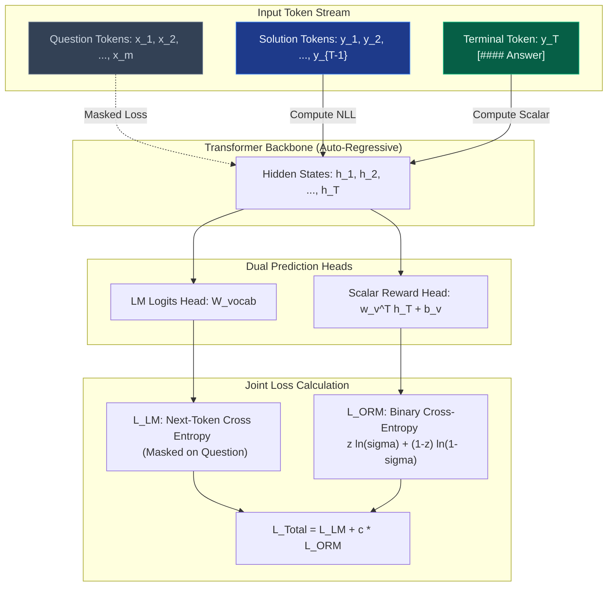
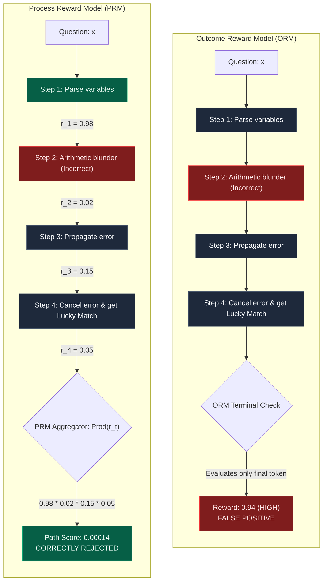
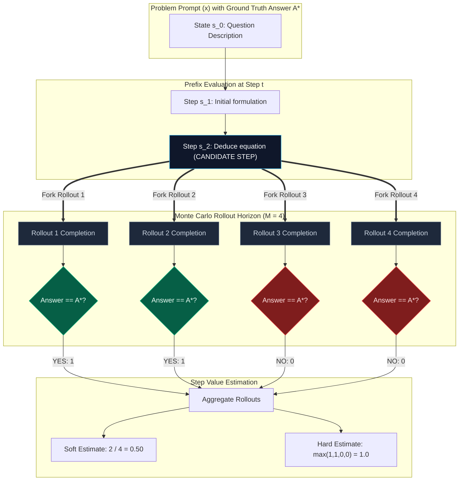
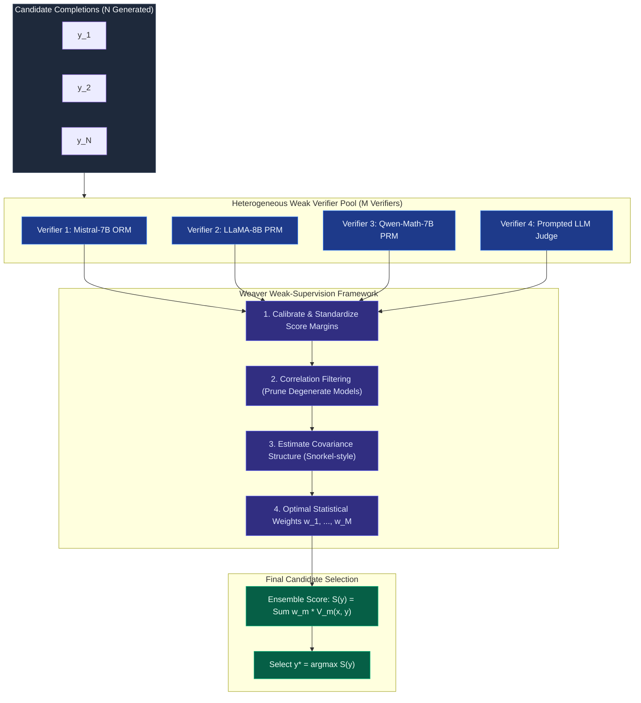
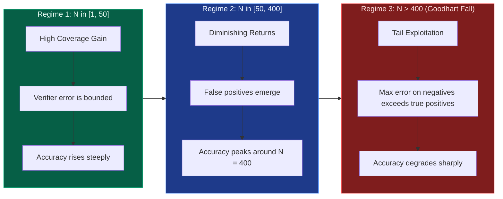

## 1. Introduction & Theoretical Foundations

In test-time compute scaling, increasing the inference budget requires an automated mechanism to distinguish correct solutions from plausible hallucinations. In simple tasks, majority voting (self-consistency) aggregates independent samples to identify the modal output. However, as problem complexity increases—such as in multi-step mathematics, competitive programming, and formal theorem proving—majority voting degrades rapidly. When the probability of generating a correct response falls below a critical threshold, the modal answer is frequently an incorrect consensus.

This bottleneck elevates **verification** to the central component of test-time scaling. Rather than asking a generator to produce an infallible answer on its initial forward pass, the system samples multiple candidate reasoning traces and evaluates each against a trained verifier or reward model. 

```
                               TEST-TIME COMPUTE
                                       │
        ┌──────────────────────────────┴──────────────────────────────┐
        ▼                                                             ▼
   GENERATOR                                                      VERIFIER
Samples N Candidate Traces                                 Scores & Ranks Completions
P_θ(y_1, y_2, ..., y_N | x)                                V_φ(x, y_i) -> [0, 1]
```

However, relying on learned verifiers introduces a fundamental challenge known as **Goodhart's Law** or **Verifier Over-Optimization**: as search depth and sample budgets expand, generators systematically exploit the false-positive vulnerabilities of the verifier. A reward model that achieves 95% validation accuracy on offline benchmarks can fail when used to guide search over hundreds of candidate solutions.

### Lecture Prerequisites & Scope

This lesson covers the theoretical and empirical foundations of automated verification as presented in Stanford CS329A (Lecture 3):

- **The Generation-Verification Gap**: Why verifying candidate proofs or solutions is asymptotically easier than discovering them from scratch, and why imperfect verifiers constrain search.
- **Outcome Reward Models (ORMs)**: The joint language-modeling and scalar classification objective introduced in Cobbe et al. (OpenAI 2021) with GSM8K.
- **Process Reward Models (PRMs)**: Step-level dense reward modeling, the PRM800K dataset, and active mining of "convincing wrong" reasoning traces from Lightman et al. (OpenAI 2023).
- **Automated Step Supervision (Math-Shepherd)**: Replacing human step annotations with Monte Carlo tree rollouts (Hard vs. Soft estimation) from Wang et al. (2023).
- **Ensembling Weak Verifiers (Weaver)**: Stanford's NeurIPS 2025 framework for aggregating heterogeneous, imperfect verifiers via weak-to-strong covariance modeling and distilling them into lightweight 400M student models.
- **The Dynamics of Over-Optimization**: The mathematical failure modes of search when $N > 400$, extreme value theory of reward errors, and calibration strategies.

---

## 2. The Generation-Verification Gap

The rationale for test-time verification rests on a core computational complexity principle: for many difficult problem domains, **verification is computationally easier than generation**.

### 2.1 Complexity Asymmetry in NP Domains

In computational complexity theory, the complexity class $\mathbf{NP}$ contains decision problems for which a proposed solution (witness or certificate $w$) can be verified in deterministic polynomial time:

$$\text{Verify}(x, w) \in \mathbf{P}$$

In contrast, finding the certificate $w$ from scratch by brute-force search generally requires exponential time:

$$\text{Generate}(x) \in \mathcal{O}(2^{|x|})$$

| Domain | Generation Complexity (Finding $w$) | Verification Complexity (Checking $w$) | Verification Mechanism |
| :--- | :--- | :--- | :--- |
| **Formal Mathematics** | Searching exponential proof trees ($\text{BFS} / \text{DFS}$) | Evaluating proof step transitions ($\mathcal{O}(\text{length})$) | Proof Assistants (Lean 4, Isabelle, Coq) |
| **Code Generation** | Exploring algorithm design & edge cases | Running unit test assertions & linters | Deterministic Sandboxed Runtime |
| **Arithmetic / Word Problems** | Multi-hop variable assignment & operations | Checking algebraic constraints step-by-step | Symbolic Solvers (SymPy) / PRMs |
| **Circuit Design / SAT** | NP-complete boolean satisfiability | Evaluating CNF clauses against assignment | Deterministic Boolean Evaluation |

Because the verifier operates on a concrete candidate sequence, its operational complexity is bounded: it needs only to confirm that each transition follows valid mathematical or logical deduction.

### 2.2 The Collapse of Imperfect Verifiers

While the theoretical gap favors verification, learned verifiers are approximations. An imperfect verifier can undermine test-time scaling when scaling the sample size $N$.

Consider a problem instance $x$ with solution space $\mathcal{Y}$. Let $y_1, y_2, \dots, y_N \sim P_\theta(y \mid x)$ be $N$ independent candidate completions sampled from a generator with base accuracy:

$$p = P(\text{IsCorrect}(y) = 1) \in (0, 1)$$

#### The Ideal Verifier Case
If an oracle verifier $V^*(x, y) = \mathbf{1}[\text{IsCorrect}(y) = 1]$ is available, the system achieves the theoretical **Pass@N** coverage:

$$\text{Coverage}(N) = 1 - (1 - p)^N$$

As $N \to \infty$, $\text{Coverage}(N) \to 1.0$.

#### The Learned Verifier Case
Now consider a real-world, parameterized verifier $V_\phi(x, y) \in [0, 1]$. Decompose its predictions into a true signal plus an error term:

$$V_\phi(x, y) = \mathbf{1}[\text{IsCorrect}(y) = 1] + \epsilon(x, y)$$

where $\epsilon(x, y)$ represents epistemic and aleatoric error. Define the verifier's error rates:
- **False Positive Rate ($\alpha$)**: $\alpha = P(V_\phi(x, y) > \tau \mid \text{IsCorrect}(y) = 0)$
- **False Negative Rate ($\beta$)**: $\beta = P(V_\phi(x, y) \le \tau \mid \text{IsCorrect}(y) = 1)$

When selecting the top candidate $\hat{y} = \arg\max_{i \in \{1, \dots, N\}} V_\phi(x, y_i)$, the probability that the system selects an incorrect solution depends on the ratio of incorrect candidates to correct candidates in the sample pool.

Out of $N$ generated candidates:
- Expected correct candidates: $N_{\text{correct}} = p N$
- Expected incorrect candidates: $N_{\text{incorrect}} = (1 - p) N$

By **Extreme Value Theory**, if the verifier error on incorrect samples follows a distribution with tail parameter $\sigma$, the maximum score among the $(1 - p)N$ incorrect samples grows logarithmically with sample size:

$$\mathbb{E}\left[\max_{j \in \text{Incorrect}} V_\phi(x, y_j)\right] \approx \mu + \sigma \sqrt{2 \ln((1 - p)N)}$$

For any non-zero false positive rate $\alpha > 0$, as $N$ increases, the number of incorrect candidates generating large positive error spikes eventually outnumbers the genuine correct candidates. 

Consequently, after a critical threshold $N^*$, **system accuracy declines as $N$ increases**. The generator produces false solutions that exploit the verifier's blind spots.

---

## 3. Seminal Paper 1: Outcome Reward Models (OpenAI 2021)

*Training Verifiers to Solve Math Word Problems* (Cobbe, Kosaraju, Bavarian, et al., OpenAI 2021) introduced the modern framework for training neural verifiers on multi-step reasoning tasks.

### 3.1 The GSM8K Benchmark

To evaluate multi-step arithmetic reasoning, the authors introduced **GSM8K** (Grade School Math 8K), a dataset of 8,500 high-quality, linguistically diverse word problems. 

Each problem requires between 2 and 8 steps of elementary arithmetic operations ($+, -, \times, \div$). Solutions are written in natural language, pairing conversational steps with inline calculations:

```
Question: Natalia sold clips to 48 of her friends in April, and then she sold half as many clips in May. How many clips did Natalia sell altogether in April and May?
Solution: Natalia sold 48 / 2 = 24 clips in May. Natalia sold 48 + 24 = 72 clips altogether in April and May. #### 72
```

### 3.2 Joint Training Architecture & Dual Loss Formulation

OpenAI demonstrated that training a pure binary classifier on transformer embeddings often leads to representation collapse and poor generalization. Instead, they initialized the verifier from the generator's autoregressive weights and trained it with a **joint objective**: language modeling on the reasoning steps plus a binary classification head on the terminal token.



#### Mathematical Formulation

Let $x = (x_1, \dots, x_m)$ denote the question tokens, and $y = (y_1, \dots, y_T)$ denote the generated candidate solution tokens.

1. **Token Masking**: Question tokens are masked during loss computation to focus the verifier's capacity on solution validity.
2. **Next-Token Prediction Loss ($\mathcal{L}_{\text{LM}}$)**:
   $$\mathcal{L}_{\text{LM}}(y \mid x) = - \frac{1}{T} \sum_{t=1}^T \log P_\phi(y_t \mid x, y_{<t})$$
3. **Outcome Reward Classification Loss ($\mathcal{L}_{\text{ORM}}$)**: A linear projection vector $w_v \in \mathbb{R}^d$ and scalar bias $b_v \in \mathbb{R}$ are applied to the final hidden state $h_T \in \mathbb{R}^d$:
   $$\hat{p}_{\text{ORM}} = \sigma(w_v^T h_T + b_v) = \frac{1}{1 + e^{-(w_v^T h_T + b_v)}}$$
   Given binary ground-truth label $z \in \{0, 1\}$ (where $z = 1$ if $\text{FinalAnswer}(y) == A^*$, else $z = 0$):
   $$\mathcal{L}_{\text{ORM}} = - \left[ z \log \hat{p}_{\text{ORM}} + (1 - z) \log (1 - \hat{p}_{\text{ORM}}) \right]$$
4. **Total Multi-Task Objective**:
   $$\mathcal{L}_{\text{Total}} = \mathcal{L}_{\text{LM}} + c_{\text{ORM}} \cdot \mathcal{L}_{\text{ORM}}$$
   where $c_{\text{ORM}} \approx 0.5$ balances gradient updates between semantic representation and scalar calibration.

### 3.3 Empirical Insights & Pareto Frontiers

Cobbe et al. established several empirical properties that govern reward-guided inference:

1. **Verification Outperforms Supervised Fine-Tuning (SFT)**: As training data scales, sampling 100 solutions and ranking them with an ORM significantly outperforms a model fine-tuned purely on ground-truth solutions.
2. **Generator vs. Verifier Parameter Allocation**: When total compute is constrained, allocating parameters to a **larger generator and a smaller verifier** yields superior performance compared to a small generator paired with an oversized verifier:
   $$\text{Acc}(\text{Gen}_{\text{175B}} + \text{Ver}_{\text{6B}}) > \text{Acc}(\text{Gen}_{\text{6B}} + \text{Ver}_{\text{175B}})$$
   *Intuition*: A verifier cannot score a correct proof if the generator lacks the capacity to express it in its sampling distribution. Coverage precedes verification.
3. **The Test-Time Saturation Cliff**: As candidate completions per problem $N$ scale from 1 to 400, accuracy increases monotonically. Beyond $N = 400$, accuracy plateaus and eventually declines due to the accumulation of false-positive classifier errors.

---

## 4. Seminal Paper 2: Process Reward Models (OpenAI 2023)

While Outcome Reward Models provide an automated scoring pipeline, their outcome-level reward assignment introduces structural vulnerabilities. In *Let's Verify Step by Step* (Lightman, Kosaraju, Cobbe, et al., OpenAI 2023), the authors analyzed these limitations and introduced **Process Reward Models (PRMs)**.

### 4.1 Structural Vulnerabilities of ORMs

Outcome-based reward evaluation suffers from three main limitations:

1. **Credit Assignment Failure**: If an 8-step solution makes a critical algebraic error on Step 2 but arrives at an answer labeled correct due to a compensating error on Step 6, the ORM assigns the entire trajectory a positive label ($z = 1$). This reinforces invalid reasoning steps.
2. **False Positives on Lucky Guesses**: In multiple-choice questions or problems with small answer ranges (e.g., $A^* \in \{0, 1, 2\}$), a random guess has a high probability of receiving a positive label.
3. **Poor Data Efficiency**: An ORM extracts only 1 bit of supervisory signal ($z \in \{0, 1\}$) from hundreds of generated tokens.

### 4.2 Architecture: ORM vs. PRM Evaluation



### 4.3 The PRM800K Dataset & Active Learning

To train step-level models, OpenAI curated **PRM800K**, containing **800,000 step-level human annotations** across 12,000 problems from the MATH benchmark.

- **Annotation Schema**: Human annotators evaluated each step $s_t$ in a generated reasoning chain and assigned a ternary rating:
  - $\text{Positive} (+1)$: Step is logically sound, mathematically valid, and makes progress toward the goal.
  - $\text{Negative} (-1)$: Step contains an algebraic, logical, or semantic error.
  - $\text{Neutral} (0)$: Step is a redundant rephrasing or an unhelpful but harmless comment.

#### Active Mining of "Convincing Wrong" Traces
Random sampling of reasoning chains produces mostly trivial negatives (early errors that drift off topic) or trivial positives (simple problems). To maximize annotation efficiency, Lightman et al. used an **active learning** pipeline:

1. Deploy the current PRM checkpoint to score thousands of unlabelled rollouts.
2. Filter for **convincing wrong solutions**: trajectories where the final answer matched the correct output, but the PRM flagged an intermediate step as suspicious, or where the model produced a high-confidence incorrect answer.
3. Route these borderline samples to human annotators.

*Result*: Active mining delivered a **2.6× improvement in data efficiency** compared to uniform random sampling.

### 4.4 PRM Scoring Formulations

Given a multi-step solution $y = (s_1, s_2, \dots, s_T)$, the PRM computes a per-step probability of correctness $r_t = P(\text{Step } s_t \text{ is correct} \mid x, s_1, \dots, s_{t-1})$.

To score the entire solution trace, two main aggregations are used:

#### 1. Product Formulation (Joint Reliability)
Under the assumption that each step must be sound for the overall deduction to hold:

$$S_{\text{prod}}(y) = \prod_{t=1}^T r_t$$

*Limitation*: Longer reasoning chains are penalized by repeated multiplication of numbers less than 1 ($r_t < 1$), creating length bias.

#### 2. Min-Step Formulation (Weakest-Link Bottleneck)
Because a single incorrect deduction invalidates a mathematical proof:

$$S_{\min}(y) = \min_{t \in \{1, \dots, T\}} r_t$$

If any step exhibits $r_t < \tau_{\text{threshold}}$, the candidate solution is rejected, regardless of the quality of the remaining steps.

### 4.5 Empirical Performance: ORM vs. PRM

Lightman et al. evaluated PRMs and ORMs on the challenging MATH benchmark (high-school competition level):

1. **Accuracy on Outliers**: PRMs identify correct solutions in instances where the generator's pass rate is below $5\%$ (rare successes in the tail distribution).
2. **Out-of-Distribution Robustness**: While ORM performance dropped under domain transfer, PRMs maintained higher ranking precision across novel problem distributions.
3. **Data Efficiency**: A PRM trained on 100K step annotations matched or exceeded the ranking accuracy of an ORM trained on 1M full-solution outcome labels.

---

## 5. Seminal Paper 3: Math-Shepherd (Automated Step Rollouts)

While PRMs demonstrated clear empirical advantages, their practical application was constrained by human annotation costs: collecting PRM800K required hundreds of thousands of dollars in human labeler fees. 

In *Math-Shepherd: Verify and Reinforce LLMs Step-by-Step Without Human Annotations* (Wang et al., Dec 2023), the authors addressed this limitation by asking: **Can we synthesize dense, step-level supervision automatically using Monte Carlo tree rollouts?**

### 5.1 The Value Estimation Intuition

Math-Shepherd defines the correctness of an intermediate reasoning step $s_t$ by its **potential to complete a correct derivation**. 

If an intermediate mathematical deduction $s_t$ is logically valid, a competent generator should be able to continue from that state and reach the ground-truth answer $A^*$ in a non-trivial fraction of random rollouts. Conversely, if $s_t$ introduces an irrecoverable algebraic mistake, subsequent rollouts will fail to arrive at $A^*$, unless compensating errors occur.



### 5.2 Mathematical Formulation: Hard vs. Soft Estimations

Let $x$ denote the problem prompt with ground-truth answer $A^*$. Consider a generated trajectory with $T$ steps:

$$y = (s_1, s_2, \dots, s_T)$$

For each prefix state $s_{1:t} = (s_1, \dots, s_t)$ at step $t \in \{1, \dots, T\}$:

1. **Monte Carlo Sampling**: Freeze the prefix $(x, s_1, \dots, s_t)$. Sample $M$ independent completions to termination:
   $$\tau_j \sim P_\theta(\cdot \mid x, s_1, \dots, s_t), \quad j \in \{1, \dots, M\}$$
2. **Deterministic Evaluation**: Extract the terminal answer $\text{Ans}(\tau_j)$ and compare against $A^*$:
   $$I_j = \mathbf{1}[\text{Ans}(\tau_j) = A^*]$$
3. **Value Estimation**:
   - **Soft Estimation (Empirical Success Frequency)**:
     $$\hat{V}_{\text{soft}}(s_t) = \frac{1}{M} \sum_{j=1}^M I_j \in [0, 1]$$
   - **Hard Estimation (Existence of Valid Path)**:
     $$\hat{V}_{\text{hard}}(s_t) = \max_{j \in \{1, \dots, M\}} I_j = \mathbf{1}\left[ \sum_{j=1}^M I_j > 0 \right] \in \{0, 1\}$$

#### Empirical Comparison
Wang et al. evaluated rollouts with $M \in \{2, 4, 8, 16\}$. Counterintuitively, **Hard Estimation with $M = 4$ performed comparably to or better than soft estimation**. 

*Why Hard Estimation Works*: Binary labels prevent noisy reward variance during cross-entropy training. If an LLM finds even one viable path from state $s_t$ to $A^*$, that state represents a mathematically recoverable deduction.

### 5.3 Automated PRM Training & Reinforcement Learning

Once step-level labels are assigned via rollouts, a Process Reward Model $V_\phi$ is trained using standard cross-entropy loss:

$$\mathcal{L}_{\text{Shepherd}}(\phi) = - \sum_{i} \sum_{t=1}^{T_i} \left[ \hat{V}(s_{i,t}) \log \sigma(V_\phi(x_i, s_{i, 1:t})) + (1 - \hat{V}(s_{i,t})) \log(1 - \sigma(V_\phi(x_i, s_{i, 1:t}))) \right]$$

#### PPO Reinforcement Learning Loop
Beyond test-time ranking, Math-Shepherd uses the trained PRM as a dense, token-level reward provider for Proximal Policy Optimization (PPO):

$$R(s_t) = V_\phi(x, s_{1:t}) - V_\phi(x, s_{1:t-1})$$

Rewarding the model on positive step-level deltas prevents early-step failures, improving sample efficiency compared to sparse outcome rewards.

| Model / Benchmark | GSM8K (Pass@1) | MATH (Pass@1) | Verification Baseline |
| :--- | :--- | :--- | :--- |
| **LLaMA-2 70B Base** | 56.8% | 13.5% | Greedy Baseline |
| **+ Self-Consistency (N=64)** | 71.2% | 24.6% | Majority Voting |
| **+ Outcome Reward Model (ORM)** | 74.5% | 28.2% | Terminal Classifier |
| **+ PRM800K (Human Supervision)** | 78.4% | 34.2% | Human Step Annotations |
| **+ Math-Shepherd PRM (Zero Human)**| **81.7%** | **36.9%** | Monte Carlo Rollouts |

Math-Shepherd outperformed PRM800K on the MATH benchmark while requiring zero human-in-the-loop annotations.

---

## 6. Seminal Paper 4: Weaver — Ensembling Weak Verifiers (Stanford NeurIPS 2025)

Every learned verifier, whether an ORM, a PRM, or an LLM-as-a-Judge, has systematic blind spots. In *Shrinking the Generation-Verification Gap with Weak Verifiers* (Stanford, NeurIPS 2025), the authors introduced **Weaver**, an approach that addresses verification by ensembling diverse, imperfect verifiers without requiring ground-truth labels.

### 6.1 The Core Idea: Weak-to-Strong Aggregation

Rather than training a single verifier, Weaver pools $M$ distinct, off-the-shelf verifiers $\lambda_1, \lambda_2, \dots, \lambda_M$ (spanning small ORMs, PRMs, open-source reward models, and prompt-based LLM judges). 

While individual verifiers exhibit non-zero error rates, their mistakes are often conditionally independent across model families:



### 6.2 Mathematical Formalism: Covariance Matching

Weaver models the joint agreement and disagreement among the $M$ verifiers using principles from weak supervision (Ratner et al., Snorkel).

Let $Y^* \in \{-1, +1\}$ denote the latent, unobserved correctness of candidate completion $y$. Let $\boldsymbol{\lambda} = (\lambda_1, \dots, \lambda_M)^T \in \{-1, 0, +1\}^M$ denote the binary decisions of the $M$ verifiers.

Under the conditional independence assumption given true label $Y^*$:

$$P(\boldsymbol{\lambda} \mid Y^*) = \prod_{m=1}^M P(\lambda_m \mid Y^*)$$

Define the parameter vector $\boldsymbol{\theta} \in \mathbb{R}^M$ where $\theta_m$ represents the log-odds accuracy of verifier $m$:

$$\theta_m = \log \left( \frac{P(\lambda_m = Y^*)}{1 - P(\lambda_m = Y^*)} \right)$$

Using the covariance matrix $\Sigma = \mathbb{E}[\boldsymbol{\lambda} \boldsymbol{\lambda}^T] - \mathbb{E}[\boldsymbol{\lambda}]\mathbb{E}[\boldsymbol{\lambda}]^T$, one can solve for $\boldsymbol{\theta}$ using only unlabelled data via matrix completion:

$$\Sigma_{j, k} = \mathbb{E}[\lambda_j \lambda_k] - \mathbb{E}[\lambda_j]\mathbb{E}[\lambda_k] = \mu_j \mu_k (1 - \mathbb{E}[Y^*]^2)$$

where $\mu_m = \mathbb{E}[\lambda_m Y^*]$ is the unobserved accuracy correlation. By observing the empirical correlations between verifiers on a set of unlabelled candidate outputs, Weaver computes the optimal weights $w_m$ without human labels.

### 6.3 Distillation into a 400M Student Model

Running an ensemble of 10 to 15 diverse 8B/70B verifiers at inference time incurs substantial compute costs. 

To resolve this latency overhead, Weaver distills the weighted ensemble predictions into a single, compact **400M parameter encoder student model**:

```
Heterogeneous Verifier Pool (70B, 8B, LLM-as-Judge)
                     │
                     ▼
       Weaver Covariance Optimization
                     │
                     ▼
           Soft Target Labels S(y)
                     │
                     ▼  (Offline Distillation)
       Compact 400M Student Verifier
          [Runs in ~8ms per sample]
```

#### Results
- The distilled 400M verifier retained **97% of the accuracy** of the full, heterogeneous multi-model ensemble.
- Test-time inference compute was reduced by **over 99%**.
- Pairing a LLaMA-3.1 8B generator with the distilled Weaver verifier pushed its MATH accuracy to **70.2%**, rivaling unguided 70B parameter models.

---

## 7. Verifier Over-Optimization & Goodhart's Law

A central theme of Stanford CS329A Lecture 3 is the behavior of search when scaling $N \to \infty$. In practice, performance does not scale indefinitely; it often collapses due to **Goodhart's Law**.

> *"When a measure becomes a target, it ceases to be a good measure."* — Marilyn Strathern

### 7.1 The Extreme Value Mechanism of Reward Hacking

Let the true reward of a candidate $y$ be $R^*(x, y) \in \{0, 1\}$. The learned reward model is:

$$\hat{R}(x, y) = R^*(x, y) + \epsilon(x, y)$$

where $\epsilon \sim \mathcal{N}(0, \sigma^2)$ is the approximation error.

Suppose the generator produces $N$ candidate solutions, of which $N_{\text{correct}} = pN$ are correct ($R^* = 1$) and $N_{\text{incorrect}} = (1 - p)N$ are wrong ($R^* = 0$).

When the search algorithm selects the argmax:

$$\hat{y} = \arg\max_{i \in \{1, \dots, N\}} \hat{R}(x, y_i)$$

The score of the best correct answer is distributed as:

$$\max_{j \in \text{Correct}} \hat{R}(x, y_j) \approx 1 + \sigma \sqrt{2 \ln(pN)}$$

However, the score of the best incorrect answer is distributed as:

$$\max_{k \in \text{Incorrect}} \hat{R}(x, y_k) \approx 0 + \sigma \sqrt{2 \ln((1 - p)N)}$$



Because the number of incorrect candidates is typically much larger than correct candidates ($1 - p \gg p$ on challenging problems), the probability that an incorrect candidate receives an artificially high score approaches 1 as $N$ grows:

$$\lim_{N \to \infty} P\left(\max_{k \in \text{Incorrect}} \hat{R}(x, y_k) > \max_{j \in \text{Correct}} \hat{R}(x, y_j)\right) = 1.0$$

Beyond $N \approx 400$, the generator begins sampling low-probability sequences (e.g., specific punctuation patterns, pseudo-formal phrasing, or circular reasoning) that trigger false-positive activations in the verifier.

### 7.2 Mitigation Strategies

Three main engineering strategies help prevent verifier over-optimization:

1. **Ensemble Consensus**: Taking the minimum or lower-percentile score across multiple distinct verifier architectures:
   $$\hat{R}_{\text{robust}}(x, y) = \min \left( V_{\phi_1}(x, y), V_{\phi_2}(x, y), V_{\phi_3}(x, y) \right)$$
   An adversarial artifact that exploits $V_{\phi_1}$ is unlikely to simultaneously exploit $V_{\phi_2}$ and $V_{\phi_3}$.
2. **Process Verification Constraints**: Because PRMs require high scores across every intermediate step ($S(y) = \min_t r_t$), the probability of an invalid reasoning chain maintaining false positives across every step decreases exponentially with chain length $T$:
   $$P_{\text{exploit}} \approx \alpha^T \ll \alpha$$
3. **Temperature Calibration & Penalty Constraints**: Applying Platt scaling and penalizing trajectories that diverge from the reference policy's token distribution via a KL divergence penalty:
   $$\mathcal{R}_{\text{penalized}}(y) = V_\phi(x, y) - \beta D_{\text{KL}}\left(P_\theta(y \mid x) \parallel P_{\text{ref}}(y \mid x)\right)$$

---

## 8. Comparative Analysis: Verification Architectures

| Dimension | Outcome Reward Model (ORM) | Process Reward Model (PRM) | Math-Shepherd Automated PRM | Weaver Weak Ensemble |
| :--- | :--- | :--- | :--- | :--- |
| **Supervision Level** | Solution-level ($z \in \{0, 1\}$) | Step-level ($r_t \in \{0, 1\}$) | Step-level via MC rollouts | Multi-verifier consensus |
| **Human Data Cost** | Moderate (Outcome only) | Very High (PRM800K scale) | **Zero (Fully Automated)** | **Zero (Unsupervised)** |
| **Credit Assignment** | None (Sparse terminal reward) | Explicit per-step attribution | Explicit per-step attribution | Model-level variance |
| **False-Positive Vulnerability**| High (Goodhart cliff at $N \approx 400$)| Low (Multiplied over path) | Low (Empirically verified) | Very Low (Ensemble regularized)|
| **Search Integration** | Best-of-N Ranking only | Best-of-N, Tree Search, MCTS | Best-of-N, Tree Search, PPO | Fast Filter / Distilled Scorer |
| **Compute Overhead** | Low (Single forward pass) | Moderate ($T$ step evaluations)| High at train, low at test | Low via 400M student model |

---

## 9. Production Implementation: Process Reward Evaluator & Monte Carlo Rollout Scorer

Below is a self-contained, typed Python implementation demonstrating:
1. **`MonteCarloRolloutEngine`**: A tree rollout module that simulates step expansions and computes Hard and Soft step value estimates using deterministic ground-truth verification.
2. **`ProcessRewardModelEvaluator`**: A step-level evaluator that tracks step transitions, computes joint product and weakest-link scores, flags logical drop-offs, and scores reasoning candidates.

```python
"""
Process Reward Model & Monte Carlo Step-Level Verification Engine.
Designed for multi-step reasoning trace evaluation and automated supervision.
"""

from __future__ import annotations
import math
import re
from dataclasses import dataclass, field
from typing import List, Dict, Optional, Tuple, Callable
from enum import Enum


class LabelType(str, Enum):
    POSITIVE = "positive"
    NEGATIVE = "negative"
    NEUTRAL = "neutral"


@dataclass(frozen=True)
class ReasoningStep:
    step_idx: int
    content: str
    predicted_score: float = 0.0
    ground_truth_label: Optional[LabelType] = None


@dataclass
class ReasoningTrace:
    problem_id: str
    question: str
    steps: List[ReasoningStep] = field(default_factory=list)
    ground_truth_answer: Optional[str] = None
    extracted_answer: Optional[str] = None

    @property
    def num_steps(self) -> int:
        return len(self.steps)

    def text_up_to_step(self, step_idx: int) -> str:
        """Returns the accumulated reasoning chain up to the given step index (1-indexed)."""
        return "\n".join(s.content for s in self.steps[:step_idx])


@dataclass
class RolloutResult:
    prefix_step_idx: int
    num_rollouts: int
    success_count: int
    soft_estimate: float
    hard_estimate: float
    rollout_completions: List[str]


class DeterministicOracle:
    """
    Deterministic answer checker using regex parsing and symbolic equality.
    """
    @staticmethod
    def extract_final_answer(text: str) -> Optional[str]:
        # Looks for patterns like '#### 42' or 'The answer is: 42'
        match = re.search(r"####\s*([^\n\r]+)", text)
        if match:
            return match.group(1).strip()
        match = re.search(r"[Tt]he answer is:?\s*([^\n\r.]+)", text)
        if match:
            return match.group(1).strip()
        return None

    @classmethod
    def evaluate(cls, completion: str, expected_answer: str) -> bool:
        pred = cls.extract_final_answer(completion)
        if pred is None:
            return False
        # Normalize strings for comparison
        clean_pred = pred.replace(",", "").replace("$", "").strip()
        clean_exp = expected_answer.replace(",", "").replace("$", "").strip()
        return clean_pred == clean_exp


class MonteCarloRolloutEngine:
    """
    Implements Math-Shepherd automated step annotation via Monte Carlo rollouts.
    """
    def __init__(
        self,
        generator_fn: Callable[[str, int], List[str]],
        oracle: DeterministicOracle = DeterministicOracle()
    ):
        """
        Args:
            generator_fn: A callable accepting (prompt_prefix, num_samples) and returning completions.
            oracle: Deterministic answer checker.
        """
        self.generator_fn = generator_fn
        self.oracle = oracle

    def annotate_trace(
        self,
        trace: ReasoningTrace,
        num_rollouts_per_step: int = 4
    ) -> List[RolloutResult]:
        """
        Runs Monte Carlo rollouts from each intermediate step prefix to estimate its step value.
        """
        if not trace.ground_truth_answer:
            raise ValueError("Cannot perform automated verification without ground_truth_answer.")

        rollout_results: List[RolloutResult] = []

        for t in range(1, trace.num_steps + 1):
            prefix_context = (
                f"Question: {trace.question}\n"
                f"Work so far:\n{trace.text_up_to_step(t)}\n"
                f"Please finish the solution and conclude with #### <answer>:"
            )

            # Sample M completions from prefix
            completions = self.generator_fn(prefix_context, num_rollouts_per_step)

            # Evaluate against ground-truth
            successes = sum(
                1 for comp in completions
                if self.oracle.evaluate(comp, trace.ground_truth_answer)
            )

            soft_val = successes / float(num_rollouts_per_step)
            hard_val = 1.0 if successes > 0 else 0.0

            result = RolloutResult(
                prefix_step_idx=t,
                num_rollouts=num_rollouts_per_step,
                success_count=successes,
                soft_estimate=soft_val,
                hard_estimate=hard_val,
                rollout_completions=completions
            )
            rollout_results.append(result)

        return rollout_results


class ProcessRewardModelEvaluator:
    """
    Process Reward Model (PRM) scoring engine.
    Supports Path-Product, Minimum-Step (Weakest Link), and Error Step Detection.
    """
    def __init__(
        self,
        step_classifier_fn: Callable[[str, str], float],
        step_threshold: float = 0.50
    ):
        """
        Args:
            step_classifier_fn: A function (context, current_step) -> probability in [0, 1].
            step_threshold: Minimum probability for a step to be accepted as logically sound.
        """
        self.step_classifier_fn = step_classifier_fn
        self.step_threshold = step_threshold

    def evaluate_trace(self, trace: ReasoningTrace) -> Dict[str, any]:
        """
        Evaluates a complete multi-step reasoning trace using the PRM.
        """
        scored_steps: List[ReasoningStep] = []
        step_probs: List[float] = []
        first_error_step: Optional[int] = None

        accumulated_context = f"Question: {trace.question}\n"

        for idx, step in enumerate(trace.steps, start=1):
            prob = self.step_classifier_fn(accumulated_context, step.content)
            # Clip probability for numerical stability
            prob = max(1e-6, min(1.0 - 1e-6, prob))
            step_probs.append(prob)

            if prob < self.step_threshold and first_error_step is None:
                first_error_step = idx

            scored_step = ReasoningStep(
                step_idx=idx,
                content=step.content,
                predicted_score=prob,
                ground_truth_label=step.ground_truth_label
            )
            scored_steps.append(scored_step)
            accumulated_context += f"{step.content}\n"

        # 1. Product Formulation: Prod_{t=1}^T r_t
        product_score = math.exp(sum(math.log(p) for p in step_probs)) if step_probs else 0.0

        # 2. Min-Step Formulation: min_{t} r_t
        min_step_score = min(step_probs) if step_probs else 0.0

        # 3. Geometric Mean Formulation: (Prod r_t)^(1/T) - mitigates length penalty
        geo_mean_score = product_score ** (1.0 / len(step_probs)) if step_probs else 0.0

        is_valid = (first_error_step is None)

        return {
            "num_steps": len(scored_steps),
            "step_scores": step_probs,
            "product_score": product_score,
            "min_step_score": min_step_score,
            "geometric_mean_score": geo_mean_score,
            "is_valid_trace": is_valid,
            "first_error_step": first_error_step,
            "scored_steps": scored_steps
        }

    def rank_candidates(
        self,
        candidates: List[ReasoningTrace],
        aggregation_mode: str = "min_step"
    ) -> List[Tuple[ReasoningTrace, float]]:
        """
        Ranks multiple candidate completions using the chosen PRM aggregation formulation.
        """
        ranked = []
        for cand in candidates:
            eval_res = self.evaluate_trace(cand)
            if aggregation_mode == "min_step":
                score = eval_res["min_step_score"]
            elif aggregation_mode == "product":
                score = eval_res["product_score"]
            elif aggregation_mode == "geometric_mean":
                score = eval_res["geometric_mean_score"]
            else:
                raise ValueError(f"Unknown aggregation mode: {aggregation_mode}")
            ranked.append((cand, score))

        ranked.sort(key=lambda x: x[1], reverse=True)
        return ranked


# ==============================================================================
# Verification Demonstration: ORM False Positive vs. PRM Detection
# ==============================================================================

def mock_step_classifier(context: str, current_step: str) -> float:
    """
    Mock verifier scoring step validity.
    Flags step 2 as an algebraic mistake.
    """
    if "48 / 2 = 12" in current_step:
        return 0.02  # Severe arithmetic error: 48 / 2 is 24, not 12
    if "48 / 2 = 24" in current_step:
        return 0.98  # Valid step
    if "48 + 12 = 60" in current_step:
        return 0.95  # Internally sound given prior step, but propagates error
    if "48 + 24 = 72" in current_step:
        return 0.99  # Sound deduction
    if "Lucky guess compensation" in current_step:
        return 0.05  # Flawed leap
    return 0.90      # Default step score


def mock_generator(prompt: str, num_samples: int) -> List[str]:
    """
    Simulates rollouts from intermediate states.
    If the context contains the error '48 / 2 = 12', subsequent steps fail.
    """
    completions = []
    for i in range(num_samples):
        if "48 / 2 = 12" in prompt:
            # Flawed prefix leads to wrong completions
            completions.append(f"Continuing calculation: Total sold is 60. #### 60")
        else:
            # Sound prefix leads to correct completions
            completions.append(f"Continuing calculation: Total sold is 72. #### 72")
    return completions


if __name__ == "__main__":
    print("=== 1. Trace Setup: Correct vs Flawed Traces ===")
    question = (
        "Natalia sold clips to 48 of her friends in April, and then she sold "
        "half as many clips in May. How many clips did she sell in April and May?"
    )
    expected_ans = "72"

    # Trace A: Fully sound reasoning
    trace_sound = ReasoningTrace(
        problem_id="prob_001",
        question=question,
        ground_truth_answer=expected_ans,
        steps=[
            ReasoningStep(step_idx=1, content="Natalia sold 48 clips in April."),
            ReasoningStep(step_idx=2, content="In May, she sold half as many: 48 / 2 = 24 clips."),
            ReasoningStep(step_idx=3, content="Altogether: 48 + 24 = 72 clips. #### 72")
        ]
    )

    # Trace B: Flawed reasoning with an arithmetic blunder (False positive for an ORM)
    trace_flawed = ReasoningTrace(
        problem_id="prob_002",
        question=question,
        ground_truth_answer=expected_ans,
        steps=[
            ReasoningStep(step_idx=1, content="Natalia sold 48 clips in April."),
            ReasoningStep(step_idx=2, content="In May, she sold half as many: 48 / 2 = 12 clips."), # Blunder
            ReasoningStep(step_idx=3, content="Lucky guess compensation: Total must be 72. #### 72")   # Terminal matches
        ]
    )

    prm_evaluator = ProcessRewardModelEvaluator(step_classifier_fn=mock_step_classifier)

    eval_sound = prm_evaluator.evaluate_trace(trace_sound)
    eval_flawed = prm_evaluator.evaluate_trace(trace_flawed)

    print("\n--- Sound Trace Evaluation ---")
    print(f"Valid: {eval_sound['is_valid_trace']}")
    print(f"Step Scores: {[round(s, 3) for s in eval_sound['step_scores']]}")
    print(f"Product Score: {eval_sound['product_score']:.4f}")
    print(f"Min-Step Score: {eval_sound['min_step_score']:.4f}")

    print("\n--- Flawed Trace Evaluation (ORM False Positive) ---")
    print(f"Valid: {eval_flawed['is_valid_trace']}")
    print(f"First Error Step: {eval_flawed['first_error_step']}")
    print(f"Step Scores: {[round(s, 3) for s in eval_flawed['step_scores']]}")
    print(f"Product Score: {eval_flawed['product_score']:.6f}")
    print(f"Min-Step Score: {eval_flawed['min_step_score']:.4f}")

    print("\n=== 2. Math-Shepherd Automated Monte Carlo Rollouts ===")
    mc_engine = MonteCarloRolloutEngine(generator_fn=mock_generator)
    rollout_results = mc_engine.annotate_trace(trace_flawed, num_rollouts_per_step=4)

    for res in rollout_results:
        print(f"Step {res.prefix_step_idx} | Successes: {res.success_count}/{res.num_rollouts} | "
              f"Soft: {res.soft_estimate:.2f} | Hard: {res.hard_estimate:.1f}")
```

---

## 10. Practical Failure Modes & Engineering Checklist

When deploying automated verifiers and reward models in production agent systems, watch for these common failure modes:

| Failure Mode | Root Cause | Observable Symptom | Mitigation Strategy |
| :--- | :--- | :--- | :--- |
| **Length Penalty Collapse** | Multiplying probabilities ($S = \prod r_t$) on long reasoning chains. | Short, truncated proofs score higher than thorough, detailed solutions. | Use **Geometric Mean** ($S^{1/T}$) or **Min-Step** ($S = \min_t r_t$) aggregation. |
| **Verifier Reward Hacking** | High sample budget ($N > 400$) exposes classifier false-positive tail. | Verifier gives near-1.0 scores to nonsensical, repetitive, or hallucinated chains. | Cap sample budget ($N \le 128$), ensemble distinct verifier architectures, or penalize KL divergence. |
| **Token-Level Label Noise** | Labeling individual tokens rather than step boundaries. | High variance in verifier heads; unstable training dynamics. | Enforce structural step separators (e.g., newline `\n\n` or `\nStep k:`) and score on transition boundaries. |
| **Compensating Hallucinations**| Intermediate deductions introduce errors that coincidentally cancel. | Outcome reward models (ORMs) assign positive labels to unsound derivations. | Deploy Process Reward Models (PRMs) with strict error-threshold gating. |
| **Inference Latency Spikes** | Running multi-model 70B ensembles at test time. | Time-to-first-token exceeds SLAs; system throughput collapses. | Distill the ensemble into a 400M parameter student verifier (the Weaver architecture). |

---

## 11. Summary & Key Takeaways

1. **The Generation-Verification Asymmetry**: In structured reasoning domains ($\mathbf{NP}$-like problems in math, code, and formal logic), checking a candidate derivation is computationally simpler than discovering it from scratch.
2. **The Limit of Imperfect Verifiers**: Learned verifiers do not scale indefinitely with sample count. Beyond a critical sample threshold ($N \approx 400$), false-positive tail distributions dominate, causing system accuracy to plateau or degrade (Goodhart's Law).
3. **ORM vs. PRM**:
   - **Outcome Reward Models (ORMs)** provide terminal binary rewards but suffer from credit assignment failures and vulnerability to false-positive guesses.
   - **Process Reward Models (PRMs)** provide dense, step-level supervision, reliably catch reasoning blunders, and maintain out-of-distribution robustness.
4. **Automating the Verifier**: Frameworks like **Math-Shepherd** demonstrate that dense step-level supervision can be generated without human annotations by running Monte Carlo tree rollouts against deterministic outcome checkers.
5. **Ensemble & Distill**: Stanford's **Weaver** shows that ensembling heterogeneous weak verifiers through unsupervised covariance matching provides strong verification signals, which can be distilled into lightweight 400M student models to reduce inference FLOPS by over 99%.

---

[Next: Learning from Feedback with Tools and Code →](/docs/ai-agents/self-improving-ai-agents/04-grounded-feedback-tools-and-code)
