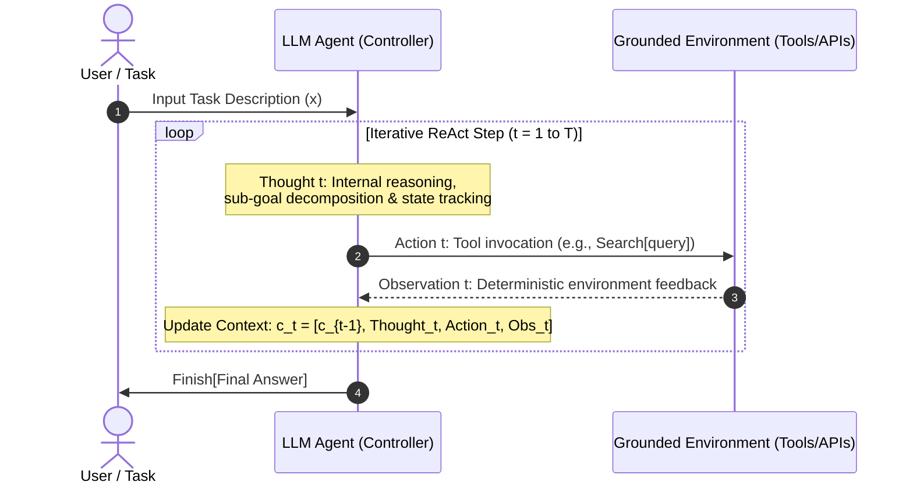
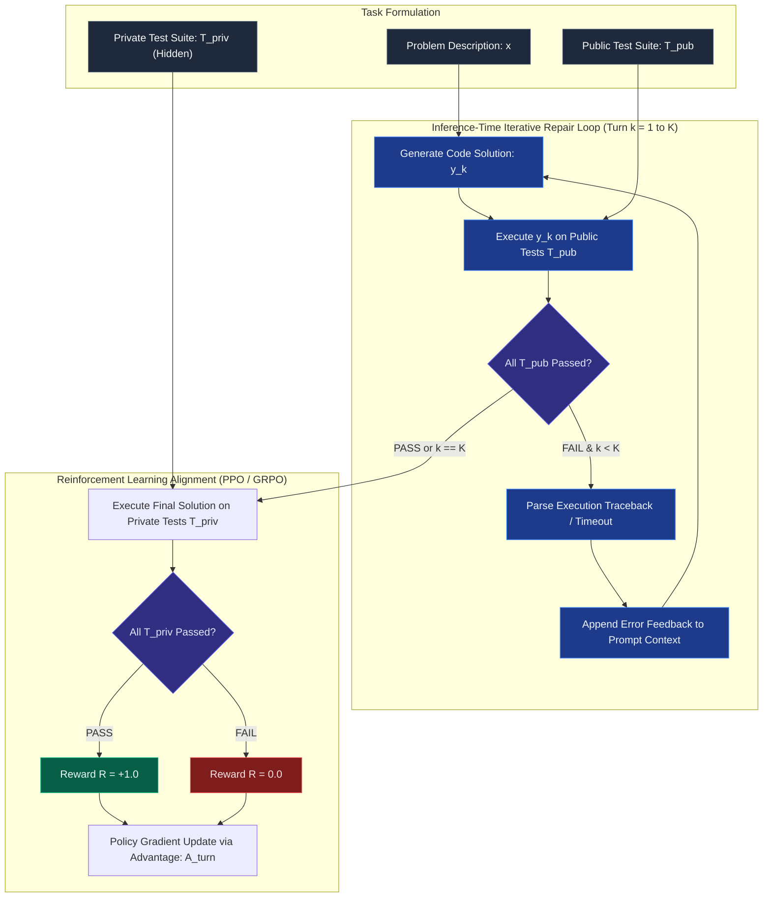
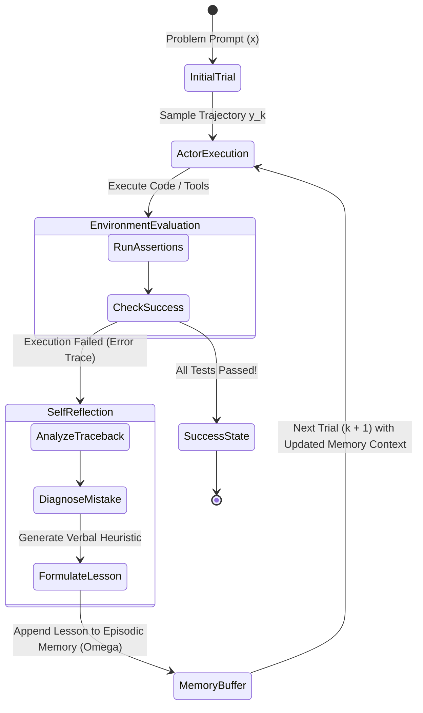
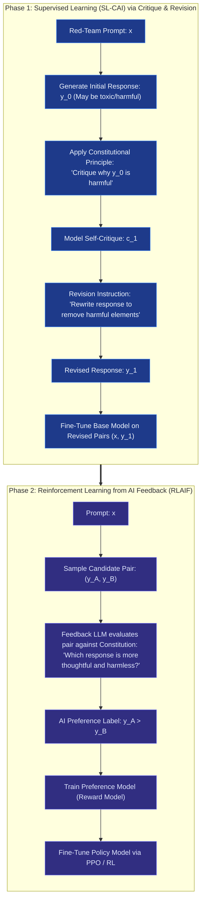

## Course & Lecture Context

> **Stanford CS329A: Self-Improving AI Agents** — Lecture 4  
> **Instructors:** Dr. Akanksha Sharma (Adjunct Professor, Stanford University; Research at Reflection AI; ex-Google Brain, Google DeepMind) & Prof. Azalia Mirhoseini (Assistant Professor of Computer Science, Stanford University; ex-Google Brain, Google DeepMind, Anthropic).

In Lectures 1 through 3, we examined how to scale test-time compute through repeated sampling, majority voting, and neural reward models (ORMs, PRMs, and ensembles). While learned verifiers significantly outperform unguided generation, they share a critical limitation with generators: **they operate purely within the closed parametric representation of the neural network**. When an LLM hallucinates an intermediate algebraic step or invents an API endpoint, a learned reward model trained on similar data often shares the same blind spot.

To build autonomous agents capable of genuine self-improvement, models must escape the closed loop of parametric inference. They require **external grounding**—the ability to act upon an external environment, observe deterministic outcomes, parse execution feedback, and refine their policy based on objective truth.

```
       CLOSED PARAMETRIC WORLD (Lectures 1-3)
  [Prompt] ──> [LLM Generator] ──> [Learned Verifier (PRM/ORM)]
                     ▲                          │
                     └────────(Prone to Blind Spots)

       GROUNDED ENVIRONMENT (Lecture 4)
  [Prompt] ──> [LLM Agent] ──> [Tool / Code Action]
                     ▲                   │
                     │                   ▼
           [Verbal / RL Policy] <── [Deterministic Runtime / Oracle]
           (Reflexion / RLEF)       (Python / Tests / Sandbox)
```

In this lesson, we study the theoretical foundations and production architectures of **grounded learning from feedback**. We cover the seminal ReAct paradigm, examine how execution environments enable Reinforcement Learning with Execution Feedback (RLEF), explore verbal reinforcement learning via Reflexion, and analyze automated self-critique via Constitutional AI.

---

## Learning Objectives

By the end of this lesson, you will be able to:

1. **Formalize the Need for External Grounding:** Explain why purely parametric language models suffer from uncalibrated overconfidence, state drift, and hallucination loops, and how external deterministic oracles break these failure modes.
2. **Deconstruct the ReAct Paradigm:** Formulate the interleaved Thought-Action-Observation Markov Decision Process (MDP), analyze fallback strategies between Chain-of-Thought and ReAct, and evaluate trade-offs in action space design.
3. **Master Reinforcement Learning with Execution Feedback (RLEF):** Explain the two-tier testing architecture (public tests for inference repair vs. private tests for reward estimation), the hybrid token-turn level policy, and error transition dynamics in competitive programming.
4. **Implement Verbal Reinforcement Learning (Reflexion):** Architect agents that self-improve across consecutive episodes without gradient updates, utilizing heuristic self-reflection and persistent episodic memory buffers.
5. **Analyze Constitutional AI (RLAIF):** Dissect the two-phase training loop (critique & revision supervised learning followed by AI preference-based RL) and evaluate the Pareto frontier between helpfulness and harmlessness.
6. **Deploy Production Sandboxed Coding Agents:** Build a fully typed, secure Python execution harness that runs code in isolated processes, parses diagnostic tracebacks, and executes multi-turn Reflexion loops.

---

## 1. The Need for External Grounding

### 1.1 The Parametric Isolation Problem

A standard Large Language Model parameterizes a conditional probability distribution $P_\theta(y_t \mid x, y_{<t})$ over a fixed token vocabulary $\mathcal{V}$. Once weights $\theta$ are frozen after pre-training and alignment:

1. **Knowledge Cutoff & Static State**: The model possesses zero native perception of temporal progression, dynamic web states, external API changes, or real-time system metrics.
2. **Uncalibrated Overconfidence**: When asked about facts outside its training distribution, autoregressive decoding samples tokens that maximize syntactic plausibility rather than epistemic truth. The model cannot naturally assess "what it does not know."
3. **Compound Reasoning Degradation**: In multi-step algorithmic derivation, errors made in early tokens become fixed context for subsequent tokens. Because the model must condition on its own prior hallucinations, errors cascade exponentially:
   $$P(\text{Success}) = \prod_{t=1}^T P(\text{Step } t \text{ valid} \mid \text{Step } <t)$$
   If each step has a 90% chance of correctness, an 8-step ungrounded deduction succeeds only $0.90^8 \approx 43\%$ of the time.

### 1.2 Deterministic Oracles as Grounding Anchors

External tools and execution environments act as **deterministic oracles**. Unlike a learned reward model that outputs a noisy probability $\hat{p} \in [0, 1]$, an execution environment provides ground-truth assertions:

| Tool / Environment | Action $\mathcal{A}$ | Observation $\mathcal{O}$ | Verification Property |
| :--- | :--- | :--- | :--- |
| **Python Sandbox** | Execute code string | `stdout`, `stderr`, exit code | Deterministic runtime verification |
| **Unit Test Suite** | Run test assertions | `AssertionError`, `Passed` | Strict specification compliance |
| **Search Engine / Web** | Query string | Retrieved HTML / text passages | Dynamic, real-world factual grounding |
| **Symbolic Solver (SymPy)** | Algebraic expression | Factorization, symbolic roots | Mathematical precision (zero hallucination)|
| **Linter / Typechecker** | AST parsing | Static analysis errors | Syntactic and type correctness |

By offloading factual storage, algorithmic arithmetic, and state transitions to deterministic engines, the LLM transitions from an unreliable generalist simulator to a **reasoning controller** orchestrating verified tools.

---

## 2. Seminal Paper 1: ReAct (Yao et al., ICLR 2023)

*ReAct: Synergizing Reasoning and Acting in Language Models* (Yao, Zhao, Yu, et al., ICLR 2023) introduced the foundational abstraction for interleaving reasoning traces and environment actions in language models.

### 2.1 The Cognitive Duality: Thought vs. Action

Human task-solving relies on a tight synergy between internal mental models and external physical actions. Yao et al. observed that prior AI agents treated reasoning and acting as disconnected paradigms:

- **Reasoning Only (Chain-of-Thought)**: The model produces internal verbal tokens step-by-step. While effective for closed-world math puzzles, it cannot incorporate real-world observations, verify assumptions, or update internal state when facts are missing.
- **Acting Only (WebGPT / SayCan)**: The model maps observations directly to action tokens (e.g., `Search[Apple Remote]`). Without intermediate reasoning, it struggles with long-horizon goal decomposition, cannot synthesize complex multi-document evidence, and lacks error recovery mechanisms.

ReAct unites these two paradigms into an **interleaved Thought-Action-Observation sequence**:



### 2.2 Formalizing the ReAct MDP

Consider an agent interacting with an environment $\mathcal{E}$. At step $t$:
- Context $c_t = (x, r_1, a_1, o_1, \dots, r_{t-1}, a_{t-1}, o_{t-1})$ represents the history of prompt $x$, thoughts $r_i \in \mathcal{L}$, actions $a_i \in \mathcal{A}$, and observations $o_i \in \mathcal{O}$.
- **Language Thought Space ($\mathcal{L}$)**: Unconstrained natural language generation. Thoughts $r_t \sim P_\theta(\cdot \mid c_t)$ do not alter the external environment state. Their purpose is:
  1. Decomposing high-level goals into atomic actions.
  2. Extracting salient facts from noisy observations.
  3. Diagnosing errors and formulating recovery plans.
- **Action Space ($\mathcal{A}$)**: Structured domain commands executed by external APIs (e.g., `Search[query]`, `Lookup[keyword]`, `Click[element]`, `Finish[answer]`).
- **Observation Space ($\mathcal{O}$)**: Textual responses returned by the external system: $o_t \sim \mathcal{E}(a_t)$.

### 2.3 Empirical Performance: HotpotQA, FEVER, and WebShop

ReAct was evaluated across both knowledge-intensive multi-hop reasoning benchmarks and interactive decision-making environments:

#### 1. HotpotQA & FEVER (Multi-Hop Question Answering & Fact-Checking)
On HotpotQA, answering questions like *"Aside from the Apple Remote, what other device can control the program Apple Remote was originally designed to interact with?"* requires multi-hop search over Wikipedia:

```
Thought 1: I need to search Apple Remote and find what program it was originally designed to interact with.
Action 1: Search[Apple Remote]
Observation 1: The Apple Remote is a remote control... originally designed to control the Front Row media center program.
Thought 2: The program is Front Row. Now I need to find other devices that can control Front Row.
Action 2: Search[Front Row]
Observation 2: Front Row is a discontinued media center software... It can be controlled by the Apple Remote or the keyboard function keys.
Thought 3: The other device/input method is keyboard function keys.
Action 3: Finish[keyboard function keys]
```

#### 2. ReAct vs. Baselines Comparison
On HotpotQA and FEVER, Yao et al. compared standard prompting, Chain-of-Thought (CoT), Action-only (Act), and ReAct:

| Architecture | HotpotQA (F1 Score) | FEVER (Accuracy) | Primary Failure Mode |
| :--- | :--- | :--- | :--- |
| **Standard Prompting** | 33.7 | 57.1 | Factual guessing / low recall |
| **Chain-of-Thought (CoT)** | 39.8 | 62.4 | Severe hallucination (56% of errors) |
| **Action-Only (Act)** | 25.7 | 58.9 | Goal drifting / shallow retrieval |
| **ReAct** | **43.1** | **67.7** | Search loop on noisy query formulations |
| **CoT-SC + ReAct (Fallback)**| **44.9** | **70.4** | Best trade-off across paradigms |

#### 3. Decision Making: WebShop Benchmark
On **WebShop** (a simulated e-commerce environment with 1.18M products where agents must search, inspect attributes, and purchase items meeting user constraints), ReAct was benchmarked against imitation learning and RL:

$$\text{Success Rate: } \text{Imitation Learning (28.4\%)} \to \text{IL + RL (31.6\%)} \to \text{ReAct (34.9\%)} \to \text{Human (59.6\%)}$$

Even without parameter updates, ReAct's language-based reasoning outperformed fine-tuned reinforcement learning agents by maintaining structured state tracking.

---

## 3. Seminal Paper 2: RLEF (Reinforcement Learning with Execution Feedback)

While ReAct relies on few-shot prompting, scaling agent capabilities on technical domains requires post-training alignment. *Grounding Code LLMs with Execution Feedback* (Zhang et al., 2024) introduced **RLEF**, an end-to-end framework that uses Python runtime execution feedback directly in the reinforcement learning loop.

### 3.1 Why Code is the Ideal Domain for Self-Improvement

Coding tasks offer unique properties for autonomous learning:
1. **Deterministic Verification**: Code syntax, compilation, and execution assertions provide objective pass/fail signals.
2. **Dense Diagnostic Information**: When code fails, compilers and interpreters do not just return $0$; they provide execution tracebacks (`IndexError`, `ZeroDivisionError`, `AssertionError`) identifying the exact line and runtime state.
3. **Inference-Time Multi-Turn Repair**: A model can execute its code on public test cases, inspect errors, patch its solution across consecutive turns, and submit only after local tests pass.

### 3.2 Two-Tier Test Execution Strategy

A critical contribution of RLEF is the architectural separation between **Public Tests** (used for inference-time multi-turn repair) and **Private Tests** (used strictly for environment reward calculation).



#### Why the Two-Tier Strategy Prevents Reward Hacking
If an agent optimizes directly against the test suite it inspects during generation, it quickly discovers degenerate shortcuts:
- Hardcoding `if input == x: return y` for the public test cases.
- Overfitting to simple edge cases while breaking general algorithmic complexity.

By keeping private test suites completely hidden from the agent during both inference repair and reward extraction, RLEF ensures the model learns **generalizable algorithmic repair** rather than assertion memorization.

### 3.3 Hybrid Token-Turn Level Policy

In standard PPO implementations for text generation, rewards are assigned at the token level, or a value network predicts a value $V(s_t)$ for every token in the sequence. For multi-turn code generation, this token-level credit assignment is computationally wasteful and introduces high variance.

RLEF introduces a **Hybrid Token-Turn Policy**:
- **Token-Level Action Generation**: The code generator policy $\pi_\theta(y_{k, t} \mid x, c_{<k}, y_{k, <t})$ generates code autoregressively token-by-token, preserving fine-grained syntactic control.
- **Turn-Level Value Assignment**: The environment reward $R \in \{0, 1\}$ is determined only at the conclusion of the execution turn. The advantage $A_{\text{turn}}$ is computed over the entire completion turn:
  $$\mathcal{L}_{\text{RLEF}}(\theta) = - \mathbb{E}\left[ \sum_{t=1}^{|y_k|} \min \left( \frac{\pi_\theta(y_{k,t})}{\pi_{\text{old}}(y_{k,t})} A_{\text{turn}}, \text{clip}\left(\frac{\pi_\theta(y_{k,t})}{\pi_{\text{old}}(y_{k,t})}, 1-\epsilon, 1+\epsilon\right) A_{\text{turn}} \right) \right]$$
  where $A_{\text{turn}} = R(y_K, T_{\text{priv}}) - V_\phi(c_k)$.

### 3.4 Error Transition Dynamics Across Turns

Zhang et al. analyzed how code errors evolve across consecutive repair turns on competitive programming problems (CodeContests):

```
Turn 1: Syntax Errors / Missing Imports / Infinite Loops
   │  (Receives interpreter stderr & line numbers)
   ▼
Turn 2: Logic Errors / Off-by-one / Wrong Output
   │  (Receives Assertion failure: expected [1, 2], got [2, 1])
   ▼
Turn 3: Algorithmic Refinement / Edge Case Resolution
   │  (Public tests pass -> Evaluated on private tests)
   ▼
PASS (Reward = 1.0)
```

| Turn Stage | Syntax Errors | Runtime / Timeout | Logic / AssertionError | Pass Rate on Private Tests |
| :--- | :--- | :--- | :--- | :--- |
| **Turn 1 (Zero-Shot)** | 18.4% | 24.2% | 34.6% | 22.8% |
| **Turn 2 (After Public Feedback)** | 3.2% | 19.1% | 28.5% | 49.2% |
| **Turn 3 (Final Iteration)** | 0.8% | 14.5% | 18.2% | **66.5%** |

*Key Finding*: The model does not rewrite code from scratch between turns. Instead, execution feedback enables **localized surgical edits**, reducing syntax failures to near zero by Turn 2 and focusing generation capacity on algorithmic correctness.

---

## 4. Seminal Paper 3: Reflexion (Shinn et al., NeurIPS 2023)

While RLEF updates model parameters through reinforcement learning, fine-tuning 70B parameter models requires massive GPU clusters, distributed infrastructure, and risks catastrophic forgetting of general reasoning capabilities.

In *Reflexion: Language Agents with Verbal Reinforcement Learning* (Shinn, Cassano, Berman, et al., NeurIPS 2023), the authors proposed an alternative: **Can agents learn from trial-and-error without updating model weights?**

### 4.1 The Verbal Reinforcement Learning Paradigm

Traditional RL updates policy parameters $\theta$ via scalar gradients: $\theta \leftarrow \theta + \alpha \nabla_\theta J(\theta)$. 

Reflexion replaces scalar rewards and weight updates with **symbolic verbal feedback stored in persistent episodic memory**:

$$\text{Policy Behavior at Trial } k: \quad y_k \sim P_\theta(\cdot \mid x, \Omega_{k-1})$$

where $\Omega_{k-1} = \{m_1, m_2, \dots, m_{k-1}\}$ represents a cumulative buffer of **verbal self-reflections** generated after prior failed attempts.



### 4.2 Tripartite Component Architecture

Reflexion structures agent self-improvement around three distinct modules:

```
┌─────────────────────────────────────────────────────────────┐
│                      REFLEXION AGENT                        │
│                                                             │
│   ┌─────────────────────────────────────────────────────┐   │
│   │ 1. ACTOR (LLM Policy):                              │   │
│   │    Generates candidate actions, reasoning, & code   │   │
│   │    conditioned on task prompt and memory buffer     │   │
│   └──────────────────────────┬──────────────────────────┘   │
│                              │ Action Trajectory            │
│                              ▼                              │
│   ┌─────────────────────────────────────────────────────┐   │
│   │ 2. EVALUATOR (Environment / Oracle):                │   │
│   │    Executes trajectory against deterministic tests  │   │
│   │    Outputs reward R in {0, 1} and execution error   │   │
│   └──────────────────────────┬──────────────────────────┘   │
│                              │ Binary Fail + Traceback      │
│                              ▼                              │
│   ┌─────────────────────────────────────────────────────┐   │
│   │ 3. SELF-REFLECTION (Meta-Cognitive Evaluator):      │   │
│   │    Analyzes execution failure and verbalizes        │   │
│   │    actionable lessons for future trials             │   │
│   └──────────────────────────┬──────────────────────────┘   │
│                              │ Verbal Lesson m_k            │
│                              ▼                              │
│   ┌─────────────────────────────────────────────────────┐   │
│   │ PERSISTENT EPISODIC MEMORY (Buffer Omega):          │   │
│   │    Omega = [m_1, m_2, ..., m_k]                     │   │
│   │    Prepended to prompt context on Trial k+1         │   │
│   └─────────────────────────────────────────────────────┘   │
└─────────────────────────────────────────────────────────────┘
```

#### 1. The Actor
The generative policy model. It receives the task $x$ plus the accumulated reflection buffer $\Omega$.
$$y_k \sim P_\theta(\text{trajectory} \mid x, \Omega_{k-1})$$

#### 2. The Evaluator
A deterministic or learned judge. In coding benchmarks, the evaluator is a sandboxed Python runner executing test suites:
$$\text{Eval}(y_k) = (R_k, \text{traceback}_k), \quad R_k \in \{0, 1\}$$

#### 3. The Self-Reflection Model
When $R_k = 0$, the self-reflection module is prompted with the failed trajectory $y_k$ and the execution traceback. It generates an explicit natural-language critique:
$$m_k \sim P_{\text{reflect}}(\text{reflection} \mid x, y_k, \text{traceback}_k)$$

A well-formed reflection satisfies two properties:
1. **Root-Cause Attribution**: It identifies the conceptual or logical mistake (e.g., *"My previous attempt assumed the input array was sorted, causing binary search to fail on unsorted lists"*).
2. **Actionable Directive**: It specifies what to do differently in the next trial (e.g., *"In the next attempt, explicitly sort the array or use a hash map for linear lookup"*).

### 4.3 Empirical Results: HumanEval, MBPP, and Decision Making

On code generation and interactive decision tasks, Reflexion achieved dramatic accuracy gains across iterative trials without modifying a single weight in the model:

| Benchmark | Model | Baseline (Trial 1) | Reflexion (Trial 2) | Reflexion (Trial 5) | Absolute Delta |
| :--- | :--- | :--- | :--- | :--- | :--- |
| **HumanEval** | GPT-4 | 67.0% | 82.3% | **91.0%** | **+24.0%** |
| **MBPP** | GPT-4 | 67.8% | 76.5% | **82.2%** | **+14.4%** |
| **ALFWorld** | GPT-3.5 | 73.0% | 88.0% | **97.0%** | **+24.0%** |
| **HotpotQA** | GPT-3.5 | 34.0% | 45.0% | **54.0%** | **+20.0%** |

*Why Memory Reflection Outperforms Re-Prompting*: If a failed agent is simply given its prior error and prompted to "try again," it often loops around the same broken logic. Storing explicit verbal guidelines in episodic memory acts as a soft constraint that forces the model to explore alternate branches of the reasoning tree.

---

## 5. Seminal Paper 4: Constitutional AI & Automated Critique (Anthropic 2022)

In *Constitutional AI: Harmlessness from AI Feedback* (Bai et al., Anthropic 2022), the authors demonstrated how self-critique mechanisms can eliminate human annotators from the alignment loop, creating a self-improving training framework known as **RLAIF (Reinforcement Learning from AI Feedback)**.

### 5.1 The Two-Phase Alignment Pipeline

Constitutional AI replaces tens of thousands of human preference labels with a compact set of written human principles—a **Constitution** (e.g., rules governing helpfulness, harmlessness, factual rigor, and bias elimination).



### 5.2 Phase 1: Self-Critique & Revision Loop (SL-CAI)

1. The base model generates an initial unconstrained response $y_0$ to an adversarial prompt $x$.
2. The model is presented with a constitutional principle and asked to critique its own generation:
   ```
   Critique Request: Review the response above and discuss any aspects that are harmful, unethical, dangerous, or illegal according to Principle 4: "Choose the response that minimizes real-world harm."
   Critique: The response provided step-by-step instructions on synthesizing a hazardous chemical compound, which violates safety protocols.
   ```
3. The model is prompted to rewrite its response based on the critique:
   ```
   Revision Request: Please rewrite the response to explain the general chemistry principles safely while removing all instructions for physical synthesis.
   Revision: [Safe educational response]
   ```
4. The base model is fine-tuned on the resulting dataset of $(x, y_{\text{revised}})$ pairs.

### 5.3 Phase 2: RLAIF (Reinforcement Learning from AI Feedback)

In Phase 2, human feedback is replaced entirely by an automated AI judge:
1. The model samples two completions $y_A, y_B \sim \pi_\theta(y \mid x)$.
2. An evaluator model evaluates the pair against the Constitution and outputs a log-likelihood preference:
   $$P(y_A \succ y_B \mid x) = \frac{e^{R(x, y_A)}}{e^{R(x, y_A)} + e^{R(x, y_B)}}$$
3. A preference reward model is trained on these synthetic preference labels.
4. The policy model is updated using PPO to maximize the reward model's score.

### 5.4 The Helpfulness vs. Harmlessness Pareto Frontier

A central finding of Bai et al. is the interaction between helpfulness and harmlessness:

- Standard RLHF (with human labelers) often suffers from **helpfulness degradation**: models trained aggressively to avoid harm become evasive, refusing harmless educational requests.
- **Constitutional AI with Chain-of-Thought critique achieves a superior Pareto frontier**: by forcing the model to explicitly verbalize *why* a response is safe or unsafe before revising it, the model learns nuanced behavioral boundaries rather than blind refusals.

---

## 6. Comparative Synthesis: Grounded Feedback Architectures

| Dimension | ReAct (Yao et al.) | RLEF (Zhang et al.) | Reflexion (Shinn et al.) | Constitutional AI (Bai et al.) |
| :--- | :--- | :--- | :--- | :--- |
| **Primary Domain** | Multi-hop QA, Web, Embodied | Competitive Programming, Code | General Coding, Web Tasks | Alignment, Safety, Harmlessness |
| **Feedback Source** | Tool APIs, Search, Web | Python Runtime / Unit Tests | Python / Sandbox / State Trace | AI Judge / Written Constitution |
| **Policy Modification** | In-Context (Zero weight change) | Gradient Updates (PPO / RL) | In-Context (Episodic Memory) | Two-Phase (SFT + RLAIF PPO) |
| **Test Architecture** | Ad-hoc observation parsing | **Two-Tier (Public vs Private)**| Single-tier test suite | Pairwise Preference Ranking |
| **Error Recovery Mode**| Next-step reactive replanning | Multi-turn localized patching | Epistemic self-reflection | Iterative critique & revision |
| **Compute Cost** | Inference-time token expansion | Massive GPU RL training clusters| Low (Multi-turn inference) | High (Post-training pipeline) |

---

## 7. Production Implementation: Sandboxed Code Agent with Reflexion & Two-Tier Testing

Below is a complete, production-ready Python implementation demonstrating:
1. **`SandboxedPythonRuntime`**: A secure execution sandbox using subprocess isolation, strict timeout enforcement, and structured traceback parsing.
2. **`TwoTierTestHarness`**: Separation between public tests (for iterative repair) and private tests (for objective evaluation).
3. **`ReflexionMemory`**: Persistent episodic buffer storing structured root-cause analyses and heuristics across trials.
4. **`SandboxedCodeAgent`**: Orchestrator executing the complete multi-turn self-improvement loop.

```python
"""
Production-grade Sandboxed Code Agent with Reflexion Memory and Two-Tier Testing.
Implements runtime grounding, traceback parsing, and verbal reinforcement learning.
"""

from __future__ import annotations
import subprocess
import sys
import os
import re
from dataclasses import dataclass, field
from typing import List, Dict, Optional, Tuple, Callable


@dataclass
class ExecutionResult:
    success: bool
    return_code: int
    stdout: str
    stderr: str
    error_type: Optional[str] = None
    failing_line: Optional[str] = None
    timed_out: bool = False


@dataclass
class TestCase:
    input_args: str
    expected_output: str
    test_code: str


@dataclass
class ReflectionEntry:
    trial_idx: int
    failed_code: str
    error_summary: str
    root_cause: str
    actionable_directive: str


class SandboxedPythonRuntime:
    """
    Executes Python code in an isolated subprocess with timeout enforcement.
    Parses tracebacks into structured diagnostic metadata.
    """
    def __init__(self, timeout_seconds: float = 3.0):
        self.timeout_seconds = timeout_seconds

    def execute(self, code_str: str) -> ExecutionResult:
        """
        Executes code string via subprocess. Returns structured execution outcome.
        """
        try:
            process = subprocess.Popen(
                [sys.executable, "-c", code_str],
                stdout=subprocess.PIPE,
                stderr=subprocess.PIPE,
                text=True,
                env={**os.environ, "PYTHONDONTWRITEBYTECODE": "1"}
            )
            stdout, stderr = process.communicate(timeout=self.timeout_seconds)
            return_code = process.returncode

            if return_code == 0:
                return ExecutionResult(
                    success=True,
                    return_code=0,
                    stdout=stdout.strip(),
                    stderr=stderr.strip()
                )
            else:
                error_type, failing_line = self._parse_traceback(stderr)
                return ExecutionResult(
                    success=False,
                    return_code=return_code,
                    stdout=stdout.strip(),
                    stderr=stderr.strip(),
                    error_type=error_type,
                    failing_line=failing_line
                )

        except subprocess.TimeoutExpired:
            process.kill()
            stdout, stderr = process.communicate()
            return ExecutionResult(
                success=False,
                return_code=-1,
                stdout=stdout.strip(),
                stderr="Execution timed out (Infinite Loop Detected).",
                error_type="TimeoutExpired",
                timed_out=True
            )
        except Exception as e:
            return ExecutionResult(
                success=False,
                return_code=-1,
                stdout="",
                stderr=str(e),
                error_type=type(e).__name__
            )

    @staticmethod
    def _parse_traceback(stderr: str) -> Tuple[Optional[str], Optional[str]]:
        """Extracts error class and failing line from Python traceback."""
        error_type = None
        failing_line = None

        lines = stderr.strip().split("\n")
        if lines:
            # Last line is typically 'ErrorClass: message'
            last_line = lines[-1].strip()
            match = re.match(r"^([A-Za-z0-9_]+Error):", last_line)
            if match:
                error_type = match.group(1)
            else:
                error_type = last_line

            # Find line where failure occurred
            for line in reversed(lines):
                if "line " in line:
                    failing_line = line.strip()
                    break

        return error_type, failing_line


class TwoTierTestHarness:
    """
    Manages public tests (visible for multi-turn repair) and private tests (hidden for reward).
    """
    def __init__(self, public_tests: List[TestCase], private_tests: List[TestCase]):
        self.public_tests = public_tests
        self.private_tests = private_tests
        self.runtime = SandboxedPythonRuntime()

    def evaluate_public(self, code_str: str) -> Tuple[bool, Optional[str]]:
        """Runs candidate code against public test suite."""
        return self._run_test_suite(code_str, self.public_tests, "Public")

    def evaluate_private(self, code_str: str) -> Tuple[bool, Optional[str]]:
        """Runs candidate code against private held-out test suite."""
        return self._run_test_suite(code_str, self.private_tests, "Private")

    def _run_test_suite(
        self,
        code_str: str,
        test_suite: List[TestCase],
        tier_name: str
    ) -> Tuple[bool, Optional[str]]:
        for idx, test in enumerate(test_suite, start=1):
            harness_script = (
                f"{code_str}\n\n"
                f"# --- {tier_name} Test {idx} ---\n"
                f"{test.test_code}\n"
            )
            res = self.runtime.execute(harness_script)
            if not res.success:
                error_feedback = (
                    f"[{tier_name} Test {idx} FAILED]\n"
                    f"Error Type: {res.error_type}\n"
                    f"Failing Context: {res.failing_line}\n"
                    f"Stderr: {res.stderr}\n"
                )
                return False, error_feedback
        return True, None


class ReflexionMemory:
    """
    Persistent episodic memory buffer storing verbal self-reflections.
    """
    def __init__(self, max_entries: int = 5):
        self.max_entries = max_entries
        self.buffer: List[ReflectionEntry] = []

    def add_reflection(self, entry: ReflectionEntry) -> None:
        self.buffer.append(entry)
        if len(self.buffer) > self.max_entries:
            self.buffer.pop(0)  # FIFO eviction

    def format_for_prompt(self) -> str:
        """Formats prior reflections as in-context guidelines for the next trial."""
        if not self.buffer:
            return ""

        formatted = ["### Prior Failed Attempts & Lessons Learned:"]
        for item in self.buffer:
            formatted.append(
                f"- Attempt {item.trial_idx} Failed with: {item.error_summary}\n"
                f"  Root Cause: {item.root_cause}\n"
                f"  Directive for Next Attempt: {item.actionable_directive}"
            )
        return "\n".join(formatted) + "\n\n"


class SandboxedCodeAgent:
    """
    Agent orchestrating the multi-turn Reflexion loop with Two-Tier Testing.
    """
    def __init__(
        self,
        test_harness: TwoTierTestHarness,
        generator_fn: Callable[[str], str],
        reflection_fn: Callable[[str, str], Tuple[str, str]],
        max_trials: int = 3
    ):
        self.harness = test_harness
        self.generator_fn = generator_fn
        self.reflection_fn = reflection_fn
        self.max_trials = max_trials
        self.memory = ReflexionMemory()

    def solve(self, problem_spec: str) -> Dict[str, any]:
        """Executes the iterative Reflexion loop."""
        for trial in range(1, self.max_trials + 1):
            print(f"\n--- [Trial {trial}/{self.max_trials}] Generating Candidate Solution ---")

            # 1. Prepend verbal reflections from prior failures
            memory_context = self.memory.format_for_prompt()
            full_prompt = f"{memory_context}Task Description:\n{problem_spec}\nWrite the Python function:"

            candidate_code = self.generator_fn(full_prompt)
            print("Generated Code:\n" + candidate_code.strip())

            # 2. Evaluate against Public Tests (Inference Repair Tier)
            pub_passed, pub_error = self.harness.evaluate_public(candidate_code)

            if not pub_passed:
                print(f"Trial {trial} Public Tests FAILED!")
                print(pub_error)

                # 3. Generate Verbal Self-Reflection
                root_cause, directive = self.reflection_fn(candidate_code, pub_error)
                print(f"Self-Reflection: {root_cause} -> Directive: {directive}")

                self.memory.add_reflection(ReflectionEntry(
                    trial_idx=trial,
                    failed_code=candidate_code,
                    error_summary=pub_error.split("\n")[1],
                    root_cause=root_cause,
                    actionable_directive=directive
                ))
                continue  # Loop to next trial

            # 4. Public Tests Passed -> Evaluate against Private Tests (Environment Reward)
            print(f"Trial {trial} Public Tests PASSED! Submitting to Private Tests...")
            priv_passed, priv_error = self.harness.evaluate_private(candidate_code)

            if priv_passed:
                print(f"Trial {trial} PRIVATE TESTS PASSED! Solution Verified.")
                return {
                    "status": "SUCCESS",
                    "solved_at_trial": trial,
                    "final_code": candidate_code,
                    "total_reflections": len(self.memory.buffer)
                }
            else:
                print(f"Trial {trial} Private Tests Failed (Hidden failure).")
                # Even if public tests passed, private edge cases failed
                root_cause, directive = self.reflection_fn(candidate_code, priv_error)
                self.memory.add_reflection(ReflectionEntry(
                    trial_idx=trial,
                    failed_code=candidate_code,
                    error_summary="Failed private edge-case assertions",
                    root_cause=root_cause,
                    actionable_directive=directive
                ))

        return {
            "status": "FAILED",
            "solved_at_trial": None,
            "final_code": candidate_code,
            "total_reflections": len(self.memory.buffer)
        }


# ==============================================================================
# Simulation Demonstration: Palindrome Substring Extraction
# ==============================================================================

def mock_llm_code_generator(prompt: str) -> str:
    """
    Simulates code generator behavior across consecutive trials.
    Trial 1 introduces an off-by-one slice error.
    Trial 2 fixes the slice using the directive from memory.
    """
    if "Directive for Next Attempt: In Python slices, use s[i:j+1]" in prompt:
        # Correct implementation informed by memory
        return """def longest_palindrome(s: str) -> str:
    if not s:
        return ""
    longest = ""
    for i in range(len(s)):
        for j in range(i, len(s)):
            sub = s[i : j + 1]
            if sub == sub[::-1] and len(sub) > len(longest):
                longest = sub
    return longest"""
    else:
        # Buggy initial implementation: s[i:j] misses the terminal character
        return """def longest_palindrome(s: str) -> str:
    if not s:
        return ""
    longest = ""
    for i in range(len(s)):
        for j in range(i, len(s)):
            sub = s[i:j]  # BUG: Should be j + 1
            if sub == sub[::-1] and len(sub) > len(longest):
                longest = sub
    return longest"""


def mock_self_reflection_engine(code: str, error_msg: str) -> Tuple[str, str]:
    """Simulates self-reflection model diagnosing the error."""
    if "AssertionError" in error_msg or "FAILED" in error_msg:
        return (
            "The slice s[i:j] excludes the character at index j, causing single-character palindromes to fail.",
            "In Python slices, use s[i:j+1] to properly include the end index."
        )
    return ("Unspecified logic error.", "Carefully verify loop bounds.")


if __name__ == "__main__":
    # Define Two-Tier Test Suite
    public_tests = [
        TestCase(
            input_args="'babad'",
            expected_output="'bab' or 'aba'",
            test_code="assert longest_palindrome('babad') in ['bab', 'aba'], 'Failed on babad'"
        ),
        TestCase(
            input_args="'cbbd'",
            expected_output="'bb'",
            test_code="assert longest_palindrome('cbbd') == 'bb', 'Failed on cbbd'"
        )
    ]

    private_tests = [
        TestCase(
            input_args="'a'",
            expected_output="'a'",
            test_code="assert longest_palindrome('a') == 'a', 'Failed on single char a'"
        ),
        TestCase(
            input_args="'racecar'",
            expected_output="'racecar'",
            test_code="assert longest_palindrome('racecar') == 'racecar', 'Failed on full palindrome'"
        )
    ]

    harness = TwoTierTestHarness(public_tests=public_tests, private_tests=private_tests)
    agent = SandboxedCodeAgent(
        test_harness=harness,
        generator_fn=mock_llm_code_generator,
        reflection_fn=mock_self_reflection_engine,
        max_trials=3
    )

    problem = "Write a function `longest_palindrome(s: str) -> str` that returns the longest palindromic substring in s."
    result = agent.solve(problem)

    print("\n=== Final Execution Summary ===")
    print(f"Outcome: {result['status']}")
    print(f"Solved At Trial: {result['solved_at_trial']}")
    print(f"Reflections Ingested: {result['total_reflections']}")
```

---

## 8. Practical Engineering Tips & Production Checklist

Deploying grounded execution agents in production requires safeguards against common runtime pitfalls:

| Engineering Challenge | Failure Manifestation | Production Safeguard |
| :--- | :--- | :--- |
| **Malicious Code Execution** | Prompt injection writes `os.system("rm -rf /")` or accesses cloud credentials. | Run code in **ephemeral Docker / gVisor sandboxes** with network disabled and dropped root privileges. |
| **Infinite Execution Loops** | `while True:` or exponential recursion hangs the worker thread. | Enforce strict OS-level process timeouts (`subprocess.communicate(timeout=3.0)`) and SIGKILL. |
| **Context Window Bloat** | Appending complete multi-page tracebacks and 10 trial histories exhausts context. | Truncate tracebacks to the last 20 lines; summarize older reflections via an LLM memory condenser. |
| **Public Test Memorization** | Model outputs hardcoded conditionals `if x == 1: return 2` to bypass public tests. | Enforce structural separation: **never expose private test assertions** in the agent's prompt context. |
| **Contradictory Reflections** | In complex tasks, trial 3's reflection directly contradicts trial 1's directive. | Maintain structured episodic memory with explicit validation checks before injecting memory entries into the prompt. |

---

## 9. Summary & Key Takeaways

1. **The Necessity of Grounding**: Closed-loop parametric models cannot overcome systematic blind spots or assess what they do not know. Grounding in external oracles (interpreters, unit tests, web search) provides deterministic truth anchors that make autonomous self-improvement possible.
2. **ReAct MDP**: Interleaving internal language reasoning (**Thoughts**) with external tool calls (**Actions**) and environment responses (**Observations**) drastically reduces factual hallucination and outperforms both pure reasoning (CoT) and pure action execution.
3. **Two-Tier Test Isolation in RLEF**: Separating public tests (for multi-turn localized debugging) from private tests (for policy reward estimation) prevents reward hacking, hardcoding, and assertion leakage while achieving state-of-the-art competitive coding performance.
4. **Verbal Reinforcement Learning (Reflexion)**: Agents can hill-climb on complex tasks without gradient updates by diagnosing failures into actionable verbal heuristics and retrieving them from persistent episodic memory buffers.
5. **Constitutional AI & RLAIF**: Replacing human annotators with structured constitutional critique-and-revision loops enables scalable self-improvement while establishing superior Pareto frontiers between helpfulness and safety.

---

[Next: Planning, MCTS & Multi-Step Reasoning →](/docs/ai-agents/self-improving-ai-agents/05-planning-mcts-and-multi-step-reasoning)
