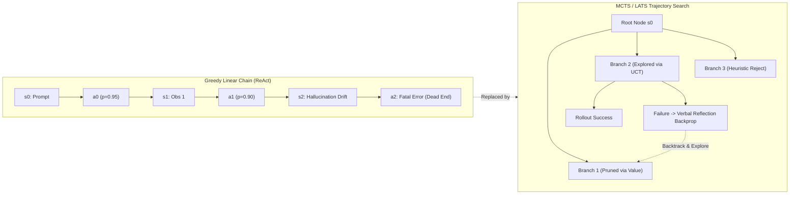
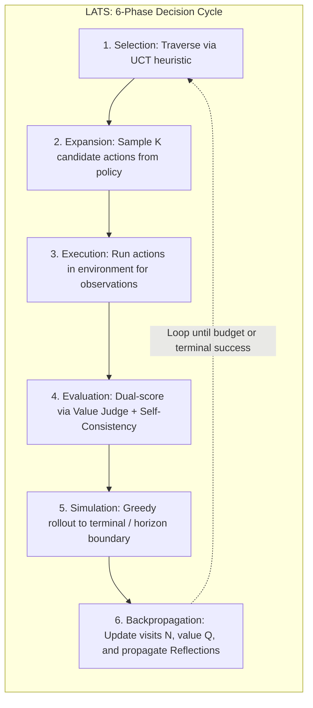
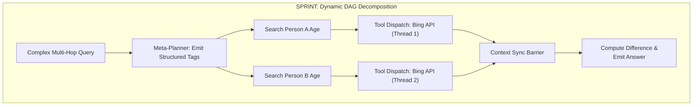
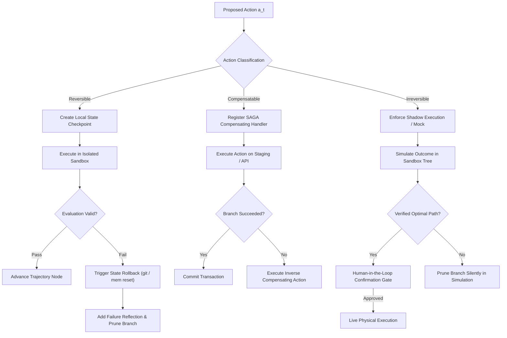

> **Learning goals:** Formulate language agent reasoning as tree search over an MDP; quantify why greedy autoregressive execution collapses over long horizons ($P(\text{success}) = p^T$); implement Language Agent Tree Search (LATS) with UCT selection, rollout, and reflection; analyze parallel inference planning via SPRINT and offline tool RL via SWiRL; architect reversible state rollbacks vs transactional guardrails.
>
> **Prerequisites:** [02: Test-Time Compute Scaling & Search](/docs/ai-agents/self-improving-ai-agents/02-test-time-compute-scaling-and-search), [03: Robust Verification & Reward Models](/docs/ai-agents/self-improving-ai-agents/03-robust-verification-and-reward-models), and [04: Grounded Feedback, Tools & Code](/docs/ai-agents/self-improving-ai-agents/04-grounded-feedback-tools-and-code).

---

## The Compound Error Catastrophe in Long-Horizon Execution

Linear autoregressive agent execution—typified by basic ReAct loops (`Thought` $\to$ `Action` $\to$ `Observation`)—treats problem-solving as a sequential Markov chain. At step $t$, the agent emits an action based solely on the current prompt context:

$$\tau = (s_0, a_0, o_0, s_1, a_1, o_1, \dots, s_T, a_T, o_T)$$

While this paradigm succeeds on shallow tasks ($T \le 3$), it suffers from an exponential decay in success probability as the horizon lengthens. If each individual step possesses an independent probability of success $p_t \le p < 1$, the cumulative probability of executing a valid $T$-step trajectory without failure scales as:

$$P(\text{Success}_T) = \prod_{t=1}^T p_t \approx p^T$$

```
Single-Step Reliability (p) vs Multi-Step Task Success:
----------------------------------------------------------------------
Horizon (T)      p = 0.99         p = 0.95         p = 0.90
----------------------------------------------------------------------
T = 1            99.0%            95.0%            90.0%
T = 5            95.1%            77.4%            59.0%
T = 10           90.4%            59.9%            34.9%
T = 20           81.8%            35.8%            12.2%
T = 50           60.5%            7.7%             0.5%
```

Even an elite frontier model with $95\%$ per-step execution accuracy drops below coin-flip reliability ($35.8\%$) at 20 steps, and effectively collapses ($7.7\%$) at 50 steps.



### The Three Drivers of Linear Drift

1. **Hallucination Snowballing:** When an LLM generates a slightly flawed assumption at step $t$, that hallucination enters the conversational context as an immutable truth for steps $t+1 \dots T$. Downstream reasoning adapts to optimize coherence with a false premise.
2. **Irreversible Commitment:** Greedy decoders possess no native primitive for *backtracking*. If tool call $a_3$ enters an unproductive API endpoint or queries an unhelpful database partition, the agent typically exhausts its context window trying to rationalize the bad output rather than resetting to state $s_2$.
3. **Lack of Deliberative Lookahead:** Standard generation samples actions based on immediate token transition likelihoods $\pi_\theta(a_t \mid s_t)$ rather than expected terminal return $Q^*(s_t, a_t)$.

---

## Seminal Paper 1: Language Agent Tree Search (LATS)

To replace greedy execution with deliberate planning, Zhou et al. (ICML 2024) introduced **Language Agent Tree Search (LATS)**. LATS unifies the strengths of **ReAct** (grounded environment interactions), **Reflexion** (verbal failure analysis), and **Monte Carlo Tree Search (MCTS)** (deliberate exploration vs. exploitation trade-offs).



### Formal MCTS Formulation for LLM Agents

LATS models agent reasoning over a state-action tree where:
- A state node $s$ comprises the sequence of prior thoughts, executed actions, environment observations, and accumulated verbal reflections: $s = (x, a_0, o_0, r_0, \dots, a_t, o_t, r_t)$.
- An edge represents a candidate language action $a \in \mathcal{A}$ or internal reasoning thought.
- Each tree node maintains statistics: visit count $N(s)$, accumulated value $Q(s)$, and candidate child links.

#### 1. Selection
Starting at the root state $s_0$, the algorithm navigates down the tree by greedily selecting child nodes that maximize the **Upper Confidence bounds applied to Trees (UCT)**:

$$a^* = \arg\max_{a \in \mathcal{C}(s)} \left[ Q(s, a) + c \cdot \sqrt{\frac{\ln N(s)}{N(s, a)}} \right]$$

- **Exploitation term ($Q(s, a)$):** The estimated historical value of taking action $a$ from state $s$.
- **Exploration bonus ($c \sqrt{\frac{\ln N(s)}{N(s, a)}}$):** Favors actions that have been visited infrequently relative to the parent. The parameter $c$ controls exploration aggressiveness (typically $c = \sqrt{2} \approx 1.414$).

#### 2. Expansion
Once selection reaches a non-terminal leaf node with unexplored action headroom, the LLM policy $\pi_\theta$ is prompted with temperature $T > 0$ to generate $k$ distinct candidate actions:

$$\{a^{(1)}, a^{(2)}, \dots, a^{(k)}\} \sim \pi_\theta(\cdot \mid s)$$

#### 3. Execution & Environment Feedback
Each sampled action $a^{(i)}$ is executed against the external environment (e.g., Python execution sandbox, SQL engine, simulated browser, or API registry) yielding grounded observations:

$$o^{(i)} \sim \mathcal{E}(s, a^{(i)})$$

The child state is materialized as $s^{(i)} = s \circ (a^{(i)}, o^{(i)})$.

#### 4. Dual-Factor Evaluation
Rather than relying exclusively on noisy final-answer rewards, LATS evaluates intermediate nodes using a composite scoring mechanism:

$$V(s') = w \cdot V_{\text{LLM}}(s') + (1 - w) \cdot V_{\text{SC}}(s')$$

- **LLM-as-a-Judge Heuristic ($V_{\text{LLM}}$):** A prompted evaluator rates how promising state $s'$ is on a normalized scale $[0, 1]$, analyzing whether the latest observation advances the goal:
  ```
  "Given initial goal: {goal}, past trajectory: {trajectory}, and latest observation: {obs},
  evaluate the likelihood of task success from this state on a scale of 0.0 to 1.0."
  ```
- **Self-Consistency Frequency ($V_{\text{SC}}$):** When sampling a larger pool of candidate thoughts ($N_{\text{samples}} = 20\dots 50$), actions that cluster into identical semantic intents receive higher probability mass, serving as an unsupervised confidence score:
  $$V_{\text{SC}}(a) = \frac{\text{Count}(\text{Cluster}(a))}{\sum_j \text{Count}(\text{Cluster}(a_j))}$$

#### 5. Simulation (Rollout)
From evaluated child $s'$, the agent performs a rapid simulation (rollout) using greedy policy decoding ($\text{argmax} \, \pi_\theta$) until either:
1. The task reaches a verifiable terminal state (success return $R=1$, failure return $R=0$).
2. A search depth horizon $H_{\text{rollout}}$ is exhausted, in which case the intermediate value $V(s_{\text{terminal}})$ is returned.

#### 6. Backpropagation and Semantic Reflection
The trajectory outcome return $R \in [0, 1]$ updates every node along the visited path from the leaf back to the root:

$$N(s) \leftarrow N(s) + 1$$

$$Q_{\text{new}}(s) \leftarrow \frac{Q_{\text{old}}(s) \cdot (N(s) - 1) + R}{N(s)}$$

**The Critical LATS Addition — Verbal Reflection:**
If a simulation terminates in a failure ($R = 0$), LATS does not merely increment failure counters. It triggers a reflection prompt where the LLM inspects the failed trajectory and verbalizes *why* it failed:

$$\text{Reflect}(\tau_{\text{fail}}) \to \text{"The query failed because searching for 'Hawaii cheapest flights' returned expired 2023 promos; should instead query current active booking engines."}$$

This semantic diagnosis is stored directly at the corresponding node. When subsequent iterations visit this neighborhood, the reflection is injected into the expansion prompt, preventing the agent from repeating the same class of error.

---

## Comparative Planning Frameworks: ToT, RAP, and SPRINT

While LATS represents a full MCTS instantiation with environment interaction, other planning architectures tackle different trade-offs along search depth, environment fidelity, and parallel execution.

| Framework | Search Strategy | State Representation | Environment / World Model | Backtracking Mechanism |
|---|---|---|---|---|
| **Tree of Thoughts (ToT)** | BFS or DFS | Discrete text thoughts | Internal LLM state evaluation | Stack pop / frontier re-ranking |
| **Reasoning via Planning (RAP)** | MCTS | World model state predictions | Internal LLM world simulator | UCT backpropagation |
| **LATS** | MCTS | Thought + Action + Grounded Observation | External live environment | UCT backprop + verbal reflection |
| **SPRINT** | Dynamic DAG Dispatch | Decomposed sub-plans + executors | Live parallel tool execution | Post-hoc synthesis & DAG re-plan |

### 1. Tree of Thoughts (ToT) vs. Reasoning via Planning (RAP)
- **Tree of Thoughts (Yao et al., 2023):** Explores multi-branch reasoning for closed-world puzzles (e.g., Game of 24, Creative Writing). It relies entirely on internal model generation and heuristic self-scoring without external environment grounding.
- **Reasoning via Planning (RAP) (Hao et al., 2023):** Equips the LLM with a dual role: an **Actor** that proposes candidate plans, and a **World Model** that predicts next states ($s_{t+1} \sim P(s_{t+1} \mid s_t, a_t)$). This enables pure mental simulation before executing actions in the real world.

### 2. SPRINT: Parallelizing Multi-Step Thought Graphs
Modern reasoning models (o1, DeepSeek-R1, Gemini Flash Thinking) generate thousands of sequential tokens for complex tasks. However, as demonstrated in **SPRINT** (*Self-Paced Reasoning with Inference-Time Planning*, NeurIPS 2025), deep chains of thought contain significant conditional independence:

$$\text{DAG Dependency: } \text{Plan}_1 \to \{\text{Exec}_{1a}, \text{Exec}_{1b}\} \to \text{Plan}_2 \to \text{Exec}_2$$



By training models (via SFT and RL) on annotated DAG traces, SPRINT enables the policy to output explicit planning blocks (`<plan_i>`) and parallel execution tags (`<exec_i>`). Multiple tool calls (e.g., searching two distinct Wikipedia pages, executing independent Python matrix multiplications) execute concurrently.
- **Latency Advantage:** Reduces wall-clock sequential token delays by $40\%$ on MATH and GPQA.
- **Accuracy Boost:** The model achieves $+3.5\%$ higher accuracy because modularized parallel plans prevent cross-talk interference and hallucination leakage across independent sub-tasks.

### 3. SWiRL: Offline Multi-Step Tool RL
Live tool execution during reinforcement learning introduces major engineering bottlenecks: tools hang, APIs rate-limit, and sandbox latency cripples GPU utilization. As presented in **SWiRL** (COLM), multi-step tool reasoning can be trained efficiently without live tool calls during the RL loop:
1. **Offline Trajectory Synthesis:** Generate diverse multi-step problem-solving trajectories offline using grounded tools.
2. **Process Filtering:** Score every individual intermediate action and query using an LLM-as-a-Judge.
3. **Freeze Environment Transitions:** During RL, present the model with prior context and pre-recorded observations, asking it to emit the next action $a_t$. Compute policy gradients directly against the offline process reward without executing the tool.
4. **Generalization:** Models trained on synthetic tool data (e.g., GSM8k with SymPy) generalize out-of-domain to entirely unseen tools and benchmarks (e.g., HotPotQA with search engines), proving that multi-step procedural competence transfers across domains.

---

## Action Reversibility vs. Irreversibility

In simulated environments (e.g., chess, HotPotQA, code interpretation), tree search can freely fork, backtrack, and prune branches. In real-world enterprise agent deployments, however, actions interact with non-deterministic and stateful external systems.

```
Reversibility Classification Spectrum:
=============================================================================
Category            Examples                                Rollback Mechanism
=============================================================================
Purely Reversible   Code files in git, local memory,        git reset --hard,
                    sandbox file writes, read queries       Docker snapshot restore
-----------------------------------------------------------------------------
Compensatable       Database inserts, SaaS object creation, SAGA compensating actions
                    calendar event booking                  (DELETE /cancel endpoint)
-----------------------------------------------------------------------------
Strictly            Bank wires, customer emails,            Two-Phase Commit,
Irreversible        production DROP TABLE, physical acts    Human-in-the-Loop Gate
```



### The Two-Phase Shadow Planning Pattern
For agents with access to consequential tools:
1. **Phase 1: Shadow Simulation.** The MCTS search algorithm operates entirely within a virtualized sandbox. Mock adapters simulate external API responses. No live external network mutation occurs.
2. **Phase 2: Verified Commitment.** Once tree search terminates with an optimal, verified end-to-end trajectory $\tau^*$, the agent requests explicit human confirmation or executes idempotent transactional operations with registered rollback compensating hooks.

---

## Production Python Implementation: LATS Planner

Below is a complete, production-grade, dependency-free implementation of the **Language Agent Tree Search (LATS)** framework with UCT selection, rollout evaluation, state checkpointing, and reflection backpropagation.

```python
"""
lats_planner.py
Complete Production Implementation of Language Agent Tree Search (LATS).
Includes UCT selection, dual evaluation, verbal reflection, and state rollbacks.
"""

from __future__ import annotations
import math
import copy
from typing import List, Dict, Optional, Tuple, Callable


class LATSNode:
    """Represents a state node in the Language Agent Tree Search."""

    def __init__(
        self,
        state_description: str,
        parent: Optional[LATSNode] = None,
        action_from_parent: Optional[str] = None,
        observation: Optional[str] = None,
        state_checkpoint: Optional[Dict] = None,
    ) -> None:
        self.state_description: str = state_description
        self.parent: Optional[LATSNode] = parent
        self.action_from_parent: Optional[str] = action_from_parent
        self.observation: Optional[str] = observation
        self.state_checkpoint: Dict = state_checkpoint or {}

        # MCTS Statistics
        self.children: List[LATSNode] = []
        self.visit_count: int = 0
        self.value_sum: float = 0.0
        self.reflections: List[str] = []
        self.is_terminal: bool = False
        self.terminal_reward: float = 0.0

    @property
    def value(self) -> float:
        """Returns the empirical average value Q(s)."""
        if self.visit_count == 0:
            return 0.0
        return self.value_sum / self.visit_count

    def is_fully_expanded(self, max_children: int) -> bool:
        return len(self.children) >= max_children or self.is_terminal

    def uct_score(self, exploration_constant: float = 1.414) -> float:
        """Computes Upper Confidence Bound for Trees (UCT)."""
        if self.visit_count == 0:
            return float("inf")
        assert self.parent is not None
        parent_visits = max(1, self.parent.visit_count)
        exploitation = self.value
        exploration = exploration_constant * math.sqrt(
            math.log(parent_visits) / self.visit_count
        )
        return exploitation + exploration

    def select_best_child(self, exploration_constant: float = 1.414) -> LATSNode:
        """Selects the child maximizing UCT."""
        return max(
            self.children,
            key=lambda child: child.uct_score(exploration_constant),
        )

    def trajectory(self) -> List[Tuple[Optional[str], Optional[str]]]:
        """Reconstructs the full (action, observation) sequence from root."""
        path = []
        curr: Optional[LATSNode] = self
        while curr is not None:
            if curr.action_from_parent is not None:
                path.append((curr.action_from_parent, curr.observation))
            curr = curr.parent
        return list(reversed(path))


class SimulatedEnvironment:
    """Simulates an interactive stateful environment with rollback capabilities."""

    def __init__(self) -> None:
        self._db: Dict[str, str] = {
            "hawaii_deals": "Flight HNL $450 valid on dates Nov 1-10.",
            "hotel_honolulu": "Waikiki Resort $180/night confirmed available.",
            "budget_limit": "$1000 total budget.",
        }

    def get_checkpoint(self) -> Dict:
        """Creates an isolated snapshot of state."""
        return copy.deepcopy(self._db)

    def restore_checkpoint(self, checkpoint: Dict) -> None:
        """Restores state from a snapshot."""
        self._db = copy.deepcopy(checkpoint)

    def step(self, action: str) -> Tuple[str, bool, float]:
        """
        Executes action. Returns (observation, is_terminal, reward).
        """
        action_lower = action.lower()
        if "search flights" in action_lower:
            return self._db.get("hawaii_deals", "No flights found."), False, 0.0
        elif "search hotel" in action_lower:
            return self._db.get("hotel_honolulu", "No hotel found."), False, 0.0
        elif "finalize booking" in action_lower:
            # Terminal success condition
            return "Booking confirmed within $1000 budget! Trip finalized.", True, 1.0
        elif "invalid tool" in action_lower or "crash" in action_lower:
            return "Error 500: Invalid call.", False, 0.0
        else:
            return f"Action '{action}' executed; no novel data.", False, 0.0


class LATSPlanner:
    """Language Agent Tree Search Orchestrator."""

    def __init__(
        self,
        env: SimulatedEnvironment,
        max_depth: int = 5,
        branching_factor: int = 3,
        exploration_constant: float = 1.414,
    ) -> None:
        self.env = env
        self.max_depth = max_depth
        self.branching_factor = branching_factor
        self.exploration_c = exploration_constant

    # -------------------------------------------------------------------------
    # Policy / Value / Reflection LLM Simulation Stubs
    # (In production, replace with real LLM API calls)
    # -------------------------------------------------------------------------
    def _call_policy_sample_actions(
        self, node: LATSNode, k: int
    ) -> List[str]:
        """Generates candidate thoughts/actions conditioned on past reflections."""
        past_reflections = " | ".join(node.reflections)
        depth = len(node.trajectory())

        candidates = [
            "search flights to Honolulu under $500",
            "search hotel in Waikiki",
            "finalize booking Hawaii package",
            "invalid tool call crash",
        ]
        # Avoid repeat actions on the same branch
        taken = {c.action_from_parent for c in node.children}
        valid = [a for a in candidates if a not in taken]
        return valid[:k]

    def _call_value_heuristic(self, state_desc: str, obs: str) -> float:
        """LLM-as-a-Judge evaluating step progress between 0.0 and 1.0."""
        if "Booking confirmed" in obs:
            return 1.0
        if "Flight HNL" in obs:
            return 0.8
        if "Waikiki Resort" in obs:
            return 0.85
        if "Error 500" in obs:
            return 0.1
        return 0.4

    def _call_verbal_reflection(
        self, trajectory: List[Tuple[Optional[str], Optional[str]]]
    ) -> str:
        """Reflexion step: Diagnose failure to prevent repeated errors."""
        last_action, last_obs = trajectory[-1]
        return f"Refusal reflection: Action '{last_action}' yielded error '{last_obs}'. Avoid similar syntax."

    # -------------------------------------------------------------------------
    # Core MCTS Algorithm Phases
    # -------------------------------------------------------------------------
    def select(self, root: LATSNode) -> LATSNode:
        """Phase 1: Traverse the tree via UCT to an unexpanded leaf."""
        curr = root
        depth = 0
        while curr.is_fully_expanded(self.branching_factor) and depth < self.max_depth:
            if curr.is_terminal:
                break
            curr = curr.select_best_child(self.exploration_c)
            depth += 1
        return curr

    def expand(self, leaf: LATSNode) -> List[LATSNode]:
        """Phase 2 & 3: Sample actions, execute in environment, create children."""
        if leaf.is_terminal:
            return [leaf]

        actions = self._call_policy_sample_actions(leaf, self.branching_factor)
        new_children = []

        for action in actions:
            # Checkpoint environment state before speculative execution
            self.env.restore_checkpoint(leaf.state_checkpoint)
            obs, is_terminal, reward = self.env.step(action)
            child_checkpoint = self.env.get_checkpoint()

            child = LATSNode(
                state_description=f"{leaf.state_description} -> {action}",
                parent=leaf,
                action_from_parent=action,
                observation=obs,
                state_checkpoint=child_checkpoint,
            )
            child.is_terminal = is_terminal
            child.terminal_reward = reward
            leaf.children.append(child)
            new_children.append(child)

        return new_children

    def evaluate(self, node: LATSNode) -> float:
        """Phase 4: Dual-Factor intermediate evaluation."""
        if node.is_terminal:
            return node.terminal_reward
        # Combine value heuristic with baseline prior
        heuristic = self._call_value_heuristic(
            node.state_description, node.observation or ""
        )
        return heuristic

    def backpropagate(self, node: LATSNode, return_value: float) -> None:
        """Phase 5: Propagate return and verbal reflections back to root."""
        curr: Optional[LATSNode] = node
        # If terminal failure, generate verbal reflection
        failure_reflection: Optional[str] = None
        if node.is_terminal and return_value < 0.5:
            failure_reflection = self._call_verbal_reflection(node.trajectory())

        while curr is not None:
            curr.visit_count += 1
            curr.value_sum += return_value
            if failure_reflection:
                curr.reflections.append(failure_reflection)
            curr = curr.parent

    def run_search(self, goal: str, num_simulations: int = 15) -> Optional[LATSNode]:
        """Executes full LATS search loop."""
        initial_checkpoint = self.env.get_checkpoint()
        root = LATSNode(
            state_description=f"Goal: {goal}",
            state_checkpoint=initial_checkpoint,
        )

        for iteration in range(num_simulations):
            # 1. Selection
            leaf = self.select(root)

            # 2. Expansion
            expanded_nodes = self.expand(leaf)
            target_node = expanded_nodes[0] if expanded_nodes else leaf

            # 3. Evaluation
            eval_score = self.evaluate(target_node)

            # 4. Backpropagation
            self.backpropagate(target_node, eval_score)

            # Early stopping on terminal success
            if target_node.is_terminal and target_node.terminal_reward >= 1.0:
                print(f"[LATS] Success discovered at simulation step {iteration + 1}!")
                return target_node

        # Return best child of root according to visit count
        if root.children:
            best_root_child = max(root.children, key=lambda c: c.visit_count)
            return best_root_child
        return root


# -----------------------------------------------------------------------------
# Verification Run
# -----------------------------------------------------------------------------
if __name__ == "__main__":
    env = SimulatedEnvironment()
    planner = LATSPlanner(env=env, max_depth=4, branching_factor=3)

    print("Initiating LATS Planning Session...")
    goal_prompt = "Plan a complete vacation to Hawaii under $1000 budget."
    winning_node = planner.run_search(goal=goal_prompt, num_simulations=10)

    if winning_node:
        print("\n--- Optimal Action Trajectory ---")
        for step_idx, (act, obs) in enumerate(winning_node.trajectory()):
            print(f"Step {step_idx + 1}: Action = '{act}'")
            print(f"        Obs    = '{obs}'")
        print(f"\nFinal State Value Q(s) = {winning_node.value:.3f}")
        print(f"Total Visits to Solution = {winning_node.visit_count}")
```

---

## Critical Failure Modes in Multi-Step Planning

| Failure Mode | Root Cause | Production Mitigation |
|---|---|---|
| **Search Budget Explosion** | Branching factor $k > 4$ over depth $D > 5$ produces $O(k^D)$ token explosion. | Dynamic beam-pruning: restrict expansion to top-$k$ actions scored by lightweight local verifier; set strict timeout deadlines. |
| **Optimistic Value Hallucination** | LLM-as-a-Judge overestimates progress on dead-end states, dragging MCTS down doomed subtrees. | Calibrate value heuristic with self-consistency clustering ($V_{\text{SC}}$) and ground truth unit verification. |
| **Environment State Contamination** | Actions modify external system without reversible checkpoints, breaking tree consistency on backtrack. | Enforce sandbox virtualization (Docker, Git worktrees, SQLite rollback journals) or two-phase shadow planning. |
| **Context Window Saturation** | Deep trees accumulate massive prompt histories, exceeding token limits or inducing middle-loss. | Summarize past trajectory prefixes into structured state vectors; retain only recent observations and explicit reflections. |

---

## Summary & Key Takeaways

1. **Greedy decoding fails mathematically:** Over deep horizons, independent error rates compound exponentially ($P = p^T$). High reliability demands search, evaluation, and backtracking.
2. **LATS bridges deliberation and action:** By combining MCTS with grounded tool execution, dual-factor heuristic scoring, and Reflexion-based semantic backpropagation, LATS systematically out-indexes ReAct on multi-step reasoning benchmarks.
3. **Planning can be parallelized:** SPRINT demonstrates that long chains of thought contain significant conditional independence; decomposing plans into execution DAGs cuts latency by $40\%$ while boosting accuracy.
4. **Action safety dictates architecture:** Reversible actions permit exploratory in-situ tree search; irreversible actions mandate two-phase shadow simulation with strict human-in-the-loop checkpoints.

---

[Next: Train-Time Scaling & Scaling Reinforcement Learning →](/docs/ai-agents/self-improving-ai-agents/06-train-time-scaling-and-scaling-rl)
