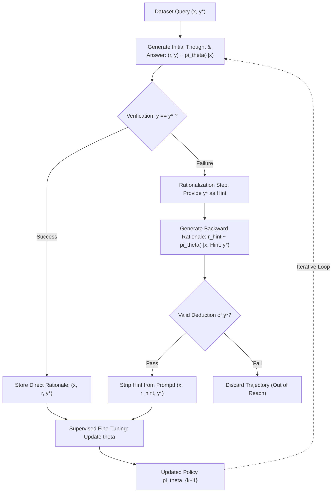
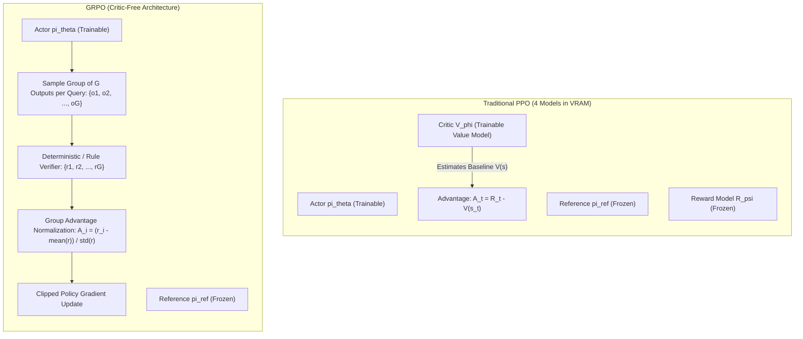
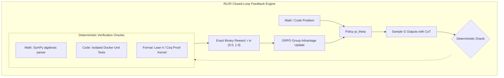

> **Learning goals:** Master the transition from test-time search to train-time weight internalisation; unpack the Self-Taught Reasoner (STaR) rationalization loop; formulate Group Relative Policy Optimization (GRPO) to bypass PPO critic bottlenecks; evaluate Reinforcement Learning with Verifiable Rewards (RLVR); implement stabilization techniques from Direct Alignment for Policy Optimization (DAPO) including asymmetric clipping, dynamic group filtering, and token-level loss.
>
> **Prerequisites:** [04: Grounded Feedback, Tools & Code](/docs/ai-agents/self-improving-ai-agents/04-grounded-feedback-tools-and-code) and [05: Planning, MCTS & Multi-Step Reasoning](/docs/ai-agents/self-improving-ai-agents/05-planning-mcts-and-multi-step-reasoning).

---

## The Paradigm Shift: From Test-Time Search to Train-Time Scaling

In [Lesson 02](/docs/ai-agents/self-improving-ai-agents/02-test-time-compute-scaling-and-search) and [Lesson 05](/docs/ai-agents/self-improving-ai-agents/05-planning-mcts-and-multi-step-reasoning), we investigated **test-time compute scaling**: allocating FLOPs at inference via majority voting ($N$-sampling), beam search, and Monte Carlo Tree Search. 

While test-time search lifts problem-solving capability, it incurs severe practical penalties:
- **Linear Inference Cost:** Every user request pays the recurring tax of generating $32\dots 128$ candidate trajectories or navigating deep exploration trees.
- **Latency Bloat:** Generating thousands of speculative tokens introduces massive wall-clock delay.
- **Fragile Verification:** External search relies on verifiers or reward heuristics that can be gamed at inference.

**Train-time scaling** changes the equation. Instead of repeatedly discovering reasoning paths at inference, we invest compute during training to **internalize search capabilities into the model's base weights $\theta$**.

```
Compute Allocation Spectrum:
--------------------------------------------------------------------------------------
Paradigm                  Where FLOPs are Spent            What is Learned
--------------------------------------------------------------------------------------
Pre-Training              Internet tokens (next-token)     Broad world knowledge & priors
Supervised Fine-Tuning    Curated human demonstrations     Tone, format, tool syntax
Test-Time Search          Inference rollouts & MCTS        Transient solution exploration
Train-Time Scaling (RL)   Self-generated rollouts & RLVR   Permanent reasoning policies:
                                                           backtracking, verification,
                                                           error-recovery in weights!
```

As demonstrated by frontier models (OpenAI o1, DeepSeek-R1), scaling RL compute during post-training triggers qualitative phase shifts: models spontaneously develop **self-correction, error-detection, and multi-path hypothesis testing** inside their native forward pass.

---

## Seminal Paper 1: STaR (Self-Taught Reasoner)

Published by Zelikman et al. (Stanford, 2022), **STaR** (*Self-Taught Reasoner: Bootstrapping Reasoning With Reasoning*) introduced a fundamental insight: *a model's existing generation capabilities can bootstrap its own training data if filtered by ground-truth outcomes*.

### The Core Problem with Naive Fine-Tuning
- High-quality step-by-step reasoning traces are virtually non-existent at internet scale.
- Human annotation of complex mathematical proofs and system debugging is prohibitively expensive.
- Few-shot chain-of-thought prompting saturates rapidly and cannot expand model capability beyond its initial zero-shot boundary.

### The STaR Bootstrapping Algorithm

STaR operates as an iterative EM-style bootstrapping algorithm over a dataset of questions and ground-truth answers $\mathcal{D} = \{(x_i, y_i^*)\}_{i=1}^M$:



#### Step 1: Forward Generation
For each query $x$, the base policy $\pi_\theta$ generates a candidate rationale $r$ and final answer $\hat{y}$:

$$(r, \hat{y}) \sim \pi_\theta(\cdot \mid x)$$

#### Step 2: Outcome Verification & Direct Filtering
The predicted answer $\hat{y}$ is verified against ground-truth $y^*$:
- If $\hat{y} = y^*$, the rationale $r$ is considered valid. The instance $(x, r, y^*)$ is added to the training buffer $\mathcal{D}_{\text{train}}$.

#### Step 3: The Rationalization Mechanism (Hint Injection)
If $\hat{y} \ne y^*$, the model failed to solve the problem forward. In standard rejection sampling, this failed sample is discarded, providing zero learning signal. 

STaR introduces **Rationalization**: the model is re-prompted with the ground-truth answer revealed as a hint:

$$r_{\text{hint}} \sim \pi_\theta(\cdot \mid x, \text{"Hint: The final answer is "} y^*)$$

Because backward deduction is structurally easier than forward search (e.g., finding the prime factors of $N=221$ is hard, but verifying given factor $13$ is trivial), the model frequently constructs a coherent, mathematically sound reasoning path when knowing the target.

#### Step 4: Hint Stripping and SFT
Crucially, if $r_{\text{hint}}$ successfully derives $y^*$, **the hint is stripped from the prompt**. The tuple $(x, r_{\text{hint}}, y^*)$ is added to $\mathcal{D}_{\text{train}}$ *as if the model had discovered the path autonomously*.

The model is then fine-tuned via standard supervised loss:

$$\mathcal{L}_{\text{SFT}}(\theta) = -\sum_{(x, r, y^*) \in \mathcal{D}_{\text{train}}} \sum_{t=1}^{|r \circ y^*|} \log \pi_\theta(w_t \mid x, w_{<t})$$

The updated policy $\pi_{\theta_{t+1}}$ is now more capable of solving similar problems *without* hints in iteration $t+1$.

### Extensions: V-STaR and Quiet-STaR
- **V-STaR (2024):** Co-trains a verifier alongside the generator. Instead of discarding failed trajectories, incorrect rationales serve as hard negative examples to train a discriminator $P(\text{correct} \mid x, r)$.
- **Quiet-STaR (Zelikman et al., 2024):** Generalizes STaR to generate *internal latent reasoning tokens* before predicting every text token in arbitrary unstructured web text, moving reasoning beyond prompt-response boundaries.

---

## Seminal Paper 2: DeepSeekMath & Group Relative Policy Optimization (GRPO)

While STaR demonstrated that models can self-bootstrap reasoning, its supervised fine-tuning mechanism is fundamentally offline and sample-inefficient. Transitioning to full Reinforcement Learning, however, historically collided with the **PPO Memory Bottleneck**.

### The PPO Critic Bottleneck in Frontier LLMs

Standard Proximal Policy Optimization (PPO) utilizes an Actor-Critic architecture. For an actor model of size $N$ parameters, training requires maintaining four separate models in GPU memory:
1. **Actor Network ($\pi_\theta$):** The policy being optimized (trainable, requires gradients, optimizer states, and activations).
2. **Reference Policy ($\pi_{\text{ref}}$):** Frozen baseline policy to compute KL-divergence penalties.
3. **Critic Network ($V_\phi$):** Value model that predicts expected scalar return from state $s_t$.
4. **Reward Model ($R_\psi$):** Evaluates terminal output quality.

```
GPU VRAM Burden of Standard PPO (e.g., 70B Model):
--------------------------------------------------------------------------------------
Model Component       Parameters       Optimizer (AdamW)       Activation Memory
--------------------------------------------------------------------------------------
Actor (pi_theta)      70 Billion       16-bit + FP32 states    High (Backprop)
Reference (pi_ref)    70 Billion       None (Frozen)           Low (Forward only)
Critic (V_phi)        70 Billion       16-bit + FP32 states    High (Backprop)
Reward Model (R_psi)  70 Billion       None (Frozen)           Low (Forward only)
--------------------------------------------------------------------------------------
Total VRAM required exceeds 8x 80GB H100 nodes solely for weight and optimizer residency!
```

Moreover, training a token-level Value Critic $V_\phi(s_t)$ on long mathematical derivations is notoriously unstable; value errors compound over hundreds of reasoning tokens, destabilizing policy gradients.

### GRPO: Eliminating the Critic Model

In *DeepSeekMath: Pushing the Limits of Mathematical Reasoning in Open Language Models* (Shao et al., 2024), the authors introduced **Group Relative Policy Optimization (GRPO)**. GRPO completely eliminates the Critic model $V_\phi$, substituting it with a **Group Advantage Estimator**.



### The GRPO Objective Formulation

For each input query $q \sim \mathcal{D}$, GRPO samples a group of $G$ independent candidate outputs from the old policy:

$$\{o_1, o_2, \dots, o_G\} \sim \pi_{\theta_{\text{old}}}(\cdot \mid q)$$

Each candidate output $o_i$ is evaluated by a reward oracle (or rule-based verifier), yielding scalar rewards $\{r_1, r_2, \dots, r_G\}$.

#### 1. Group Advantage Normalization
The advantage $A_i$ for output $o_i$ is computed by standardizing the reward relative to its group peers:

$$\tilde{A}_i = \frac{r_i - \text{Mean}(\{r_1, \dots, r_G\})}{\text{Std}(\{r_1, \dots, r_G\}) + \epsilon}$$

If an answer is better than the group average, its advantage is positive ($\tilde{A}_i > 0$); if worse, negative ($\tilde{A}_i < 0$).

#### 2. Surrogate Clipped Objective
The policy parameter $\theta$ is updated by maximizing:

$$\mathcal{J}_{\text{GRPO}}(\theta) = \mathbb{E}_{\substack{q \sim \mathcal{D} \\ \{o_i\}_{i=1}^G \sim \pi_{\theta_{\text{old}}}}} \left[ \frac{1}{G} \sum_{i=1}^G \frac{1}{|o_i|} \sum_{t=1}^{|o_i|} \mathcal{L}_{\text{clip}}(\theta; q, o_{i, \le t}) - \beta D_{\text{KL}}(\pi_\theta \parallel \pi_{\text{ref}}) \right]$$

where the per-token clipped objective is:

$$\mathcal{L}_{\text{clip}} = \min \left( \frac{\pi_\theta(o_{i,t} \mid q, o_{i,<t})}{\pi_{\theta_{\text{old}}}(o_{i,t} \mid q, o_{i,<t})} \tilde{A}_i, \; \text{clip}\left( \frac{\pi_\theta(o_{i,t} \mid q, o_{i,<t})}{\pi_{\theta_{\text{old}}}(o_{i,t} \mid q, o_{i,<t})}, 1 - \epsilon, 1 + \epsilon \right) \tilde{A}_i \right)$$

and $D_{\text{KL}}$ uses the unbiased token-level estimator (Schulman, 2020):

$$D_{\text{KL}}(\pi_\theta \parallel \pi_{\text{ref}}) = \frac{\pi_{\text{ref}}(o_{i,t} \mid \dots)}{\pi_\theta(o_{i,t} \mid \dots)} - \log \frac{\pi_{\text{ref}}(o_{i,t} \mid \dots)}{\pi_\theta(o_{i,t} \mid \dots)} - 1$$

### Why GRPO Unlocked Reasoning Scaling
1. **Memory Reduction:** Dropping the critic saves $50\%$ of active training VRAM, allowing labs to double the batch size $G$ or scale reasoning models from 7B to 70B on standard clusters.
2. **Variance Reduction without Critic Drift:** In multi-step mathematical derivations, empirical group baselines $\mu_G$ provide an unbiased counterfactual estimate: *"How did this reasoning path perform relative to $G-1$ other attempts on the exact same problem?"*

---

## Reinforcement Learning with Verifiable Rewards (RLVR)

Why did reasoning breakthroughs (OpenAI o1, DeepSeek-R1) emerge specifically in **mathematics** and **software engineering**, rather than creative writing, legal analysis, or medical diagnosis?

The answer lies in **Reinforcement Learning with Verifiable Rewards (RLVR)**.



### Deterministic Oracles vs. Neural Reward Models

| Dimension | Neural Reward Models (RLHF) | Verifiable Rewards (RLVR) |
|---|---|---|
| **Oracle Nature** | Learned neural network (LLM judge) | Deterministic code execution / SymPy parser |
| **Susceptibility to Hacking** | **Severe:** Policy exploits judge biases, sycophancy, verbosity | **Immune:** Code either passes all assertions or fails |
| **Reward Distribution** | Continuous, noisy scalar ($r \in \mathbb{R}$) | Exact, deterministic binary ($r \in \{0, 1\}$) |
| **Optimization Ceiling** | Saturates quickly; policy drifts into degenerate modes | Unbounded hill-climbing over arbitrary search depths |

### The Emergence of Self-Correction Under Pure RLVR
When models are trained via RLVR using only outcome verification (did the final Python program pass test cases? Is the boxed mathematical integer exact?), a striking phenomenon occurs:

> **The "Aha!" Emergence:**
> Without any supervised demonstrations of backtracking, the policy spontaneously discovers tokens such as:
> - *"Wait, let me recalculate the discriminant..."*
> - *"Hold on, this creates an edge case where $n=0$..."*
> - *"Alternative approach: let's try proof by contradiction..."*

Because the RL gradient rewards any internal computation pattern that increases terminal success probability, allocating tokens to **speculative hypothesis testing and error-detection** becomes an optimal policy strategy.

---

## DAPO: Direct Alignment for Policy Optimization

While GRPO is mathematically elegant, naively running it on competition-level math benchmarks (such as AIME 2024 or Olympiads) reveals severe training instabilities. In **DAPO** (*Direct Alignment for Policy Optimization*, 2025), researchers systematically diagnosed and resolved the core failure modes of scaled reasoning RL.

```
DAPO Ablation Progression on Qwen-32B (AIME 2024 Benchmark):
--------------------------------------------------------------------------------------
Algorithm Configuration                                          AIME Accuracy
--------------------------------------------------------------------------------------
1. Naive GRPO Baseline                                           30.0%
2. + Overlong Response Filtering                                 36.0%
3. + Asymmetric Policy Ratio Clipping                            38.0%
4. + Soft Overlong Truncation Punishment                         41.0%
5. + Token-Level Normalized Loss                                 42.0%
6. + Dynamic Group Sampling (Zero-Variance Batch Removal)        50.0%
DeepSeek-R1 Distilled Baseline (Reference)                       47.0%
--------------------------------------------------------------------------------------
```

### The 4 Pillars of DAPO

#### 1. Asymmetric Policy Ratio Clipping
In standard PPO, the importance sampling ratio $w_t = \frac{\pi_\theta(y_t)}{\pi_{\text{old}}(y_t)}$ is clipped symmetrically to $[1 - \epsilon, 1 + \epsilon]$ (typically $\epsilon = 0.2$).
- **The Problem:** In complex reasoning, a breakthrough step requires increasing the probability of a previously low-probability token (e.g., discovering an obscure mathematical substitution where $\pi_{\text{old}} \approx 10^{-4}$). Symmetric clipping prevents the policy from taking large positive gradient steps on rare, high-value tokens, leading to **exploration collapse** and plunging policy entropy.
- **The Solution:** DAPO enforces asymmetric clipping thresholds $[\epsilon_{\text{low}}, \epsilon_{\text{high}}]$ where $\epsilon_{\text{high}} > \epsilon_{\text{low}}$ (e.g., $[0.8, 1.4]$), enabling aggressive positive exploration while penalizing destructive policy shifts.

#### 2. Dynamic Group Sampling (Filtering Zero-Variance Batches)
In GRPO, the advantage denominator is the standard deviation of rewards within the group: $\text{std}(\{r_1, \dots, r_G\})$.
- **The Problem:** On very difficult problems (e.g., AIME), all $G$ sampled solutions fail ($r_i = 0$ for all $i$). Thus, $\text{std}(r) = 0$, and the gradient is undefined or zeroes out. Conversely, on trivial problems, all $G$ pass ($r_i = 1$). Both extremes waste computational FLOPs and dilute effective batch size.
- **The Solution:** Dynamic sampling oversamples queries and strictly **discards all-zero and all-one groups**. Only groups with mixed outcomes ($0 < \sum r_i < G$) are admitted to the gradient step, ensuring every backward pass delivers high-variance, informative training signals.

#### 3. Token-Level vs. Sample-Level Loss Normalization
Standard PPO averages loss at the sequence level.
- **The Problem:** A 16,000-token hallucinated derivation receives the exact same global loss weight as an elegant, concise 500-token proof. This creates an incentive for **length explosion**, where models generate verbose fluff to maximize stochastic opportunities for partial credit.
- **The Solution:** DAPO normalizes loss strictly by the number of active completion tokens across the batch:
  $$\mathcal{L}_{\text{token}} = \frac{1}{\sum_{i=1}^G |o_i|} \sum_{i=1}^G \sum_{t=1}^{|o_i|} \mathcal{L}_{\text{clip}}(t)$$

#### 4. Soft Overlong Truncation Punishment
When reasoning models tackle difficult problems, responses frequently hit the maximum generation cutoff (e.g., $16,384$ tokens). 
- Truncating mid-sentence yields an incomplete, unverified trajectory that receives reward $r=0$.
- Naively treating this as a normal failure injects massive gradient noise, because the policy is penalized for early correct steps simply because it ran out of room.
- DAPO introduces a **gradual length penalty** as generation approaches $L_{\text{max}}$, teaching the policy to budget its tokens and conclude proofs cleanly before reaching context limits.

---

## Production Python Implementation: Standalone GRPO Module

Below is a complete, production-grade PyTorch implementation of the **GRPO Advantage Estimator and Clipped Policy Loss Engine**, featuring group advantage normalization, token-level masking, and Schulman KL divergence tracking.

```python
"""
grpo_engine.py
Complete Production PyTorch Implementation of Group Relative Policy Optimization (GRPO).
Features:
- Group-wise Advantage Normalization (Critic-free)
- Asymmetric / Symmetric PPO Ratio Clipping
- Unbiased Schulman KL Divergence Penalty
- Token-Level Loss Masking (pads & prompts excluded)
"""

from __future__ import annotations
import torch
import torch.nn as nn
import torch.nn.functional as F
from typing import Tuple, Dict


def compute_group_advantages(
    rewards: torch.Tensor,
    epsilon: float = 1e-8,
) -> torch.Tensor:
    """
    Computes normalized group relative advantages for GRPO.

    Args:
        rewards: Tensor of shape (batch_size, group_size) containing scalar rewards.
        epsilon: Small constant to prevent division by zero.

    Returns:
        advantages: Tensor of shape (batch_size, group_size) with zero mean
                    and unit variance per group.
    """
    assert rewards.ndim == 2, f"Expected (B, G), got shape {rewards.shape}"
    # Compute mean and standard deviation across the group dimension (dim=1)
    mean_reward = rewards.mean(dim=1, keepdim=True)
    std_reward = rewards.std(dim=1, keepdim=True, unbiased=True)

    # Standardize
    advantages = (rewards - mean_reward) / (std_reward + epsilon)

    # If all samples in a group share identical rewards (std == 0), set advantages to 0
    zero_var_mask = (std_reward < 1e-6).expand_as(advantages)
    advantages = torch.where(zero_var_mask, torch.zeros_like(advantages), advantages)
    return advantages


class GRPOLoss(nn.Module):
    """
    Computes the token-level GRPO clipped policy surrogate loss with KL regularization.
    """

    def __init__(
        self,
        clip_eps_low: float = 0.2,
        clip_eps_high: float = 0.2,
        kl_coeff: float = 0.04,
    ) -> None:
        super().__init__()
        self.clip_eps_low = clip_eps_low
        self.clip_eps_high = clip_eps_high
        self.kl_coeff = kl_coeff

    def forward(
        self,
        logprobs_policy: torch.Tensor,
        logprobs_old: torch.Tensor,
        logprobs_ref: torch.Tensor,
        advantages: torch.Tensor,
        completion_mask: torch.Tensor,
    ) -> Tuple[torch.Tensor, Dict[str, float]]:
        """
        Calculates the surrogate loss.

        Args:
            logprobs_policy: (B, G, SeqLen) - log pi_theta(y_t | x, y_<t)
            logprobs_old:    (B, G, SeqLen) - log pi_old(y_t | x, y_<t)
            logprobs_ref:    (B, G, SeqLen) - log pi_ref(y_t | x, y_<t)
            advantages:      (B, G)         - Scalar advantage per sequence
            completion_mask: (B, G, SeqLen) - Binary mask (1 for completion tokens, 0 for pad/prompt)

        Returns:
            loss: Scalar PyTorch loss tensor for backpropagation.
            metrics: Dictionary of tracking metrics (kl, clip_fraction, entropy).
        """
        # 1. Expand advantages across token sequence length: (B, G, 1) -> (B, G, SeqLen)
        adv_expanded = advantages.unsqueeze(-1)

        # 2. Compute probability ratios: w_t = exp(log pi_theta - log pi_old)
        log_ratio = logprobs_policy - logprobs_old
        ratio = torch.exp(log_ratio)

        # 3. Asymmetric PPO Clipping bounds
        lower_bound = 1.0 - self.clip_eps_low
        upper_bound = 1.0 + self.clip_eps_high
        clipped_ratio = torch.clamp(ratio, min=lower_bound, max=upper_bound)

        # 4. Surrogate Policy Gradient Objective
        surr1 = ratio * adv_expanded
        surr2 = clipped_ratio * adv_expanded
        policy_loss_per_token = -torch.min(surr1, surr2)

        # 5. Unbiased KL Divergence Penalty (Schulman approximation)
        # KL(pi_theta || pi_ref) ~ exp(log_ref - log_theta) - (log_ref - log_theta) - 1
        log_ref_ratio = logprobs_ref - logprobs_policy
        kl_per_token = torch.exp(log_ref_ratio) - log_ref_ratio - 1.0

        # Total combined token loss
        total_token_loss = policy_loss_per_token + self.kl_coeff * kl_per_token

        # 6. Apply token mask and normalize strictly by valid completion tokens
        active_tokens = completion_mask.sum().clamp(min=1.0)
        masked_loss = (total_token_loss * completion_mask).sum() / active_tokens

        # Diagnostic metrics
        with torch.no_grad():
            mean_kl = (kl_per_token * completion_mask).sum() / active_tokens
            clipped_tokens = ((ratio < lower_bound) | (ratio > upper_bound)) & (
                completion_mask.bool()
            )
            clip_fraction = clipped_tokens.float().sum() / active_tokens

        metrics = {
            "loss": masked_loss.item(),
            "mean_kl": mean_kl.item(),
            "clip_fraction": clip_fraction.item(),
            "active_tokens": int(active_tokens.item()),
        }
        return masked_loss, metrics


# -----------------------------------------------------------------------------
# Unit Test and Functional Demonstration
# -----------------------------------------------------------------------------
if __name__ == "__main__":
    torch.manual_seed(42)

    batch_size = 2   # 2 questions in the batch
    group_size = 4   # 4 sampled completions per question (G=4)
    seq_len = 16     # 16 tokens sequence length

    # Simulated rewards from deterministic verifier (e.g. SymPy)
    # Question 1: Mixed outcomes (0.0, 1.0, 1.0, 0.0) -> high variance
    # Question 2: Mixed outcomes (0.0, 0.0, 1.0, 0.0) -> single success
    sample_rewards = torch.tensor([
        [0.0, 1.0, 1.0, 0.0],
        [0.0, 0.0, 1.0, 0.0],
    ])

    print("--- 1. Computing GRPO Group Advantages ---")
    group_advs = compute_group_advantages(sample_rewards)
    print("Raw Rewards:\n", sample_rewards)
    print("Computed Group Advantages:\n", group_advs.round(decimals=3))

    # Synthetic Log-Probabilities
    logprobs_policy = torch.randn(batch_size, group_size, seq_len, requires_grad=True)
    logprobs_old = logprobs_policy.detach() + torch.randn_like(logprobs_policy) * 0.05
    logprobs_ref = logprobs_old.detach()

    # Binary mask: tokens 0-3 are prompt, 4-13 are response, 14-15 are pad
    mask = torch.zeros(batch_size, group_size, seq_len)
    mask[:, :, 4:14] = 1.0

    print("\n--- 2. Executing GRPO Forward Step ---")
    grpo_module = GRPOLoss(clip_eps_low=0.2, clip_eps_high=0.2, kl_coeff=0.05)
    loss, diagnostics = grpo_module(
        logprobs_policy=logprobs_policy,
        logprobs_old=logprobs_old,
        logprobs_ref=logprobs_ref,
        advantages=group_advs,
        completion_mask=mask,
    )

    print(f"Calculated GRPO Loss: {loss.item():.4f}")
    print("Diagnostics:", diagnostics)

    # Verify Backward Pass
    loss.backward()
    print("Backward pass executed successfully! Gradient norm:", logprobs_policy.grad.norm().item())
```

---

## Failure Modes, Training Instabilities & Diagnostics

```
RL Training Diagnostic Matrix:
========================================================================================
Observable Symptom              Underlying Cause                 Mitigation Action
========================================================================================
Response Length Explodes        Policy games reward via          Switch to token-level loss;
(Reaches context cutoff)        rambling flattery                apply soft length penalty
----------------------------------------------------------------------------------------
Policy Entropy Drops to Zero    Exploration collapsed into       Implement asymmetric clipping;
(Repeats exact same words)      narrow deterministic path        increase group size G
----------------------------------------------------------------------------------------
Flat Loss / Zero Advantage      Batch contains only all-pass     Enable Dynamic Group Sampling
(Zero gradient progress)        or all-fail questions            to filter zero-variance sets
----------------------------------------------------------------------------------------
KL Divergence Diverges (>0.5)   Policy weights updated too       Increase beta KL penalty;
                                aggressively away from ref       lower learning rate (1e-6)
```

---

## Paradigm Synthesis

| Dimension | SFT (Imitation) | STaR (Self-Taught) | GRPO (DeepSeekMath) | DAPO (Scaled RLVR) |
|---|---|---|---|---|
| **Optimization Method** | Cross-Entropy Loss | Rejection SFT + Hints | Group-Normalized RL | Stabilized Group RL |
| **Critic Requirement** | None | None | **None (Group Peer Baseline)** | **None** |
| **Reward Dependency** | Static labels | Binary Ground Truth | Reward Model / Oracle | Strict Deterministic Oracles |
| **Exploration Discovery** | Limited to corpus | Moderate (via hints) | High (Online sampling) | Unbounded (Asymmetric) |
| **Primary Domain Fit** | Format adaptation | Symbolic & math | STEM, Math, Logic | Competition Math & Code |

---

## Summary & Key Takeaways

1. **Train-time scaling internalizes search:** Test-time MCTS is powerful but computationally expensive at inference. Train-time RL directly compiles deliberate reasoning habits (backtracking, verification) into policy weights.
2. **STaR proves rationalization works:** When models fail forward search, providing the ground truth as a hint enables backward rationalization. Stripping the hint provides clean, self-generated synthetic training data.
3. **GRPO shatters the memory ceiling:** By replacing PPO's heavyweight neural Critic ($V_\phi$) with group-relative reward normalization, GRPO saves $50\%$ of training VRAM and stabilizes credit assignment on long reasoning chains.
4. **Verifiable rewards eliminate reward hacking:** In mathematics and code, deterministic sandboxes provide ungameable ground truth, allowing policies to self-improve indefinitely without hitting the reward saturation ceilings of RLHF.
5. **DAPO provides the production blueprint:** Scaling reasoning RL to competition benchmarks requires asymmetric clipping, dynamic zero-variance filtering, and token-level loss normalization.

---

[Next: Deep Research & Scaled Autonomous Systems →](/docs/ai-agents/self-improving-ai-agents/07-deep-research-and-scaled-systems)
