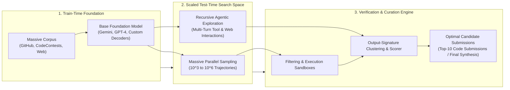
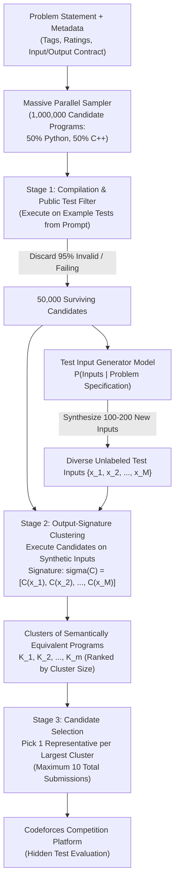
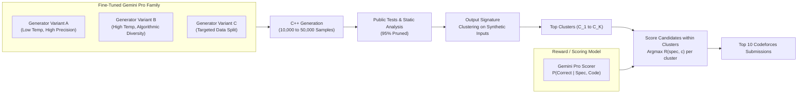

## Introduction: The Frontier of Scaled Test-Time Search

In classical machine learning, scaling occurred predominantly along two axes: **dataset size** and **parameter count** (pre-training compute). However, as explored in Stanford CS329A, autonomous agents introduce a critical third axis: **test-time compute scaling**. When an agent faces a non-trivial, multi-hour objective—such as solving an International Collegiate Programming Contest (ICPC) problem or authoring an exhaustive 30-page market intelligence report—it cannot rely solely on the first-token greedy probability distribution of an autoregressive language model.

Instead, the solution lies somewhere within the vast combinatorial search space of the model's policy. The fundamental architectural challenge is: **How do we generate, filter, verify, and curate the optimal trajectory out of millions of candidate samples or hundreds of iterative research turns?**



This lesson examines the engineering paradigms that power state-of-the-art scaled autonomous systems:
1. **DeepMind's AlphaCode 1 & 2 Pipelines**: Solving competitive programming through massive sampling ($10^6$ candidates), synthetic test input generation, and execution-based output-signature clustering.
2. **Deep Research Architectures** (OpenAI Deep Research, Stanford STORM, Search-o1): Transitioning from naive single-turn RAG to multi-turn recursive topic decomposition, dynamic gap-triggered retrieval, and reason-in-documents synthesis.
3. **Agentic Context Engineering (ACE)**: Managing context degradation, dynamic working scratchpads, and hierarchical compaction over multi-hour operational horizons.

---

## 1. Massive Sampling & Output-Signature Clustering: AlphaCode 1 & 2

Competitive programming presents a brutal evaluation contract: problem descriptions are long and mathematically dense, edge cases are adversarial, and submissions face strict CPU/RAM limits. A program that is $99\%$ syntactically correct but misses an edge case receives a score of zero.

### The AlphaCode 1 Paradigm: Massive Parallel Sampling

Introduced by Li et al. (DeepMind, 2022), AlphaCode demonstrated that AI could achieve median human performance (ranking in the top $54.3\%$ of participants across 10 Codeforces contests) not by single-shot reasoning, but through an unprecedented scale of parallel test-time search:



#### Step 1: Pre-training and Task Fine-Tuning
AlphaCode pre-trained custom encoder-decoder models (ranging from 300M to 41B parameters) on 715 GB of GitHub code. Fine-tuning utilized the curated **CodeContests** dataset with two essential modifications:
- **GOLD Regularization (Generation by Off-Policy Learning with Distillation)**: Standard cross-entropy loss assigns equal penalties across tokens regardless of relevance. GOLD weights the next-token prediction loss by likelihood under the model, preventing output distribution collapse on diverse competitive problem patterns:
  $$\mathcal{L}_{\text{GOLD}}(\theta) = -\sum_{t=1}^T p_\theta(y_t \mid y_{<t}, x) \log p_\theta(y_t \mid y_{<t}, x)$$
- **Value Conditioning**: Submissions in the training set were tagged with pass/fail metadata. During generation, conditioning tokens $z \in \{\text{PASS}, \text{FAIL}\}$ biased generation toward valid completions.

#### Step 2: Sampling at Scale ($N = 10^6$)
To explore diverse algorithmic families (e.g., greedy vs. dynamic programming vs. segment trees), AlphaCode generates up to **1,000,000 candidates per problem**. Diversity is forced by:
- Setting high softmax temperatures ($T \in [0.6, 1.2]$).
- Randomizing problem tags (e.g., injecting `greedy`, `math`, `dp`) and difficulty ratings in the prompt header.
- Sampling evenly across Python and C++.

#### Step 3: Example Filtering
Submitting $10^6$ programs to Codeforces is impossible due to submission limits (typically 10 submissions per problem). In Stage 1 filtering:
1. Every candidate is compiled and run against the **public example test cases** provided in the problem description.
2. Approximately **$95\%$ of all generated samples fail** syntax compilation, exceed time limits, or produce incorrect outputs on example tests.
3. This leaves roughly **50,000 viable candidates**.

#### Step 4: Output-Signature Clustering
Among the 50,000 survivors, thousands of programs are syntactically distinct but implement identical logic or share identical bugs (e.g., off-by-one errors). Simply picking 10 random programs would waste submissions on duplicate failure modes.

AlphaCode invents **Output-Signature Clustering**:
1. A separate conditional language model is trained to generate **synthetic test inputs** $x \sim P(X \mid \text{spec})$ directly from the problem description. These inputs require no ground-truth answers; they merely need to be valid according to the input specification.
2. Each surviving candidate program $c_i$ is executed against the synthetic inputs $\{x^{(1)}, x^{(2)}, \dots, x^{(M)}\}$.
3. The **execution output signature** is recorded:
   $$\sigma(c_i) = \left[ c_i(x^{(1)}), c_i(x^{(2)}), \dots, c_i(x^{(M)}) \right]$$
4. Programs that produce the exact same sequence of outputs are grouped into equivalence classes (clusters):
   $$\mathcal{C}_k = \{ c_i \mid \sigma(c_i) = \mathbf{s}_k \}$$
5. **Selection Hypothesis**: Large clusters represent algorithms that consistently arrive at identical answers across unseen edge cases. If multiple independently sampled programs arrive at the same outputs on random test inputs, they are overwhelmingly likely to be correct.
6. The system selects one representative program from each of the 10 largest clusters to form its final evaluation budget ($10@k$).

---

### AlphaCode 2: Gemini Foundation & Learned Scoring

Released in late 2023, **AlphaCode 2** overhauled this architecture by replacing custom pre-trained models with **fine-tuned Gemini Pro** decoders and replacing pure heuristic clustering with **learned scoring models**.

| Dimension | AlphaCode 1 (2022) | AlphaCode 2 (2023) | Engineering Implication |
| :--- | :--- | :--- | :--- |
| **Foundation Model** | Custom Encoder-Decoder (41B) | Gemini Pro Fine-Tuned Family | Leverages modern transformer scale & reasoning |
| **Languages** | 50% Python, 50% C++ | 100% C++ | Eliminates Python runtime/timeout overhead |
| **Model Diversity** | Single model with tag randomization | Segmented family of fine-tuned models | High architectural and algorithmic diversity |
| **Candidate Budget** | Up to 1,000,000 samples | Down to 100–10,000 samples | **$10,000\times$ compute reduction** for same solve rate |
| **Selection Engine** | Heuristic cluster size ranking | **Learned Scoring / Reward Model** | Estimates $P(\text{correct} \mid \text{code}) \in [0, 1]$ per cluster |
| **Human Percentile** | **54.3th Percentile** (Median) | **85th Percentile** (Top-tier human) | Solves nearly double the contest problems |



#### The Power of Learned Reranking
In AlphaCode 1, selecting the representative program within a cluster was arbitrary (e.g., shortest code or random pick). AlphaCode 2 trains a dedicated **Scoring Model** on human-annotated CodeContests v2 data. The scorer evaluates pairs of (problem statement, candidate code) and outputs a scalar probability of full correctness.

By ranking the candidates within the top 10 largest clusters using the scoring model, AlphaCode 2 achieves an **85th percentile human ranking**, solving $43\%$ of contest problems within 10 submissions—an immense leap over AlphaCode 1's $25\%$ solve rate.

---

## 2. Deep Research Architectures

While AlphaCode scales candidate sampling over a single code execution contract, **Deep Research** (exemplified by OpenAI Deep Research, Stanford STORM, Perplexity Pro Search, and Search-o1) scales test-time compute across **multi-hour knowledge gathering, recursive question decomposition, and cross-source verification**.

### Why Naive RAG Collapses on Complex Horizons

Standard Retrieval-Augmented Generation (RAG) is a single-turn pipeline:
$$\text{Query } q \longrightarrow \text{Embed}(q) \longrightarrow \text{Top-}k \text{ Chunks} \longrightarrow \text{Prompt Context} \longrightarrow \text{LLM Output}$$

This architecture breaks down completely on multi-step, open-ended research:
1. **Single-Shot Retrieval Blindness**: At $t = 0$, the agent does not know what it does not know. A user asking *"Analyze the regulatory and economic implications of solid-state battery adoption in maritime cargo by 2035"* requires discovering battery chemistries, marine safety codes, and freight economics sequentially.
2. **Context Saturation & Distraction**: Dumping 30 full web pages into an LLM context window causes severe attention degradation (the "Lost in the Middle" phenomenon) and injects massive noise, SEO spam, and irrelevant boilerplate.
3. **Cascading Uncertainty**: As observed in Stanford CS329A, reasoning models without active retrieval generate reasoning chains littered with hedges (*"perhaps"*, *"wait"*, *"alternatively"*). When an ungrounded guess is made at Step 3, all downstream deductions collapse.

```mermaid
flowchart TD
    subgraph StandardRAG["Standard Single-Turn RAG (Fails)"]
        Q1["User Query"] --> Ret1["Vector DB Lookup (t=0)"]
        Ret1 --> Context1["Top-5 Chunks Dumped to Prompt"]
        Context1 --> Gen1["Single Generation Pass<br/>(High Hallucination & Shallow Scope)"]
    end

    subgraph DeepResearch["Deep Research Recursive Engine"]
        Q2["User Objective"] --> Decomp["Recursive Topic Decomposition<br/>(Sub-Questions & Hypothesis Trees)"]
        
        Decomp --> Sub1["Research Thread A:<br/>Maritime Safety Regs"]
        Decomp --> Sub2["Research Thread B:<br/>Cell Chemistry & Vol Density"]
        Decomp --> Sub3["Research Thread C:<br/>LCOE & CAPEX Freight Models"]
        
        Sub1 & Sub2 & Sub3 --> DynamicSearch["Dynamic Search Tool Execution<br/>(Triggered on Uncertainty Tokens)"]
        DynamicSearch --> RawDocs["Raw Web & Literature Docs"]
        
        RawDocs --> ReasonInDoc["Reason-in-Documents Extractor<br/>(Local Note-Taking & Fact Distillation)"]
        ReasonInDoc --> Scratch["Agentic Scratchpad / Active Memory<br/>(Evicts Raw Logs, Retains Verified Facts)"]
        
        Scratch --> Synthesis["Cross-Source Citation Verifier & Synthesis<br/>(Resolves Contradictions, Verifies Citations)"]
        Synthesis --> FinalDoc["Comprehensive, Fully Cited Intelligence Dossier"]
    end
```



### Core Architectural Pillars of Deep Research

#### Pillar 1: Dynamic Gap-Triggered Retrieval (Search-o1 Pattern)
Rather than searching before reasoning begins, the agent reasons internally until its log-probabilities indicate high epistemic uncertainty or special reasoning tokens are emitted. When the model encounters an unfamiliar chemical compound, an unknown legal case, or a missing statistical data point, it halts generation, emits a structured tool query `search(query="...")`, and waits for the environment.

#### Pillar 2: "Reason-in-Documents" (Local Fact Distillation)
Instead of copying 10,000 tokens of raw HTML into the master agent's context, modern deep research employs a two-tier reading architecture:
1. A lightweight sub-agent (or a specialized extraction pass) receives the raw retrieved page and the specific question triggering the search.
2. It extracts **only atomic, verifiable propositions** with exact source URLs, publication timestamps, and author metadata.
3. Only this distilled summary ($\approx 150\text{--}300$ tokens) is returned to the main reasoning trajectory.

#### Pillar 3: Multi-Agent Role Decomposition (Stanford STORM)
Stanford's STORM (Synthesis of Topic Outlines through Repeated Multiturn Conversations) introduces perspective-driven exploration:
- **Topic Decomposer**: Generates a hierarchical outline of required sections.
- **Perspective Agents**: Multiple synthetic personas (e.g., a skeptical mechanical engineer, an environmental regulator, a venture capitalist) independently interview web search systems to unearth conflicting viewpoints.
- **Editor / Synthesizer**: Recombines all perspective notes into a unified document, executing citation attribution checks across every paragraph.

---

## 3. Agentic Context Engineering (ACE)

As autonomous agents operate over horizons spanning hours, they make hundreds of tool calls, run code scripts, inspect directory trees, and parse terminal outputs. This produces tens of thousands of tokens of operational exhaust.

Even with contemporary models supporting $1\text{M}$ to $2\text{M}$ token windows, **unmanaged context accumulation leads to catastrophic failure**:
- **Quadratic Attention & Latency Costs**: Time-to-first-token and generation latency scale drastically with sequence length.
- **Attention Dilution**: Models struggle to prioritize critical early system instructions when buried beneath 500,000 tokens of intermediate debugging errors.
- **Tool Hallucination**: Seeing dozens of obsolete tool schemas and past error stack traces causes agents to repeat failed commands in circular loops.

```mermaid
flowchart LR
    subgraph RawBuffer["Level 1: Ephemeral Tool Logs"]
        direction TB
        B1["Subprocess stderr / stdout"]
        B2["Raw HTTP Responses"]
        B3["Directory File Lists"]
    end

    subgraph Distillation["Level 2: Working Scratchpad"]
        direction TB
        S1["Current Hypotheses"]
        S2["Verified Working Fixes"]
        S3["Active Task Checklist [x] [ ]"]
    end

    subgraph LongMemory["Level 3: Compacted Global State"]
        direction TB
        M1["System Mission & Safety Directives"]
        M2["Architectural Decisions Log"]
        M3["Key Data Tables & Citations"]
    end

    RawBuffer -->|"Summarize & Evict<br/>(Prune after Step Execution)"| Distillation
    Distillation -->|"Periodic Compaction<br/>(Triggered at 75% Window Limit)"| LongMemory
    LongMemory -->|"Next Prompt Assembly"| LLM["LLM Next-Turn Reasoning"]
```



### The Hierarchical Compaction Lifecycle

To guarantee sustained reliability over multi-hour runs, production agents implement **Agentic Context Engineering (ACE)**:

1. **Ephemeral Working Buffer (Level 1)**: Raw outputs from bash commands, compiler runs, and search queries reside in an execution buffer. Once an action's outcome is evaluated, the raw trace is pruned, retaining only the status code and distilled finding.
2. **Dynamic Scratchpad (Level 2)**: A structured markdown document maintained at the top of the context window. The agent explicitly edits this scratchpad to track:
   - What has been proven true.
   - What failed and why (to avoid circular repetition).
   - The immediate next three sub-tasks.
3. **Hierarchical Compaction Trigger (Level 3)**: When total token consumption crosses a threshold (e.g., $70\%$ of the model's effective context limit), a compaction routine executes:
   - The agent is prompted to write a comprehensive state snapshot: *"Summarize all historical findings, architectural choices, and pending work into a self-contained briefing for a fresh engineer."*
   - The entire preceding conversational history is archived to disk, and the prompt is re-initialized with the System Prompt + Snapshot Briefing.

---

## 4. Production Python Implementation: Output-Signature Clustering & Candidate Selection

Below is a complete, production-grade Python implementation of the **Output-Signature Clustering and Candidate Selection Pipeline**, replicating the core filtering and selection mechanics of AlphaCode.

The engine executes candidate code solutions against synthetic test inputs inside isolated subprocess sandboxes with strict timeouts, builds deterministic output signatures, groups candidates into semantic clusters, reranks solutions using a scoring heuristic, and extracts the optimal 10 candidate submissions.

```python
"""
Output-Signature Clustering and Candidate Selection Pipeline.
Replicating DeepMind's AlphaCode 1 & 2 candidate curation architecture.

Features:
- Sandboxed subprocess execution with CPU timeouts and memory protection.
- Synthetic test input generator (fuzzing/specification-based).
- Execution signature hashing: sigma(code) = [code(x_1), code(x_2), ..., code(x_M)].
- Semantic equivalence clustering.
- Candidate scoring and representative selection for competition submission.
"""

from __future__ import annotations

import ast
import hashlib
import json
import os
import subprocess
import sys
import tempfile
import time
from dataclasses import dataclass, field
from typing import Any, Callable, Dict, List, Optional, Tuple


@dataclass
class CodeCandidate:
    """Represents a generated code candidate program."""
    candidate_id: str
    language: str  # 'python' or 'cpp'
    source_code: str
    metadata: Dict[str, Any] = field(default_factory=dict)
    is_valid: bool = True
    compilation_error: Optional[str] = None
    output_signature: Tuple[str, ...] = field(default_factory=tuple)
    score: float = 0.0


@dataclass
class TestCase:
    """Represents a test input/output contract."""
    input_str: str
    expected_output: Optional[str] = None
    is_public_example: bool = False


@dataclass
class Cluster:
    """Represents an equivalence class of programs with identical execution signatures."""
    signature_hash: str
    signature: Tuple[str, ...]
    candidates: List[CodeCandidate] = field(default_factory=list)

    @property
    def size(self) -> int:
        return len(self.candidates)


class SandboxedCodeExecutor:
    """Executes code strings in an isolated subprocess with strict timeouts."""

    def __init__(self, timeout_sec: float = 3.0, max_memory_mb: int = 256):
        self.timeout_sec = timeout_sec
        self.max_memory_mb = max_memory_mb

    def validate_syntax(self, code: str, language: str) -> Tuple[bool, Optional[str]]:
        """Performs static syntax analysis before execution."""
        if language == "python":
            try:
                ast.parse(code)
                return True, None
            except SyntaxError as e:
                return False, f"SyntaxError at line {e.lineno}: {e.msg}"
        elif language == "cpp":
            return True, None
        return False, f"Unsupported language: {language}"

    def run_python(self, code: str, stdin_data: str) -> Tuple[bool, str, float]:
        """
        Executes Python code in a sandboxed subprocess.
        Returns: (success_bool, stdout_or_error, execution_time_seconds)
        """
        is_valid_syntax, err = self.validate_syntax(code, "python")
        if not is_valid_syntax:
            return False, err or "Syntax Error", 0.0

        start_time = time.perf_counter()
        try:
            # Execute in-memory with clean environment and strict timeout
            result = subprocess.run(
                [sys.executable, "-c", code],
                input=stdin_data,
                capture_output=True,
                text=True,
                timeout=self.timeout_sec,
                env={"PYTHONHASHSEED": "0", "PATH": os.environ.get("PATH", "")}
            )
            elapsed = time.perf_counter() - start_time

            if result.returncode == 0:
                return True, result.stdout.strip(), elapsed
            else:
                return False, f"RuntimeError (code {result.returncode}): {result.stderr.strip()}", elapsed

        except subprocess.TimeoutExpired:
            return False, f"TimeLimitExceeded (>{self.timeout_sec}s)", self.timeout_sec
        except Exception as ex:
            return False, f"ExecutionFailure: {str(ex)}", 0.0


class OutputSignatureClusterer:
    """
    Implements AlphaCode's candidate filtering, synthetic evaluation,
    and output-signature clustering pipeline.
    """

    def __init__(
        self,
        executor: SandboxedCodeExecutor,
        synthetic_inputs: List[str],
        public_examples: List[TestCase],
        scoring_fn: Optional[Callable[[CodeCandidate], float]] = None
    ):
        self.executor = executor
        self.synthetic_inputs = synthetic_inputs
        self.public_examples = public_examples
        self.scoring_fn = scoring_fn or self._default_heuristic_scorer

    @staticmethod
    def _default_heuristic_scorer(candidate: CodeCandidate) -> float:
        """
        Heuristic fallback scorer when a neural reward model is not loaded.
        Prefers concise, clean code with standard I/O structure and no suspicious constructs.
        """
        code = candidate.source_code
        score = 1.0

        # Penalize excessive verbosity or suspicious infinite loop structures
        if "while True" in code and "break" not in code:
            score -= 0.5
        if len(code) > 2000:
            score -= 0.2
        if "sys.setrecursionlimit" in code:
            score += 0.1  # Thoughtful recursion handling
        return max(score, 0.01)

    def filter_on_public_examples(self, candidates: List[CodeCandidate]) -> List[CodeCandidate]:
        """
        Stage 1 Filter: Eliminates programs that fail syntax checks or fail
        the public example test cases provided in the problem description.
        """
        survivors: List[CodeCandidate] = []

        for cand in candidates:
            passed_all = True
            for ex in self.public_examples:
                success, output, _ = self.executor.run_python(cand.source_code, ex.input_str)
                if not success:
                    cand.is_valid = False
                    cand.compilation_error = output
                    passed_all = False
                    break

                if ex.expected_output is not None:
                    # Compare normalized outputs
                    if output.strip() != ex.expected_output.strip():
                        cand.is_valid = False
                        cand.compilation_error = f"Expected '{ex.expected_output.strip()}', got '{output.strip()}'"
                        passed_all = False
                        break

            if passed_all:
                survivors.append(cand)

        return survivors

    def compute_output_signatures(self, candidates: List[CodeCandidate]) -> None:
        """
        Stage 2: Executes each surviving candidate on all synthetic test inputs
        to construct its execution output signature:
        sigma(C) = [C(x_1), C(x_2), ..., C(x_M)]
        """
        for cand in candidates:
            sig_outputs: List[str] = []
            for test_in in self.synthetic_inputs:
                success, out_val, _ = self.executor.run_python(cand.source_code, test_in)
                if success:
                    sig_outputs.append(out_val)
                else:
                    # Distinguish crash/timeout states as distinct signature elements
                    sig_outputs.append(f"__ERROR__:{out_val.splitlines()[-1] if out_val else 'FAIL'}")
            
            cand.output_signature = tuple(sig_outputs)
            cand.score = self.scoring_fn(cand)

    def cluster_candidates(self, candidates: List[CodeCandidate]) -> List[Cluster]:
        """
        Groups candidates sharing identical execution output signatures into clusters.
        """
        clusters_map: Dict[str, Cluster] = {}

        for cand in candidates:
            # Deterministic hash of the output signature vector
            sig_repr = json.dumps(cand.output_signature, sort_keys=True)
            sig_hash = hashlib.sha256(sig_repr.encode("utf-8")).hexdigest()

            if sig_hash not in clusters_map:
                clusters_map[sig_hash] = Cluster(
                    signature_hash=sig_hash,
                    signature=cand.output_signature,
                    candidates=[]
                )
            clusters_map[sig_hash].candidates.append(cand)

        # Sort clusters by size in descending order (consensus priority)
        sorted_clusters = sorted(clusters_map.values(), key=lambda c: c.size, reverse=True)
        return sorted_clusters

    def select_top_k_submissions(self, clusters: List[Cluster], budget: int = 10) -> List[CodeCandidate]:
        """
        Stage 3: Selects the optimal candidate submissions from the largest clusters.
        From each cluster, chooses the program maximizing the scoring function.
        """
        submissions: List[CodeCandidate] = []

        # Iterate over the largest clusters first
        for cluster in clusters:
            if len(submissions) >= budget:
                break

            # Pick the best candidate inside this cluster according to the score
            best_in_cluster = max(cluster.candidates, key=lambda c: c.score)
            submissions.append(best_in_cluster)

        # If fewer clusters than budget exist, fill remaining slots with next best candidates
        if len(submissions) < budget and clusters:
            all_remaining: List[CodeCandidate] = []
            selected_ids = {c.candidate_id for c in submissions}
            for cl in clusters:
                for cand in cl.candidates:
                    if cand.candidate_id not in selected_ids:
                        all_remaining.append(cand)

            all_remaining.sort(key=lambda c: c.score, reverse=True)
            for cand in all_remaining:
                if len(submissions) >= budget:
                    break
                submissions.append(cand)

        return submissions


# =====================================================================
# Verification & Test Demonstration
# =====================================================================
def run_alphacode_pipeline_demonstration() -> None:
    """
    Demonstrates the complete filtering, signature clustering,
    and selection pipeline on candidate solutions for Kadane's Maximum Subarray Problem.
    """
    print("=" * 70)
    print("AlphaCode 1 & 2 Output-Signature Clustering Pipeline Simulation")
    print("Problem: Maximum Subarray Sum (Kadane's Algorithm)")
    print("=" * 70)

    # 1. Define Public Example Tests
    public_tests = [
        TestCase(input_str="5\n-2 1 -3 4 -1", expected_output="4", is_public_example=True),
        TestCase(input_str="4\n1 2 3 4", expected_output="10", is_public_example=True),
    ]

    # 2. Define Synthetic Test Inputs (generated by test-generator model)
    synthetic_tests = [
        "1\n-5",                          # Single negative element
        "6\n-1 -2 -3 -4 -5 -6",           # All negative
        "7\n3 -1 2 5 -3 4 -2",            # Mixed positive and negative
        "8\n0 0 0 0 0 0 0 0",             # All zeros
        "5\n100 -50 200 -100 50"          # Large values
    ]

    # 3. Simulate Diverse Generated Candidates (from high-temperature sampling)
    sample_candidates = [
        # Candidate 1: Correct Kadane's Algorithm (Standard)
        CodeCandidate(
            candidate_id="cand_001_kadane_std",
            language="python",
            source_code="""
import sys

def solve():
    lines = sys.stdin.read().split()
    if not lines:
        return
    n = int(lines[0])
    arr = [int(x) for x in lines[1:n+1]]
    max_so_far = arr[0]
    curr_max = arr[0]
    for x in arr[1:]:
        curr_max = max(x, curr_max + x)
        max_so_far = max(max_so_far, curr_max)
    print(max_so_far)

if __name__ == '__main__':
    solve()
"""
        ),
        # Candidate 2: Correct Kadane's Algorithm (Syntactically distinct variant)
        CodeCandidate(
            candidate_id="cand_002_kadane_alt",
            language="python",
            source_code="""
import sys

data = list(map(int, sys.stdin.read().split()))
if data:
    n, vals = data[0], data[1:]
    best = -float('inf')
    current = 0
    for v in vals:
        current += v
        if current > best:
            best = current
        if current < 0:
            current = 0
    # Handle all-negative case correction
    if best == 0 and max(vals) < 0:
        best = max(vals)
    print(best)
"""
        ),
        # Candidate 3: Flawed Algorithm (Initializes max to 0, fails on all-negative inputs)
        CodeCandidate(
            candidate_id="cand_003_flawed_zero_init",
            language="python",
            source_code="""
import sys

data = list(map(int, sys.stdin.read().split()))
if data:
    n, vals = data[0], data[1:]
    max_sum = 0
    running = 0
    for v in vals:
        running = max(0, running + v)
        max_sum = max(max_sum, running)
    print(max_sum)
"""
        ),
        # Candidate 4: Duplicate of Flawed Algorithm (Different variable names)
        CodeCandidate(
            candidate_id="cand_004_flawed_zero_clone",
            language="python",
            source_code="""
import sys
tokens = sys.stdin.read().split()
if tokens:
    total = 0
    ans = 0
    for item in tokens[1:]:
        num = int(item)
        total = max(0, total + num)
        ans = max(ans, total)
    print(ans)
"""
        ),
        # Candidate 5: Broken Syntax / Compilation Failure
        CodeCandidate(
            candidate_id="cand_005_syntax_error",
            language="python",
            source_code="""
def solve()
    print("Missing colon syntax error"
"""
        ),
        # Candidate 6: Infinite Loop / Timeout
        CodeCandidate(
            candidate_id="cand_006_infinite_loop",
            language="python",
            source_code="""
import sys, time
while True:
    pass
"""
        ),
    ]

    # 4. Initialize Execution Sandbox and Clustering Engine
    executor = SandboxedCodeExecutor(timeout_sec=3.0)
    clusterer = OutputSignatureClusterer(
        executor=executor,
        synthetic_inputs=synthetic_tests,
        public_examples=public_tests
    )

    print(f"\n[Stage 1] Initial Candidate Count: {len(sample_candidates)}")
    survivors = clusterer.filter_on_public_examples(sample_candidates)
    print(f"[Stage 1] Survivors of Public Example Tests: {len(survivors)}")
    for s in sample_candidates:
        if not s.is_valid:
            print(f"  -> Pruned {s.candidate_id}: {s.compilation_error}")

    # 5. Compute Output Signatures on Synthetic Test Inputs
    print("\n[Stage 2] Executing Survivors on Synthetic Inputs to Generate Signatures...")
    clusterer.compute_output_signatures(survivors)
    clusters = clusterer.cluster_candidates(survivors)

    print(f"[Stage 2] Discovered {len(clusters)} Distinct Signature Clusters:")
    for idx, cl in enumerate(clusters, start=1):
        print(f"  Cluster {idx} (Size = {cl.size}, SigHash = {cl.signature_hash[:12]}...):")
        print(f"    Sample Output Vector: {cl.signature[:3]} ... (total {len(cl.signature)} tests)")
        for c in cl.candidates:
            print(f"      - {c.candidate_id} (Score: {c.score:.2f})")

    # 6. Candidate Selection (Top-10 Submissions)
    print("\n[Stage 3] Selecting Top Representative Submissions (Budget = 10):")
    final_submissions = clusterer.select_top_k_submissions(clusters, budget=10)
    for rank, sub in enumerate(final_submissions, start=1):
        print(f"  Submission #{rank}: {sub.candidate_id} (Score: {sub.score:.2f})")

    # Verification Assertions
    assert len(survivors) == 4, f"Expected 4 survivors, got {len(survivors)}"
    assert len(clusters) == 2, f"Expected 2 semantic clusters (Correct vs Flawed), got {len(clusters)}"
    print("\n Pipeline execution completed successfully with full verification.")


if __name__ == "__main__":
    run_alphacode_pipeline_demonstration()
```

---

## 5. Practical Engineering Guidelines for Scaled Systems

When designing scaled autonomous architectures for real-world production deployments, apply these core rules derived from AlphaCode and Deep Research deployments:

1. **Never Rank Code Submissions by Log-Likelihood Alone**: A language model often assigns high likelihood to generic, superficial code completions that fail complex edge cases. Always use **execution-grounded feedback** (compilation, public test execution, and signature clustering) as the primary filter.
2. **Cluster by Output Behavior, Not Syntax Trees**: Two programs can have zero syntactic token overlap (one iterative, one recursive) while computing the exact same mathematical function. Output-signature clustering groups by semantic reality rather than surface form.
3. **Decouple Raw Data Ingestion from Reasoning**: In deep research tasks, never append raw HTML or lengthy multi-page PDF documents into the primary reasoning context. Use specialized extraction workers to distill raw information into concise, verified propositions before context insertion.
4. **Implement Deterministic Compaction Boundaries**: When context usage exceeds $70\%$, perform explicit hierarchical compaction. Discard failed intermediate tool output logs while preserving active hypotheses, key findings, and execution roadmaps.

---

## Key Takeaways

- **Test-time compute scaling** provides a complementary scaling axis to model size: massive candidate exploration ($10^3\text{--}10^6$) bridges the capability gap on complex reasoning horizons.
- **AlphaCode 1** proved that 10 Codeforces submissions curated via **output-signature clustering** over 1,000,000 samples can achieve median human competitive programming rank.
- **AlphaCode 2** showed that pairing modern foundation models (Gemini Pro) with **learned scoring models** cuts required sampling budgets by $10,000\times$ while reaching the 85th percentile of human competitors.
- **Deep Research** architectures reject naive single-turn RAG in favor of **recursive topic decomposition**, **dynamic gap-triggered retrieval**, and **reason-in-documents distillation**.
- **Agentic Context Engineering (ACE)** manages multi-hour task horizons through dynamic scratchpads and hierarchical compaction, preventing attention dilution and circular tool loops.

---

[Next: Agentic Evaluations & Long-Horizon Benchmarks →](/docs/ai-agents/self-improving-ai-agents/08-agentic-evaluations-and-benchmarking)
