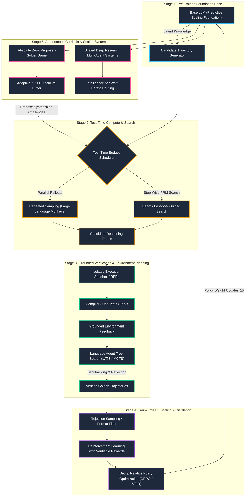

Welcome to the definitive curriculum on **Self-Improving AI Agents**, based on the landmark **Stanford CS329A** course taught by **Prof. Azalia Mirhoseini** (Assistant Professor of Computer Science at Stanford University; ex-Google Brain, Google DeepMind, Anthropic) and **Adjunct Prof. Akanksha** (Reflection AI; ex-Google Brain, Google DeepMind), featuring groundbreaking research conducted in collaboration with Turing Award laureate **Prof. John Hennessy**.

This curriculum deconstructs the profound paradigm shift currently reshaping artificial intelligence: **the migration of scaling laws from pre-training parameter expansion to post-training reinforcement learning and inference-time compute scaling.**

---

## The Core Thesis: The Post-Training Revolution

For nearly a decade (2018–2024), AI progress was governed by pre-training scaling laws (Kaplan et al., Chinchilla). Maximizing model capability meant training larger transformer models on larger internet-scraped text corpora using ever-larger supercomputing clusters:

$$\mathcal{L}(N, D, C) \approx \left(\frac{N_c}{N}\right)^{\alpha_N} + \left(\frac{D_c}{D}\right)^{\alpha_D} + \left(\frac{C_c}{C}\right)^{\alpha_C}$$

As pre-training datasets encounter the **human data exhaustion wall** and parameter scaling hits diminishing returns, frontier AI laboratories have unlocked a new axis of intelligence: **self-improving agentic loops**.

```
Traditional Pre-Training Paradigm (2018–2024)
[Internet Data] ──▶ [Next-Token Prediction] ──▶ [Static Model Weights] ──▶ Single-Turn Chatbot
                                                                                  │
                                            ┌─────────────────────────────────────┘
                                            ▼
Modern Self-Improving Agent Paradigm (2024–Present)
[Base Weights] ──▶ [Test-Time Search (MCTS/Sampling)] ──▶ [Grounded Verifier Feedback]
       ▲                                                                   │
       └──────── [Train-Time RL (GRPO / STaR Distillation)] ───────────────┘
```

By decoupling reasoning capability from parameter count, models can dynamically trade **inference-time compute** for problem-solving accuracy. When paired with **grounded environment verifiers** (compilers, formal theorem provers, execution sandboxes), agents autonomously generate, verify, and distill high-quality reasoning trajectories back into their own parameter weights.

---

## Master Architecture of Self-Improving Agents

The following architectural blueprint illustrates the end-to-end self-improvement lifecycle explored across the 9 modules of this curriculum:



---

## Curriculum Matrix & Syllabus

The curriculum spans 9 rigorous, self-contained modules comprising theoretical foundations, algorithmic formulations, benchmark analyses, and production-grade Python implementations:

| Module | Title | Key Research Papers | Primary Algorithmic Paradigm | Code Implementation |
|---|---|---|---|---|
| **[01](/docs/ai-agents/self-improving-ai-agents/01-paradigm-shift-and-scaling-foundations)** | **Paradigm Shift & Scaling Foundations** | Kaplan et al. (2020), Chinchilla (2022), Wei et al. (Emergent CoT), InstructGPT (2022) | Pre-training scaling laws, emergent chain-of-thought, SFT/RLHF limits, the post-training transition | Empirical scaling law loss regression & compute frontier estimator |
| **[02](/docs/ai-agents/self-improving-ai-agents/02-test-time-compute-scaling-and-search)** | **Test-Time Compute Scaling & Search** | Large Language Monkeys (Mirhoseini et al., 2024), OpenAI o1 (2024), Snell et al. (2024) | Inference-time scaling, parallel repeated sampling, $\text{pass}@k$ vs $\text{pass}@1$, temperature tuning | High-throughput Best-of-$N$ parallel sampler with coverage estimation |
| **[03](/docs/ai-agents/self-improving-ai-agents/03-robust-verification-and-reward-models)** | **Robust Verification & Reward Models** | DeepSeekMath-V2 (2024), Lightman et al. (PRMs, 2023), Uesato et al. (2022) | Outcome (ORM) vs Process Reward Models (PRM), generator-verifier gap, meta-verification | Dual-head Process Reward Model (PRM) verifier with credit assignment |
| **[04](/docs/ai-agents/self-improving-ai-agents/04-grounded-feedback-tools-and-code)** | **Grounded Feedback, Tools & Code Execution** | Code Monkeys (2024), SWiRL (2024), Toolformer (Schick et al., 2023) | Tool-use loops, compiler/terminal feedback, dynamic test synthesis, interactive debugging | Sandboxed Python REPL execution harness with automated test-driven feedback |
| **[05](/docs/ai-agents/self-improving-ai-agents/05-planning-mcts-and-multi-step-reasoning)** | **Planning, MCTS & Multi-Step Reasoning** | Language Agent Tree Search (LATS, 2023), Tree of Thoughts (2023), RAP (2023) | Monte Carlo Tree Search over text spaces, UCT action selection, reflection, backtracking | Full Language Agent Tree Search (LATS) engine with semantic state rollouts |
| **[06](/docs/ai-agents/self-improving-ai-agents/06-train-time-scaling-and-scaling-rl)** | **Train-Time Scaling & Scaling RL** | DeepSeek-R1 (2025), DeepSeekMath (2024), STaR (Zelikman et al., 2022), PPO (2017) | RL with Verifiable Rewards (RLVR), Group Relative Policy Optimization (GRPO), self-training flywheels | Group Relative Policy Optimization (GRPO) loss objective with group baseline |
| **[07](/docs/ai-agents/self-improving-ai-agents/07-deep-research-and-scaled-systems)** | **Deep Research & Scaled Systems** | The AI Scientist (Lu et al., 2024), STORM (Stanford, 2024), OpenAI Deep Research | Multi-agent research orchestration, recursive information retrieval, citation verification | Multi-stage Deep Research orchestrator with parallel query fan-out |
| **[08](/docs/ai-agents/self-improving-ai-agents/08-agentic-evaluations-and-benchmarking)** | **Agentic Evaluations & Benchmarking** | SWE-bench (2024), GAIA (2023), WebArena (2023), HumanEval (2021) | Long-horizon benchmarks, contamination audits, $\text{pass}@1$ vs $\text{pass}^k$, cost/latency profiling | Containerized SWE-bench evaluation runner with git-patch verification |
| **[09](/docs/ai-agents/self-improving-ai-agents/09-frontiers-self-generation-and-safety)** | **Frontiers: Self-Generation, Efficiency & Safety** | Absolute Zero (2024), Multi-Agent Fine-Tuning (2024), Stanford IPW Study (2025) | Autonomous curricula (Deduction/Abduction/Induction), MAFT diversity, Intelligence per Watt ($\text{IPW}$) | AutonomousCurriculumGenerator with ZPD scheduling and AST sandbox |

---

## How to Study This Course

Depending on your engineering and research objectives, we recommend three distinct learning tracks:

```
┌─────────────────────────────────────────────────────────────────────────────┐
│                            LEARNING TRACKS                                  │
├──────────────────────┬──────────────────────┬───────────────────────────────┤
│   The AI Engineer    │  The ML Researcher   │  The Systems & Infra Builder  │
│      (Track A)       │      (Track B)       │           (Track C)           │
├──────────────────────┼──────────────────────┼───────────────────────────────┤
│ Focus: Agentic       │ Focus: Post-training │ Focus: Distributed execution, │
│ harnesses, tool-use  │ RL, loss objectives, │ inference throughput, and     │
│ loops, tree-search   │ PRM mathematics, and │ Intelligence per Watt         │
│ planning, and evals. │ autonomous curricula.│ Pareto efficiency.            │
│                      │                      │                               │
│ Primary Modules:     │ Primary Modules:     │ Primary Modules:              │
│ 02, 04, 05, 07, 08   │ 01, 03, 05, 06, 09   │ 02, 04, 06, 08, 09            │
└──────────────────────┴──────────────────────┴───────────────────────────────┘
```

### Track A: The AI Engineer Track
*Goal: Build production-grade coding agents, deep research systems, and reliable verification harnesses.*
1. Begin with **[02: Test-Time Compute Scaling](/docs/ai-agents/self-improving-ai-agents/02-test-time-compute-scaling-and-search)** to understand why repeated parallel sampling boosts pass rates on difficult coding tasks.
2. Master **[04: Grounded Feedback & Code](/docs/ai-agents/self-improving-ai-agents/04-grounded-feedback-tools-and-code)** and **[05: Planning & MCTS](/docs/ai-agents/self-improving-ai-agents/05-planning-mcts-and-multi-step-reasoning)** to implement backtracking, reflection, and stateful tree search.
3. Build scaled workflows in **[07: Deep Research](/docs/ai-agents/self-improving-ai-agents/07-deep-research-and-scaled-systems)** and evaluate them rigorously using **[08: Agentic Evaluations](/docs/ai-agents/self-improving-ai-agents/08-agentic-evaluations-and-benchmarking)**.

### Track B: The ML Researcher Track
*Goal: Advance the frontier of reinforcement learning, process rewards, and autonomous synthetic curricula.*
1. Analyze the mathematical foundations in **[01: Paradigm Shift](/docs/ai-agents/self-improving-ai-agents/01-paradigm-shift-and-scaling-foundations)** and credit assignment in **[03: Robust Verification & PRMs](/docs/ai-agents/self-improving-ai-agents/03-robust-verification-and-reward-models)**.
2. Deep-dive into policy gradients, PPO, and GRPO in **[06: Train-Time Scaling & Scaling RL](/docs/ai-agents/self-improving-ai-agents/06-train-time-scaling-and-scaling-rl)**.
3. Explore the self-generating frontiers of **[09: Self-Generation & Safety](/docs/ai-agents/self-improving-ai-agents/09-frontiers-self-generation-and-safety)** to investigate multi-agent fine-tuning (MAFT) and the Absolute Zero paradigm.

### Track C: The Systems & Infrastructure Builder Track
*Goal: Deploy high-throughput inference engines, secure sandbox runners, and energy-optimal hybrid architectures.*
1. Master inference scaling economics and sampling latency in **[02: Test-Time Compute](/docs/ai-agents/self-improving-ai-agents/02-test-time-compute-scaling-and-search)**.
2. Implement secure execution environments in **[04: Grounded Feedback](/docs/ai-agents/self-improving-ai-agents/04-grounded-feedback-tools-and-code)** and containerized benchmarking in **[08: Agentic Evaluations](/docs/ai-agents/self-improving-ai-agents/08-agentic-evaluations-and-benchmarking)**.
3. Architect edge-cloud hybrid routing and optimize **Intelligence per Watt** in **[09: Frontiers & Efficiency](/docs/ai-agents/self-improving-ai-agents/09-frontiers-self-generation-and-safety)**.

---

## Complete Lesson Directory

Explore all 9 lessons below:

### 01. Paradigm Shift & Scaling Foundations
*Why parameter scaling saturated, the emergence of chain-of-thought, the limits of SFT and RLHF, and the mathematical inflection toward test-time reasoning.*

[Open Lesson 1 &rarr;](/docs/ai-agents/self-improving-ai-agents/01-paradigm-shift-and-scaling-foundations)

### 02. Test-Time Compute Scaling & Search
*The Large Language Monkeys discovery: how parallel repeated sampling ($1 \to 10^4$) enables small models to outperform frontier baselines, log-linear coverage scaling, and Best-of-$N$ search.*

[Open Lesson 2 &rarr;](/docs/ai-agents/self-improving-ai-agents/02-test-time-compute-scaling-and-search)

### 03. Robust Verification & Reward Models
*Solving the generator-verifier gap: Outcome Reward Models (ORMs), Process Reward Models (PRMs), and DeepSeekMath-V2's automated meta-verification loops.*

[Open Lesson 3 &rarr;](/docs/ai-agents/self-improving-ai-agents/03-robust-verification-and-reward-models)

### 04. Grounded Feedback, Tools & Code
*Grounding agent reasoning in deterministic execution: terminal environments, compiler diagnostics, dynamic unit test generation, and SWiRL synthetic tool-use.*

[Open Lesson 4 &rarr;](/docs/ai-agents/self-improving-ai-agents/04-grounded-feedback-tools-and-code)

### 05. Planning, MCTS & Multi-Step Reasoning
*Language Agent Tree Search (LATS): combining Monte Carlo Tree Search, UCT exploration, semantic state evaluation, backtracking, and long-horizon reflection.*

[Open Lesson 5 &rarr;](/docs/ai-agents/self-improving-ai-agents/05-planning-mcts-and-multi-step-reasoning)

### 06. Train-Time Scaling & Scaling RL
*Reinforcement Learning with Verifiable Rewards (RLVR): Group Relative Policy Optimization (GRPO), STaR reasoning distillation, and the DeepSeek-R1 zero-RL breakthrough.*

[Open Lesson 6 &rarr;](/docs/ai-agents/self-improving-ai-agents/06-train-time-scaling-and-scaling-rl)

### 07. Deep Research & Scaled Systems
*Scaled multi-agent information retrieval: orchestrator-worker architectures, query decomposition, source citation grounding, and autonomous scientific discovery.*

[Open Lesson 7 &rarr;](/docs/ai-agents/self-improving-ai-agents/07-deep-research-and-scaled-systems)

### 08. Agentic Evaluations & Benchmarking
*Benchmarking autonomous agents: SWE-bench, GAIA, WebArena, contamination mitigation, $\text{pass}@1$ vs $\text{pass}^k$, and cost-accuracy Pareto evaluation.*

[Open Lesson 8 &rarr;](/docs/ai-agents/self-improving-ai-agents/08-agentic-evaluations-and-benchmarking)

### 09. Frontiers: Self-Generation, Efficiency & Safety
*The final frontier: Multi-Agent Fine-Tuning (MAFT), the Absolute Zero curriculum generator, Stanford's Intelligence per Watt Pareto curve, and recursive alignment safety.*

[Open Lesson 9 &rarr;](/docs/ai-agents/self-improving-ai-agents/09-frontiers-self-generation-and-safety)
