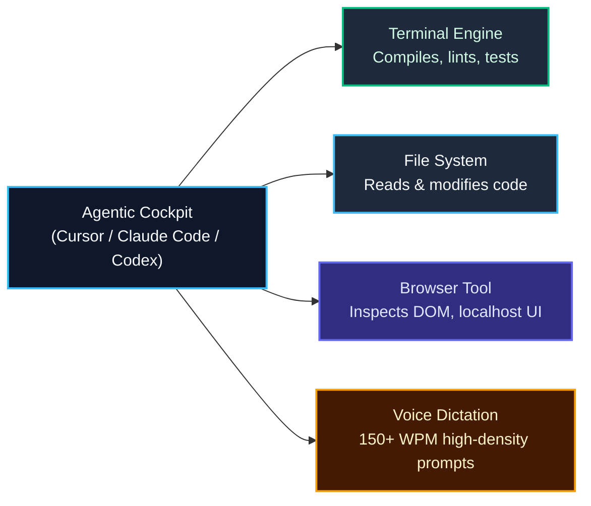

import { Callout } from 'fumadocs-ui/components/callout';
import { Steps, Step } from 'fumadocs-ui/components/steps';

<LessonIntro>
Your development environment is no longer just a text buffer with syntax highlighting; it is an AI orchestration cockpit. If your tool cannot autonomously inspect web application state in a real browser, cannot execute terminal verification loops, or is drowning in four hundred conflicting agent skills, your coding velocity will stall. Setting up an agentic cockpit requires three deliberate foundations: an agentic IDE with browser tools, disciplined context budgeting (keeping skills under 100), and high-bandwidth voice dictation to overcome typing bottlenecks.
</LessonIntro>

<Concepts items={['Agentic IDE Selection', 'Browser Tool Integration', 'Skill Budgeting (<100 Rule)', 'Voice Dictation Workflows', 'Setup Checklist Artifact']} />

---

## 1. The Core Requirements of an Agentic IDE

Not all code editors are equal when collaborating with autonomous models. To operate at peak effectiveness, your IDE or agent must support three capabilities:

1. **Direct Terminal & File System Agency**: The agent must read files, edit lines, inspect directory structures, and execute command-line tooling without manual copy-pasting.
2. **Integrated Browser Tools**: The agent must launch or connect to a browser (via Playwright or Chrome DevTools MCP) to navigate localhost, capture rendered UI screenshots, inspect the DOM tree, and verify console errors directly.
3. **Standing Context Rules**: Native ingestion of `.cursorrules`, `AGENTS.md`, or Claude project prompts at session boot.

---

## 2. The Rule of 100: Avoid "Skill Bloat"

A common mistake when developers discover Agent Skills or MCP plugins is installing hundreds of them simultaneously. 

<Callout type="warn">
**Why Skill Bloat Degrades Performance**: Every skill you register injects its instructions, schema, or tool definitions into the model's system prompt or tool catalog. Registering 300 skills consumes 40,000+ tokens of context before your actual message is read, pushes the model out of its optimal reasoning window, and triggers tool hallucinations.
</Callout>

- **Keep active skills under 100**: Curate only the skills directly applicable to your current project stack (e.g. Next.js, Supabase, Tailwind, Security Audit).
- **Disable inactive MCP servers**: When building a frontend landing page, disable your AWS or Kubernetes MCP connectors until you reach the deployment phase.

---

## 3. High-Bandwidth Input: Voice Dictation

Typing complex, 500-word architectural prompts by hand creates a physical bottleneck. Most developers type at 40–70 words per minute, but speak at 130–160 words per minute with far richer nuance and context.

- **Tools to use**: Superwhisper, WhisperKit, or native OS voice engines (macOS Voice Control / Windows Dictation `Win + H`).
- **Dictate context freely**: Explain edge cases, data invariants, and negative requirements conversationally. AI models excel at extracting structure from rambling, context-rich voice transcripts.

---

## Reusable Artifact: The Cockpit Setup Checklist

| Category | Requirement | Verified? |
|---|---|---|
| **IDE** | Cursor, Claude Code, or Codex CLI installed and authenticated | [ ] |
| **Browser Tool** | Playwright MCP, Chrome DevTools MCP, or IDE browser tool configured | [ ] |
| **Terminal Tool** | Agent has execution rights for `bun`, `npm`, `git` commands | [ ] |
| **Skill Budget** | Active skills and tools count is strictly under 100 | [ ] |
| **Dictation** | Voice dictation configured and tested with a global shortcut | [ ] |
| **Rulebook** | Root `AGENTS.md` or `.cursorrules` present in repository | [ ] |

---

<Takeaway>
A developer typing brief commands into an unequipped chat box operates at 1x. A developer speaking rich context into an agentic IDE equipped with terminal agency, browser tools, and a lean toolset operates at 10x.
</Takeaway>
