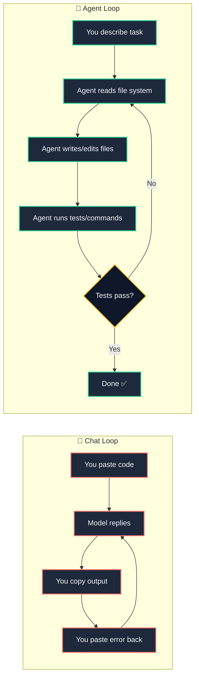

import { Callout } from 'fumadocs-ui/components/callout';

<LessonIntro>
A developer sits down to add a new feature: a password reset flow. They open ChatGPT, paste in a rough description, and receive a beautifully formatted implementation. They drop it into their project. Immediately, `npm run dev` throws five errors. The generated code references a `User` model with different field names than their actual schema. The email utility it imports doesn't exist in their project. The auth middleware it bypasses is the one thing protecting their entire API. Twenty minutes of ChatGPT back-and-forth later, nothing works — and the existing auth system is now broken. The problem was not the model. GPT-4 is extraordinarily capable. The problem was the *interface*. A chat window has no idea what your project looks like. A coding agent does.
</LessonIntro>

<Concepts items={["Claude Code", "GitHub Copilot (Agent Mode)", "OpenAI Codex CLI", "Gemini Code Assist", "Context Windows", "Agentic vs Chat", "AGENTS.md", "Smart Zone vs Dumb Zone"]} />

---

## Agent vs Chat: A Fundamental Distinction

This distinction is the most important mental model in this entire course. Burn it in.

**Chat mode:** You paste code into a box. The model responds with code in a box. You copy it out. You paste it in. You re-paste the error. Repeat. The model never sees your actual file system. It only sees what you paste. Every response starts from the context you manually curate.

**Agent mode:** The agent opens your files directly. It reads your entire project structure. It runs your terminal commands and reads the output. It writes files, iterates when tests fail, checks its own work, and operates in a loop until the task is done — or it gets stuck and asks for guidance.



Use chat for learning, exploration, and quick one-off questions. Use agents for everything you are actually building.

---

## Claude Code

Claude Code is Anthropic's terminal-native coding agent. It is not a plugin, not an IDE extension — it runs directly in your terminal and operates as a full autonomous agent against your file system.

**What makes it exceptional:**

- **Terminal-native** — no IDE required, works anywhere you have a shell
- **Claude 3.5 / Claude 4 models** — among the strongest coding models available as of 2025
- **Full file system access** — reads, creates, edits, and deletes files with your permission
- **Git-aware** — understands branches, diffs, and commit history
- **Ideal workloads** — complex refactors, database migrations, API integrations, test suites, backend logic, multi-file restructuring

Claude Code is the go-to for tasks that span many files, require careful reasoning about side effects, or need several rounds of iteration. It does not get distracted. It does not forget what it read three files ago.

Install and launch:

```bash
# Install globally via npm
npm install -g @anthropic-ai/claude-code

# Navigate to your project
cd my-project

# Launch the agent
claude
```

Once launched, Claude Code reads your project structure and is immediately ready to take instructions. You can also create an `AGENTS.md` file at your project root — Claude Code reads this automatically at the start of every session, similar to `.cursorrules` for Cursor:

```bash
# Create a standing instructions file
touch AGENTS.md
```

```
# Project: Link Shortener SaaS
Stack: Next.js 15, TypeScript, Supabase, Drizzle ORM, Tailwind CSS, Clerk Auth

## Coding Conventions
- All database queries go in /src/lib/db/ — never in route handlers directly
- Use Zod for all input validation
- Prefer async server components, use 'use client' only when needed
- Run `npm run type-check` and `npm run lint` before marking any task done

## Things to Never Do
- Never delete migration files
- Never hardcode secrets — use environment variables
- Never bypass Clerk middleware
```

---

## GitHub Copilot

GitHub Copilot is the most widely deployed coding agent in the world, and for good reason — it lives exactly where you already work: your IDE. Copilot has evolved from a tab-completion tool into a full agentic collaborator.

**Key capabilities:**

- **IDE-integrated** — works inside Cursor, VS Code, JetBrains IDEs, Neovim
- **Copilot Chat** — conversational interface with workspace context; it understands your open files
- **Agent Mode (2025)** — multi-step task execution with terminal access inside VS Code and Cursor
- **Workspace instructions** — `.github/copilot-instructions.md` gives it standing context

Copilot is the best choice for **daily feature work**: adding a new component, writing a utility function, generating a type from a JSON blob, fixing a lint error. Its deep IDE integration means you never break your flow — the agent operates in the same environment where you are reading and editing code.

---

## Codex CLI

OpenAI's Codex CLI is a terminal agent powered by the `o3` and `o4-mini` models — OpenAI's reasoning-heavy series. It operates in a sandboxed environment, which means it can execute code safely without risk of accidental system modifications.

```bash
# Install Codex CLI
npm install -g @openai/codex

# Run against your project
codex
```

**Strengths:**
- Powered by o3/o4-mini reasoning models — exceptional for algorithmic and logic-heavy problems
- Sandboxed execution — safer to let run autonomously
- Strong at code explanation, test generation, and debugging puzzles

**Weaknesses:**
- Less context-aware of your broader project than Claude Code
- Sandboxing can limit practical file-system workflows

Use Codex CLI when you have a difficult algorithmic problem, a tricky bug to reason through, or need test coverage generated for complex logic.

---

## The "Smart Zone" Principle

This mental model comes from TypeScript educator Matt Pocock, adapted for agentic coding: **every AI model has a "smart zone" — a context window range where it performs optimally.** Beyond that zone, quality degrades.

The practical rule: **give each agent one job, with the minimum context it needs to do that job.**

When you open a new Claude Code session and dump your entire 50,000-line codebase into context with a vague instruction like "improve my app," you are operating outside the smart zone. The model spreads its attention across irrelevant files, loses track of constraints, and produces mediocre output.

Instead, scope tightly:

- ❌ "Refactor my app to use the new auth system"
- ✅ "Refactor `src/lib/auth.ts` and its three importers to replace `next-auth` with Clerk. Here are the three files: [specific paths]. Do not touch any other files."

<Callout type="warn">
**Context saturation is silent and deadly.** Agents rarely tell you when they are confused by too much context — they just start making worse decisions. If your agent seems to be going in circles, hallucinating function names, or forgetting constraints you stated three messages ago, the fix is to start a fresh session with a narrower scope. Clear context, clear output.
</Callout>

---

## Comparison Table

| | Claude Code | GitHub Copilot | Codex CLI | Gemini Code Assist |
|---|---|---|---|---|
| **Model** | Claude 3.5 / 4 | GPT-4o / Claude (Cursor) | o3 / o4-mini | Gemini 1.5 Pro / 2.0 |
| **Terminal Native** | ✅ Yes | ❌ IDE only | ✅ Yes | ❌ IDE only |
| **File Access** | ✅ Full | 🔶 Workspace-scoped | ✅ Sandboxed | 🔶 Workspace-scoped |
| **Best Phase** | Complex logic / refactors | Daily feature work | Algorithmic problems | Google Cloud / GCP apps |
| **Price** | Usage-based (API) | $10/mo | Usage-based (API) | Free / $19/mo |
| **AGENTS.md / Instructions** | ✅ AGENTS.md | ✅ copilot-instructions.md | ❌ | ❌ |

---

<Takeaway>
Use **Claude Code** for deep, multi-file, reasoning-heavy work: migrations, refactors, complex feature implementations. Use **Cursor + Copilot** for your daily development flow: components, utilities, quick fixes. Use **Codex CLI** for algorithmic reasoning and complex logic puzzles. Always scope your agent's task narrowly — one clear goal per session, minimum necessary context. The "Smart Zone" is your quality guarantee.
</Takeaway>

<TryIt>
1. Install Claude Code: `npm install -g @anthropic-ai/claude-code`
2. Navigate to any existing project: `cd your-project`
3. Launch the agent: `claude`
4. Give it this exact prompt:

   > "Read this project and explain what it does in 3 sentences. Then list the top 3 files I should understand first to contribute effectively, and explain why each one matters."

5. Observe how it reads your actual files — not a description of them.
6. Create an `AGENTS.md` at your project root with at least: your stack, two coding conventions, and one thing it should never do.
</TryIt>
