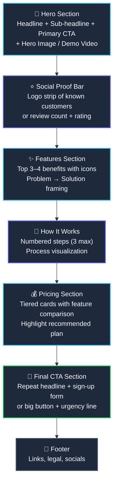

import { Callout } from 'fumadocs-ui/components/callout';
import { Steps, Step } from 'fumadocs-ui/components/steps';

<LessonIntro>
Picture this: a developer spends two days building a landing page. The agent wrote every component. The code is clean, the Tailwind classes are correct — and the result looks like a Bootstrap template from 2015. Not because they couldn't code, but because they gave the AI agent zero visual direction. The agent defaulted to what it knows best: generic, bland, "web-safe" design decisions. Design inspiration is not about copying other products. It's about extracting patterns — spacing systems, color moods, typographic rhythms — and handing your agent a concrete visual reference point it can actually follow.
</LessonIntro>

<Concepts items={["Design Galleries", "Mobbin", "SaaSFrame", "Godly", "Dribbble", "Landing Page Anatomy", "Auth Flow Patterns", "Dashboard Patterns", "Pattern Extraction"]} />

---

## The Three Pages You Must Design

Before your agent writes a single component, you need visual references for exactly three screens. Every SaaS app lives or dies on these three moments:

| Screen | User's Question | What It Must Accomplish |
|--------|----------------|------------------------|
| **Landing Page** | "Should I care?" | Communicate value, build trust, drive signup in under 8 seconds |
| **Auth (Sign Up / Login)** | "Is this safe and easy?" | Remove friction, signal legitimacy, get them in without confusion |
| **Main Dashboard** | "Do I understand this?" | Show the core value immediately, make the primary action obvious |

If your agent builds these three screens without a reference, it will produce placeholder layouts. With a reference, it has a visual contract to honor.

---

## Inspiration Sources by Screen Type

Not all design galleries are created equal. Each source has a specialty. Use the right tool for the right screen:

| Screen Type | Best Source | Why | Example URL |
|-------------|------------|-----|-------------|
| Landing Page | **SaaSFrame** | Curated SaaS landing pages only, filterable by section | `saasframe.io` |
| Landing Page | **Godly** | Premium, award-winning landing pages with bold aesthetics | `godly.website` |
| Landing Page | **Land-book** | Wide variety, searchable by industry and style | `land-book.com` |
| Auth Flows | **Mobbin** | Real app screenshots including sign-up, login, onboarding | `mobbin.com` |
| Dashboard / App | **SaaSUI** | Full product UI screenshots for authenticated screens | `saasui.design` |
| Dashboard / App | **Mobbin** | Filter by "Web" → "Productivity" or "Finance" for app UIs | `mobbin.com/apps` |
| General Mood | **Dribbble** | Good for color palette and micro-interaction ideas | `dribbble.com` |

<Callout type="info">
Save the specific inspiration URLs directly in your `DESIGN.md` under an `inspiration` key. Agents that read DESIGN.md can reference these links to understand your intended visual direction — and so can you, six months later when you've forgotten why you chose that specific shade of slate.
</Callout>

---

## The Research Process

<Steps>
<Step>
### Define Your App's Mood and Tone

Before opening any gallery, answer three questions:
- **Bold or minimal?** (Heavy typography and big imagery vs. clean whitespace and subtle details)
- **Dark or light mode first?** (Dark-first apps feel technical and premium; light-first feels accessible and consumer)
- **Playful or serious?** (Rounded corners and illustrations vs. sharp edges and data density)

Write these answers down. They filter everything that follows.
</Step>

<Step>
### Search Mobbin for Your App Category

Go to `mobbin.com`, select **Web**, then search for your category (e.g. "project management", "invoicing", "analytics"). Filter by screen type: **Sign Up**, **Dashboard**, **Home**. You will see real screenshots from live products. Don't save everything — only screenshots where your gut says "yes, that's the vibe."
</Step>

<Step>
### Collect 5–10 Screenshots Per Screen Type

For each of your three target screens (landing, auth, dashboard), save 5–10 screenshots. Quality over quantity. You want diversity of approach — different color palettes, different layouts — so you can extract patterns rather than just copying one design wholesale.
</Step>

<Step>
### Build a Mood Board in Figma or Notion

Create a single page in Figma (free) or a Notion gallery. Drop all screenshots in one place. Group by screen type. This becomes your design reference document that you can screenshot and paste into Claude or Cursor when prompting.
</Step>

<Step>
### Extract Specific Patterns

Don't stop at "I like how this looks." Force yourself to articulate **what specifically** you like. Use the Pattern Extraction Checklist below. Turn visual feelings into concrete tokens you can write into DESIGN.md.
</Step>
</Steps>

---

## Pattern Extraction Checklist

For each design you save, extract these specifics. This is the translation layer between "inspiration" and "implementable design system."

### Colors
- [ ] Primary action color (button, link, CTA)
- [ ] Surface colors (card background, page background, sidebar)
- [ ] Accent / highlight color (badges, tags, active states)
- [ ] Text hierarchy (heading color, body color, muted/subtle color)
- [ ] Border color

### Typography
- [ ] Heading font (name and weight — e.g. "Inter 700" or "Cal Sans")
- [ ] Body font (name and weight — e.g. "Inter 400")
- [ ] Code font (e.g. "JetBrains Mono")
- [ ] Typographic scale (approximate px sizes for h1 → h6 → body → small)
- [ ] Letter spacing (tight for headings? wide for labels?)

### Spacing
- [ ] Base unit (4px or 8px grid?)
- [ ] Section padding (top/bottom padding on major page sections)
- [ ] Card internal padding
- [ ] Gap between grid items

### Component Style
- [ ] Border radius (pill buttons? sharp corners? medium rounded?)
- [ ] Shadow depth (none, subtle, medium, dramatic)
- [ ] Button style (filled, outlined, ghost — which is primary?)
- [ ] Input style (underline? boxed? floating label?)
- [ ] Navigation style (top nav? sidebar? both?)

---

## Landing Page Anatomy

Every high-converting landing page follows a proven narrative arc. When you brief your agent, reference this structure explicitly:

When you find a landing page you love on SaaSFrame or Godly, map it against this anatomy. Note which sections they include, which they skip, and what makes each section work. Then tell your agent: "Build a landing page with this structure. Hero uses a [dark/light] background, Features section uses a 3-column grid with [icon style]."

---

<AnalogyCard name="Movie Set Design vs. Improv">
  
<strong>The Movie Set:</strong> A film director scouts locations, builds sets, chooses props, and designs the visual look of every scene before a single actor steps on set. The cinematographer knows the color palette, the lighting mood, the lens choices. Every creative decision flows from a pre-defined visual bible.

  
<strong>The Improv:</strong> You tell the AI agent "build something cool" and it generates components using whatever Tailwind classes feel reasonable in the moment. Each new session, it improvises again. The result: no consistent scene, no coherent visual world — just a pile of props that don't belong together.

</AnalogyCard>

---

<LessonNote variant="myth" title="Myth: Looking at Other Designs Is Copying">
Design research is a standard professional practice. Every designer on every team uses reference boards, Dribbble saves, and competitive analysis. Extracting patterns — spacing systems, color rhythms, layout conventions — is fundamentally different from copying a product's branding. The goal is to train your own eye and encode what you learn into a design system that is uniquely yours.
</LessonNote>

---

<Takeaway>
Great AI-generated UI starts with human-curated inspiration. Use Mobbin for auth flows and app screens, SaaSFrame and Godly for landing pages. Collect 5–10 screenshots per target screen, then run every saved design through the Pattern Extraction Checklist to turn visual feelings into concrete design tokens. Those tokens become your DESIGN.md.
</Takeaway>

<TryIt>
**Your Mission:** Open Mobbin and SaaSFrame right now. For the app you're building (or a hypothetical SaaS app of your choice), collect:
- 5 landing page screenshots from SaaSFrame or Godly
- 5 auth flow screenshots from Mobbin (filter by Sign Up / Login)
- 5 dashboard / main app screenshots from Mobbin or SaaSUI

For each screenshot, fill out at least the Colors and Typography sections of the Pattern Extraction Checklist. Save your findings — you'll need them in the next lesson when you write your DESIGN.md.
</TryIt>
