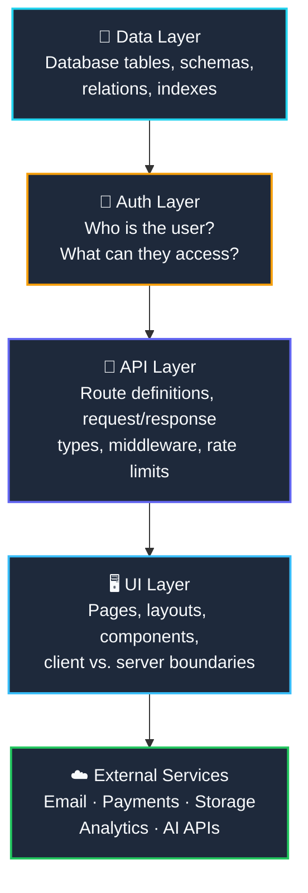
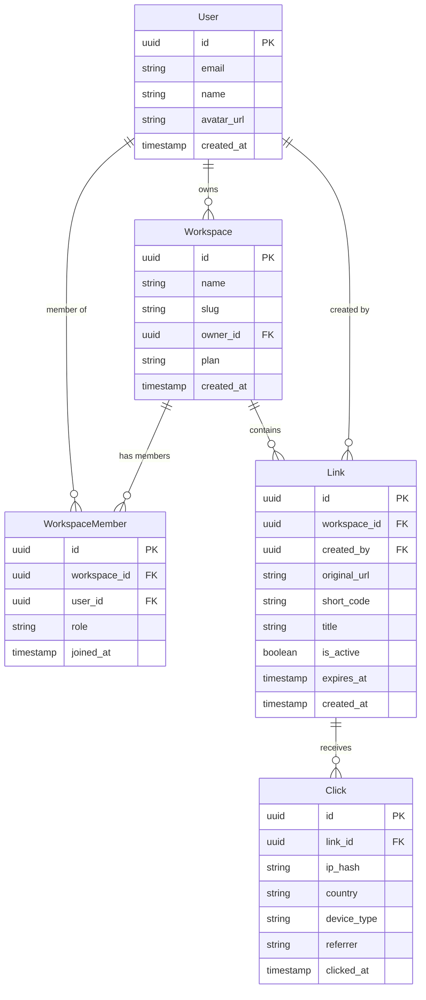
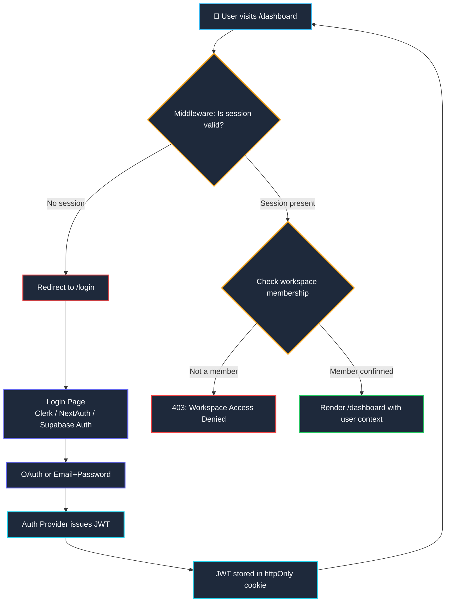

import { Callout } from 'fumadocs-ui/components/callout';
import { Steps, Step } from 'fumadocs-ui/components/steps';

<LessonIntro>
The agent has been coding for three hours. It has created 40 files across 12 directories. The feature works — mostly. But there's no single source of truth for the data model. The auth check is duplicated in three different middleware files with slightly different logic in each. The API routes follow three different naming conventions because each session the agent "decided" differently. The database schema has two tables that should be one and one table that should be three. None of this is the agent's fault. The agent had no architecture to follow, so it invented one — differently each time. System design before code is not optional ceremony with AI-assisted development. It is protective armor that keeps 3-hour coding sprints from becoming 3-day refactoring nightmares.
</LessonIntro>

<Concepts items={["Architecture Diagram", "ERD (Entity Relationship Diagram)", "Auth Flow Diagram", "Component Tree", "API Route Map", "Feature List", "System Boundaries", "Mermaid Diagrams"]} />

---

## What "Architecture" Means for a SaaS App

Architecture is just the answer to one question: **what are all the moving parts, and how do they connect?** For a SaaS app, that breaks down into five layers. You need a plan for each before you build any of them:



| Layer | Questions to Answer Before Building |
|-------|-------------------------------------|
| **Data** | What tables exist? What are the relations? What indexes do you need? |
| **Auth** | Who are the user roles? What can each role access? Where does auth state live? |
| **API** | What are all the routes? What HTTP methods? What returns what shape? |
| **UI** | What are all the pages? Which are server vs. client components? What layout wraps what? |
| **External** | Which third-party services? How do they integrate? What happens if one goes down? |

---

## Drawing the Data Model (ERD)

An Entity Relationship Diagram (ERD) is the single most important artifact you can give an agent before it writes any database code. Without it, the agent will create tables on-demand as features arise — and they will be inconsistent.

Here's an ERD for **Linky**, our example link-shortening SaaS app, written in Mermaid:



**Why these tables?**

- **User** — individual authenticated accounts. Separate from Workspace for multi-tenant support.
- **Workspace** — the billing and organizational unit. A user can own or belong to multiple workspaces.
- **WorkspaceMember** — the join table that handles multi-tenancy. `role` field controls permissions.
- **Link** — the core resource. `short_code` is the unique slug, `workspace_id` scopes it to a tenant.
- **Click** — the analytics record. `ip_hash` instead of raw IP for privacy. Never store raw IPs.

<LessonNote variant="warning" title="Draw the ERD Before Creating Any Schema File">
If you let an agent create your Prisma schema or Drizzle schema before you've drawn the ERD, it will make structural decisions you didn't ask for — and those decisions are expensive to change later. Ten minutes with mermaid erDiagram saves hours of migration pain.
</LessonNote>

---

## The Auth Flow Diagram

Authentication is the most common place for SaaS apps to have bugs, security holes, and duplicated logic. Draw the flow explicitly so your agent knows exactly where auth state is checked, by what mechanism, and what happens when it fails:



This diagram answers questions the agent would otherwise guess at:
- Where does auth checking happen? (Middleware — not in every page)
- What auth provider are we using? (Clerk in this example — one source of truth)
- Where is the JWT stored? (httpOnly cookie — not localStorage)
- What happens on workspace access failure? (403, not redirect to login)

---

## API Route Map

Document every API route before the agent writes any. This prevents the agent from inventing ad-hoc route names mid-session. For Linky:

| Method | Path | Auth Required | Description |
|--------|------|--------------|-------------|
| `POST` | `/api/auth/callback` | No | Auth provider OAuth callback handler |
| `GET` | `/api/workspaces` | Yes | List all workspaces for the current user |
| `POST` | `/api/workspaces` | Yes | Create a new workspace |
| `GET` | `/api/workspaces/:slug` | Yes (member) | Get workspace details by slug |
| `PATCH` | `/api/workspaces/:slug` | Yes (owner) | Update workspace name or settings |
| `DELETE` | `/api/workspaces/:slug` | Yes (owner) | Delete workspace and all links |
| `GET` | `/api/workspaces/:slug/links` | Yes (member) | List all links in a workspace |
| `POST` | `/api/workspaces/:slug/links` | Yes (member) | Create a new short link |
| `PATCH` | `/api/workspaces/:slug/links/:id` | Yes (creator/owner) | Update link title or active status |
| `DELETE` | `/api/workspaces/:slug/links/:id` | Yes (creator/owner) | Delete a link |
| `GET` | `/api/workspaces/:slug/links/:id/analytics` | Yes (member) | Get click analytics for a link |
| `GET` | `/:shortCode` | No | Public redirect endpoint (not under /api) |

**Naming conventions to call out explicitly in AGENTS.md:**
- All API routes live under `/api/`
- Workspace-scoped resources always include `/:slug/` in the path
- Use `:id` (UUID) for specific resources, `:slug` for workspace lookup
- The public redirect endpoint is a Next.js page route, not an API route

---

## Feature List: The Project Manifest

The feature list is the source of truth for **what the agent is allowed to build**. Without it, agents gold-plate features, add things you didn't ask for, or skip things you assumed were obvious. Write it as a markdown checklist in your AGENTS.md under `## Features`:

```mdx
## Features

### Core (MVP — Build These First)
- [x] User authentication via Clerk (email + Google OAuth)
- [x] Workspace creation and management
- [x] Invite team members to workspace (by email)
- [x] Create short links with custom or auto-generated short codes
- [x] Redirect short codes to original URLs
- [x] Track clicks with timestamp, country, device type, referrer
- [x] Link analytics dashboard (click count, trend chart, top countries)
- [x] Deactivate / delete links
- [x] Link expiration dates

### Stretch (Post-MVP — Do Not Build Until Core Is Shipped)
- [ ] Custom domains per workspace
- [ ] Link password protection
- [ ] QR code generation per link
- [ ] Bulk link import via CSV
- [ ] Zapier / webhook integration
- [ ] API key management for external access
```

The `[x]` and `[ ]` markers matter. They tell the agent: **build what is checked, do not touch what is unchecked.**

<Callout type="info">
Before you start any coding sprint, paste your feature list into Claude Opus or Claude Sonnet with this prompt: **"Review this feature list and architecture for a [app type]. Find gaps, missing edge cases, and any features that will be painful to build given the data model I've described. Ask me one clarifying question at a time."** This pre-flight review costs 2 minutes and regularly saves days.
</Callout>

---

## Composing Your Architecture Document

All of the above — ERD, auth flow, API routes, feature list — lives in your **AGENTS.md** under an `## Architecture` section. Here's how to assemble it:

<Steps>
<Step>
### Draw the ERD

Use Mermaid `erDiagram` syntax. Define every table, every column with type, every relation. Don't be precious — you can refine it. Getting it down is more important than getting it perfect.
</Step>

<Step>
### Map the Auth Flow

Use Mermaid `flowchart TD`. Trace the path from "unauthenticated user arrives" to "user is in the app, fully authorized." Note every decision point and what happens on failure.
</Step>

<Step>
### List All API Routes

Create the route table. Include method, path pattern, auth requirements, and a one-sentence description. This is the API contract your agent will implement.
</Step>

<Step>
### Sketch the Component Tree

You don't need a mermaid diagram for this — plain markdown headings work fine:

```mdx
## UI Structure

- `/` — Landing page (public)
- `/login` — Auth page (public)
- `/[slug]` — Workspace root (private layout)
  - `/[slug]/links` — Link list view
  - `/[slug]/links/[id]` — Link detail + analytics
  - `/[slug]/settings` — Workspace settings
  - `/[slug]/members` — Team management
- `/:shortCode` — Public redirect (no layout)
```
</Step>

<Step>
### Write the Feature List

Core features with `[x]`, stretch features with `[ ]`. Keep it honest — if you're not building it in this sprint, it goes in stretch.
</Step>

<Step>
### Paste Everything into AGENTS.md under `## Architecture`

Put it all in one place. The agent reads AGENTS.md at session start. Everything it needs to build correctly should be in that file — or referenced from it.
</Step>
</Steps>

---

<AnalogyCard name="Blueprint vs. Winging It">
  <div><strong>The Architect's Blueprint:</strong> Before a building is constructed, architects draw every floor plan, specify where every structural beam goes, map every electrical run, and plan every HVAC duct. The builders on-site don't design — they execute. The blueprint is the single source of truth. If the blueprint says load-bearing wall, nobody removes it without updating the blueprint first.</div>
  <div><strong>Coding Without Architecture:</strong> Letting an AI agent build your app without an architecture document is like telling construction workers "build a nice house" and letting each crew member decide independently where walls go. Each session, each new crew member (each new agent context) makes reasonable local decisions that collectively produce an incoherent structure. By day 10, nobody knows which walls are load-bearing.</div>
</AnalogyCard>

---

<LessonNote variant="myth" title="Myth: Architecture Is Only for Big Teams">
Solo developers working with AI agents need architecture documents *more* than large teams — not less. A large team has daily standups, code reviews, and institutional knowledge shared in real time. A solo developer's only persistent collaborator is an AI with no memory between sessions. The architecture document is the institutional knowledge. Without it, every session reinvents the system from scratch.
</LessonNote>

---

<Takeaway>
System architecture is the most important artifact you create before coding begins. Draw the ERD (mermaid `erDiagram`), map the auth flow (mermaid `flowchart`), table out all API routes, sketch the page structure, and write the feature checklist. Paste all of it into AGENTS.md under `## Architecture`. This single document transforms your AI agent from a creative guesser into a disciplined builder executing a known plan.
</Takeaway>

<TryIt>
**Your Mission:** For your project (or the Linky example), write the architecture document.

1. Create a `mermaid erDiagram` for your app's data model — minimum 3 tables with real columns and relations.
2. Create a `mermaid flowchart TD` for your auth flow — from unauthenticated user to protected page.
3. Write an API route table covering at minimum your core resource (CRUD) plus auth routes.
4. Write a feature checklist with at least 5 core features checked and 3 stretch features unchecked.
5. Paste all of it into `AGENTS.md` under a `## Architecture` heading and commit it.

Once it's committed, you're ready to write code with your agent.
</TryIt>
