import { Callout } from 'fumadocs-ui/components/callout';
import { Steps, Step } from 'fumadocs-ui/components/steps';

<LessonIntro>
If you cannot draw your system on a whiteboard using simple boxes and arrows, your AI agent cannot build it reliably. Modern full-stack architecture is not an emergent mystery — it is an explicit flow of state, network boundaries, and database mutations. Two rules govern AI-assisted architecture: first, pick technologies that are thoroughly saturated in LLM training data and that you know how to code-review; second, draw the end-to-end user journeys and system topologies before opening your code editor.
</LessonIntro>

<Concepts items={['Tech Stack Reviewability', 'System Diagrams', 'User Flow Mapping', 'State Boundary Delineation', 'Architecture Diagram Template']} />

---

## 1. The Reviewability Principle

When picking a framework, database, or library for an AI-built app, evaluate it across two axes:

1. **LLM Saturation**: Has the model seen millions of working examples, bug fixes, and edge cases for this tool? (e.g., Next.js, Postgres, Tailwind, FastAPI = High; Brand new niche framework = Low).
2. **Personal Reviewability**: Can *you* inspect the resulting diff and spot a memory leak, security vulnerability, or broken promise? 

If you pick a stack that the agent writes well but you cannot read, you have surrendered control over your system.

---

## 2. Drawing User Journeys First

Before drawing server nodes or cloud containers, map the user's step-by-step experience through the product:

```mermaid
flowchart LR
    A["Landing Page<br/>(Hero CTA)"] --> B["Auth Screen<br/>(Email / Google)"]
    B --> C["Onboarding<br/>(Create First Project)"]
    C --> D["Main Dashboard<br/>(Active Workspace)"]
    D --> E["Primary Action<br/>(Generate / Run / Share)"]
    E --> F["Success State<br/>(Telemetry & Output)"]

    style A fill:#0f172a,stroke:#38bdf8,stroke-width:2px,color:#f8fafc
    style B fill:#1e293b,stroke:#38bdf8,stroke-width:2px,color:#f8fafc
    style C fill:#1e293b,stroke:#a855f7,stroke-width:2px,color:#f3e8ff
    style D fill:#065f46,stroke:#10b981,stroke-width:2px,color:#d1fae5
    style E fill:#451a03,stroke:#f59e0b,stroke-width:2px,color:#fef3c7
    style F fill:#312e81,stroke:#6366f1,stroke-width:2px,color:#e0e7ff
```



---

## Reusable Artifact: The Architecture and Flow Template

Paste this Markdown template into your repository as `ARCHITECTURE.md` or into your system design brief:

```markdown
# System Architecture: [App Name]

## 1. System Topology
\`\`\`mermaid
flowchart TD
    Client["Client Browser (Next.js 15 / React 19)"]
    Edge["Edge Middleware (Auth Session & Routing)"]
    API["API Route Handlers (Server Actions / REST)"]
    DB[("PostgreSQL (Supabase / Neon via Drizzle ORM)")]
    Queue["Async Queue / Webhooks (Stripe / Inngest)"]
    Storage["Object Storage (S3 / Cloudflare R2 Presigned URLs)"]

    Client -->|HTTPS Request| Edge
    Edge -->|Verified JWT| API
    API -->|Typed SQL Queries| DB
    API -->|Trigger Background Task| Queue
    Client -->|Direct Upload via Presigned URL| Storage
\`\`\`

## 2. Core Entities and Data Relationships
- **User**: Primary identity (`id`, `email`, `created_at`).
- **Workspace**: Tenancy boundary (`id`, `name`, `owner_id`).
- **Resource**: Primary domain item (`id`, `workspace_id`, `status`, `payload`).

## 3. Data Flow Guarantees
- Client components never make direct unauthenticated SQL queries.
- Multi-tenant data queries always filter by `where workspace_id = current_workspace.id`.
- Long-running tasks (>10 seconds) must run asynchronously in background workers.
```

<Callout type="info">
Once drawn, feed your architecture diagram to Claude 3.7 Sonnet or OpenAI o3 with this prompt: *"Here is my architecture diagram. What edge cases, race conditions, or unhandled failure states exist in this flow?"*
</Callout>

---

<Takeaway>
A clear architectural diagram is an operational contract. When the agent understands data flows, network boundaries, and tenancy rules visually, it writes code that fits cleanly into your system on the first attempt.
</Takeaway>
