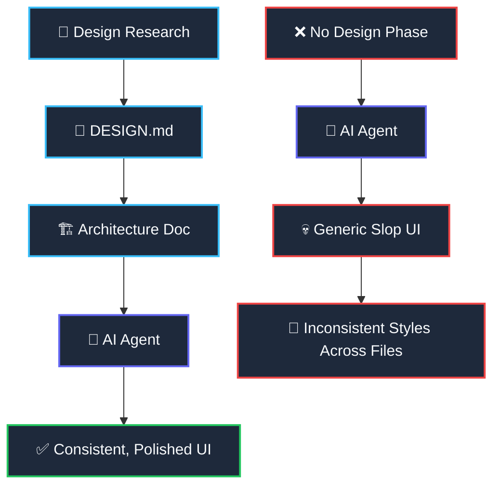

import { Cards, Card } from 'fumadocs-ui/components/card';

<LessonIntro>
Before a single line of code is written, the design phase determines whether your app will feel like a toy or a product. AI agents are powerful builders — but they are terrible designers. Left unconstrained, an agent defaults to generic layouts, mismatched spacing, and inconsistent color usage across files. Your job in this track is to create the design specification that constrains and guides the agent's output so that every component it generates feels intentional, cohesive, and yours.
</LessonIntro>

<Concepts items={["UI Inspiration Research", "Design System Extraction", "DESIGN.md File", "System Architecture", "Architecture Diagrams", "Feature Lists"]} />

---

## Why Design Before Code?

Most developers skip straight to building. They open Cursor or Claude Code, type "build me a SaaS dashboard," and let the agent run. Three hours later they have 40 files — and a UI that looks like it was assembled by committee.

The design phase creates a forcing function: a written contract between you and your agent about **what the product should look like and how it should be structured**.

The difference is a single artifact: **DESIGN.md**. It encodes your visual identity as machine-readable text that your agent reads at the start of every session. Pair it with an architecture document and your agent stops guessing — it builds.

---

## Lessons in this Track

<Cards>
  <Card
    title="Finding Design Inspiration"
    description="Use Mobbin, SaaSFrame, Godly, and Dribbble to collect real UI patterns for your landing page, auth flow, and dashboard — then extract what matters."
    href="/docs/code-with-ai/02-design-phase/01-finding-design-inspiration"
  />
  <Card
    title="Writing Your DESIGN.md"
    description="Create a machine-readable design system file with color tokens, typography scale, component rules, and forbidden patterns your agent must follow."
    href="/docs/code-with-ai/02-design-phase/02-writing-design-md"
  />
  <Card
    title="Architecture & System Design"
    description="Draw your ERD, auth flow, API route map, and component tree before the agent writes a single file. System design is protective armor."
    href="/docs/code-with-ai/02-design-phase/03-architecture-and-system-design"
  />
</Cards>

<Takeaway>
The design phase is not optional luxury work — it is the foundation that keeps your AI agent building a coherent product instead of a pile of disconnected components. Complete this track before you open any code editor.
</Takeaway>
