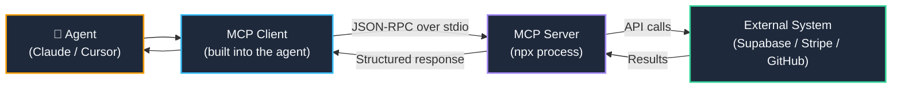

import { Callout } from 'fumadocs-ui/components/callout';
import { Steps, Step } from 'fumadocs-ui/components/steps';
import { Tabs, Tab } from 'fumadocs-ui/components/tabs';

<LessonIntro>
Picture this: you ask Claude to "add a new `clicks` table with RLS policies that only allow users to read their own data." Without an MCP server, Claude generates the SQL migration and says "run this yourself in the Supabase dashboard." With the Supabase MCP server connected, Claude reads your existing schema to avoid conflicts, generates the correct migration, applies it against your development database, then verifies the RLS policies are set correctly — all without you leaving the conversation. MCP is the bridge between AI agents and live systems. It's the difference between an agent that advises and an agent that acts.
</LessonIntro>

<Concepts items={["Model Context Protocol (MCP)", "MCP Servers", "Supabase MCP", "Stripe MCP", "Clerk MCP", "GitHub MCP", "mcp.json Config", "Stdio vs SSE Transport"]} />

---

## What MCP Is

Model Context Protocol (MCP) is an open standard released by Anthropic in late 2024, now adopted by OpenAI, Google, and the major IDE vendors. It defines a protocol for AI agents to call tools against real external systems — databases, APIs, file systems, browsers — in a structured, auditable way.



### MCP vs Function Calling

| | Function Calling | MCP |
|---|---|---|
| **Definition** | Functions defined inline per-conversation | Servers defined in a config file, available always |
| **Persistence** | One-time, per-prompt | Permanent, reusable across sessions |
| **Discovery** | You define what's available | The MCP server advertises its own tools |
| **Vendor lock-in** | Provider-specific | Open standard — works across Claude, GPT-4o, Gemini |
| **Transport** | HTTP | Stdio (local) or SSE (remote) |

MCP servers run as local `npx` processes (stdio transport) or remote HTTP services (SSE transport). For development, stdio is simpler and more secure — the MCP server process runs on your machine, never exposing credentials over a network.

---

## Supabase MCP Server

The Supabase MCP server is the most impactful MCP for a typical web app project. With it connected, your agent can:

- **Read your schema** — list tables, columns, types, and foreign key relationships
- **Run migrations** — generate and apply Drizzle or raw SQL migrations
- **Inspect RLS policies** — read and validate your Row Level Security configuration
- **Generate TypeScript types** — pull types directly from your live schema
- **Query data** — run SELECT queries against development data for debugging

### Configuration

Add this to your MCP config file:

<Tabs items={["Cursor (~/.cursor/mcp.json)", "Claude Code (~/.claude/mcp.json)"]}>
<Tab value="Cursor (~/.cursor/mcp.json)">
```json
{
  "mcpServers": {
    "supabase": {
      "command": "npx",
      "args": [
        "-y",
        "@supabase/mcp-server-supabase",
        "--supabase-url",
        "YOUR_SUPABASE_PROJECT_URL",
        "--service-role-key",
        "YOUR_SERVICE_ROLE_KEY"
      ]
    }
  }
}
```
</Tab>
<Tab value="Claude Code (~/.claude/mcp.json)">
```json
{
  "mcpServers": {
    "supabase": {
      "command": "npx",
      "args": [
        "-y",
        "@supabase/mcp-server-supabase",
        "--supabase-url",
        "YOUR_SUPABASE_PROJECT_URL",
        "--service-role-key",
        "YOUR_SERVICE_ROLE_KEY"
      ]
    }
  }
}
```
</Tab>
</Tabs>

### Example Prompts

Once the MCP server is connected, these prompts work end-to-end:

```
"List all tables in my database and describe their columns and relationships."

"Add a `custom_domains` table with columns: id (uuid), workspace_id (uuid FK), domain (text unique), verified_at (timestamptz nullable). Add an RLS policy that only allows workspace members to read their own domains."

"My `clicks` table is missing an index on `link_id`. Add a migration to create it."

"Generate TypeScript types from my current schema and write them to src/db/types.ts."
```

---

## Stripe MCP Server

The Stripe MCP server gives your agent read access to your Stripe account — customers, subscriptions, payment intents, invoices, and charges. Invaluable for debugging billing issues without opening the Stripe dashboard.

### Configuration

```json
{
  "stripe": {
    "command": "npx",
    "args": [
      "-y",
      "@stripe/mcp-server-stripe"
    ],
    "env": {
      "STRIPE_API_KEY": "sk_test_YOUR_KEY_HERE"
    }
  }
}
```

### Example Prompts

```
"List all active subscriptions and show me which plan each customer is on."

"Show me all failed payment attempts in the last 7 days."

"Create a test payment intent for $29 USD for customer cus_abc123."

"Which customers are on the free plan and have been active for more than 30 days? 
 (Good candidates for an upgrade prompt)"
```

<LessonNote variant="warning" title="Always use test mode keys in development">
Configure your Stripe MCP with `sk_test_*` keys during development. Never put live `sk_live_*` keys in your local MCP config. If you accidentally ask the agent to "cancel all subscriptions," you want that to be a test operation.
</LessonNote>

---

## GitHub MCP Server

The GitHub MCP server gives your agent access to your repositories — reading file content, creating issues, opening PRs, listing commits, and reviewing diffs.

### Configuration

```json
{
  "github": {
    "command": "npx",
    "args": [
      "-y",
      "@modelcontextprotocol/server-github"
    ],
    "env": {
      "GITHUB_PERSONAL_ACCESS_TOKEN": "ghp_YOUR_TOKEN_HERE"
    }
  }
}
```

### Example Prompts

```
"Create a GitHub issue titled 'Branded domains: database migration' with a detailed 
 description of the schema changes we just designed."

"Open a draft PR from the current branch to main with a summary of all changes made 
 in this session."

"Read the contents of src/db/schema/links.ts from the main branch."

"List the last 10 commits on the branded-domains branch."
```

---

## Building Your Complete mcp.json

Here's a production-ready `mcp.json` that combines all three servers. Store secrets in environment variables — never hardcode them in the JSON file.

```json
{
  "mcpServers": {
    "supabase": {
      "command": "npx",
      "args": [
        "-y",
        "@supabase/mcp-server-supabase",
        "--supabase-url",
        "${SUPABASE_URL}",
        "--service-role-key",
        "${SUPABASE_SERVICE_ROLE_KEY}"
      ]
    },
    "stripe": {
      "command": "npx",
      "args": [
        "-y",
        "@stripe/mcp-server-stripe"
      ],
      "env": {
        "STRIPE_API_KEY": "${STRIPE_TEST_SECRET_KEY}"
      }
    },
    "github": {
      "command": "npx",
      "args": [
        "-y",
        "@modelcontextprotocol/server-github"
      ],
      "env": {
        "GITHUB_PERSONAL_ACCESS_TOKEN": "${GITHUB_PAT}"
      }
    }
  }
}
```

Set the environment variables in your shell profile (`.zshrc`, `.bashrc`, or Windows environment variables):

```bash
export SUPABASE_URL="https://yourproject.supabase.co"
export SUPABASE_SERVICE_ROLE_KEY="eyJ..."
export STRIPE_TEST_SECRET_KEY="sk_test_..."
export GITHUB_PAT="ghp_..."
```

<AnalogyCard name="The Office Keycard System">
  <div><strong>The Office:</strong> An employee has a keycard that grants access to specific rooms: the server room, the finance office, the design lab. Each door they open is logged. They can only access what their role requires.</div>
  <div><strong>MCP Servers:</strong> Each MCP server is a keycard for a specific system. The agent can only do what the MCP server exposes as tools. Every tool call is logged and visible to you before it executes (in Cursor's MCP UI). You grant access per-service, per-key-scope.</div>
</AnalogyCard>

---

## MCP Security Rules

MCP gives your agent real power over real systems. Follow these three rules without exception.

<Callout type="warn">
**Rule 1 — Never use production credentials in MCP during development.** Always point MCP servers at a dedicated development project. Use `sk_test_*` for Stripe, a separate non-production Supabase project for development, and a fine-grained GitHub PAT scoped only to the repositories you need. If something goes wrong in a dev session (and it will), the blast radius is zero.
</Callout>

**Rule 2 — Set proper Supabase RLS policies before connecting MCP.**

Even with a service-role key (which bypasses RLS), design your tables with RLS in mind from day one. The service-role key in your MCP config is privileged — it's the equivalent of a DBA account. Use it for migrations and schema inspection only. For app-level queries in production, always use the anon key (which respects RLS).

**Rule 3 — Review MCP tool calls before accepting them.**

Cursor and Claude Code both show you the MCP tool call the agent wants to make before executing it. Read them. An agent that says "I'll run a migration to add the `custom_domains` table" should be reviewed before you click Accept. Especially for destructive operations (DROP TABLE, DELETE FROM), always read the full SQL before accepting.

```
# Cursor MCP approval dialog shows:
Tool: supabase_execute_sql
Query: ALTER TABLE links DROP COLUMN short_code;

# ← Read this before clicking Accept. That's a destructive migration.
```

---

## Connecting MCPs in Cursor

<Steps>
<Step>
**Open Cursor Settings**

Press `Cmd+Shift+P` (macOS) or `Ctrl+Shift+P` (Windows) and search for **"Cursor Settings"**. Navigate to the **MCP** tab in the left sidebar.
</Step>
<Step>
**Add or edit your mcp.json**

Click **"Edit MCP Settings"** to open `~/.cursor/mcp.json` in the editor. Paste in your server configurations from the examples above.
</Step>
<Step>
**Set your environment variables**

Ensure your shell environment has the required variables exported (`SUPABASE_URL`, etc.). Cursor inherits your shell environment, so variables set in `.zshrc` or `.bashrc` will be available.
</Step>
<Step>
**Restart Cursor**

MCP servers are initialized at startup. Fully quit and reopen Cursor to load the new configuration.
</Step>
<Step>
**Verify the connection**

In a new Cursor chat, type: `"List all MCP tools available to you."` The agent should enumerate tools like `supabase_list_tables`, `stripe_list_customers`, `github_list_repos`. If it can't list them, check the Cursor MCP panel for error logs.
</Step>
</Steps>

---

<Takeaway>
MCP servers transform your agent from a code generator into an active collaborator with live access to your systems. The Supabase MCP alone eliminates a huge amount of copy-paste friction around schema design and migrations. Set up your MCP config once, keep credentials in environment variables, and your agent can read your database, query Stripe, and file GitHub issues — all from a single conversation.
</Takeaway>

<TryIt>
**Connect the Supabase MCP server to Cursor:**

1. Add the Supabase MCP config to `~/.cursor/mcp.json` using your development project credentials.
2. Restart Cursor and open a new chat.
3. Ask the agent: **"List all tables in my database and describe their columns, types, and any foreign key relationships."**
4. Follow up with: **"Are there any tables missing RLS policies? If so, suggest the policies I should add."**
5. Review what the agent reads — you now have a live bridge between your agent and your database.
</TryIt>
