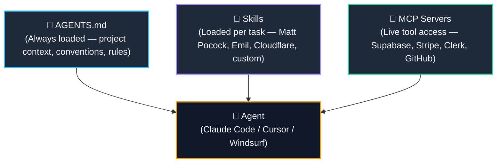

import { Cards, Card } from 'fumadocs-ui/components/card';

<LessonIntro>
An AI agent without proper setup is like hiring a brilliant contractor who doesn't know your building codes, your aesthetic preferences, or where the electrical panel is. In the first 30 minutes, they will build the wrong thing in the wrong place. AGENTS.md, skills, and MCPs are how you brief your contractor — before a single line of code is touched. This track is about turning a raw, general-purpose agent into a sharp, context-aware collaborator that understands your project as well as you do.
</LessonIntro>

<Concepts items={["AGENTS.md", "Skills", "MCP Servers", "Context Priming", "Matt Pocock Skills", "Emil Design Skills", "Supabase MCP", "Clerk MCP"]} />

---

## The Agent Context Stack

Every well-configured agent session is built on three layers. Miss any one of them and you will feel the friction — in wrong conventions, stale assumptions, and dead-end code that doesn't connect to your actual backend.

| Layer | What It Does | How Often Updated |
|---|---|---|
| **AGENTS.md** | Standing brief — architecture, conventions, do/don't rules | Per-project, updated as conventions evolve |
| **Skills** | Task-specific playbooks — how to do a particular type of work | Per-skill, community-maintained |
| **MCP Servers** | Live connections to real systems — databases, APIs, repos | Per-environment, configured once |

---

## Lessons in this Track

<Cards>
  <Card
    title="01. Context Files: The Standing Brief"
    description="PRD, glossary, tech-stack declaration, concise AGENTS.md, and DESIGN.md. Use 'grill me' sessions to eliminate hidden assumptions."
    href="/docs/code-with-ai/03-agent-setup/01-context-files"
  />
  <Card
    title="02. Writing Your AGENTS.md"
    description="The standing brief every agent reads before every session. Project context, conventions, and explicit do/don't rules."
    href="/docs/code-with-ai/03-agent-setup/02-writing-agents-md"
  />
  <Card
    title="03. Installing Skills"
    description="Matt Pocock skills, Emil Kowalski design engineering skills, Cloudflare security audits, and writing your own custom skills."
    href="/docs/code-with-ai/03-agent-setup/03-installing-skills"
  />
  <Card
    title="04. Connecting MCP Servers"
    description="Give your agent live access to Supabase, Stripe, Clerk, and GitHub via the Model Context Protocol."
    href="/docs/code-with-ai/03-agent-setup/04-connecting-mcp-servers"
  />
</Cards>

<Takeaway>
Agent setup is a one-time investment that pays back on every single session. Spend 2 hours getting AGENTS.md, skills, and MCPs right at the start of a project, and your agent will be productive from minute one — every time you open a new session.
</Takeaway>
