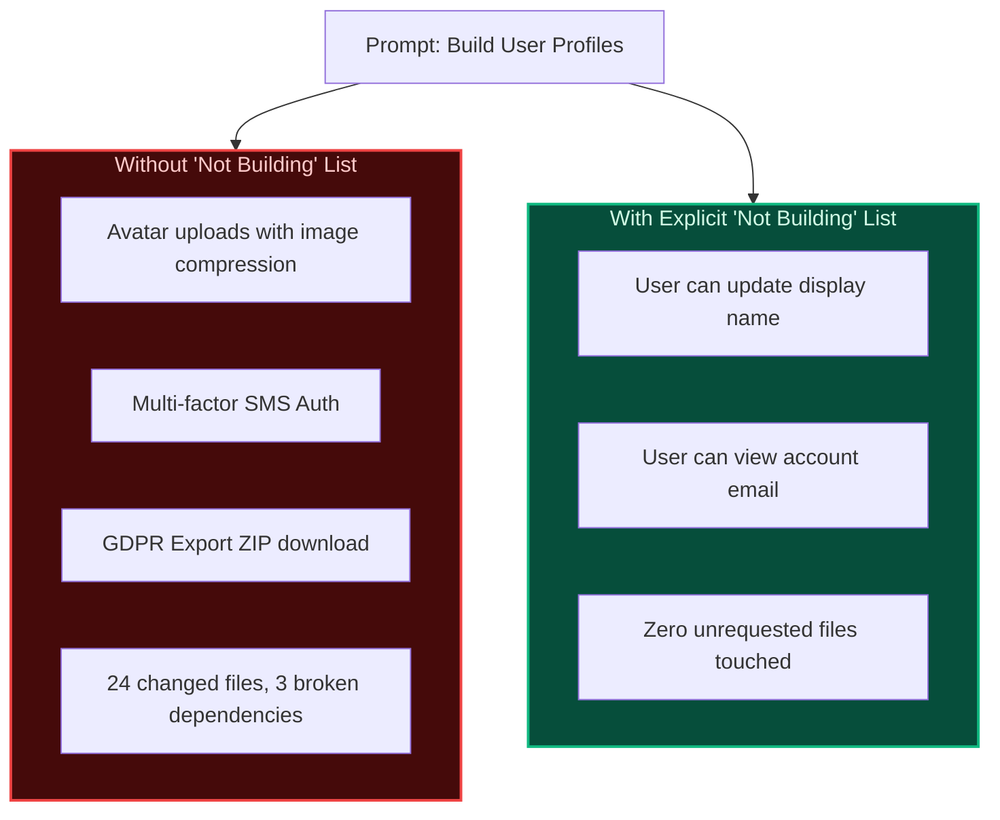

import { Callout } from 'fumadocs-ui/components/callout';
import { Steps, Step } from 'fumadocs-ui/components/steps';

<LessonIntro>
In traditional software development, scope creep is an incremental leak caused by team debate over months. In AI-assisted software development, scope creep is an explosion: an autonomous agent can generate sixteen unrequested features, four new database entities, and an entire notification subsystem in under ten minutes if boundaries are left unstated. The secret to shipping an AI product is not just declaring what you *are* building — it is writing down an unambiguous, aggressive list of what you are *not* building.
</LessonIntro>

<Concepts items={['V1 Scope Definition', 'The Explicit Not-List', 'Feature Creep Prevention', 'One-Page Product Definition Artifact', 'Complexity Calibration']} />

---

## The Power of the Negative Constraint

LLMs are completion engines conditioned on vast datasets of enterprise software. When you instruct an agent:
> *"Build user authentication and profile management."*

The model's statistical intuition fills in what "profile management" usually looks like in enterprise code: avatar uploading, crop utilities, two-factor authentication via SMS, audit logs, dark mode preferences, and GDPR data export.

To keep the agent on track, negative constraints are twice as effective as positive ones:



---

## Reusable Artifact: The One-Page Product Definition

Before touching code, draft this single-page definition document and store it in your repository root as `PRODUCT.md` or append it to `AGENTS.md`:

```markdown
# Product Definition: [App Name]

## 1. One-Sentence Elevator Pitch
[App Name] enables [target persona] to accomplish [core value] without [biggest friction point].

## 2. The Core Problem
- What is broken today?
- Why do existing solutions fail?

## 3. V1 Features (Must-Have Only)
1. **[Feature 1]**: [User can do X and receive Y result]
2. **[Feature 2]**: [User can do X and receive Y result]
3. **[Feature 3]**: [User can do X and receive Y result]

## 4. The "NOT BUILDING" List (V1 Explicit Exclusions)
- ❌ NO custom avatar uploading (use default gravatar/initials)
- ❌ NO social logins beyond Google/Email
- ❌ NO team workspaces or multi-tenant role management (single-user only)
- ❌ NO dark mode toggle (hardcode single clean theme)
- ❌ NO mobile app or native packaging (responsive web only)
- ❌ NO email newsletter integration
- ❌ NO custom domain mapping

## 5. Success Metric (Proof of Life)
A user can log in, execute [core action], and view the outcome in under 60 seconds.
```

<Callout type="info">
Whenever your agent proposes an architectural refactor or a new package dependency, check it against Section 4. If it serves an excluded feature, reject it immediately.
</Callout>

---

<Takeaway>
The best way to ship an AI product is to build the smallest possible slice that solves a real problem. Your "Not Building" list is the shield that preserves your project's velocity.
</Takeaway>
