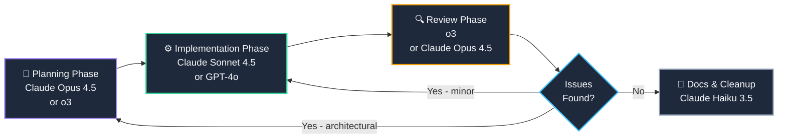

<LessonIntro>
A developer is building a new authentication system. Under deadline pressure, they reach for GPT-4o-mini — it's fast, it's cheap, and they've used it successfully for a dozen smaller tasks. It produces a complete auth flow in minutes: JWT issuance, refresh token rotation, protected route middleware. It looks right. It reads right. They ship it. Three days later, production logs start showing phantom sessions. The refresh token endpoint never invalidates old tokens on rotation — a textbook vulnerability that any senior engineer would have caught in a five-minute review. A focused planning session with Claude Opus 4.5 would have cost $0.40 and twenty minutes. The debugging cost three days and a security incident post-mortem. **Model selection is risk management.** The cheapest option is never the cheapest option when the reasoning depth is wrong.
</LessonIntro>

<Concepts items={["Claude Opus 4.5", "Claude Sonnet 4.5", "Claude Haiku 3.5", "OpenAI o3", "o4-mini", "Gemini 2.5 Pro", "GPT-4o", "Capability Tiers", "Cost-Performance Matrix"]} />

---

## The Three Task Tiers

Before you pick a model, classify your task. Every task you'll ever hand to an LLM fits into one of three tiers based on the reasoning depth it demands.

| Tier | Label | What belongs here | Failure mode if under-powered |
|------|-------|-------------------|-------------------------------|
| **1** | Deep Reasoning | System architecture, security design, complex refactors, API contract design, debugging mysterious prod issues | Plausible-but-wrong output with subtle logic errors you won't catch until pain |
| **2** | Standard Implementation | Feature coding, CRUD endpoints, SQL queries, unit test generation, component building | Occasional logic slip, usually caught in review |
| **3** | Repetitive Tasks | Docstring generation, code formatting guidance, changelog entries, renaming, quick one-liner fixes | Minimal — worst case you spend 30 seconds correcting |

The economic insight: **Tier 1 failures are catastrophically expensive. Tier 3 failures are nearly free.** Spend your compute budget where the risk is.

---

## Model Profiles

### Claude Opus 4.5
Anthropic's flagship reasoning model. Opus 4.5 excels at tasks that require holding large amounts of context in tension simultaneously — multi-file refactors, security threat modeling, architecture decisions with complex tradeoffs. It's notably honest about uncertainty and will push back on bad premises in your prompt, which is exactly what you want when designing systems. It is slower and more expensive than Sonnet, which is the correct price to pay for Tier 1 work. Use it for planning sessions before you write a single line of code.

### Claude Sonnet 4.5
The workhorse. Sonnet 4.5 hits the sweet spot for the majority of day-to-day implementation tasks: building features, writing tests, generating SQL, explaining code, producing first drafts of components. It's fast enough to iterate with in real time and accurate enough that review catches the rare slip. In practice, 70–80% of your AI coding interactions should happen here.

### Claude Haiku 3.5
Haiku is purpose-built for speed and cost at scale. It's the right choice for tasks you'll run dozens or hundreds of times in a session: generating docstrings across a codebase, filling in boilerplate, quick formatting questions, or any task where "pretty good and instant" beats "excellent but slow." Don't use it for anything where a subtle error compounds.

### OpenAI o3
o3 is a chain-of-thought reasoning model with exceptional performance on code logic, algorithmic challenges, and formal verification tasks. It's particularly strong at reading code and finding non-obvious bugs — the kind of review that catches the JWT vulnerability above. It "thinks" before responding, so it's slower, but the output on hard reasoning tasks is genuinely different in character from non-reasoning models. Excellent for code review and algorithmic design sessions.

### o4-mini
o4-mini gives you most of o3's reasoning capability at significantly lower cost and latency. It's a compelling default for Tier 2 tasks where you want slightly above-average reasoning without paying full o3 prices. Strong at math, algorithms, and structured code generation with moderate context.

### Gemini 2.5 Pro
Gemini 2.5 Pro has the largest effective context window in the field, making it uniquely positioned for tasks that require understanding an entire large codebase at once — think "explain this 40-file monorepo" or "trace this bug across ten modules." Its reasoning on complex tasks is competitive with Opus and o3. It's the go-to when context volume is the binding constraint, not reasoning depth.

---

## The Model Selection Matrix

Route each task type to the appropriate model. This matrix is a starting point — adjust based on your actual cost constraints and context needs.

| Task Type | Recommended Model | Runner-Up | Why |
|-----------|------------------|-----------|-----|
| System architecture / design | Claude Opus 4.5 | o3 | Needs deep reasoning + honest pushback on bad ideas |
| Security review / threat modeling | o3 | Claude Opus 4.5 | o3's chain-of-thought catches subtle logic gaps |
| Complex multi-file refactor | Claude Opus 4.5 | Gemini 2.5 Pro | Needs to hold the whole system in mind simultaneously |
| Feature implementation (new endpoint, component) | Claude Sonnet 4.5 | GPT-4o | Fast, accurate, iteratable |
| Unit / integration test generation | Claude Sonnet 4.5 | o4-mini | High output volume + needs to understand edge cases |
| SQL query writing & optimization | o4-mini | Claude Sonnet 4.5 | Strong structured reasoning at lower cost |
| Bug investigation across large codebase | Gemini 2.5 Pro | Claude Opus 4.5 | Context window is the primary constraint |
| Code review / PR analysis | o3 | Claude Opus 4.5 | Reasoning models find non-obvious issues |
| Docstring / comment generation | Claude Haiku 3.5 | GPT-4o-mini | Pure throughput, minimal reasoning needed |
| Quick one-liner / syntax question | Claude Haiku 3.5 | GPT-4o-mini | Fast lookup, not worth full model overhead |

---

## Multi-Model Workflows

The most effective teams don't pick one model and stick to it. They route tasks through a pipeline where each model does what it's best at.

The key insight: **review with a stronger model than you implemented with.** If you built something with Sonnet, review it with o3 or Opus. You want the reviewer to be harder to fool than the implementer.

---

<LessonNote variant="myth" title="Myth: The most expensive model is always the best choice">
This is the most common mistake beginners make. Expensive models have higher reasoning ceilings, but they don't magically produce better output on tasks that don't require deep reasoning. Asking Claude Opus to generate a docstring produces a marginally better docstring than Haiku — at 10–20× the cost and 3× the latency. Worse, filling your context window with low-value Opus calls means you have less budget for the planning sessions where it genuinely matters. Optimize total project cost, not per-call prestige.
</LessonNote>

---

<AnalogyCard name="The Law Firm Model">
  
<strong>The Law Firm:</strong> A senior partner (Opus) handles strategy, contract structure, and the cases that set precedent. Mid-level associates (Sonnet) do the billable implementation work. Paralegals (Haiku) handle document prep, formatting, and repetitive filings. The firm doesn't have the senior partner review every paralegal task — that would bankrupt the client and bore the partner.

  
<strong>Your AI Workflow:</strong> Opus owns architectural decisions and security reviews. Sonnet owns feature implementation. Haiku handles docstrings, quick fixes, and boilerplate generation. Route by reasoning depth required, not by habit or prestige.

</AnalogyCard>

---

<Takeaway>
Classify every task into one of three tiers before choosing a model. Tier 1 (deep reasoning) deserves Opus or o3. Tier 2 (standard implementation) belongs to Sonnet or GPT-4o. Tier 3 (repetitive) is Haiku territory. Review with a stronger model than you implemented with. The most expensive session of your day should be the planning session — everything downstream is cheaper because the plan is solid.
</Takeaway>

<TryIt>
Take your current project's next planned feature. Before writing any code, open a session with Claude Opus 4.5 or o3 and describe the feature requirements, constraints, and any security considerations. Ask it to identify the three most likely failure modes in your proposed approach. Then switch to Sonnet for implementation. Compare the output quality and the confidence you have shipping it versus your usual workflow.
</TryIt>
