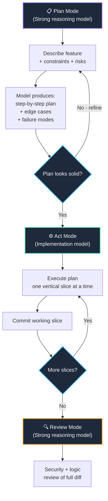

import { Callout } from 'fumadocs-ui/components/callout';
import { Steps, Step } from 'fumadocs-ui/components/steps';
import { Tabs, Tab } from 'fumadocs-ui/components/tabs';

<LessonIntro>
Two developers sit down to implement the same JWT refresh flow. The first types: *"write me a JWT refresh token implementation in Next.js"* and pastes the output directly into their codebase. The second types: *"I'm building a Next.js 14 app with the App Router. Auth is handled by a custom JWT layer — access tokens expire in 15 minutes, refresh tokens in 7 days and rotate on use. I need a server action that validates the current refresh token, issues a new access token, rotates the refresh token (invalidating the old one in Redis), and sets both as httpOnly cookies. The old refresh token must be blacklisted in Redis with a TTL matching its remaining validity. Security constraint: reject any refresh attempt if the token has already been rotated (replay protection)."* The first developer gets a plausible starting point full of holes. The second gets a production-ready implementation that anticipates the exact failure modes that burned our hypothetical developer three days ago. The difference isn't intelligence — it's context.
</LessonIntro>

<Concepts items={["Plan & Act Workflow", "Context Priming", "Task Decomposition", "The Smart Zone", "Git Worktrees", "Vertical Slices", "Prompt Templates"]} />

---

## The Plan & Act Workflow

Don't start coding. Start planning. The Plan & Act workflow separates the reasoning phase from the execution phase, using different models for each.



The loop is deliberate: **plan → commit → plan → commit**. Each commit gives you a rollback point. Each planning session resets context before the next slice. You never accumulate a 4,000-line diff that's impossible to review.

---

## Context Priming

The single highest-leverage improvement to your prompt quality costs zero tokens of extra thought — it just requires being explicit about what the model doesn't know. Every coding prompt should be primed with five pieces of context before you state the task.

<Steps>
  <Step>
    **Stack & versions** — Be specific. "Next.js 14.2 with App Router, TypeScript 5.4, Prisma 5.x, PostgreSQL 15, Redis 7 via `ioredis`." Not "Next.js with a database."
  </Step>
  <Step>
    **Relevant existing code** — Paste the interfaces, types, and existing functions the model needs to stay compatible with. Don't make it guess your `User` type.
  </Step>
  <Step>
    **Constraints & non-goals** — "This must work in a Next.js server action, not an API route. Do not use `jsonwebtoken` — we use `jose`. Do not change the database schema."
  </Step>
  <Step>
    **Security & compliance requirements** — If there are requirements the model might optimize away ("httpOnly cookies only, no localStorage"), state them explicitly. Models optimize for working code, not secure code by default.
  </Step>
  <Step>
    **The acceptance criteria** — How will you know it's done? "The refresh endpoint should return 401 if the token has been rotated already (replay detection), and set two new httpOnly cookies."
  </Step>
</Steps>

### Primed vs Bare Prompt Example

<Tabs items={["❌ Bare Prompt", "✅ Primed Prompt"]}>
  <Tab value="❌ Bare Prompt">
```typescript
// What you typed:
"Write a JWT refresh token endpoint"

// What the model assumes:
// - Express? Next.js? Fastify? It guesses.
// - jsonwebtoken library? Probably.
// - Stores tokens where? Also guesses.
// - Replay protection? Not mentioned, so probably skipped.
// - Cookie flags? Probably missing httpOnly + Secure.
```
  </Tab>
  <Tab value="✅ Primed Prompt">
```typescript
// Stack: Next.js 14.2 App Router, TypeScript 5.4, jose 5.x for JWT,
// Redis 7 via ioredis for token storage, Prisma for user lookups.
//
// Existing types (do not change):
// type Session = { userId: string; sessionId: string }
// type Tokens = { accessToken: string; refreshToken: string }
//
// Constraints:
// - Server Action only (not API Route)
// - httpOnly + Secure + SameSite=Strict cookies
// - Refresh tokens rotate on use; old token blacklisted in Redis
//   with TTL = remaining validity of the old token
// - Return 401 if token already rotated (replay protection)
// - Access token TTL: 15min. Refresh token TTL: 7 days.
//
// Task: Implement the refreshSession() server action.
// Acceptance: Passes replay detection, rotates tokens atomically,
// sets both cookies, returns the new Session object.
```
  </Tab>
</Tabs>

---

## The Smart Zone

Matt Pocock coined "the Smart Zone" — the idea that models produce their best output when the task is **neither too easy nor too hard** relative to the context you've given them. 

<Callout type="warn">
**Beware context window overflow.** Pasting your entire codebase into a prompt doesn't give the model "more context" — it gives it a haystack to search for the needle while degrading output quality. Models lose coherence when context approaches the limit. Keep your context **tight and relevant**: the types the function touches, the interfaces it must satisfy, and nothing else.
</Callout>

The Smart Zone for a coding task looks like this:

| Zone | Context Size | Task Scope | Output Quality |
|------|-------------|------------|----------------|
| Under-primed | Minimal | Vague | Guesses wrong, generic output |
| **Smart Zone** | **Precise + relevant** | **Single clear task** | **Production-quality, idiomatic** |
| Over-stuffed | Entire codebase | Vague or multi-task | Loses thread, contradicts itself |

The goal is surgical context: enough to be unambiguous, small enough to stay coherent.

---

## Task Decomposition

Never ask a model to implement an entire feature in one prompt. Decompose into **vertical slices** — thin cuts through the full stack that each deliver a testable, shippable increment.

<AnalogyCard name="The Vertical Slice vs. The Horizontal Layer">
  <div><strong>Horizontal (wrong):</strong> "First write all the database models. Then write all the service layer. Then write all the API routes. Then write all the frontend components." You never have anything working until the very end, and debugging spans all layers simultaneously.</div>
  <div><strong>Vertical (right):</strong> "Implement user registration end-to-end: DB schema + server action + form component. Then implement login. Then implement refresh. Then implement logout." Each slice is independently testable. Each slice gets a commit. Each slice gives you a rollback point.</div>
</AnalogyCard>

### Decomposing a Feature: Auth System Example

```
Feature: JWT Authentication System

Slice 1: DB schema + Prisma migration (User model, sessions table)
Slice 2: Password hashing utility + unit tests
Slice 3: Registration server action + form
Slice 4: Login server action + form
Slice 5: JWT issuance + cookie-setting utility
Slice 6: Session validation middleware
Slice 7: Refresh token rotation + replay protection
Slice 8: Logout + token invalidation
```

Each slice gets its own planning prompt, its own implementation prompt, and its own commit before you move to the next one.

---

## Prompt Templates

Five templates you can copy, fill in the `[brackets]`, and use immediately.

<Tabs items={["Feature", "Bug Fix", "Code Review", "Architecture", "Refactor"]}>
  <Tab value="Feature">
```
Stack: [your stack + versions]
Relevant types/interfaces:
[paste the types the feature touches]

Constraints:
- [constraint 1]
- [constraint 2]

Task: Implement [feature name].
This is slice [N] of [total]. Previous slices have delivered: [brief summary].

Acceptance criteria:
- [criterion 1]
- [criterion 2]

Do not change any existing interfaces. Do not add new dependencies without flagging them.
```
  </Tab>
  <Tab value="Bug Fix">
```
Stack: [your stack + versions]

Bug description: [what is happening vs. what should happen]

Reproduction steps:
1. [step 1]
2. [step 2]

Relevant code (do not change anything outside these files without asking):
[paste the specific function/file where the bug lives]

Error output / stack trace:
[paste the exact error]

Hypothesis (if any): [your current theory, or "none"]

Task: Identify the root cause and provide a minimal fix. Explain why it works.
```
  </Tab>
  <Tab value="Code Review">
```
Stack: [your stack + versions]

Review the following code for:
1. Security vulnerabilities (especially around [auth/input/data handling])
2. Logic errors or edge cases that aren't handled
3. Performance issues
4. Deviations from [your framework]'s idiomatic patterns

Be specific: for each issue, quote the exact line, name the problem category,
explain the risk, and suggest a fix.

Code:
[paste the code]
```
  </Tab>
  <Tab value="Architecture">
```
I'm designing [system/feature name] for a [type of app].

Requirements:
- [req 1]
- [req 2]

Scale/constraints: [expected load, team size, timeline, existing stack]

Security requirements: [list them explicitly]

Questions:
1. What are the 3 most likely failure modes in the approach I'm about to describe?
2. What are the tradeoffs between [option A] and [option B]?
3. What would you do differently?

My proposed approach: [describe it]
```
  </Tab>
  <Tab value="Refactor">
```
Stack: [your stack + versions]

Refactor goal: [e.g., "extract business logic from route handlers into service layer"]

Constraints:
- Do not change any public API signatures or function interfaces
- Do not change database schema
- All existing tests must continue to pass

Current code:
[paste the code to refactor]

Deliver the refactored version with inline comments explaining the key structural decisions.
If any current tests would need updating, flag them but don't change them.
```
  </Tab>
</Tabs>

---

## Git as Your Safety Net

Vertical slices only work if you commit aggressively. The model is your pair programmer — not your version control system. Treat every working slice like a milestone.

```bash
# Before every AI-assisted work session: create a branch
git checkout -b feat/auth-jwt-refresh

# After each working vertical slice: commit immediately
git add -p                         # stage only what you reviewed
git commit -m "feat(auth): slice 3 - JWT issuance + cookie utility"

# If a slice goes wrong: roll back cleanly
git checkout -- .                  # discard uncommitted AI changes
# or
git reset --hard HEAD              # back to last known good state

# For parallel AI experiments (git worktrees)
git worktree add ../auth-experiment feat/auth-experiment
# Run a risky AI session in the worktree — main checkout untouched
```

<LessonNote variant="warning" title="Never let an AI session run for 30+ minutes without committing">
The longer a session runs without a commit, the more context drift accumulates and the harder it is to isolate what changed. If the model starts contradicting its earlier output or producing increasingly weird code, you've hit context saturation. Commit what works, start a fresh session with tight context for the next slice.
</LessonNote>

---

<Takeaway>
The Plan & Act workflow separates reasoning from execution. Context priming — stack, types, constraints, security requirements, acceptance criteria — is the single highest-leverage change you can make to prompt quality. Keep context surgical (Smart Zone), decompose into vertical slices, commit after each one, and use the five prompt templates as starting points. The model doesn't get smarter when you give it more vague context. It gets smarter when you give it less but more precise context.
</Takeaway>

<TryIt>
Take the Feature prompt template above and fill it out completely for the next feature on your backlog. Don't skip any section, even if it feels obvious. Run it against Claude Sonnet 4.5 and compare the output against a prompt you'd normally write. Note specifically: does it catch any edge cases you didn't mention? Does it respect your constraints? If not, identify which section of the template was incomplete and refine it.
</TryIt>
