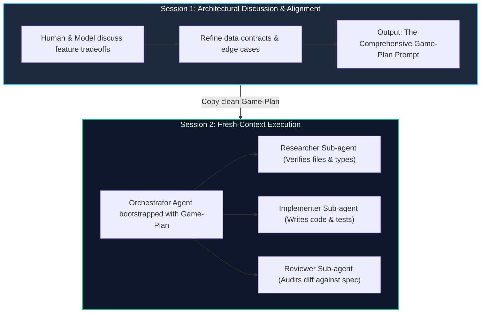

import { Callout } from 'fumadocs-ui/components/callout';
import { Steps, Step } from 'fumadocs-ui/components/steps';

<LessonIntro>
Trying to architect a feature and implement its code in the same continuous chat session is a primary cause of context degradation. As conversations drag on past fifty messages, the LLM context window becomes polluted with discarded attempts, verbose error messages, and intermediate conversation. The solution is the Two-Session Workflow: Session 1 is pure discussion that terminates in an actionable "Game Plan Prompt." Session 2 starts with a fresh context window, running an orchestrator with specialized sub-agents.
</LessonIntro>

<Concepts items={['Two-Session Architecture', 'Session 1 Planning & Discussion', 'Game-Plan Prompt Extraction', 'Session 2 Multi-Agent Orchestration', 'Context Window Hygiene']} />

---

## Anatomy of the Two-Session Loop



---

## Session 1: The Alignment Phase

In Session 1, no code is written. You treat the model as a systems designer:
1. Explain the feature and show existing schemas.
2. Debate approach options (e.g. Server Actions vs Route Handlers, optimistic updates vs SWR).
3. Conclude by prompting: *"Summarize our agreed approach into a structured, copy-pasteable Game-Plan Prompt that a fresh coding agent can execute without prior conversation history."*

---

## Reusable Artifact: The Game-Plan Prompt Template

This prompt is the output of Session 1 and the input to Session 2:

```markdown
# GAME-PLAN: [Feature Name]

## 1. Objective & Scope
Implement [Feature Name] allowing users to [Core Action].

## 2. Pre-Requisite Context & Existing Files
- Schema defined in: `src/lib/db/schema.ts` (specifically `users` and `subscriptions` tables).
- Auth session retrieved via: `src/lib/auth/session.ts:getCurrentUser()`.
- UI tokens defined in: `DESIGN.md`.

## 3. Sub-Agent Execution Plan
1. **Researcher Agent**: Inspect `src/lib/db/schema.ts` and verify existing table relations. Confirm dependencies in `package.json`.
2. **Implementer Agent**:
   - Step A: Add Zod validation schema in `src/lib/validations/feature.ts`.
   - Step B: Create Server Action `createItem()` in `src/app/actions/items.ts`.
   - Step C: Create UI modal component in `src/components/CreateItemDialog.tsx`.
3. **Reviewer Agent**:
   - Check that inputs are validated.
   - Confirm user ownership is verified before database insert.
   - Run `bun run typecheck && bun test`.

## 4. Acceptance Criteria Checklist
- [ ] User can open modal and submit valid form.
- [ ] Record inserted with user's `workspace_id`.
- [ ] Optimistic update closes modal immediately.
- [ ] All tests pass.
```

---

<Takeaway>
Separate the debate from the build. Debate in Session 1 to generate an unambiguous game plan; execute in Session 2 with a clean context window and specialized sub-agents.
</Takeaway>
