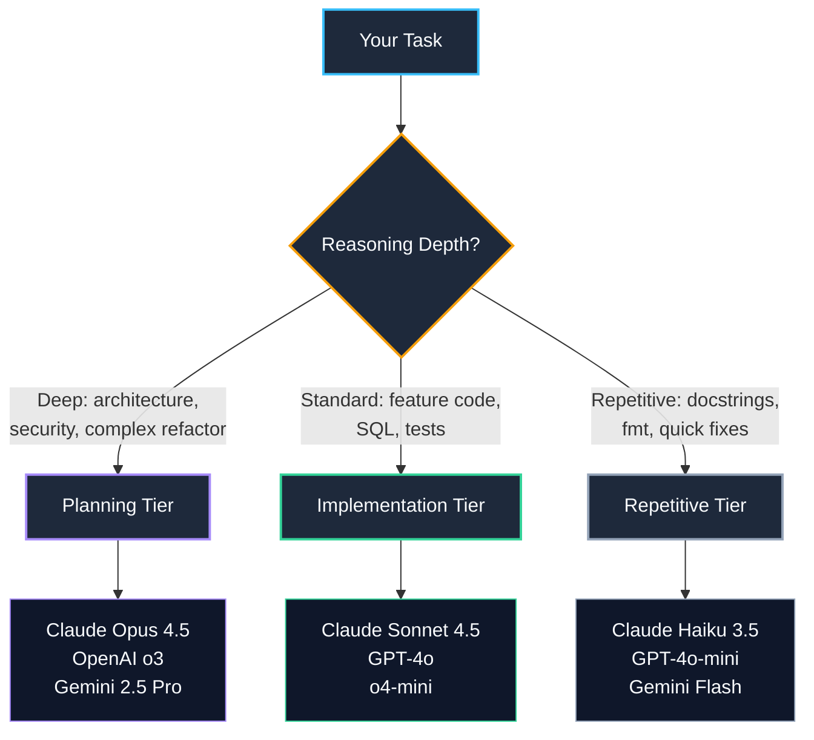

import { Cards, Card } from 'fumadocs-ui/components/card';

<LessonIntro>
Sending every task to the most expensive, slowest model is like hiring a senior architect to paint your walls — technically the job gets done, but you've burned budget, burned time, and the architect resents you. Sending complex architectural decisions to the cheapest, fastest model is like asking the janitor to design your foundation — the plan is plausible, the outcome is a disaster waiting to happen. Model selection is a skill, and it compounds across an entire project. Get it right and you ship fast without surprises. Get it wrong and you chase subtle bugs through systems that looked correct but weren't.
</LessonIntro>

<Concepts items={["Model Selection Matrix", "Claude Opus 4", "Claude Sonnet 4", "o3 / o4-mini", "Gemini 2.5 Pro", "Context Windows", "Cost-Performance Tradeoffs", "Prompt Engineering for Code"]} />

---

## How Tasks Map to Models

Every task you delegate to an LLM falls somewhere on two axes: **reasoning depth required** and **volume of output**. The winning strategy is to route each task to the cheapest model that can do it *correctly* — not the smartest model you have access to.

---

## What's in This Track

<Cards>
  <Card
    title="01. Models & Roles: Cognitive Tiering"
    description="Frontier models for PRDs and orchestration, fast lightweight models for research. Medium reasoning depth is usually sufficient for implementation."
    href="/docs/code-with-ai/04-llm-strategy/01-models-and-roles"
  />
  <Card
    title="02. Model Selection by Task"
    description="A practical matrix: which model to use for planning, implementation, review, and research. Profiles of every major model with honest tradeoffs."
    href="/docs/code-with-ai/04-llm-strategy/02-model-selection-by-task"
  />
  <Card
    title="03. Prompting: The High-Bandwidth Pattern"
    description="Be specific, attach reference visual assets, ask 'what do you think?' instead of 'fix this', and anchor agents with authoritative documentation URLs."
    href="/docs/code-with-ai/04-llm-strategy/03-prompting"
  />
  <Card
    title="04. Context & Prompt Engineering for Code"
    description="The Plan & Act workflow, context priming, vertical slice decomposition, and five copy-pasteable prompt templates for production-quality output."
    href="/docs/code-with-ai/04-llm-strategy/04-context-and-prompt-engineering"
  />
  <Card
    title="05. The Two-Session Workflow"
    description="Session 1 is architectural discussion that ends in a crisp game-plan prompt. Session 2 executes via an orchestrator with specialized sub-agents."
    href="/docs/code-with-ai/04-llm-strategy/05-two-session-workflow"
  />
</Cards>

---

<Takeaway>
The meta-skill of AI-assisted development isn't prompt writing — it's **model routing**. Match reasoning depth to model capability, keep your context tight, and your prompts structured. The rest follows naturally.
</Takeaway>
