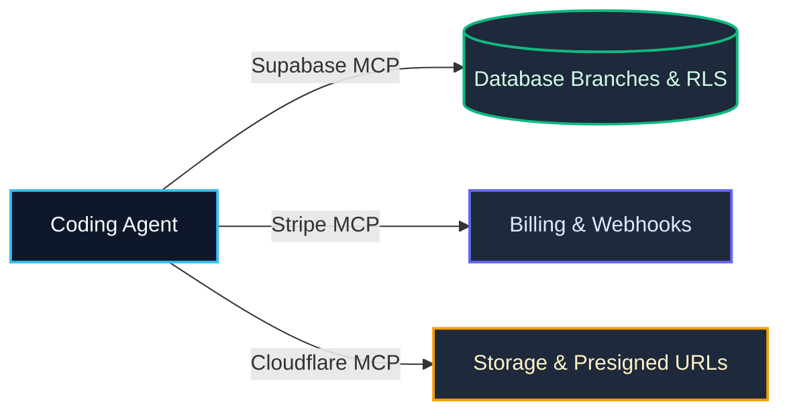

import { Callout } from 'fumadocs-ui/components/callout';
import { Steps, Step } from 'fumadocs-ui/components/steps';

<LessonIntro>
Modern backend development is rarely about writing raw SQL queries from scratch; it is about orchestrating distributed systems and external services reliably. A production-ready AI backend workflow rests on two operational shifts: using Model Context Protocol (MCP) servers so agents can interact directly with infrastructure instead of making you manually click through dashboards, and using decoupled primitives — like presigned storage uploads, asynchronous job queues, and isolated database branches.
</LessonIntro>

<Concepts items={['Database Branching (Dev vs Prod)', 'MCP-Native Infrastructure', 'Presigned URL Uploads', 'Async Background Queues', 'Realtime Sync & RAG', 'Backend Integration Checklist']} />

---

## 1. Branching Isolation: Dev vs. Prod

Never point an autonomous coding agent at your production database or live Stripe accounts. 
- Use **Supabase branching** or **Neon database branches**: spin up an isolated staging branch for your agent session.
- Run migrations and test data seeding in complete safety.
- Merge database branches via pull request only after verification tests pass.

---

## 2. MCP Over Dashboard Clicking

Instead of context-switching between your editor and vendor consoles (copying database connection strings or checking webhook delivery logs), connect official MCP servers:
- **Supabase MCP**: The agent inspects schemas, generates Drizzle migrations, and audits RLS policies.
- **Stripe MCP**: The agent queries test customer IDs, validates price objects, and simulates webhook deliveries.
- **Cloudflare / AWS MCP**: The agent provisions R2 buckets and generates presigned upload tokens directly.

---

## 3. Four Core Architectural Primitives

Every scalable SaaS application relies on these four backend patterns:

1. **Presigned Uploads**: Clients upload large binary files (images, PDFs) directly to S3/Cloudflare R2 via presigned PUT URLs, bypassing your application server entirely.
2. **Background Jobs & Queues**: Heavy workloads (sending emails, video encoding, AI embeddings) run asynchronously via Inngest, BullMQ, or Celery. Never block an HTTP request for more than 500ms.
3. **Realtime Sync**: WebSockets or Server-Sent Events (SSE) stream state updates directly to UI components as background jobs complete.
4. **RAG & Vector Pipelines**: Chunking, embedding generation, and pgvector cosine similarity search decoupled from user-facing read queries.

---

## Reusable Artifact: The Backend Integration Checklist

| Capability | Best-Practice Pattern | Verified? |
|---|---|---|
| **Database** | Development branch isolated; all tables protected with RLS | [ ] |
| **Object Storage** | Presigned S3/R2 URLs used for uploads (no file streaming via API route) | [ ] |
| **Background Tasks** | Async worker queue configured for tasks taking >1 second | [ ] |
| **Payment Webhooks** | Stripe webhook signature verified using raw request buffer | [ ] |
| **Secrets & Keys** | Staging API keys used in `.env.local`; production secrets locked in vault | [ ] |
| **MCP Tooling** | Supabase and Stripe MCP servers connected to IDE | [ ] |

---

<Takeaway>
Let agents manage infrastructure through MCP rather than manual dashboard clicking. Decouple your backend with presigned storage, background workers, and branch isolation to keep your system resilient.
</Takeaway>
