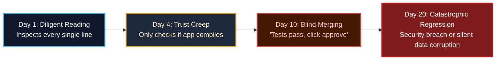

import { Callout } from 'fumadocs-ui/components/callout';
import { Steps, Step } from 'fumadocs-ui/components/steps';

<LessonIntro>
Imagine a junior developer who writes 1,000 lines of clean-looking TypeScript in forty seconds, never drinks coffee, and speaks with total, unshakeable confidence. Every pull request passes the linter. Every function has neat docstrings. But buried deep inside line 412 is a database query that exposes raw user tokens in query parameters, and line 680 quietly disables CORS protections to make an endpoint "just work". If you merge that code without reading it line-by-line, you haven't automated your development — you've automated your negligence. You are the architect, the senior engineer, and the gatekeeper. The AI produces drafts; you sign off on production reality.
</LessonIntro>

<Concepts items={["Human-in-the-Loop Discipline", "10-Point Review Checklist", "AI Code Red Flags", "Security Vulnerabilities", "Hallucinated Packages", "Silent Regressions", "Diff Inspection Workflow"]} />

---

## The Golden Rule: You Are the Senior Engineer

When working with autonomous coding agents (Claude Code, Cursor Composer, Windsurf), developers frequently slide down a dangerous psychological slope:



<AnalogyCard name="The Autonomous Pilot vs The Airline Captain">
<div>
<strong>The Copilot (AI Agent):</strong>
Executes navigational adjustments instantly, calculates approach trajectories at lightning speed, and suggests flight path alterations. It does not possess fear, legal liability, or situational awareness of passengers in the cabin.
</div>
<div>
<strong>The Captain (You):</strong>
Remains legally responsible for landing the aircraft safely. The captain never surrenders final authority to fly-by-wire automation when turbulence strikes or ground telemetry conflicts.
</div>
</AnalogyCard>

---

## The 10-Point AI Code Review Checklist

Before staging or committing any agent-generated changeset, step through this rigorous verification checklist:

| # | Inspection Point | What to Look For in the Diff | Severity |
|---|---|---|---|
| **1** | **Scope Fidelity** | Did the agent modify files outside the ticket's stated boundaries? Did it rewrite unrelated utility functions? | 🚨 High |
| **2** | **Secret Hygiene** | Are API keys, JWT secrets, or DB connection strings hardcoded instead of pulled via validated `process.env`? | 🚨 Critical |
| **3** | **Auth & Authorization** | Does this API route or server action verify user authentication and workspace membership before mutation? | 🚨 Critical |
| **4** | **Input Sanitization** | Are inputs parsed via Zod or similar validation schemas, or does the code blindly trust `req.body`? | 🚨 Critical |
| **5** | **Hallucinated Dependencies** | Did the agent install a brand new npm package with 12 weekly downloads instead of using standard node APIs or existing workspace libraries? | ⚠️ High |
| **6** | **Silent Error Swallowing** | Are there empty `catch (e) {}` blocks, or error handlers that simply log `console.log(e)` and return `status 200`? | ⚠️ High |
| **7** | **TypeScript Integrity** | Did the agent cheat strict typing using `as any`, `@ts-ignore`, or loose type assertions to satisfy the compiler? | ⚠️ Medium |
| **8** | **N+1 & Database Performance** | Are database calls executed inside loops (`items.map(async (i) => await db.query(...))`) instead of batch queries? | ⚠️ High |
| **9** | **Dead Code & Leftovers** | Are there commented-out blocks, leftover debug statements (`console.log('HERE 1')`), or duplicated functions? | ℹ️ Low |
| **10** | **Design Token Alignment** | Does UI use arbitrary pixel widths (`w-[347px]`, `bg-[#2381f2]`) instead of design system tokens from `DESIGN.md`? | ⚠️ Medium |

---

## Classic AI Code Red Flags

AI models have distinct failure modes caused by statistical completion incentives. Learn to spot these instantly:

### 1. The "Escape Hatch" TypeScript Cheat
When TypeScript complains about a complex union or nullable database field, agents love taking the path of least resistance:

```typescript
// ❌ AI SHORTCUT: Blindly casts away type safety
export async function getUserProfile(userId: string) {
  const result = await db.query.users.findFirst({ where: eq(users.id, userId) });
  return (result as any).billingSettings?.stripeCustomerId;
}

// ✅ PROPER VERIFICATION: Narrow types explicitly with runtime validation
export async function getUserProfile(userId: string): Promise<string | null> {
  const user = await db.query.users.findFirst({
    where: eq(users.id, userId),
    columns: { billingSettings: true },
  });

  if (!user?.billingSettings) return null;
  return user.billingSettings.stripeCustomerId ?? null;
}
```

### 2. Missing Authorization Gates (IDOR Vulnerability)
Agents frequently write database mutations that check if a record exists, but forget to verify that the **requesting user actually owns that record**:

```typescript
// ❌ INSECURE: Vulnerable to Insecure Direct Object Reference (IDOR)
export async function deleteProject(projectId: string) {
  // Anyone with a valid JWT can delete anyone else's project!
  await db.delete(projects).where(eq(projects.id, projectId));
  return { success: true };
}

// ✅ SECURE: Tenancy and ownership boundary enforced
export async function deleteProject(projectId: string, currentUserId: string) {
  const deleted = await db
    .delete(projects)
    .where(and(eq(projects.id, projectId), eq(projects.ownerId, currentUserId)))
    .returning({ id: projects.id });

  if (deleted.length === 0) {
    throw new Error("Project not found or unauthorized");
  }
  return { success: true };
}
```

### 3. Hallucinated APIs and Packages
Always inspect `package.json` diffs. LLMs frequently hallucinate npm packages or combine methods from two different library versions:
- Look out for packages like `lucide-react-extra`, `supabase-auth-helpers-v3`, or `date-fns-tz-utils` that don't exist.
- Verify that methods match your installed version (e.g. Next.js 15 async headers vs legacy sync headers).

---

## The Diff Review Workflow

Follow this step-by-step verification process before staging code:

<Steps>
  <Step>
    ### Terminal Git Diff Inspection
    Never review diffs exclusively in a tiny floating IDE widget. Open your full terminal or dedicated Git GUI:
    ```bash
    git status
    git diff --stat
    git diff
    ```
    Review the list of changed files. If you asked for a change to `components/Header.tsx` and see changes in `middleware.ts`, stop immediately and investigate.
  </Step>

  <Step>
    ### Run Type Checking and Linters Independently
    Do not rely on the agent saying "I verified the types". Run the checks yourself:
    ```bash
    bun run typecheck # or tsc --noEmit
    bun run lint
    ```
  </Step>

  <Step>
    ### Execute the Test Suite
    Verify that existing tests didn't break while new capabilities were added:
    ```bash
    bun test
    ```
  </Step>

  <Step>
    ### Use a Second LLM as Auditor
    Take the raw diff and feed it to a different reasoning model (e.g., Anthropic Claude 3.7 Sonnet or OpenAI o3) with an audit prompt:
    ```text
    You are an adversarial senior code reviewer. 
    Audit the following git diff for:
    1. Security vulnerabilities (IDOR, SQL injection, secrets leakage)
    2. Edge cases with null/undefined handling
    3. Performance anti-patterns (N+1 queries, memory leaks)
    Diff:
    [PASTE GIT DIFF]
    ```
  </Step>
</Steps>

<LessonNote variant="warning" title="Beware the 'Looks Right' Illusion">
LLM code is grammatically impeccable, logically structured, and well-commented. That polish tricks the human eye into assuming correctness. Treat AI code with the same professional skepticism you would apply to an unverified pull request from an unknown contributor on the internet.
</LessonNote>

---

<Takeaway>
AI agents are phenomenal drafting engines, but you remain the accountable author. Filter every generated diff through the 10-point checklist: check boundaries, enforce authorization, prohibit `any` types, verify packages, and run local linters and tests independently before committing.
</Takeaway>

<TryIt>
Open your terminal on your current working project and run `git log -n 1 -p` to inspect the most recent commit. Run through the 10-point checklist on that commit. Can you find any shortcut typing, loose error handling, or missing authorization gates?
</TryIt>
