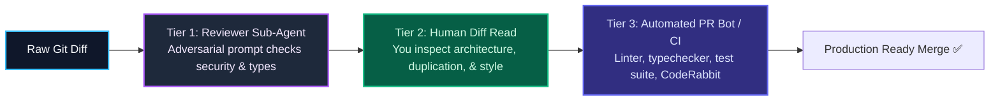

import { Callout } from 'fumadocs-ui/components/callout';
import { Steps, Step } from 'fumadocs-ui/components/steps';

<LessonIntro>
Code review in the age of AI coding is not about checking indentation or asking for variable renames; it is an adversarial audit against specific statistical failure modes. Models naturally tend to duplicate utility functions across different directories, slip in loose TypeScript assertions (`as any`) when type unions get tricky, and write over-engineered, nested error handlers that swallow runtime exceptions. A resilient team catches these issues with a three-tier review process: a reviewer sub-agent, a human diff inspection, and an automated PR bot.
</LessonIntro>

<Concepts items={['Three-Tier Code Review', 'Reviewer Sub-Agents', 'Duplicated Helper Anti-Pattern', 'Loose Typing Auditing', 'Over-Complicated Error Handling', 'Review Checklist']} />

---

## The Three-Tier Review Funnel



---

## The 3 Most Common AI Code Red Flags

### 1. Duplicated Utility Helpers
When an agent needs a function like `formatDate()` or `slugify()`, it often creates a new helper inside `src/components/feature/utils.ts` instead of importing the existing one from `src/lib/utils.ts`. 
- **The fix**: Search your codebase before accepting a helper. Consolidate shared utilities.

### 2. Loose `any` Types and Unsafe Assertions
Watch for shortcuts like `const data = (response as any).data` or `catch (err: any)`. Instruct your agent:
- *"Do not use any. Parse the response using the Zod schema defined in `src/lib/types.ts`."*

### 3. Over-Complicated Error Handling
Agents often generate five levels of nested `try/catch` blocks that log a message and swallow the error:
```typescript
// ❌ AI Anti-Pattern: Swallowing critical exceptions
try {
  await db.insert(orders).values(payload);
} catch (e) {
  console.log("Error inserting order", e);
  return { status: 200, message: "Handled" }; // Hides failure!
}
```
- **The fix**: Allow unexpected errors to bubble up to your global error boundary or API handler so alerts fire properly.

---

## Reusable Artifact: The Three-Tier Review Checklist

| Category | Audit Item | Pass? |
|---|---|---|
| 🤖 **Tier 1 (Sub-Agent)** | Ran adversarial reviewer prompt on diff; no security gaps flagged | [ ] |
| 🔍 **Duplication** | No duplicate helpers created; reuses existing functions in `src/lib/` | [ ] |
| 🛡️ **Type Safety** | Zero instances of `any`, `@ts-ignore`, or loose type assertions | [ ] |
| ⚠️ **Error Handling** | Errors are not silently swallowed; status codes match HTTP standards | [ ] |
| 🧹 **Dead Code** | Leftover `console.log` statements and commented-out code blocks purged | [ ] |
| 🤖 **Tier 3 (CI Bot)** | `bun run typecheck`, `bun run lint`, and all tests pass in CI | [ ] |

---

<Takeaway>
Don't review AI code alone. Use a reviewer sub-agent to catch subtle bugs, conduct your own manual diff inspection for architecture and duplication, and let your CI bots verify types and tests automatically.
</Takeaway>
