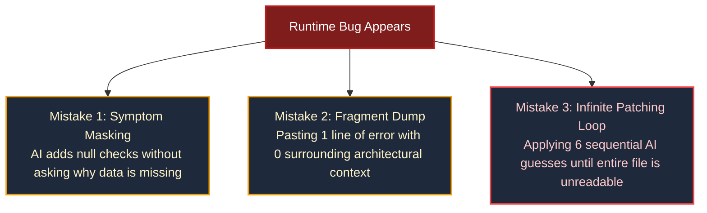
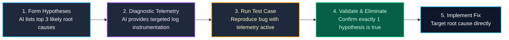

import { Callout } from 'fumadocs-ui/components/callout';
import { Steps, Step } from 'fumadocs-ui/components/steps';
import { Tabs, Tab } from 'fumadocs-ui/components/tabs';

<LessonIntro>
Every developer has experienced this nightmare: a cryptic runtime error appears in production (`TypeError: Cannot read properties of undefined (reading 'map')`). You paste the single error line into an AI chat window. The AI apologizes politely and suggests wrapping the code in an optional chain (`items?.map(...)`). You paste it in. Now it throws `items is not iterable`. The AI suggests a fallback array (`(items || []).map(...)`). You paste that in. Now the page renders blank because `items` was supposed to be fetched from an API that silently returned a 401 error. Two hours wasted playing whack-a-mole with symptoms instead of fixing the root cause. AI debugging is either your fastest diagnostic weapon or your biggest rabbit hole.
</LessonIntro>

<Concepts items={["Error Context Dump", "Rubber Duck Prompting", "Hypothesis-Driven Debugging", "Binary Search Debugging", "Root Cause vs Symptom Fixing", "Autonomous Terminal Debugging", "Diagnostic Logs"]} />

---

## Why Naive AI Debugging Fails

When developers debug poorly with AI, they make one of three fatal mistakes:



<AnalogyCard name="The Symptom Masker vs The Pathologist">
<div>
<strong>The Symptom Masker:</strong>
A patient arrives with severe abdominal pain. The doctor administers painkillers and sends them home. The pain stops temporarily, but the burst appendix remains untreated.
</div>
<div>
<strong>The Pathologist (Systematic AI Debugging):</strong>
Orders blood panels, checks physiological telemetry, identifies bacterial infection markers, and isolates the inflamed organ before performing targeted surgery.
</div>
</AnalogyCard>

---

## The Error Context Dump Pattern

To get deterministic, root-cause diagnostics from an AI agent, you must provide a structured **5-Part Context Dump**. Never paste an isolated error string.

<Steps>
  <Step>
    ### 1. The Exact Error & Full Stack Trace
    Provide the raw, unedited terminal output or browser console trace, including line numbers and module resolutions.
  </Step>

  <Step>
    ### 2. The Surrounding Code Scope
    Include the entire function containing the failure, along with its input parameter types and imports.
  </Step>

  <Step>
    ### 3. Expected vs Actual Behavior
    Describe explicitly: *"Expected: User clicking 'Checkout' receives a Stripe redirect URL. Actual: API returns HTTP 500 with empty body."*
  </Step>

  <Step>
    ### 4. What Was Recently Changed
    State what changed prior to this bug: *"This worked until we updated Drizzle ORM from v0.32 to v0.38 and migrated from Pages router to Next.js 15 App router."*
  </Step>

  <Step>
    ### 5. Relevant Environment Telemetry
    Runtime version (Node.js 22, Bun 1.2), database version (PostgreSQL 16), browser, and OS.
  </Step>
</Steps>

### Example: Bare Prompt vs. 5-Part Context Dump

<Tabs items={["❌ Fragile Prompt", "✅ 5-Part Context Dump"]}>
  <Tab value="❌ Fragile Prompt">
```text
I got this error:
TypeError: db.query.organizations.findFirst is not a function
How do I fix it?
```
*Why this fails:* The AI will guess that `db` is undefined or hallucinate that you should call `db.select().from(organizations)`. It doesn't know your schema setup, ORM version, or connection pool setup.
  </Tab>

  <Tab value="✅ 5-Part Context Dump">
```text
I need help debugging a Drizzle ORM runtime crash in my Next.js 15 App Router project.

1. Error & Stack:
TypeError: db.query.organizations.findFirst is not a function
    at getOrgMembership (src/lib/auth/tenancy.ts:18:36)
    at Layout (src/app/(dashboard)/layout.tsx:12:21)

2. Failing Function (src/lib/auth/tenancy.ts):
import { db } from '@/lib/db';
import { organizations } from '@/lib/db/schema';
import { eq } from 'drizzle-orm';

export async function getOrgMembership(orgId: string) {
  return await db.query.organizations.findFirst({
    where: eq(organizations.id, orgId),
  });
}

3. Database Client Setup (src/lib/db.ts):
import { drizzle } from 'drizzle-orm/postgres-js';
import postgres from 'postgres';
const client = postgres(process.env.DATABASE_URL!);
export const db = drizzle(client); // Notice: schema omitted here!

4. Expected Behavior:
Query should return the organization record matching the provided orgId.

5. Recent Change:
We recently converted raw SQL queries to Drizzle Relational Queries (db.query.*).

Please identify the root cause, explain why this happens, and provide the minimal clean fix.
```
  </Tab>
</Tabs>

In the second tab, the model will instantly recognize that `drizzle(client, { schema })` was initialized without passing the schema object to enable the relational query API!

---

## Hypothesis-Driven Debugging

When dealing with intermittent or non-obvious issues (race conditions, memory leaks, hydration mismatches), guide the AI through a **scientific cycle**:



### The "Diagnostic Logging First" Prompt Template
Instead of asking the AI to rewrite your logic immediately, instruct it to add observation probes:

```text
Do NOT fix the bug yet. 

Analyze this flow and provide 3 targeted `console.log` statements with clear prefixes 
that will prove whether the issue is caused by:
Hypothesis A: Token expiry before refresh
Hypothesis B: Session cookie domain mismatch across subdomains
Hypothesis C: Middleware executing before database session hydration

I will run these logs, trigger the error once, and paste the output back to you.
```

---

## Rubber Duck Prompting

Often, you don't need code generation — you need an articulate conversational partner to validate your mental model.

<Callout type="info">
**The Technique:** Explain the problem to the AI as if it were a new staff engineer who joined your team this morning. Walk through the system architecture, how the data flows from form submission down to disk, and where reality deviates from your expectations.
</Callout>

In many cases, as you compose the explanation, the missing assumption reveals itself before you even send the prompt:
- *"Wait, the webhook payload is parsed as JSON, but Stripe signature verification requires the raw binary buffer..."*
- *"The client component is executing `localStorage.getItem()`, which doesn't exist during Next.js SSR pass..."*

---

## Autonomous Terminal Debugging with Coding Agents

When using terminal-native agents like **Claude Code**, leverage their ability to investigate autonomously across multiple files and execution logs:

```bash
# Example autonomous debugging invocation with Claude Code:
claude "The test in tests/billing.test.ts is failing with 'Stripe customer missing'. 
Read the test, inspect the Stripe webhook handler in app/api/webhooks/route.ts, 
run the test suite using 'bun test tests/billing.test.ts', 
and fix the bug while ensuring all tests pass."
```

The agent will:
1. Read the test file to understand expected assertions.
2. Inspect the webhook handler and database schema.
3. Execute the test runner in the terminal to observe the failure directly.
4. Modify the code and re-run the test to verify the fix works.
5. Review the diff before reporting back.

<Takeaway>
Stop asking AI to guess fixes from single-line error messages. Use the 5-Part Error Context Dump, formulate testable hypotheses, instrument targeted telemetry before editing logic, and let terminal agents execute verification tests in closed loops.
</Takeaway>

<TryIt>
Take an open bug or unhandled promise rejection in your codebase. Draft a 5-Part Context Dump covering: (1) exact stack trace, (2) failing file, (3) expected vs actual outcome, (4) recent changes, and (5) runtime environment. Submit it to your AI agent and evaluate the precision of its diagnosis.
</TryIt>
