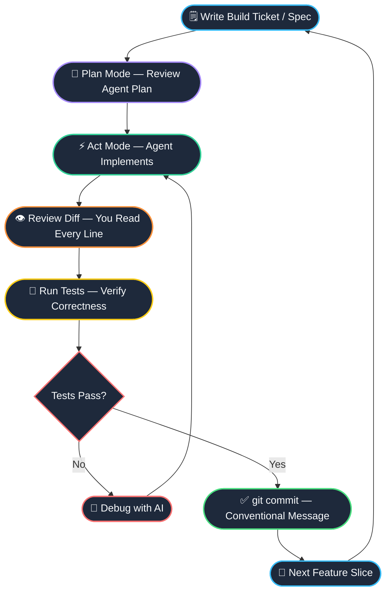

import { Cards, Card } from 'fumadocs-ui/components/card';

<LessonIntro>
You've set up your tools, written your AGENTS.md, and defined your project. Now comes the part that separates AI-assisted developers who ship from the ones who spiral: the **build loop**. The build loop is the operational heartbeat of AI-assisted development. It is the daily practice of how you move from a blank feature branch to a shipped, tested, reviewed feature. Without a disciplined loop, AI coding becomes a mess of half-finished features, bloated context windows, and mysterious regressions that you can't trace back to any single change. The build loop gives you structure, rhythm, and — crucially — **momentum**.
</LessonIntro>

<Concepts items={["Feature-by-Feature Development", "Agent Code Review", "Debugging with AI", "PDCA Loop", "Git Hygiene", "Context Window Reset", "Human-in-the-Loop"]} />

---

## The Full Build Loop

Every productive AI coding session follows the same arc. Plan a small, well-defined feature. Have the agent implement it. Review the diff with your own eyes. Run the tests. Commit with a meaningful message. Then reset your context and move to the next slice. Repeat until you've shipped.

The key insight is that this loop is **small**. Each iteration covers one vertical slice of the application — a single, independently shippable feature. When you keep iterations small, you keep control.

---

## What's in This Track

Each lesson in Track 05 drills into a critical phase of the build loop. By the end, you'll have a repeatable daily workflow that keeps you in control, keeps your codebase clean, and keeps momentum high.

<Cards>
  <Card
    title="Building Feature by Feature"
    description="Decompose your app into vertical slices, write build tickets, and ship one feature per agent session using the PDCA loop."
    href="/docs/code-with-ai/05-build-loop/01-building-feature-by-feature"
  />
  <Card
    title="Reviewing Agent-Generated Code"
    description="The 10-point code review checklist for AI output: security, type safety, dead code, and the human-in-the-loop discipline."
    href="/docs/code-with-ai/05-build-loop/02-reviewing-agent-code"
  />
  <Card
    title="Debugging with AI"
    description="Systematic debugging with an AI copilot: error context dumps, rubber duck prompting, hypothesis testing, and git bisect."
    href="/docs/code-with-ai/05-build-loop/03-debugging-with-ai"
  />
</Cards>

<Takeaway>
The build loop is a discipline, not a technique. Small slices, disciplined review, systematic debugging — these habits compound over weeks into a codebase you can actually trust and maintain. Ship daily. Review everything. Debug with context.
</Takeaway>
