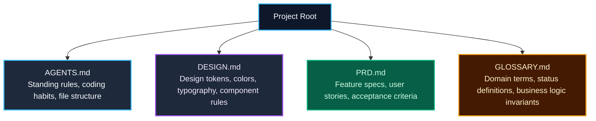

import { Callout } from 'fumadocs-ui/components/callout';
import { Steps, Step } from 'fumadocs-ui/components/steps';

<LessonIntro>
Every time you open a new session with an AI agent, you are onboarding a brilliant developer who has complete amnesia. Without standing context files, you spend the first twenty minutes of every session repeating your database conventions, your component folders, and your brand colors. Standing context files (PRD, glossary, tech stack, `AGENTS.md`, and `DESIGN.md`) give your agent persistent project memory. To ensure these files are watertight, conduct a structured "grill me" interview with the model before writing a line of code.
</LessonIntro>

<Concepts items={['Standing Context Architecture', 'AGENTS.md vs DESIGN.md', 'Project Glossary', 'The Grill-Me Interview', 'Context File Templates']} />

---

## The Standing Context File System

A production AI repository organizes context into focused, modular markdown documents rather than one giant prompt:



---

## The "Grill Me" Interview Technique

Before generating your context files, use a frontier model (Claude 3.7 Sonnet or OpenAI o3) to interrogate your product vision. 

<Callout type="info">
**The "Grill Me" Prompt:**
*"I am planning to build [App Concept]. You are an adversarial, pragmatic Principal Software Engineer. Grill me with 10 hard questions about technical edge cases, auth requirements, failure states, and scope boundaries before I write my spec. Do not write code yet. Ask questions one at a time and wait for my response."*
</Callout>

This interview forces you to address ambiguities early:
- *"What happens if a user submits a duplicate URL while the first is being scraped?"*
- *"Are deleted records soft-deleted with a timestamp or permanently purged from Postgres?"*
- *"What is the rate limit per user per minute?"*

---

## Reusable Artifact: Context File Templates

### 1. Minimal `AGENTS.md` (Standing Brief)
```markdown
# Agent Instructions: [Project Name]

## Tech Stack
- Frontend: Next.js 15 (App Router), React 19, Tailwind CSS v4, Lucide Icons.
- Backend: Next.js Server Actions, Route Handlers.
- Database: Supabase PostgreSQL with Drizzle ORM.
- Auth: Supabase Auth / Clerk with middleware session checks.

## Coding Conventions
- Always write strict TypeScript types. Never use `any` or loose type assertions.
- Data fetching belongs in Server Components; mutations belong in Server Actions.
- Validate all user inputs using Zod schemas before database queries.
- UI components must adhere strictly to design tokens in `DESIGN.md`.

## Verification Commands
- Typecheck: `bun run typecheck`
- Linter: `bun run lint`
- Tests: `bun test`
```

### 2. Domain `GLOSSARY.md`
```markdown
# Domain Glossary
- **Workspace**: The multi-tenant boundary. All projects belong to exactly one workspace.
- **Seat**: An active team member with access permissions.
- **Credit**: The internal currency consumed when running AI completions (1 generation = 5 credits).
- **Draft**: An unpublished project state visible only to the creator.
```

---

<Takeaway>
Standing context files turn random AI sessions into consistent, disciplined sprints. Run a "grill me" session to surface hidden assumptions, document your answers in your context files, and keep your agents grounded.
</Takeaway>
