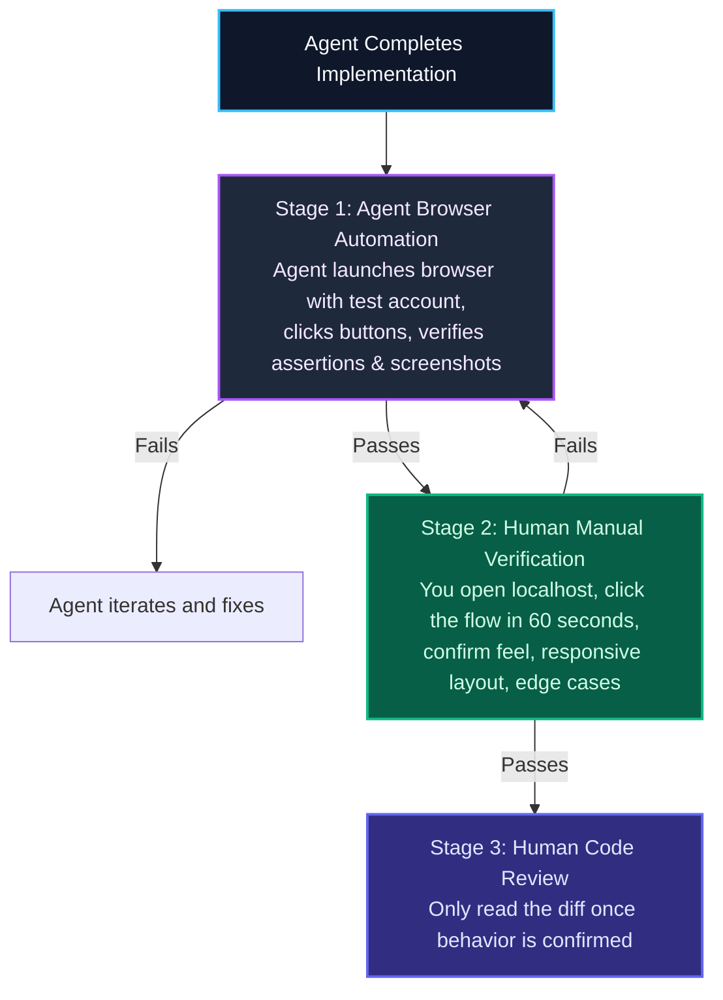

import { Callout } from 'fumadocs-ui/components/callout';
import { Steps, Step } from 'fumadocs-ui/components/steps';

<LessonIntro>
When an agent announces, *"I have implemented the billing upgrade modal and verified it works,"* do not immediately dive into a 600-line code review. Reading code before confirming the application actually works in a real browser is an expensive waste of attention. The two-stage verification loop establishes a clear rule: the agent must first drive an automated browser session using a pre-verified test account; then, you verify the user flow manually before reading the code.
</LessonIntro>

<Concepts items={['Two-Stage Verification Loop', 'Pre-Verified Test Accounts', 'Browser Agent Automation', 'Manual Smoke Verification', 'Verification Checklist']} />

---

## The Two-Stage Verification Funnel

---

## 1. Stage 1: Agent Browser Verification

Equip your agent with browser access (e.g. Playwright MCP or Chrome DevTools MCP). Give it a persistent, pre-seeded development user account:
- Seed a test user with a fixed email and password in your staging database.
- Prompt: *"Launch the browser on `http://localhost:3000`. Log in using the test account `dev@example.com`. Navigate to `/projects`, create a new item titled 'Test Project 1', and verify that the toast notification appears. Capture a screenshot of the resulting dashboard."*

If the agent hits a button that fails due to a z-index issue, an unhandled hydration error, or a broken redirect, it catches and fixes the problem without you having to point it out.

---

## 2. Stage 2: Human Manual Smoke Test

Once the agent shows you a passing browser run, perform a quick manual check before reviewing the code:
1. Open the preview URL or `localhost:3000`.
2. Walk through the happy path once (click the buttons, fill the inputs).
3. Try one common edge case (e.g. submit an empty input, click "Cancel").
4. If the UI feels broken or laggy, send it back immediately: *"The modal closes, but the background overlay remains frozen on the screen. Fix this before we review the code."*

---

## Reusable Artifact: The Verification Checklist

| Verification Gate | Step | Status |
|---|---|---|
| 🤖 **Agent Test** | Agent completed end-to-end browser execution with a test account | [ ] |
| 📸 **Visual Proof** | Agent provided screenshot or DOM trace proving success state | [ ] |
| 🧑‍💻 **Manual Smoke** | You walked through the user flow on localhost in under 60 seconds | [ ] |
| ⚠️ **Negative Test** | Form validation errors trigger properly on empty/invalid inputs | [ ] |
| 📱 **Mobile Check** | Responsive viewport (390px) checked without horizontal overflow | [ ] |

---

<Takeaway>
Never read code before you verify that the application works. Let the agent test itself in a browser first, run a 60-second manual smoke test second, and review the code diff only after behavior is verified.
</Takeaway>
