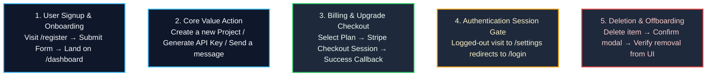

import { Callout } from 'fumadocs-ui/components/callout';
import { Steps, Step } from 'fumadocs-ui/components/steps';
import { Tabs, Tab } from 'fumadocs-ui/components/tabs';

<LessonIntro>
Unit tests prove that your credit calculation function divides numbers correctly. Integration tests prove that your database accepts the row insert. But when a customer clicks your "Complete Purchase" button in Chrome on macOS, a floating cookie consent banner with `z-index: 99999` intercepts the click event, completely blocking the payment dialog. Unit tests pass with 100% coverage, while real users cannot spend money. End-to-End (E2E) tests with Playwright launch real headless browser engines, click actual buttons, and prove that the entire software system works as a unified whole.
</LessonIntro>

<Concepts items={["Playwright Setup", "Critical Path Selection", "Page Object Model (POM)", "Locator Resilience", "Agentic Test Generation", "Self-Healing Tests", "CI Artifact Storage"]} />

---

## Setting Up Playwright for Modern Stacks

Initialize Playwright in your project:

```bash
bun create playwright
# Or via npm/pnpm:
pnpm create playwright
```

Configure your test runner to launch against your local dev server automatically:

```typescript
// playwright.config.ts
import { defineConfig, devices } from '@playwright/test';

export default defineConfig({
  testDir: './e2e',
  fullyParallel: true,
  forbidOnly: !!process.env.CI,
  retries: process.env.CI ? 2 : 0,
  workers: process.env.CI ? 1 : undefined,
  reporter: 'html',
  use: {
    baseURL: 'http://localhost:3000',
    trace: 'on-first-retry',
    screenshot: 'only-on-failure',
  },
  projects: [
    {
      name: 'chromium',
      use: { ...devices['Desktop Chrome'] },
    },
    {
      name: 'Mobile Safari',
      use: { ...devices['iPhone 14'] },
    },
  ],
  webServer: {
    command: 'bun run build && bun run start',
    url: 'http://localhost:3000',
    reuseExistingServer: !process.env.CI,
  },
});
```

---

## Critical Paths: Where to Focus Your E2E Budget

E2E tests take seconds, not milliseconds, to run. If you attempt 100% E2E coverage for every edge case, your CI pipeline will take 45 minutes to finish and suffer from frequent browser flakiness.

Instead, cover the **Top 5 Critical User Paths**:



---

## The Page Object Model (POM) Pattern

When AI agents write E2E tests directly, they often hardcode brittle XPath or CSS selectors (`page.locator('div > div:nth-child(2) > button')`). If you tweak your Tailwind padding or wrap a card in a flex container, those selectors shatter.

The **Page Object Model** encapsulates UI selectors and user actions inside reusable classes:

```typescript
// e2e/pages/LoginPage.ts
import { type Page, type Locator, expect } from '@playwright/test';

export class LoginPage {
  readonly page: Page;
  readonly emailInput: Locator;
  readonly passwordInput: Locator;
  readonly submitButton: Locator;
  readonly errorMessage: Locator;

  constructor(page: Page) {
    this.page = page;
    // Resilient accessibility locators (getByRole, getByLabel)
    this.emailInput = page.getByLabel('Email address');
    this.passwordInput = page.getByLabel('Password');
    this.submitButton = page.getByRole('button', { name: /sign in/i });
    this.errorMessage = page.getByRole('alert');
  }

  async goto() {
    await this.page.goto('/login');
  }

  async login(email: string, pass: string) {
    await this.emailInput.fill(email);
    await this.passwordInput.fill(pass);
    await this.submitButton.click();
  }

  async assertErrorShown(expectedText: string) {
    await expect(this.errorMessage).toContainText(expectedText);
  }
}
```

Now, the actual test spec reads cleanly like a human story:

```typescript
// e2e/auth.spec.ts
import { test, expect } from '@playwright/test';
import { LoginPage } from './pages/LoginPage';

test.describe('Authentication Journey', () => {
  test('rejects invalid password and displays alert', async ({ page }) => {
    const loginPage = new LoginPage(page);
    await loginPage.goto();
    await loginPage.login('user@example.com', 'wrongpassword');
    await loginPage.assertErrorShown('Invalid credentials');
  });

  test('successfully redirects authenticated user to dashboard', async ({ page }) => {
    const loginPage = new LoginPage(page);
    await loginPage.goto();
    await loginPage.login('testuser@verified.com', 'CorrectPass123!');
    await expect(page).toHaveURL(/.*dashboard/);
    await expect(page.getByRole('heading', { name: 'Welcome Back' })).toBeVisible();
  });
});
```

---

## Playwright Agentic Capabilities & Test Generation

Modern Playwright supports AI-driven agent workflows directly:

<Steps>
  <Step>
    ### Browser Code Generation (`codegen`)
    Record interactions directly into Playwright code using your mouse:
    ```bash
    bun playwright codegen http://localhost:3000
    ```
    This launches an interactive browser and records clicks into idiomatic `getByRole` selectors.
  </Step>

  <Step>
    ### Prompting AI to Scaffold Page Object Models
    Feed your HTML or React JSX component directly to an AI agent:
    ```text
    Here is my React component (src/components/CreateProjectDialog.tsx):
    [PASTE JSX]

    Generate a Playwright Page Object Model class in TypeScript using:
    - Resilient Playwright locators (getByRole, getByLabel, getByTestId)
    - Reusable action methods (e.g., fillForm, submit, cancel)
    - Assertion helpers
    Do NOT use brittle CSS tag selectors or XPath.
    ```
  </Step>

  <Step>
    ### Agentic Self-Healing via Terminal Agents
    When an E2E test fails in CI, give the failure trace to **Claude Code**:
    ```bash
    claude "Playwright test e2e/auth.spec.ts failed. 
    Run 'bun playwright test e2e/auth.spec.ts', read the error and screenshot, 
    and fix the locator or component without breaking expected user flow."
    ```
  </Step>
</Steps>

---

<Takeaway>
Unit tests test functions; E2E tests test business outcomes. Focus Playwright on the top 5 critical user flows, encapsulate selectors using Page Object Models, and use accessibility locators (`getByRole`) so minor style adjustments don't break your test suite.
</Takeaway>

<TryIt>
Run `bun playwright codegen http://localhost:3000` on your development server. Walk through signing up or logging in. Examine the generated test script in the inspector window. Refactor the recorded actions into a clean Page Object Model class.
</TryIt>
