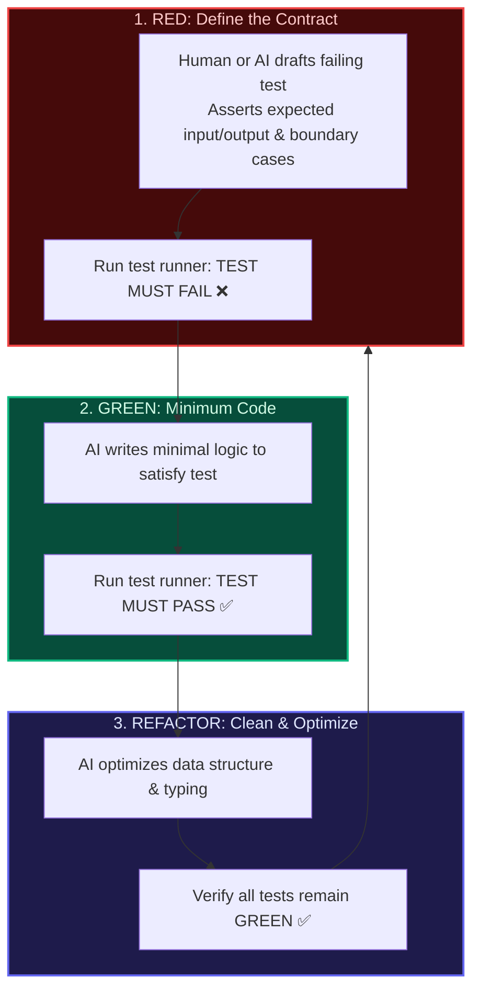

import { Callout } from 'fumadocs-ui/components/callout';
import { Steps, Step } from 'fumadocs-ui/components/steps';
import { Tabs, Tab } from 'fumadocs-ui/components/tabs';

<LessonIntro>
When you ask an AI model to "implement user rate limiting" without a test, it writes 80 lines of plausible code. You skim it, try a quick request in your browser, and think it works. Two weeks later, a customer notices that sliding window expirations reset unexpectedly on the first second of every hour. The bug was baked into the implementation from day one, and nobody noticed because no specification existed. Test-Driven Development (TDD) flips this failure mode completely upside down: you write the executable specification *first* as a failing test, and the AI agent is only allowed to write code that turns the red test green.
</LessonIntro>

<Concepts items={["Red-Green-Refactor Cycle", "Test-First Contract Writing", "Agentic Implementation Constraints", "Refactoring Safely with AI", "AGENTS.md TDD Rules", "Coverage Gates", "Preventing AI Regression"]} />

---

## The AI Red-Green-Refactor Loop

Traditional TDD can feel slow when writing tedious boilerplate manually. With AI agents, TDD becomes **the fastest way to write bulletproof software**:



<AnalogyCard name="The Contract vs The Handshake">
<div>
<strong>Vibe Coding (The Handshake):</strong>
You tell the contractor, *"Build me a sturdy kitchen table."* They deliver something with four wooden legs. It looks nice until you place a 50kg turkey on it and the legs buckle because nobody specified load tolerances.
</div>
<div>
<strong>AI-Driven TDD (The Architectural Contract):</strong>
Before touching wood, you provide a stamped engineering spec: *"Table must support 150kg without deflecting more than 2mm, fit within 2m x 1m footprint, and resist heat up to 100°C."* The carpenter builds specifically to satisfy that measurable threshold.
</div>
</AnalogyCard>

---

## Phase 1: The RED Phase (Define the Contract)

In the RED phase, you instruct the AI agent to write the test suite **without implementing the production code**.

### The RED Phase Prompt Template

```text
You are writing a unit test suite using Vitest.
Do NOT implement the production code yet. Only create the test file.

Task Specification:
We need a slugification utility: `generateSlug(title: string, options?: { maxLength?: number })`.
It must:
1. Convert string to lowercase and replace spaces and punctuation with hyphens.
2. Remove leading, trailing, and duplicate consecutive hyphens.
3. Strip accents and diacritics (e.g., "café" -> "cafe").
4. Truncate to `options.maxLength` without cutting off mid-word if possible.
5. Throw an error if title is empty or contains only whitespace.

Write the full test file at `src/lib/__tests__/slug.test.ts`. 
Run `bun test src/lib/__tests__/slug.test.ts` to confirm all tests FAIL with missing implementation.
```

### The Generated RED Test File

```typescript
// src/lib/__tests__/slug.test.ts
import { describe, it, expect } from 'vitest';
import { generateSlug } from '../slug'; // File does not exist yet!

describe('generateSlug', () => {
  it('converts basic text to lowercase hyphenated slug', () => {
    expect(generateSlug('Hello World')).toBe('hello-world');
  });

  it('removes duplicate consecutive hyphens and symbols', () => {
    expect(generateSlug('Next.js 15 & React 19: The Complete Guide!'))
      .toBe('nextjs-15-react-19-the-complete-guide');
  });

  it('normalizes accents and diacritics', () => {
    expect(generateSlug('Crème Brûlée in Zürich')).toBe('creme-brulee-in-zurich');
  });

  it('respects maxLength constraint cleanly', () => {
    expect(generateSlug('A very long title about software engineering', { maxLength: 20 }))
      .toBe('a-very-long-title');
  });

  it('throws an error on empty or whitespace strings', () => {
    expect(() => generateSlug('   ')).toThrow('Title cannot be empty');
  });
});
```

Execute the test in terminal:
```bash
bun test src/lib/__tests__/slug.test.ts
# ❌ Cannot find module '../slug' (TEST IS RED)
```

---

## Phase 2: The GREEN Phase (Implement Minimum Code)

Now switch to the GREEN phase. The agent's goal is **strictly to make the tests pass**, not to over-engineer.

### The GREEN Prompt

```text
The test file `src/lib/__tests__/slug.test.ts` is in place and failing.
Create `src/lib/slug.ts` and implement `generateSlug` to satisfy all test cases.
Do NOT alter any assertions in the test file.
Run `bun test src/lib/__tests__/slug.test.ts` to verify tests turn GREEN.
```

The agent creates the implementation:

```typescript
// src/lib/slug.ts
export function generateSlug(title: string, options?: { maxLength?: number }): string {
  const trimmed = title.trim();
  if (!trimmed) {
    throw new Error('Title cannot be empty');
  }

  // Normalize diacritics
  let slug = trimmed
    .normalize('NFD')
    .replace(/[\u0300-\u036f]/g, '')
    .toLowerCase()
    .replace(/[^a-z0-9\s-]/g, '')
    .replace(/[\s-]+/g, '-')
    .replace(/^-+|-+$/g, '');

  if (options?.maxLength && slug.length > options.maxLength) {
    const truncated = slug.slice(0, options.maxLength);
    const lastHyphen = truncated.lastIndexOf('-');
    slug = lastHyphen > 0 ? truncated.slice(0, lastHyphen) : truncated;
  }

  return slug;
}
```

Execute the test runner:
```bash
bun test src/lib/__tests__/slug.test.ts
# ✓ src/lib/__tests__/slug.test.ts (5 tests passed) (6ms)
# ✅ TEST IS GREEN
```

---

## Phase 3: The REFACTOR Phase (Clean & Harden)

Once tests are green, you have a verified baseline. Now you can ask the agent to refactor for performance, readability, and documentation **with zero fear of breaking functionality**:

```text
The tests for `generateSlug` are passing.
Refactor `src/lib/slug.ts`:
1. Add complete JSDoc comments with @example tags.
2. Optimize regex patterns to avoid unnecessary allocations.
3. Run the test suite after refactoring to ensure all 5 tests remain GREEN.
```

---

## Enforcing TDD Rules in `AGENTS.md`

Add this explicit policy to your project's `AGENTS.md` file:

```markdown
## Testing & TDD Conventions
- **Test-First Rule**: For any new business logic or utility function, write the test file in `__tests__/` first.
- **Never Weaken Assertions**: When a test fails during implementation, fix the production code, NEVER remove or weaken test expectations.
- **Coverage Baseline**: All functions in `src/lib/` must have unit test coverage >= 80%.
- **Verification Command**: Run `bun test` after every feature implementation and report test results in your response.
```

<Takeaway>
AI models are prone to hallucinating edge-case handling when given unconstrained prompts. By writing tests first (RED), having the agent implement the minimum code (GREEN), and using passing tests as an automated regression shield while refactoring, you achieve both maximum development velocity and rock-solid production quality.
</Takeaway>

<TryIt>
Pick the next feature or utility on your roadmap. Follow the Red-Green-Refactor loop:
1. Ask the AI to write only the failing test file.
2. Run your test runner to confirm it fails.
3. Ask the AI to implement the code to pass the test.
4. Verify all tests pass, and commit!
</TryIt>
