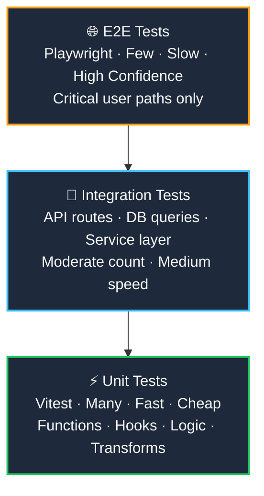

import { Cards, Card } from 'fumadocs-ui/components/card';

<LessonIntro>
Without tests, AI-assisted development has a terrifying property: every feature you add risks silently breaking a previous one, and you won't know until a user reports it. AI agents write code fast — sometimes *too* fast. They refactor confidently, rename things, restructure data flows. And without a test suite, every one of those changes is a gamble. Tests are not overhead in AI coding — they are the safety rail that lets you go fast without falling off the cliff. This track gives you the full testing strategy: fast unit tests with Vitest, critical-path E2E tests with Playwright, and the discipline of AI-driven TDD that makes your entire codebase trustworthy.
</LessonIntro>

<Concepts items={["Vitest", "Playwright", "Test-Driven Development", "Agent-Written Tests", "Self-Healing Tests", "Test Coverage", "CI Test Gates", "The Testing Pyramid"]} />

---

## The Testing Pyramid

The testing pyramid isn't just a theory — it's a budget allocation for your confidence. Write *many* fast unit tests at the base, a moderate number of integration tests in the middle, and a few slow but powerful E2E tests at the top. AI agents make it cheap to fill the base. Playwright agents make the top tractable. The pyramid becomes *affordable*.

The wider the layer, the more tests you write. The narrower, the fewer — but every test in the narrow layers carries more weight. An E2E test failure always means a real user would have hit a real problem.

---

## What's in This Track

<Cards>
  <Card
    title="Unit Testing with Vitest"
    description="Write fast, isolated unit tests with Vitest. Learn to prompt AI agents to generate complete test suites from your source files, mock external deps, and wire coverage reports into CI."
    href="/docs/code-with-ai/06-testing/01-unit-testing-with-vitest"
  />
  <Card
    title="E2E Testing with Playwright"
    description="Test critical user paths in real browsers. Use the Page Object Model for resilient selectors, and leverage Playwright's agent features — Planner, Generator, and Healer — to automate test authoring."
    href="/docs/code-with-ai/06-testing/02-e2e-testing-with-playwright"
  />
  <Card
    title="AI-Driven Test-Driven Development"
    description="The Red-Green-Refactor loop powered by AI agents. Write the failing test first, let the agent make it pass, then refactor with confidence. Enforce TDD rules in AGENTS.md and coverage gates in CI."
    href="/docs/code-with-ai/06-testing/03-ai-driven-tdd"
  />
</Cards>

---

<Takeaway>
A test suite is how you keep AI-generated code honest. Without it, every agent-authored change is a trust exercise with your production environment. With it, you can move at full speed — because any mistake is caught in milliseconds, not discovered by a user at 2am.
</Takeaway>
