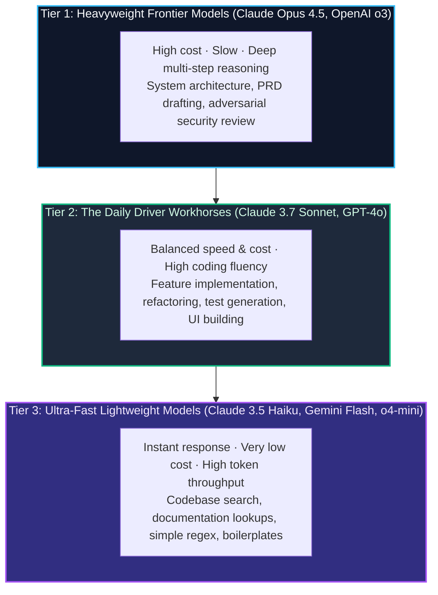

import { Callout } from 'fumadocs-ui/components/callout';
import { Steps, Step } from 'fumadocs-ui/components/steps';

<LessonIntro>
Treating all LLM models as interchangeable commodities is one of the most expensive mistakes in modern software development. If you use a lightweight model to draft your core authentication architecture, you risk introducing subtle security flaws. If you use an expensive frontier reasoning model to fix a CSS margin or generate a TypeScript interface from a JSON payload, you waste time and money. Elite AI engineers map specific models to specific cognitive roles in the development lifecycle.
</LessonIntro>

<Concepts items={['Cognitive Tiering', 'Frontier Orchestrators', 'Lightweight Research Models', 'Reasoning Effort Calibration', 'Model-to-Role Matrix']} />

---

## The Cognitive Tiering Spectrum

Modern models fall into three distinct performance categories:

---

## Calibrating Reasoning Effort

Many modern models offer tunable reasoning tokens (e.g. Claude 3.7 Sonnet thinking budgets, OpenAI o3 reasoning levels). 

<Callout type="info">
**Rule of Thumb:** Medium reasoning effort is usually sufficient for 90% of development tasks. Set reasoning to "High" or use heavyweight models only when:
- Designing database schemas and tenancy isolation.
- Auditing cryptographic authentication and token rotation flows.
- Untangling complex async concurrency race conditions.
</Callout>

---

## Reusable Artifact: The Model-to-Role Matrix

| Engineering Phase | Recommended Model | Reasoning Tier | Rationale |
|---|---|---|---|
| **Product Spec & PRD** | Claude Opus 4.5 / OpenAI o3 | High Reasoning | Spots missing business requirements and edge cases. |
| **System Architecture & ERD** | Claude Opus 4.5 / OpenAI o3 | High Reasoning | Eliminates schema design traps and foreign key conflicts. |
| **Feature Implementation** | Claude 3.7 Sonnet / GPT-4o | Medium / Adaptive | Fast code generation with strict TypeScript adherence. |
| **UI & Tailwind Styling** | Claude 3.7 Sonnet / GPT-4o | Low / Standard | Visual layout mastery without deep math reasoning. |
| **Documentation & Research** | Gemini 2.5 Flash / Haiku 3.5 | None / Fast | Millions of tokens ingested rapidly for doc lookup. |
| **Adversarial Code Review** | OpenAI o3 / Claude Opus | High Reasoning | Acts as a strict auditor to catch hidden logic bugs. |
| **Unit Test Generation** | Claude 3.7 Sonnet | Standard | Rapid generation of comprehensive test assertions. |

---

<Takeaway>
Route tasks to the right model tier: deploy heavyweight frontier models for planning and auditing, daily workhorses for implementation, and fast models for search and research.
</Takeaway>
