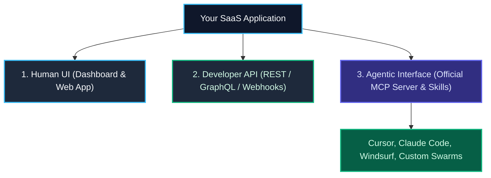

import { Callout } from 'fumadocs-ui/components/callout';
import { Steps, Step } from 'fumadocs-ui/components/steps';

<LessonIntro>
For the past twenty years, software products were designed for human beings clicking buttons in graphical user interfaces. Over the next decade, an increasing percentage of your product's users will not be humans with mice — they will be autonomous AI agents acting on behalf of humans. If your app only exposes a web dashboard, you are invisible to those agents. By exposing your core features through a Model Context Protocol (MCP) server, an agent skill, or an API plugin, you transform your application into an agent-ready platform.
</LessonIntro>

<Concepts items={['Agent-Ready Software', 'Building an MCP Server', 'Exposing API Endpoints to Agents', 'Agent Skills for Your Product', 'MCP Readiness Checklist']} />

---

## What Makes an Application "Agent-Ready"?

An agent-ready application provides three layers of integration:



1. **Self-Documenting Tool Schemas**: Tools exposed via MCP provide clear JSON Schema parameter descriptions and explicit instructions.
2. **Idempotent Mutations**: Actions support idempotency keys so network retries by an agent don't duplicate charges or records.
3. **Scoped Agent Auth Tokens**: Users can issue API keys with read-only or restricted permissions tailored specifically for agent access.

---

## Building a Minimal FastMCP Server for Your App

Using the modern FastMCP framework (TypeScript or Python), you can turn your application's API into an MCP server in under 50 lines of code:

```typescript
// server/mcp.ts
import { McpServer } from "@modelcontextprotocol/sdk/server/mcp.js";
import { StdioServerTransport } from "@modelcontextprotocol/sdk/server/stdio.js";
import { z } from "zod";

const server = new McpServer({
  name: "my-app-mcp",
  version: "1.0.0",
});

// Expose a read tool to query user resources
server.tool(
  "list-projects",
  "Lists all projects for the authenticated user",
  { status: z.enum(["active", "archived"]).optional() },
  async ({ status }) => {
    const projects = await fetchProjectsFromDb({ status });
    return {
      content: [{ type: "text", text: JSON.stringify(projects, null, 2) }],
    };
  }
);

// Expose a mutation tool
server.tool(
  "create-project",
  "Creates a new project within the user's workspace",
  { name: z.string().min(1), description: z.string().optional() },
  async ({ name, description }) => {
    const newProject = await createProjectInDb({ name, description });
    return {
      content: [{ type: "text", text: `Project created with ID: ${newProject.id}` }],
    };
  }
);

const transport = new StdioServerTransport();
await server.connect(transport);
```

---

## Reusable Artifact: The MCP Readiness Checklist

| Readiness Requirement | Implementation Target | Verified? |
|---|---|---|
| 🔌 **MCP Server Available** | Official MCP package (`npx @your-company/mcp-server`) published | [ ] |
| 📝 **Tool Descriptions** | Tools have clear descriptions explaining when and how to call them | [ ] |
| 🛡️ **Scoped API Keys** | Users can generate granular API keys for agent workflows | [ ] |
| 🔁 **Idempotency** | Mutation endpoints accept idempotency keys to prevent duplicate actions | [ ] |
| 📦 **Agent Skills Pack** | Ready-to-use `SKILL.md` provided for common agent IDEs (Cursor/Claude) | [ ] |

---

<Takeaway>
The future of software is agentic. By exposing your product through an official MCP server, clear tool schemas, and tailored skills, you ensure your software remains directly accessible to the next generation of AI-driven workflows.
</Takeaway>
