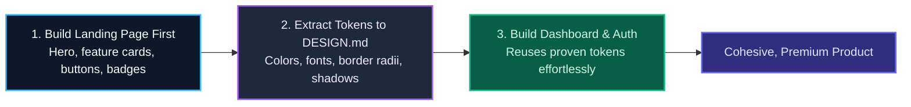

import { Callout } from 'fumadocs-ui/components/callout';
import { Steps, Step } from 'fumadocs-ui/components/steps';

<LessonIntro>
When developers build application backends and database tables first, the frontend often ends up being an afterthought — assembled quickly using default Tailwind utilities that produce generic, uninspired interfaces. The Design-First methodology reverses this sequence: you build the public landing page first. Constructing the landing page forces you to establish your typography scale, color tokens, button treatments, card radii, and visual hierarchy early. Once codified in `DESIGN.md`, those design tokens flow naturally into your dashboard and settings screens.
</LessonIntro>

<Concepts items={['Design-First Methodology', 'Landing Page Token Anchor', 'Pre-Built Blocks vs Raw Prompts', 'Git Worktrees for UI Experiments', 'DESIGN.md Iteration Loop']} />

---

## Why the Landing Page Establishes the System

Your landing page is your product's most visually demanding screen. It requires high-contrast typography, hero treatments, feature card grids, and clear call-to-action buttons. 



---

## 3 Tactics to Prevent Generic "AI Slop" UI

1. **Use Pre-Built High-Quality Component Blocks**: Never tell an agent to "code a pricing table from scratch". Use battle-tested primitives from ShadCN UI, Tailwind UI, or Aceternity as your foundation, and instruct the agent to customize them to match your design tokens.
2. **Anchor with Visual Reference Screenshots**: Take screenshots of real products on Mobbin or Godly and attach them to the prompt. Give concrete parameters: *"Notice the dark border `border-slate-800`, the generous `p-8` card padding, and the subtle 1px border highlight."*
3. **Isolate Experiments in Git Worktrees**: When exploring visual directions, create an isolated Git worktree:
   ```bash
   git worktree add ../ui-exploration-landing feature/landing-v1
   ```
   This lets your agent iterate on UI layouts without polluting your primary working branch.

---

## Reusable Artifact: The DESIGN.md and UI Iteration Loop

Maintain this minimal token file at your project root:

```markdown
# DESIGN.md - Visual System Specification

## Brand Colors
- Background: `#0B0F17` (Tailwind: `bg-slate-950`)
- Surface / Cards: `#111827` (Tailwind: `bg-slate-900`)
- Borders: `#1F2937` (Tailwind: `border-slate-800`)
- Primary Accent: `#38BDF8` (Tailwind: `text-sky-400`, `bg-sky-500`)
- Muted Text: `#94A3B8` (Tailwind: `text-slate-400`)

## Typography & Rhythm
- Headings: Inter Tight / Bold (`tracking-tight`)
- Body: Inter / Regular (`leading-relaxed`)
- Base Grid: 4px increments (`p-4`, `p-6`, `p-8`)
- Border Radius: Cards use `rounded-xl`, buttons use `rounded-lg`

## Explicit Prohibitions (Forbidden Patterns)
- ❌ NO raw black `#000000` backgrounds (use slate-950).
- ❌ NO heavy drop shadows (use subtle 1px border highlights instead).
- ❌ NO arbitrary pixel widths like `w-[327px]` (use grid and flexbox).
```

---

<Takeaway>
Build the landing page first to solidify your design tokens. Codify those choices in `DESIGN.md`, and your internal application screens will inherit that visual polish naturally.
</Takeaway>
