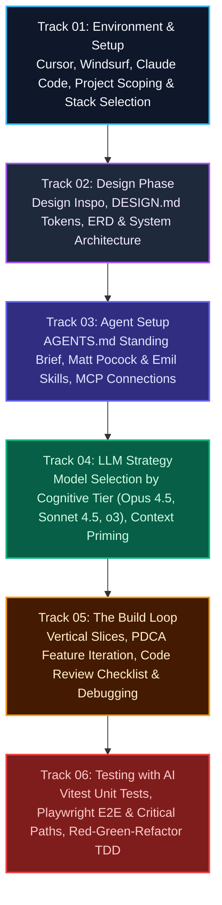

import { Callout } from 'fumadocs-ui/components/callout';
import { Cards, Card } from 'fumadocs-ui/components/card';
import { ModuleOverview } from '@/components/module-overview';

<ModuleOverview slug="code-with-ai" />

<LessonIntro>
Welcome to **Code with AI**, the master curriculum for building production-grade software with modern artificial intelligence. We have moved far beyond basic copy-paste autocomplete. Modern AI software engineering is an agentic, multi-tool discipline: you act as the senior architect directing specialized coding agents, defining machine-readable design systems (`DESIGN.md`), priming standing briefs (`AGENTS.md`), connecting live tools via Model Context Protocol (MCP), selecting models strategically by cognitive workload, and executing disciplined Test-Driven Development loops.
</LessonIntro>

<Concepts items={['Cursor & Windsurf IDEs', 'Claude Code & Coding Agents', 'DESIGN.md Design Tokens', 'AGENTS.md Standing Briefs', 'Model Context Protocol (MCP)', 'Claude Opus / Sonnet / o3', 'Vertical Slices Build Loop', 'AI-Driven TDD with Vitest & Playwright']} />

---

## The AI Engineering Lifecycle

Building apps with AI requires a structured, end-to-end pipeline rather than haphazard prompt hacking:

---

## Core Modules (Foundational Architecture)

The 14 universal principles and reusable artifacts that govern building any application with AI:

<Cards>
  <Card
    title="01. Mindset"
    href="/docs/code-with-ai/01-mindset"
    description="'Build me X' is a wish, not a plan. You make decisions; the agent executes. Includes Decision-ownership checklist."
  />
  <Card
    title="02. Environment"
    href="/docs/code-with-ai/02-environment"
    description="Agentic IDE (Cursor, Claude Code, Codex) with browser tools, skill caps under 100, and voice dictation. Includes Setup checklist."
  />
  <Card
    title="03. Product Definition"
    href="/docs/code-with-ai/03-product-definition"
    description="V1 scope plus an explicit 'not building' list. Includes One-page product definition template."
  />
  <Card
    title="04. Architecture"
    href="/docs/code-with-ai/04-architecture"
    description="Pick reviewable tech the agent knows well. Draw system diagrams and user flows. Includes Architecture & flow template."
  />
  <Card
    title="05. Context Files"
    href="/docs/code-with-ai/05-context-files"
    description="PRD, glossary, tech-stack file, AGENTS.md, DESIGN.md. Use 'grill me' sessions. Includes Templates for each file."
  />
  <Card
    title="06. Prompting"
    href="/docs/code-with-ai/06-prompting"
    description="High-bandwidth prompting: attach visuals, ask 'what do you think?', paste docs URLs. Includes Prompt patterns library."
  />
  <Card
    title="07. Models & Roles"
    href="/docs/code-with-ai/07-models-and-roles"
    description="Frontier models for PRDs/architecture, fast models for research, medium reasoning for coding. Includes Model-to-role table."
  />
  <Card
    title="08. Two-Session Workflow"
    href="/docs/code-with-ai/08-two-session-workflow"
    description="Session 1 is discussion producing a game plan. Session 2 runs an orchestrator with sub-agents. Includes Game-plan template."
  />
  <Card
    title="09. Design-First UI"
    href="/docs/code-with-ai/09-design-first-ui"
    description="Build landing page first to anchor design tokens. Pre-built blocks, screenshots, worktrees. Includes DESIGN.md iteration loop."
  />
  <Card
    title="10. Backend & Integrations"
    href="/docs/code-with-ai/10-backend-and-integrations"
    description="Dev vs prod branches. MCP servers over dashboards. Presigned uploads, background jobs, realtime, RAG. Includes Integration checklist."
  />
  <Card
    title="11. Verification"
    href="/docs/code-with-ai/11-verification"
    description="Agent tests in browser with test account. You test manually on localhost before reading code. Includes Verification checklist."
  />
  <Card
    title="12. Code Review"
    href="/docs/code-with-ai/12-code-review"
    description="Three tiers: reviewer sub-agents, human diff read, PR bots. Catch duplicated helpers and 'any' types. Includes Review checklist."
  />
  <Card
    title="13. Deployment"
    href="/docs/code-with-ai/13-deployment"
    description="Separate prod secrets, domains, and auth callbacks. Let agent run deploys. Includes Deploy & smoke-test checklist."
  />
  <Card
    title="14. Agent-Ready Products"
    href="/docs/code-with-ai/14-agent-ready-products"
    description="Turn your software into an agent platform by exposing MCP servers, plugins, and skills. Includes MCP readiness checklist."
  />
</Cards>

---

## Hands-On Tracks & Deep Dives

<Cards>
  <Card
    title="01. Environment Setup"
    href="/docs/code-with-ai/01-environment-setup"
    description="Choose your AI IDE (Cursor vs Windsurf), coding agent (Claude Code vs Copilot), define what to build, and select an AI-friendly tech stack."
  />
  <Card
    title="02. Design Phase"
    href="/docs/code-with-ai/02-design-phase"
    description="Find UI inspiration for landing pages and dashboards, write machine-readable DESIGN.md files, and design system architectures and ERDs before coding."
  />
  <Card
    title="03. Agent Setup"
    href="/docs/code-with-ai/03-agent-setup"
    description="Write your standing brief in AGENTS.md, install specialized skills (Matt Pocock, Emil Kowalski, Cloudflare Security), and connect MCP servers (Supabase, Stripe, GitHub)."
  />
  <Card
    title="04. LLM Strategy"
    href="/docs/code-with-ai/04-llm-strategy"
    description="Select models strategically by task tier (Claude Opus 4.5 for planning, Sonnet for implementation, o3 for review) and master the Plan & Act workflow."
  />
  <Card
    title="05. The Build Loop"
    href="/docs/code-with-ai/05-build-loop"
    description="Build feature-by-feature using vertical slices, review agent-generated code with a 10-point checklist, and debug systematically with error context dumps."
  />
  <Card
    title="06. Testing with AI"
    href="/docs/code-with-ai/06-testing"
    description="Automate testing with Vitest unit tests, Playwright E2E user journeys, and the Red-Green-Refactor AI-driven TDD loop."
  />
</Cards>
