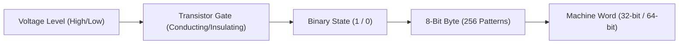
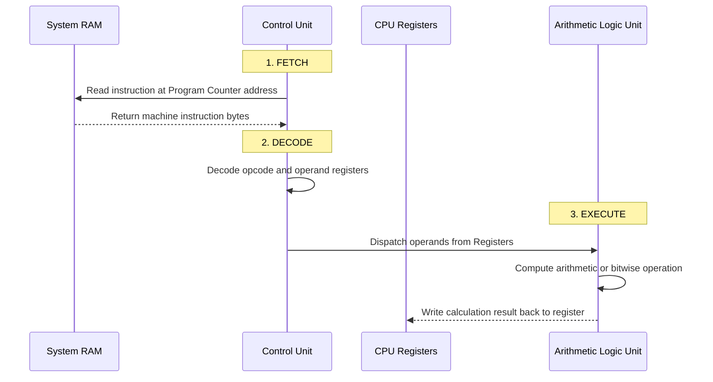
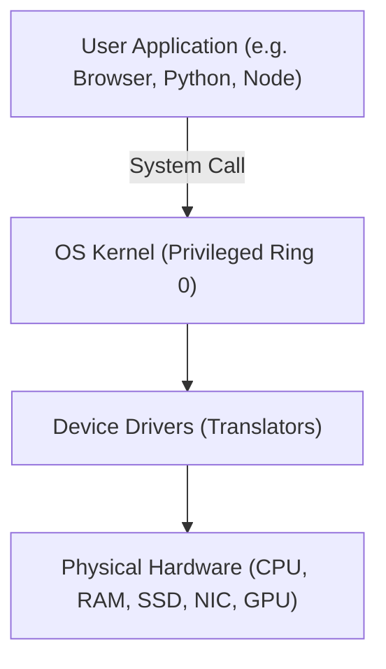
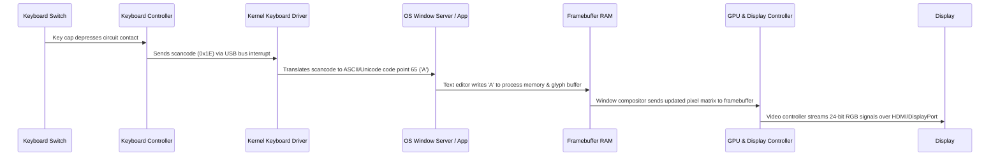

<Concepts items={["transistor switches", "bits & bytes", "CPU & ALU", "fetch-decode-execute", "memory hierarchy", "kernel & Ring 0"]} />

<LessonIntro>

Before there was a laptop, a smartphone, or a cloud server, there was a thought experiment. In 1936, Alan Turing conceptualized an infinitely long strip of paper tape divided into cells, alongside a read/write head governed by a finite table of mechanical rules. 

That abstract mathematical construct — the **Turing machine** — proved that a simple state-machine manipulating discrete symbols on cells could compute anything computable. A modern computer is physically different, but architecturally identical: it is a lightning-fast, microscopic implementation of Turing's machine built from billions of microscopic silicon switches.

</LessonIntro>

## Why this matters

Every variable allocation, database index search, API request, and microservice call you will encounter across software engineering ultimately reduces to transistor flips, memory bus cycles, and register transfers. 

When a backend container crashes with an out-of-memory (OOM) error, when a real-time game stutters due to cache misses, or when a high-throughput pipeline stalls on bus I/O, you are not debugging abstract syntax — you are debugging physical hardware constraints. Understanding the hardware layer removes the "magic" from software execution.

---

## 01 — Physical Reality: Switches Become Bits and Bytes

A computer contains no innate understanding of text, audio, mathematics, or imagery. At the atomic hardware level, modern computers are constructed from **transistors** — solid-state microscopic electronic switches fabricated from silicon.

### From Transistors to the Binary Bit

* **The Transistor:** Modern processors pack tens of billions of microscopic Field-Effect Transistors (MOSFETs) onto a chip the size of a fingernail. When a control voltage is applied to the gate, current flows (state `1`, or "on"); when voltage is removed, current is blocked (state `0`, or "off").
* **The Bit:** That single binary choice (`0` or `1`) is a **bit** (binary digit), the fundamental atomic unit of information.
* **The Byte:** Because a single bit can only communicate two possibilities, hardware bundles eight contiguous bits together into a **byte**:

$$\text{Total Combinations} = 2^8 = 256\text{ values } (00000000_2 \text{ to } 11111111_2 \text{, or } 0 \text{ to } 255)$$

A byte is the universal baseline: enough distinct patterns to encode every standard Latin keyboard character, a basic color intensity channel ($0\text{--}255$), or a machine-language instruction opcode.

---

## 02 — The Thinking Engine: CPU Architecture & The Instruction Cycle

The **Central Processing Unit (CPU)** is the computational engine of the computer. It executes instructions through a perpetual, high-speed rhythmic cycle synchronized by an internal quartz clock oscillator.

*Figure 1.1 — Modern multi-core CPU. The bottom pins seat directly into the motherboard socket to bridge data and address buses.*

### Inside the CPU Die

A modern CPU core is divided into three primary functional subunits:

1. **Control Unit (CU):** The conductor. Directs the flow of electrical signals between the ALU, registers, and external memory. It reads instructions from RAM and decodes their operational meaning.
2. **Arithmetic Logic Unit (ALU):** The calculator. Executes basic mathematical operations (addition, subtraction, multiplication) and logical comparisons (AND, OR, NOT, bitwise shifts).
3. **Registers:** A tiny cluster of ultra-fast internal memory cells located directly on the execution pipeline (e.g., Program Counter, Accumulator, Instruction Register). Accessing a register takes less than a nanosecond (typically $\approx 1\text{ clock cycle}$).

### The Fetch-Decode-Execute Cycle

Every program — whether compiled C++, interpreted Python, or browser JavaScript — executes this continuous cycle:

1. **Fetch:** The Control Unit reads the memory address stored in the **Program Counter (PC)**, queries the system bus, and retrieves the raw instruction byte sequence from RAM into the Instruction Register. The PC increments to point to the next instruction.
2. **Decode:** The instruction decoder translates the binary opcode into electrical switching configurations (e.g., `0x01` maps to an `ADD` operation).
3. **Execute:** The ALU receives the data operands, executes the operation, and routes the output into a destination register.
4. **Store (Writeback):** If required, the calculated result is transferred across the memory bus back into system RAM.

> [!NOTE] Clock Speed vs Instructions Per Cycle (IPC)
> A $3.5\text{ GHz}$ CPU oscillates its clock $3.5\text{ billion times per second}$. However, raw gigahertz alone does not determine real-world speed. Modern processors use **instruction pipelining**, **out-of-order execution**, and **superscalar architecture** to execute multiple instructions concurrently per clock cycle.

---

## 03 — Memory Architecture: The Hierarchy & Funnel

One of the greatest engineering trade-offs in computer science is the tension between **speed, capacity, and cost**.

Fast memory is physically large, power-hungry, and expensive. Cheap mass storage is physically slow. Modern computer architectures solve this dilemma using a hierarchical pyramid:

*Figure 1.2 — The memory pyramid: data funnels downward from vast, slow non-volatile storage toward lightning-fast CPU registers.*

### Comparing Memory Tiers

| Memory Tier | Typical Size | Access Latency | Volatility | Technology |
| :--- | :--- | :--- | :--- | :--- |
| **CPU Registers** | $\approx 1\text{--}2\text{ KB}$ | $< 1\text{ ns}$ ($1\text{ cycle}$) | Volatile | On-die flip-flops |
| **L1 Cache** | $64\text{--}128\text{ KB}$ | $\approx 1\text{--}2\text{ ns}$ ($4\text{ cycles}$) | Volatile | Static RAM (SRAM) |
| **L2 Cache** | $512\text{ KB -- }2\text{ MB}$ | $\approx 3\text{--}10\text{ ns}$ ($12\text{ cycles}$) | Volatile | Static RAM (SRAM) |
| **L3 Cache** | $16\text{--}96\text{ MB}$ | $\approx 10\text{--}25\text{ ns}$ ($40\text{ cycles}$) | Volatile | Shared on-die SRAM |
| **Main System RAM** | $8\text{--}64\text{ GB}$ | $\approx 60\text{--}100\text{ ns}$ ($200\text{ cycles}$) | Volatile | Dynamic RAM (DRAM) |
| **Solid-State Drive (SSD)** | $512\text{ GB -- }4\text{ TB}$ | $\approx 50\text{--}150\ \mu\text{s}$ ($100{,}000\text{ cycles}$) | Non-volatile | NAND Flash |
| **Hard Disk Drive (HDD)** | $1\text{--}16\text{ TB}$ | $\approx 5\text{--}15\text{ ms}$ ($10{,}000{,}000\text{ cycles}$) | Non-volatile | Magnetic platters |

*Figure 1.3 — The fundamental engineering trade-off: moving closer to the CPU increases cost and speed while decreasing capacity.*

### Random Access Memory (RAM)

Main system RAM is a massive grid of byte-sized storage cells, each possessing a unique numeric **memory address** (typically written in hexadecimal, like `0x7FFEE4`). 

The term **Random Access** means that reading any arbitrary memory cell takes the exact same amount of time regardless of its physical position on the chip, because the memory controller addresses rows and columns electrically over the address bus rather than seeking mechanically.

---

## 04 — Input/Output & The Operating System Kernel

Software cannot interact with silicon directly without creating catastrophic chaos. If two user applications attempted to write raw voltages to the same memory addresses or display drivers concurrently, the system would immediately crash.

### The Role of Privilege Rings

Modern CPUs enforce hardware-level privilege separation:

* **Ring 3 (User Space):** Where user applications live (VS Code, web browsers, Python runtimes). Code in Ring 3 is restricted: it cannot directly execute hardware I/O instructions or access arbitrary physical memory addresses.
* **Ring 0 (Kernel Space):** The highest privilege level. Only the core **Operating System Kernel** (Linux, Windows NT, XNU/Darwin) executes here. The kernel owns the hardware, schedules CPU time across processes, maps virtual memory pages to physical RAM, and enforces security boundaries.

### System Calls & Device Drivers

When a program wants to read a file, output sound, or send a network packet, it must make a **System Call (syscall)**:
1. The user program sets up arguments in CPU registers and issues a software interrupt or CPU instruction (like `syscall` on x86-64).
2. The CPU switches privilege levels from Ring 3 to Ring 0.
3. The kernel validates permissions and delegates the request to the appropriate **Device Driver** — a specialized software translator designed to communicate with a specific manufacturer's hardware controller.

---

## 05 — Tracing Reality: What Happens When You Press "A"?

To synthesize this hardware mental model, trace the physical chain of events when you type the single character `"A"` in a text editor:

1. **Mechanical Switch:** The physical keycap depresses a spring contact, completing an electrical circuit.
2. **Scancode Generation:** The keyboard's on-board microcontroller detects the matrix coordinate, generates a hardware **scancode** (e.g., `0x1E`), and raises an interrupt over the USB serial bus.
3. **Kernel Interrupt Handler:** The CPU pauses its current task, switches to Ring 0, and runs the kernel's keyboard interrupt service routine. The device driver maps the scancode against the current keyboard layout, converting it to character code point `65`.
4. **Application Buffer:** The OS window manager delivers a key event to the focused text editor process. The editor stores byte `0x41` in its document buffer in RAM.
5. **Rendering & Framebuffer:** The font engine rasters the character glyph into a pixel matrix, writing RGB values to the graphic framebuffer.
6. **Display Output:** The GPU scans the framebuffer at $60\text{--}144\text{ Hz}$, transmitting digital signals across the display bus (HDMI/DisplayPort) to light up the liquid crystals or OLED sub-pixels on your monitor.

---

## Summary Checklist: Hardware Foundations Mental Model

1. **Computers are discrete state machines:** Billions of microscopic transistor switches represent binary bits (`0` and `1`), bundled into 8-bit bytes ($256$ possible patterns).
2. **The CPU is rhythmic:** It continuously performs the Fetch-Decode-Execute cycle, fetching instructions from memory, decoding opcodes, and executing calculations via the ALU and registers.
3. **Memory is hierarchical:** Registers are fastest ($<1\text{ ns}$), followed by on-die caches (L1/L2/L3), main system RAM ($\approx 100\text{ ns}$), and persistent storage (SSDs/HDDs, $\mu\text{s}$ to $\text{ms}$).
4. **Privilege separation prevents chaos:** User software operates in unprivileged Ring 3 and must make system calls to the OS Kernel in Ring 0 to interact with hardware.
5. **I/O bridges the abstract to the physical:** Device drivers translate high-level software requests into low-level bus commands that drive keyboard controllers, storage controllers, network cards, and display buffers.
